# Schema 详情面板

<cite>
**本文档引用的文件**
- [lib/widgets/schema_detail_panel.dart](file://lib/widgets/schema_detail_panel.dart)
- [lib/widgets/entity_schema_panel.dart](file://lib/widgets/entity_schema_panel.dart)
- [lib/models/objectbox_model.dart](file://lib/models/objectbox_model.dart)
- [lib/bloc/db_bloc.dart](file://lib/bloc/db_bloc.dart)
- [lib/services/objectbox_service.dart](file://lib/services/objectbox_service.dart)
- [lib/widgets/home_page.dart](file://lib/widgets/home_page.dart)
- [lib/main.dart](file://lib/main.dart)
- [tool/debug_schema_detail.dart](file://tool/debug_schema_detail.dart)
- [tool/parse_schema_correct.dart](file://tool/parse_schema_correct.dart)
</cite>

## 目录
1. [简介](#简介)
2. [项目结构](#项目结构)
3. [核心组件](#核心组件)
4. [架构概览](#架构概览)
5. [详细组件分析](#详细组件分析)
6. [依赖关系分析](#依赖关系分析)
7. [性能考虑](#性能考虑)
8. [故障排除指南](#故障排除指南)
9. [结论](#结论)

## 简介

Schema 详情面板是 ObjectBox 查看器应用中的一个核心功能模块，用于展示和管理 ObjectBox 数据库的模式信息。该面板提供了数据库文件信息、实体概览、属性详情以及关系信息的可视化展示，支持从数据库文件直接解析模式信息而无需依赖 objectbox-model.json 文件。

## 项目结构

ObjectBox 查看器采用 Flutter 框架构建，主要分为以下几个核心模块：

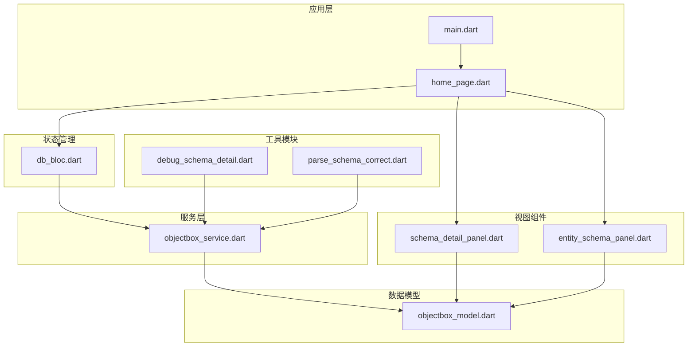

**图表来源**
- [lib/main.dart:1-147](file://lib/main.dart#L1-L147)
- [lib/widgets/home_page.dart:1-283](file://lib/widgets/home_page.dart#L1-L283)
- [lib/bloc/db_bloc.dart:1-218](file://lib/bloc/db_bloc.dart#L1-L218)

**章节来源**
- [lib/main.dart:1-147](file://lib/main.dart#L1-L147)
- [lib/widgets/home_page.dart:1-283](file://lib/widgets/home_page.dart#L1-L283)

## 核心组件

Schema 详情面板系统由多个相互协作的组件构成，每个组件都有明确的职责分工：

### 主要组件架构

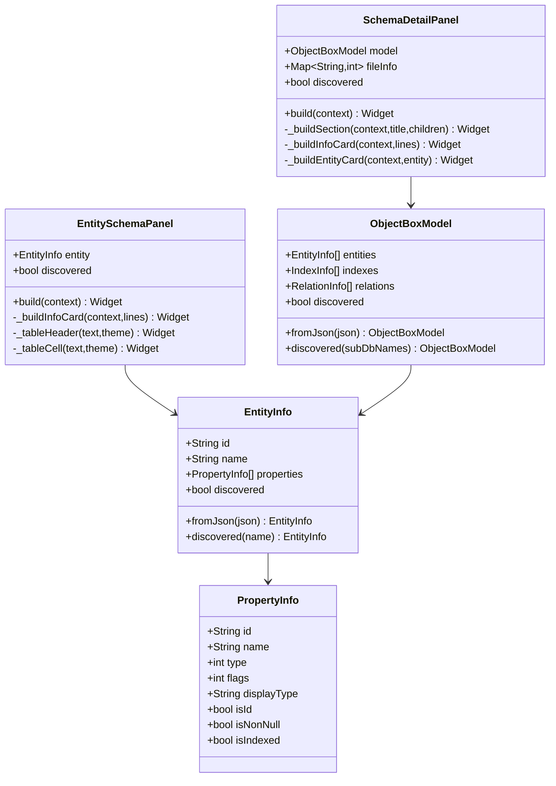

**图表来源**
- [lib/widgets/schema_detail_panel.dart:1-283](file://lib/widgets/schema_detail_panel.dart#L1-L283)
- [lib/widgets/entity_schema_panel.dart:1-205](file://lib/widgets/entity_schema_panel.dart#L1-L205)
- [lib/models/objectbox_model.dart:1-248](file://lib/models/objectbox_model.dart#L1-L248)

### 数据流处理

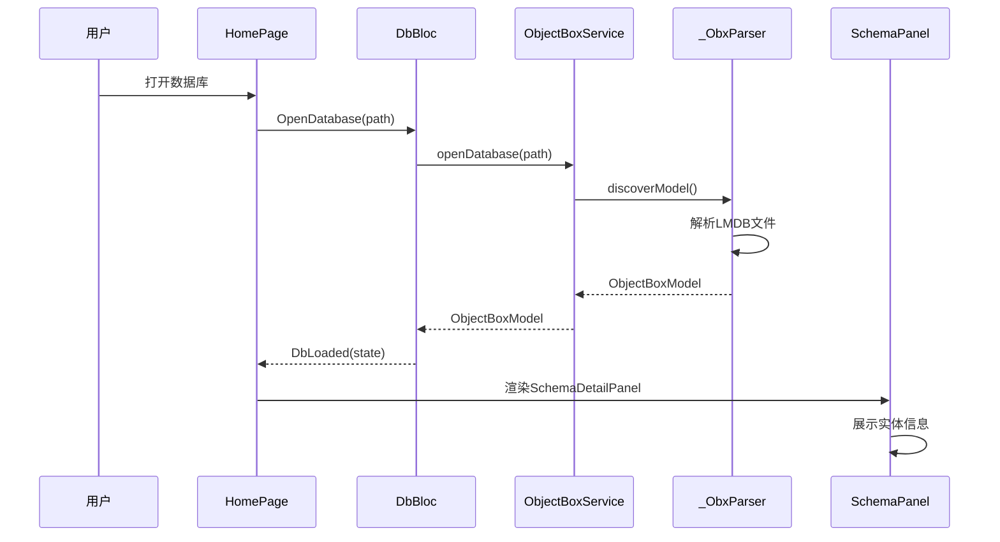

**图表来源**
- [lib/bloc/db_bloc.dart:127-139](file://lib/bloc/db_bloc.dart#L127-L139)
- [lib/services/objectbox_service.dart:10-19](file://lib/services/objectbox_service.dart#L10-L19)
- [lib/widgets/home_page.dart:111-132](file://lib/widgets/home_page.dart#L111-L132)

**章节来源**
- [lib/widgets/schema_detail_panel.dart:1-283](file://lib/widgets/schema_detail_panel.dart#L1-L283)
- [lib/widgets/entity_schema_panel.dart:1-205](file://lib/widgets/entity_schema_panel.dart#L1-L205)
- [lib/models/objectbox_model.dart:1-248](file://lib/models/objectbox_model.dart#L1-L248)

## 架构概览

Schema 详情面板采用响应式架构设计，结合了 Flutter 的组件化特性和 BLoC 状态管理模式：

### 整体架构设计

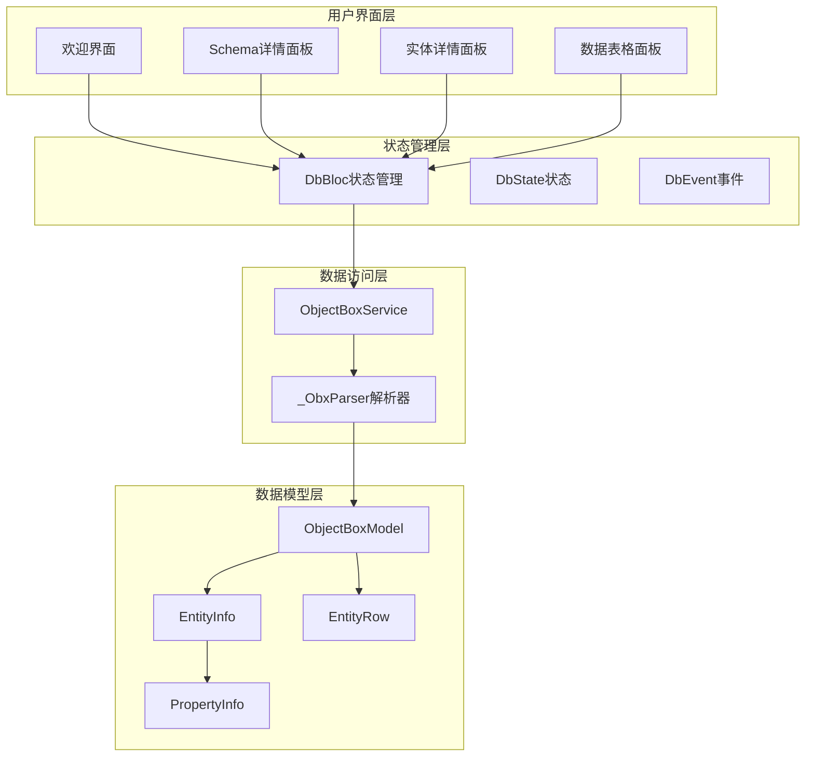

**图表来源**
- [lib/widgets/home_page.dart:35-132](file://lib/widgets/home_page.dart#L35-L132)
- [lib/bloc/db_bloc.dart:116-218](file://lib/bloc/db_bloc.dart#L116-L218)
- [lib/services/objectbox_service.dart:7-41](file://lib/services/objectbox_service.dart#L7-L41)

### 状态转换流程

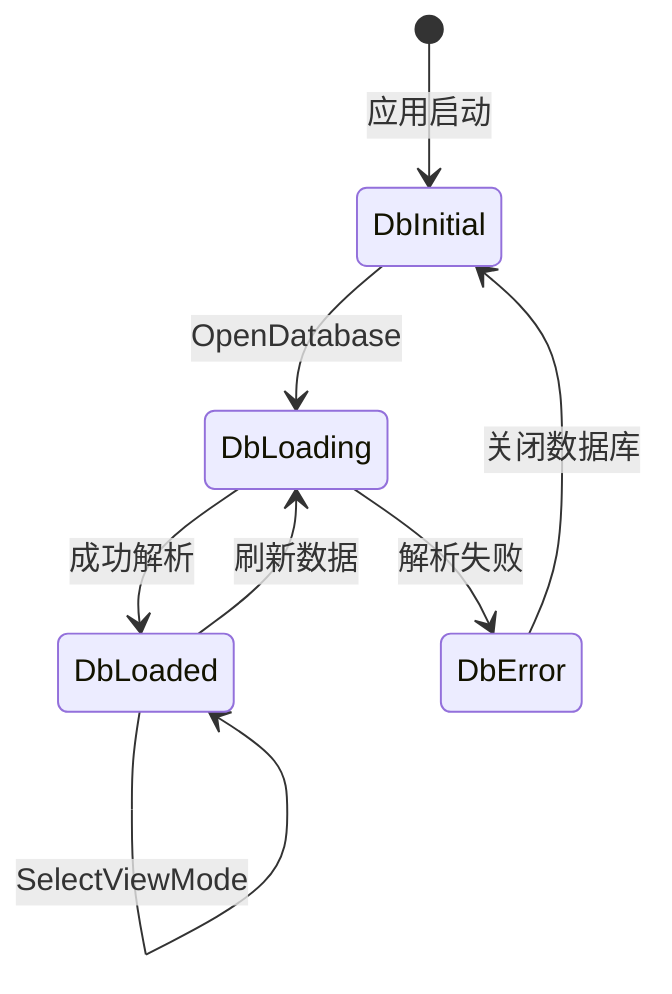

**图表来源**
- [lib/bloc/db_bloc.dart:50-113](file://lib/bloc/db_bloc.dart#L50-L113)

## 详细组件分析

### Schema 详情面板组件

Schema 详情面板是数据库模式信息的主要展示组件，提供了全面的数据库概览信息：

#### 面板功能特性

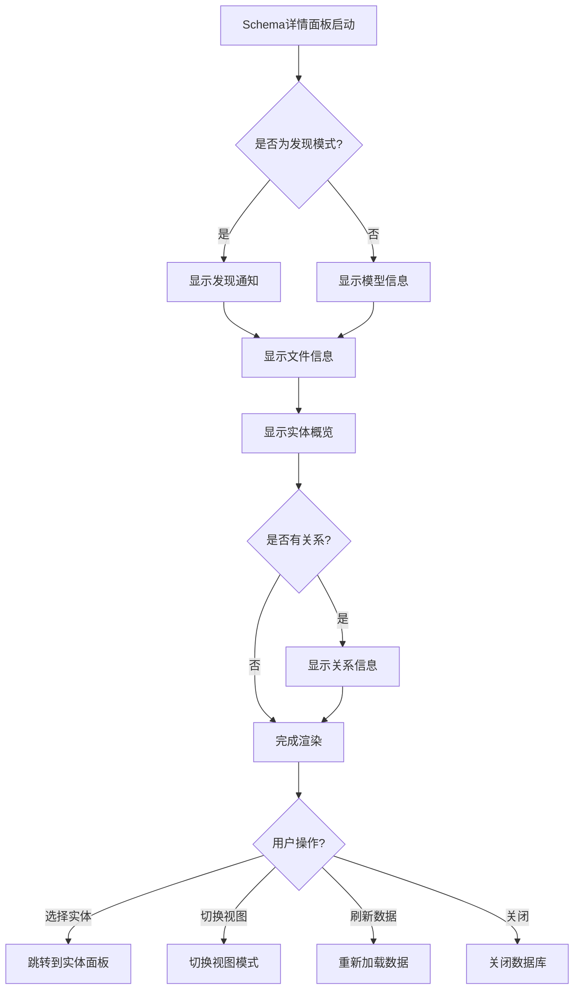

**图表来源**
- [lib/widgets/schema_detail_panel.dart:16-123](file://lib/widgets/schema_detail_panel.dart#L16-L123)

#### 实体卡片展示

实体卡片是 Schema 详情面板的核心展示元素，提供了实体的基本信息和属性概览：

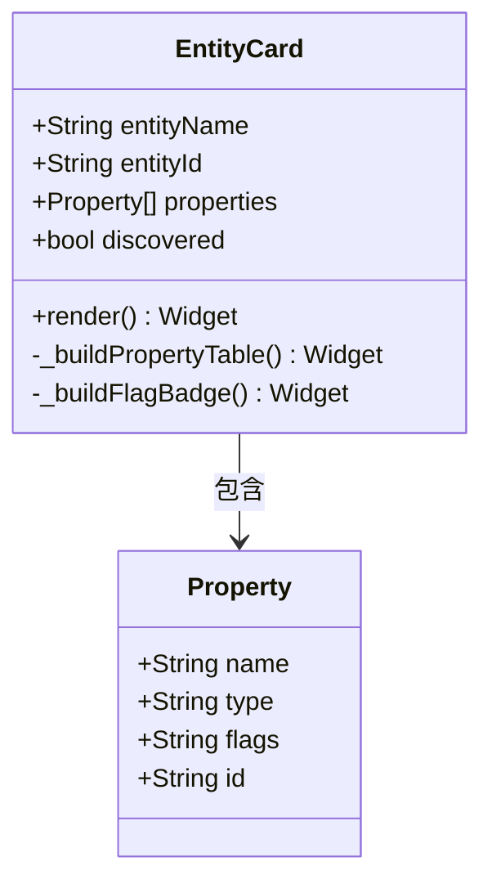

**图表来源**
- [lib/widgets/schema_detail_panel.dart:167-253](file://lib/widgets/schema_detail_panel.dart#L167-L253)

**章节来源**
- [lib/widgets/schema_detail_panel.dart:1-283](file://lib/widgets/schema_detail_panel.dart#L1-L283)

### 实体 Schema 面板组件

实体 Schema 面板专注于单个实体的详细模式信息展示：

#### 面板布局设计

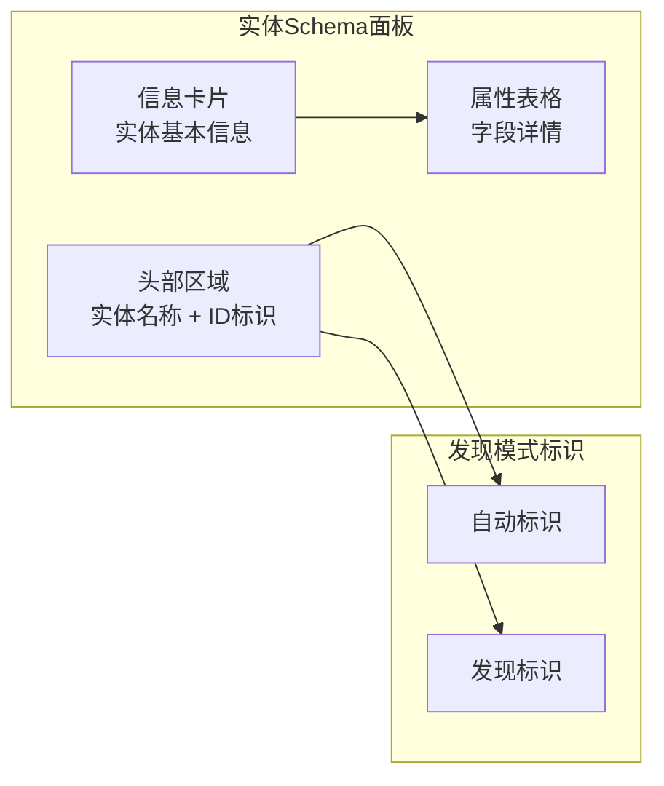

**图表来源**
- [lib/widgets/entity_schema_panel.dart:14-145](file://lib/widgets/entity_schema_panel.dart#L14-L145)

**章节来源**
- [lib/widgets/entity_schema_panel.dart:1-205](file://lib/widgets/entity_schema_panel.dart#L1-L205)

### 数据模型结构

ObjectBox 模型系统采用了分层的数据结构设计，支持从 JSON 文件解析和直接从数据库文件发现两种模式：

#### 模型层次结构

```mermaid
erDiagram
OBJECTBOX_MODEL {
int lastEntityId
int lastIndexId
int lastRelationId
int modelVersion
boolean discovered
}
ENTITY_INFO {
string id
string name
int lastPropertyId
boolean discovered
}
PROPERTY_INFO {
string id
string name
int type
int flags
string indexId
string relationTarget
}
INDEX_INFO {
string id
string name
int entityId
string[] propertyIds
int flags
}
RELATION_INFO {
string id
string name
int sourceEntityId
int targetEntityId
}
OBJECTBOX_MODEL ||--o{ ENTITY_INFO : 包含
ENTITY_INFO ||--o{ PROPERTY_INFO : 定义
ENTITY_INFO ||--o{ INDEX_INFO : 创建
OBJECTBOX_MODEL ||--o{ RELATION_INFO : 描述
```

**图表来源**
- [lib/models/objectbox_model.dart:3-248](file://lib/models/objectbox_model.dart#L3-L248)

**章节来源**
- [lib/models/objectbox_model.dart:1-248](file://lib/models/objectbox_model.dart#L1-L248)

## 依赖关系分析

Schema 详情面板系统具有清晰的依赖层次结构，各组件之间的耦合度较低，便于维护和扩展：

### 组件依赖关系

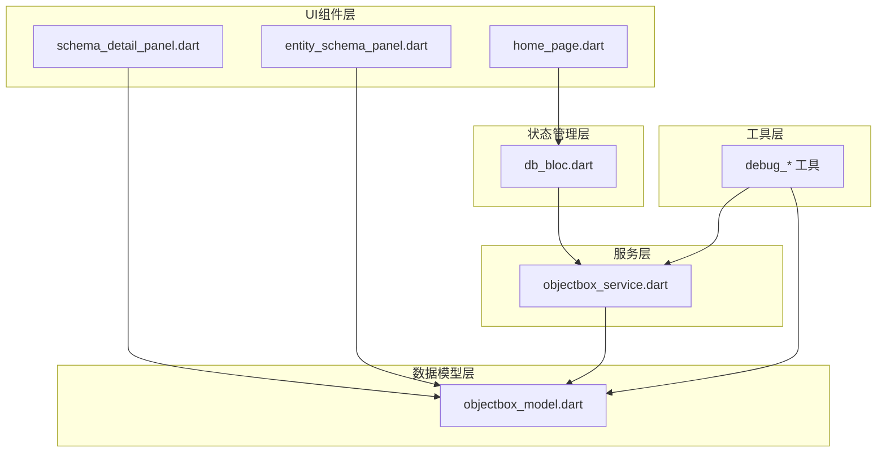

**图表来源**
- [lib/widgets/schema_detail_panel.dart:1-2](file://lib/widgets/schema_detail_panel.dart#L1-L2)
- [lib/widgets/entity_schema_panel.dart:1-2](file://lib/widgets/entity_schema_panel.dart#L1-L2)
- [lib/bloc/db_bloc.dart:4-5](file://lib/bloc/db_bloc.dart#L4-L5)

### 外部依赖分析

项目使用了以下关键外部依赖：

| 依赖包 | 版本 | 用途 |
|--------|------|------|
| flutter_bloc | ^9.1.1 | 状态管理 |
| file_picker | ^11.0.2 | 文件选择 |
| path_provider | ^2.1.5 | 路径管理 |
| equatable | ^2.0.8 | 对象相等性比较 |
| objectbox | 5.3.1 | ObjectBox数据库 |
| objectbox_flutter_libs | 5.3.1 | Flutter数据库库 |

**章节来源**
- [lib/bloc/db_bloc.dart:116-218](file://lib/bloc/db_bloc.dart#L116-L218)
- [lib/services/objectbox_service.dart:1-800](file://lib/services/objectbox_service.dart#L1-L800)

## 性能考虑

Schema 详情面板在设计时充分考虑了性能优化，特别是在处理大型数据库文件时的性能表现：

### 性能优化策略

1. **延迟加载机制**：实体数据仅在用户选择特定实体时才进行加载
2. **内存管理**：使用 Uint8List 和 ByteData 进行高效的二进制数据处理
3. **增量更新**：状态变更时只更新受影响的部分UI
4. **缓存策略**：避免重复解析相同的数据内容

### 内存使用优化

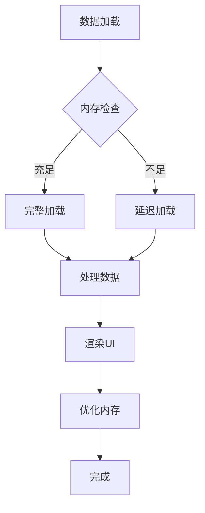

## 故障排除指南

### 常见问题及解决方案

#### 数据库文件解析错误

**问题描述**：无法正确解析数据库文件或显示空数据

**可能原因**：
1. 数据库文件损坏或格式不兼容
2. 缺少必要的权限访问数据库文件
3. 使用了不支持的 ObjectBox 版本

**解决步骤**：
1. 验证数据库文件完整性
2. 检查文件权限设置
3. 确认 ObjectBox 版本兼容性

#### Schema 发现模式问题

**问题描述**：在发现模式下实体属性显示为 field_0, field_1 等占位符

**解决方案**：
1. 确保数据库文件包含有效的 FlatBuffer 结构
2. 检查实体名称是否符合命名约定
3. 验证数据库文件的完整性

**章节来源**
- [lib/widgets/schema_detail_panel.dart:45-75](file://lib/widgets/schema_detail_panel.dart#L45-L75)
- [lib/services/objectbox_service.dart:80-113](file://lib/services/objectbox_service.dart#L80-L113)

## 结论

Schema 详情面板作为 ObjectBox 查看器的核心功能模块，成功实现了数据库模式信息的可视化展示。通过采用响应式架构设计和高效的二进制数据解析技术，该面板能够提供流畅的用户体验，同时支持从数据库文件直接解析模式信息的高级功能。

系统的主要优势包括：
- **灵活性**：支持从数据库文件直接解析模式信息，无需依赖 JSON 文件
- **可扩展性**：模块化的架构设计便于功能扩展和维护
- **性能优化**：针对大型数据库文件进行了专门的性能优化
- **用户友好**：直观的界面设计和清晰的信息层次结构

未来可以考虑的功能增强包括：
- 添加模式对比功能
- 支持更多数据库格式
- 增强搜索和过滤能力
- 提供更详细的性能分析信息