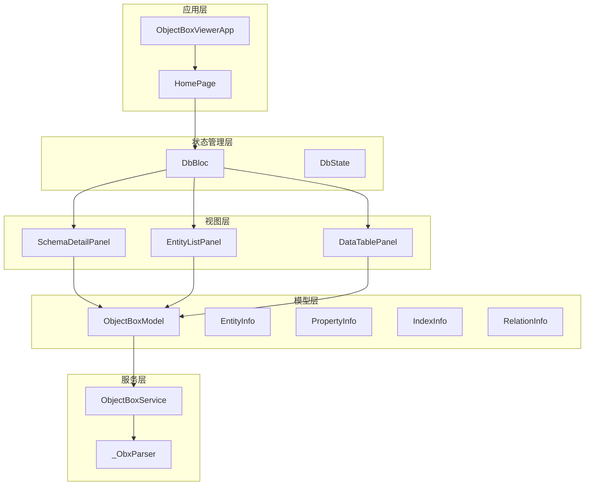
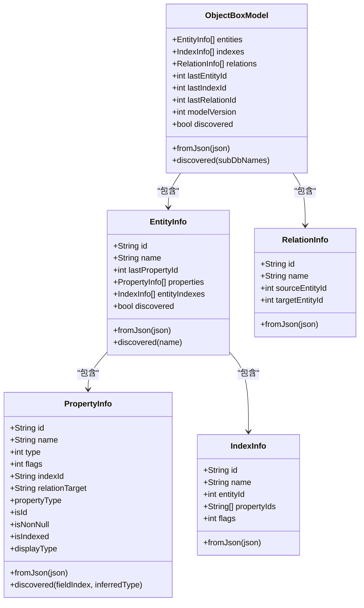
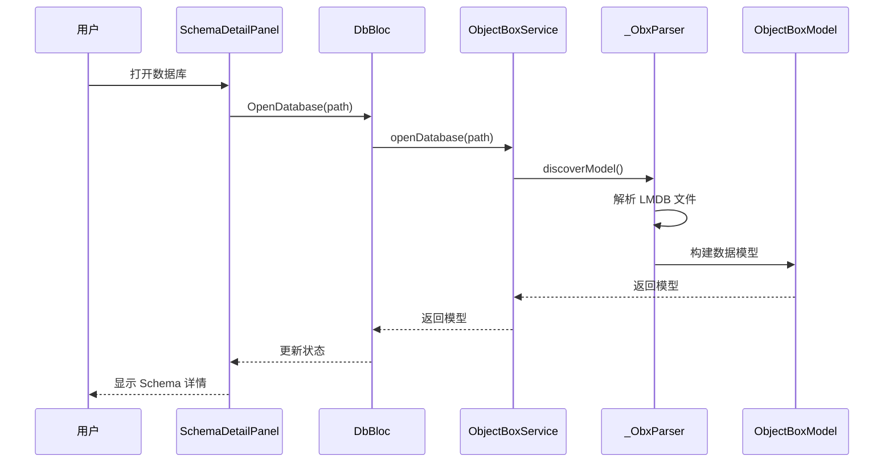
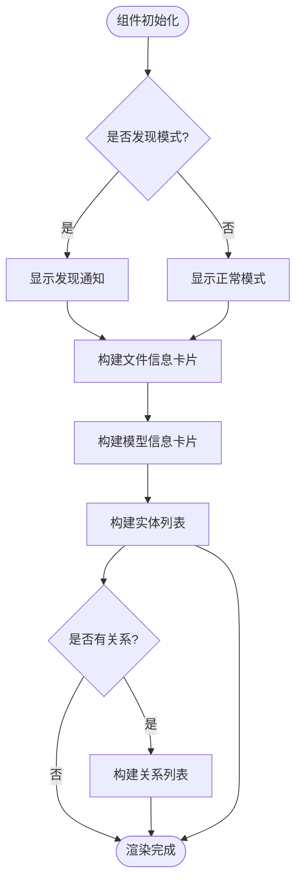
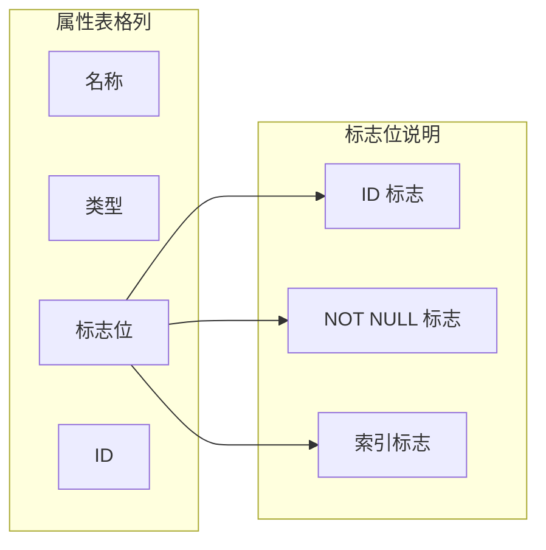
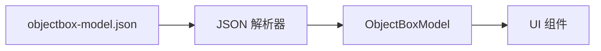
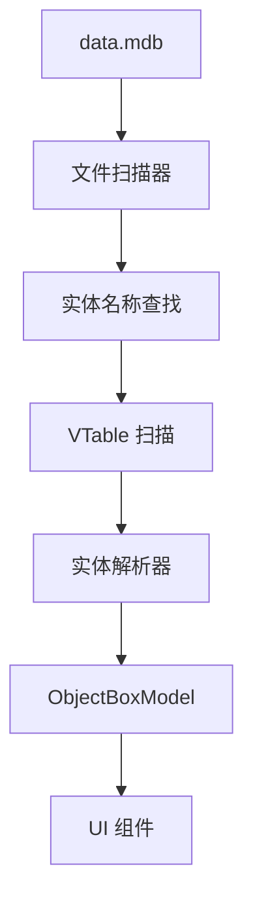
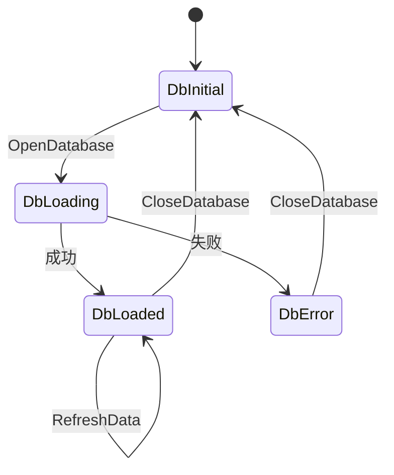
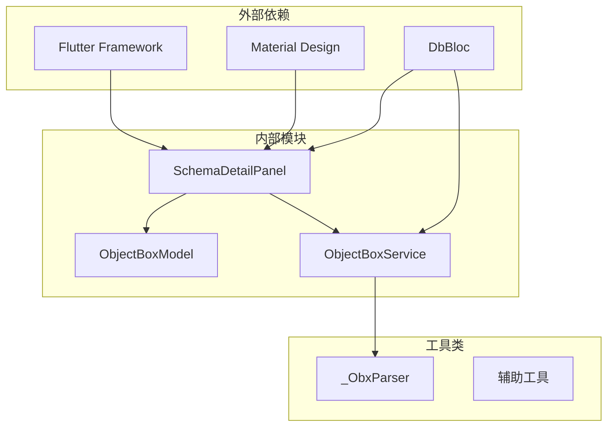
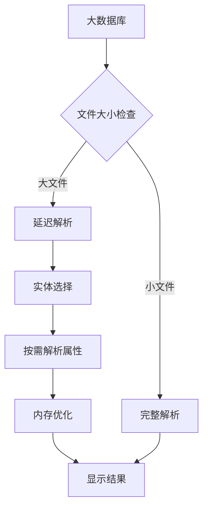

# Schema 详情面板

<cite>
**本文档引用的文件**
- [lib/main.dart](file://lib/main.dart)
- [lib/widgets/schema_detail_panel.dart](file://lib/widgets/schema_detail_panel.dart)
- [lib/widgets/home_page.dart](file://lib/widgets/home_page.dart)
- [lib/widgets/entity_list_panel.dart](file://lib/widgets/entity_list_panel.dart)
- [lib/widgets/data_table_panel.dart](file://lib/widgets/data_table_panel.dart)
- [lib/models/objectbox_model.dart](file://lib/models/objectbox_model.dart)
- [lib/bloc/db_bloc.dart](file://lib/bloc/db_bloc.dart)
- [lib/services/objectbox_service.dart](file://lib/services/objectbox_service.dart)
- [tool/debug_schema.dart](file://tool/debug_schema.dart)
- [tool/debug_schema_parse.dart](file://tool/debug_schema_parse.dart)
</cite>

## 目录
1. [简介](#简介)
2. [项目结构](#项目结构)
3. [核心组件](#核心组件)
4. [架构概览](#架构概览)
5. [详细组件分析](#详细组件分析)
6. [依赖分析](#依赖分析)
7. [性能考虑](#性能考虑)
8. [故障排除指南](#故障排除指南)
9. [结论](#结论)

## 简介

Schema 详情面板是 ObjectBox Viewer 应用中的核心组件，负责展示数据库的结构信息、实体详情和属性说明。该组件提供了完整的数据库模式可视化功能，包括：

- 数据库文件信息展示
- 实体列表和属性详情
- 字段类型说明和索引信息
- 发现模式下的自动推断功能
- 与主应用状态管理的集成

该组件采用响应式设计，支持暗色/亮色主题切换，并提供了友好的用户交互体验。

## 项目结构

ObjectBox Viewer 采用模块化架构设计，主要包含以下核心模块：

**图表来源**
- [lib/main.dart:13-43](file://lib/main.dart#L13-L43)
- [lib/widgets/home_page.dart:9-72](file://lib/widgets/home_page.dart#L9-L72)
- [lib/bloc/db_bloc.dart:91-136](file://lib/bloc/db_bloc.dart#L91-L136)

**章节来源**
- [lib/main.dart:1-147](file://lib/main.dart#L1-L147)
- [lib/widgets/home_page.dart:1-218](file://lib/widgets/home_page.dart#L1-L218)

## 核心组件

Schema 详情面板的核心功能由多个组件协同完成：

### 主要组件职责

1. **SchemaDetailPanel**: 主要的 Schema 展示组件
2. **ObjectBoxModel**: 数据模型定义
3. **DbBloc**: 状态管理
4. **ObjectBoxService**: 数据服务层

### 数据模型结构

**图表来源**
- [lib/models/objectbox_model.dart:3-248](file://lib/models/objectbox_model.dart#L3-L248)

**章节来源**
- [lib/models/objectbox_model.dart:1-248](file://lib/models/objectbox_model.dart#L1-L248)

## 架构概览

Schema 详情面板在整个应用架构中扮演着关键角色，连接了数据层、业务逻辑层和用户界面层：

**图表来源**
- [lib/bloc/db_bloc.dart:101-110](file://lib/bloc/db_bloc.dart#L101-L110)
- [lib/services/objectbox_service.dart:10-19](file://lib/services/objectbox_service.dart#L10-L19)
- [lib/services/objectbox_service.dart:78-111](file://lib/services/objectbox_service.dart#L78-L111)

**章节来源**
- [lib/bloc/db_bloc.dart:1-136](file://lib/bloc/db_bloc.dart#L1-L136)
- [lib/services/objectbox_service.dart:1-1006](file://lib/services/objectbox_service.dart#L1-L1006)

## 详细组件分析

### SchemaDetailPanel 组件

SchemaDetailPanel 是整个 Schema 详情展示的核心组件，提供了丰富的数据库信息可视化功能：

#### 组件特性

1. **响应式布局**: 支持不同屏幕尺寸的自适应布局
2. **主题适配**: 完美适配 Material Design 3 主题系统
3. **发现模式支持**: 区分正常模式和发现模式下的显示差异
4. **信息层次化**: 清晰的信息分组和层次结构

#### 核心功能实现

**图表来源**
- [lib/widgets/schema_detail_panel.dart:16-123](file://lib/widgets/schema_detail_panel.dart#L16-L123)

#### 实体卡片展示

每个实体都以卡片形式展示，包含以下信息：

1. **实体基本信息**: 名称、ID（在非发现模式下）
2. **属性表格**: 字段名、类型、标志位、ID
3. **发现模式标识**: 显示 "Discovered" 标签

#### 属性表格设计

**图表来源**
- [lib/widgets/schema_detail_panel.dart:213-239](file://lib/widgets/schema_detail_panel.dart#L213-L239)
- [lib/widgets/schema_detail_panel.dart:269-275](file://lib/widgets/schema_detail_panel.dart#L269-L275)

**章节来源**
- [lib/widgets/schema_detail_panel.dart:1-283](file://lib/widgets/schema_detail_panel.dart#L1-L283)

### 数据模型解析

ObjectBoxService 负责从 LMDB 文件中解析 Schema 信息，支持两种模式：

#### 正常模式（基于 JSON）

当存在 `objectbox-model.json` 文件时，直接解析 JSON 并构建模型：

#### 发现模式（无 JSON 文件）

当缺少 JSON 文件时，通过直接解析 LMDB 文件来推断 Schema：

**图表来源**
- [lib/services/objectbox_service.dart:78-111](file://lib/services/objectbox_service.dart#L78-L111)
- [lib/services/objectbox_service.dart:158-185](file://lib/services/objectbox_service.dart#L158-L185)
- [lib/services/objectbox_service.dart:187-217](file://lib/services/objectbox_service.dart#L187-L217)

**章节来源**
- [lib/services/objectbox_service.dart:1-1006](file://lib/services/objectbox_service.dart#L1-L1006)

### 状态管理集成

DbBloc 提供了完整的状态管理机制，确保 Schema 详情面板能够响应数据变化：

#### 状态流转

**图表来源**
- [lib/bloc/db_bloc.dart:39-88](file://lib/bloc/db_bloc.dart#L39-L88)
- [lib/bloc/db_bloc.dart:94-135](file://lib/bloc/db_bloc.dart#L94-L135)

**章节来源**
- [lib/bloc/db_bloc.dart:1-136](file://lib/bloc/db_bloc.dart#L1-L136)

## 依赖分析

Schema 详情面板的依赖关系相对清晰，主要依赖于以下核心模块：

**图表来源**
- [lib/widgets/schema_detail_panel.dart:1-2](file://lib/widgets/schema_detail_panel.dart#L1-L2)
- [lib/bloc/db_bloc.dart:4-5](file://lib/bloc/db_bloc.dart#L4-L5)

**章节来源**
- [lib/widgets/schema_detail_panel.dart:1-283](file://lib/widgets/schema_detail_panel.dart#L1-L283)
- [lib/bloc/db_bloc.dart:1-136](file://lib/bloc/db_bloc.dart#L1-L136)

## 性能考虑

针对大数据 Schema 的处理，系统采用了多种优化策略：

### 内存管理优化

1. **流式解析**: 使用流式读取方式处理大型 LMDB 文件
2. **按需加载**: 只在需要时解析实体属性
3. **缓存机制**: 对已解析的数据进行缓存避免重复计算

### 处理策略

### 大数据处理建议

1. **分页加载**: 对于大量实体的情况，考虑实现分页加载
2. **增量更新**: 支持增量更新而非全量重新解析
3. **异步处理**: 将耗时的解析操作放在后台线程执行

## 故障排除指南

### 常见问题及解决方案

#### 无法找到数据库文件

**问题症状**: 打开数据库时提示找不到文件

**解决方法**:
1. 确认选择了正确的数据库目录
2. 检查目录中是否存在 `data.mdb` 文件
3. 验证文件权限设置

#### Schema 解析失败

**问题症状**: 发现模式下无法正确解析实体信息

**解决方法**:
1. 检查 LMDB 文件完整性
2. 验证文件格式是否为 ObjectBox 格式
3. 查看日志输出获取详细错误信息

#### 性能问题

**问题症状**: 大数据库打开缓慢或内存占用过高

**解决方法**:
1. 考虑使用发现模式而非完整 JSON 解析
2. 实施分页加载策略
3. 优化 UI 组件的渲染性能

**章节来源**
- [lib/services/objectbox_service.dart:10-19](file://lib/services/objectbox_service.dart#L10-L19)
- [lib/widgets/home_page.dart:190-218](file://lib/widgets/home_page.dart#L190-L218)

## 结论

Schema 详情面板组件展现了优秀的架构设计和实现质量。通过模块化的设计、清晰的状态管理以及高效的解析算法，该组件成功地实现了数据库 Schema 的可视化展示功能。

### 主要优势

1. **架构清晰**: 采用分层架构，职责分离明确
2. **性能优秀**: 针对大数据场景进行了专门优化
3. **用户体验良好**: 提供了直观易用的界面设计
4. **扩展性强**: 支持多种数据源和解析模式

### 技术亮点

- 完整的发现模式支持，无需依赖 JSON 文件
- 高效的 LMDB 文件解析算法
- 响应式的 UI 设计和主题适配
- 完善的状态管理和错误处理机制

该组件为 ObjectBox Viewer 提供了强大的 Schema 可视化能力，是整个应用的核心基础组件之一。