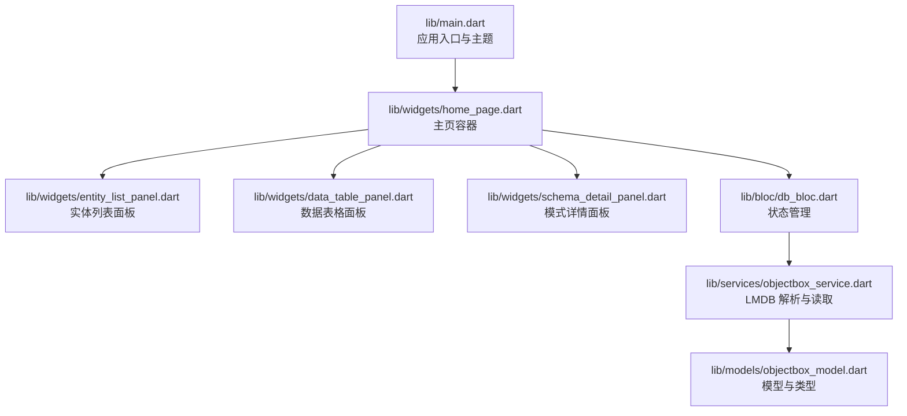
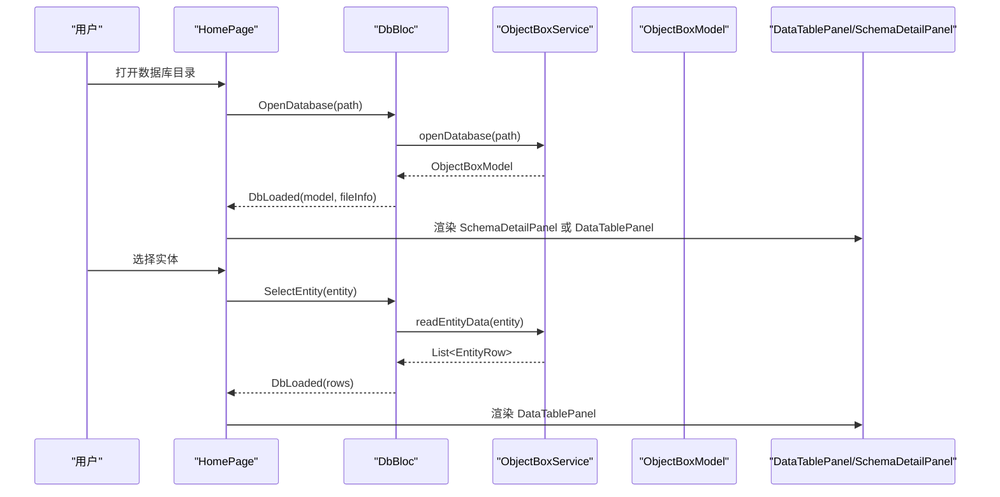
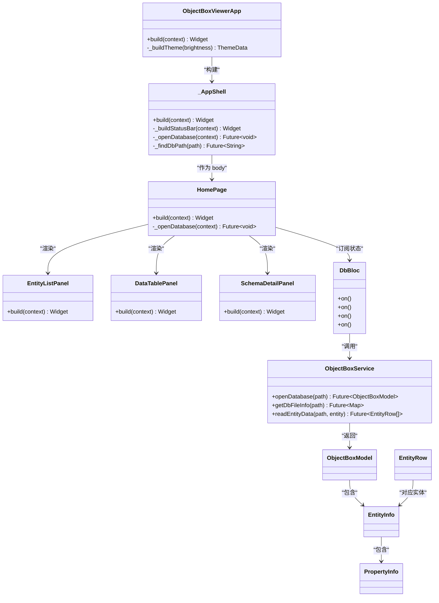

# UI 组件

<cite>
**本文引用的文件**
- [lib/main.dart](file://lib/main.dart)
- [lib/widgets/home_page.dart](file://lib/widgets/home_page.dart)
- [lib/widgets/entity_list_panel.dart](file://lib/widgets/entity_list_panel.dart)
- [lib/widgets/data_table_panel.dart](file://lib/widgets/data_table_panel.dart)
- [lib/widgets/schema_detail_panel.dart](file://lib/widgets/schema_detail_panel.dart)
- [lib/bloc/db_bloc.dart](file://lib/bloc/db_bloc.dart)
- [lib/models/objectbox_model.dart](file://lib/models/objectbox_model.dart)
- [lib/services/objectbox_service.dart](file://lib/services/objectbox_service.dart)
- [pubspec.yaml](file://pubspec.yaml)
- [test/widget_test.dart](file://test/widget_test.dart)
</cite>

## 目录
1. [简介](#简介)
2. [项目结构](#项目结构)
3. [核心组件](#核心组件)
4. [架构总览](#架构总览)
5. [组件详细分析](#组件详细分析)
6. [依赖关系分析](#依赖关系分析)
7. [性能与可扩展性](#性能与可扩展性)
8. [无障碍与响应式设计](#无障碍与响应式设计)
9. [故障排查指南](#故障排查指南)
10. [结论](#结论)
11. [附录：使用示例与最佳实践](#附录使用示例与最佳实践)

## 简介
本文件面向 ObjectBox Viewer 的 UI 组件，系统化梳理各组件的视觉外观、行为与交互模式，明确 props/属性、事件、插槽与自定义选项，提供使用示例与代码片段路径，并给出响应式设计与无障碍访问建议、样式与主题支持、跨浏览器兼容性与性能优化策略，以及组件组合与集成方式。

## 项目结构
应用采用 Flutter + BLoC 架构，UI 组件集中在 widgets 目录，业务逻辑在 bloc，数据模型在 models，数据库解析在 services。入口文件负责主题与导航壳层，主页根据数据库状态渲染不同面板。

图表来源
- [lib/main.dart:13-43](file://lib/main.dart#L13-L43)
- [lib/widgets/home_page.dart:9-72](file://lib/widgets/home_page.dart#L9-L72)
- [lib/bloc/db_bloc.dart:91-136](file://lib/bloc/db_bloc.dart#L91-L136)
- [lib/services/objectbox_service.dart:9-41](file://lib/services/objectbox_service.dart#L9-L41)

章节来源
- [lib/main.dart:1-147](file://lib/main.dart#L1-L147)
- [lib/widgets/home_page.dart:1-218](file://lib/widgets/home_page.dart#L1-L218)
- [pubspec.yaml:30-42](file://pubspec.yaml#L30-L42)

## 核心组件
- 应用壳层与主题：设置 Material 3 主题、明暗主题切换、底部状态栏与打开数据库入口。
- 主页容器：根据数据库状态渲染欢迎视图、错误视图、发现横幅、实体列表与内容面板。
- 实体列表面板：展示实体清单、选中态、统计信息与关闭数据库按钮。
- 数据表格面板：展示实体数据表、列头提示、行内值颜色区分、长文本弹窗与复制。
- 模式详情面板：展示数据库文件信息、模型信息（非发现模式）、实体概览与关系（非发现模式）。

章节来源
- [lib/main.dart:45-95](file://lib/main.dart#L45-L95)
- [lib/widgets/home_page.dart:9-89](file://lib/widgets/home_page.dart#L9-L89)
- [lib/widgets/entity_list_panel.dart:4-85](file://lib/widgets/entity_list_panel.dart#L4-L85)
- [lib/widgets/data_table_panel.dart:5-148](file://lib/widgets/data_table_panel.dart#L5-L148)
- [lib/widgets/schema_detail_panel.dart:4-123](file://lib/widgets/schema_detail_panel.dart#L4-L123)

## 架构总览
UI 层通过 BLoC 接收事件（打开数据库、选择实体、刷新、关闭），服务层解析 LMDB 文件生成模型与数据，UI 根据状态渲染不同视图。

图表来源
- [lib/widgets/home_page.dart:74-88](file://lib/widgets/home_page.dart#L74-L88)
- [lib/bloc/db_bloc.dart:101-110](file://lib/bloc/db_bloc.dart#L101-L110)
- [lib/services/objectbox_service.dart:10-19](file://lib/services/objectbox_service.dart#L10-L19)
- [lib/bloc/db_bloc.dart:112-124](file://lib/bloc/db_bloc.dart#L112-L124)
- [lib/services/objectbox_service.dart:31-40](file://lib/services/objectbox_service.dart#L31-L40)

## 组件详细分析

### 应用壳层与主题（ObjectBoxViewerApp/_AppShell）
- 视觉外观
  - 标题栏包含图标与标题，右侧提供“打开数据库”按钮。
  - 底部状态栏显示当前状态说明。
  - 主题采用 Material 3，明/暗主题基于 seed 颜色动态生成，AppBar 背景色与前景色与主题一致。
- 行为与交互
  - 点击“打开数据库”触发文件选择对话框，定位到 data.mdb 所在目录或其子目录。
  - 自动检测 objectbox-model.json 与 data.mdb 存在后，通过 DbBloc 发出打开数据库事件。
- Props/事件/插槽
  - 无外部 props；内部通过回调触发事件。
  - 事件：打开数据库、关闭数据库、刷新数据（由上层面板触发）。
- 可访问性与响应式
  - 使用系统字体与 Material 图标，支持深浅主题切换。
  - 响应式布局：状态栏高度固定，内容区域自适应窗口大小。

章节来源
- [lib/main.dart:13-43](file://lib/main.dart#L13-L43)
- [lib/main.dart:45-95](file://lib/main.dart#L45-L95)
- [lib/main.dart:97-145](file://lib/main.dart#L97-L145)

### 主页容器（HomePage）
- 视觉外观
  - 根据 DbState 渲染：加载中、错误、未加载、已加载。
  - 已加载时左侧为实体列表面板，右侧为内容面板（SchemaDetailPanel 或 DataTablePanel）。
  - 若数据库未包含 objectbox-model.json，顶部显示“发现”横幅。
- 行为与交互
  - 列表面板选择实体后，触发 SelectEntity，随后读取该实体数据并更新状态。
  - 内容面板提供刷新按钮，触发 RefreshData。
  - 错误视图提供返回按钮，触发 CloseDatabase。
- Props/事件/插槽
  - 外部传入：DbBloc 实例（通过 context.read）。
  - 事件：OpenDatabase、SelectEntity、RefreshData、CloseDatabase。
- 组合模式
  - 与实体列表面板、数据表格面板、模式详情面板组合使用。

章节来源
- [lib/widgets/home_page.dart:9-72](file://lib/widgets/home_page.dart#L9-L72)
- [lib/widgets/home_page.dart:91-126](file://lib/widgets/home_page.dart#L91-L126)
- [lib/widgets/home_page.dart:128-188](file://lib/widgets/home_page.dart#L128-L188)
- [lib/widgets/home_page.dart:190-217](file://lib/widgets/home_page.dart#L190-L217)

### 实体列表面板（EntityListPanel）
- 视觉外观
  - 顶部标题“Entities”，右侧关闭数据库按钮。
  - 列表项为 ListTile，显示实体名、属性数量、选中态高亮与右箭头。
  - 底部显示实体数与索引数统计。
- 行为与交互
  - 点击实体项触发 onEntitySelected 回调。
  - 关闭按钮触发 onClose 回调。
- Props/事件
  - 必填：model、selectedEntity、onEntitySelected。
  - 可选：onClose、onOpenDb。
- 插槽/自定义
  - 通过回调注入行为，无具名插槽。
- 无障碍
  - 使用 dense 列表提升可读性；选中态与图标配合提供视觉反馈。

章节来源
- [lib/widgets/entity_list_panel.dart:4-85](file://lib/widgets/entity_list_panel.dart#L4-L85)
- [lib/widgets/entity_list_panel.dart:88-131](file://lib/widgets/entity_list_panel.dart#L88-L131)

### 数据表格面板（DataTablePanel）
- 视觉外观
  - 顶部工具栏：实体名、自动发现标记、行数徽章、刷新按钮。
  - 内容区：水平滚动的 DataTable，列头包含字段名与类型标签（发现模式）。
  - 行内单元格按类型着色（布尔/整数/浮点/字符串），空值斜体灰色。
  - 长文本点击弹窗，支持复制到剪贴板。
- 行为与交互
  - 列头 tooltip 显示字段类型与约束信息。
  - 单元格点击弹出详情对话框，支持复制。
  - 刷新按钮触发 onRefresh。
- Props/事件
  - 必填：entity、onRefresh。
  - 可选：rows、error、discovered。
- 动画与过渡
  - 无显式动画；滚动与对话框弹出为系统默认过渡。
- 性能
  - 使用单列宽计算与横向滚动避免列过多导致的布局抖动。

章节来源
- [lib/widgets/data_table_panel.dart:5-148](file://lib/widgets/data_table_panel.dart#L5-L148)
- [lib/widgets/data_table_panel.dart:150-294](file://lib/widgets/data_table_panel.dart#L150-L294)
- [lib/widgets/data_table_panel.dart:296-345](file://lib/widgets/data_table_panel.dart#L296-L345)

### 模式详情面板（SchemaDetailPanel）
- 视觉外观
  - 标题“Database Info”，若为发现模式显示“Discovered”徽章。
  - 发现模式下显示说明卡片。
  - 数据库文件信息卡片、模型信息卡片（非发现模式）、实体概览表格、关系列表（非发现模式）。
- 行为与交互
  - 仅展示信息，无交互控件。
- Props/事件
  - 必填：model、fileInfo。
  - 可选：discovered。
- 响应式
  - 使用单列布局与卡片分组，适配小屏设备。

章节来源
- [lib/widgets/schema_detail_panel.dart:4-123](file://lib/widgets/schema_detail_panel.dart#L4-L123)
- [lib/widgets/schema_detail_panel.dart:125-283](file://lib/widgets/schema_detail_panel.dart#L125-L283)

## 依赖关系分析

图表来源
- [lib/main.dart:13-95](file://lib/main.dart#L13-L95)
- [lib/widgets/home_page.dart:9-72](file://lib/widgets/home_page.dart#L9-L72)
- [lib/bloc/db_bloc.dart:91-136](file://lib/bloc/db_bloc.dart#L91-L136)
- [lib/services/objectbox_service.dart:9-41](file://lib/services/objectbox_service.dart#L9-L41)
- [lib/models/objectbox_model.dart:3-61](file://lib/models/objectbox_model.dart#L3-L61)

章节来源
- [lib/bloc/db_bloc.dart:1-136](file://lib/bloc/db_bloc.dart#L1-L136)
- [lib/services/objectbox_service.dart:1-1006](file://lib/services/objectbox_service.dart#L1-L1006)
- [lib/models/objectbox_model.dart:1-248](file://lib/models/objectbox_model.dart#L1-L248)

## 性能与可扩展性
- 性能要点
  - 数据表格采用横向滚动与固定列宽策略，避免大表重排。
  - 发现模式下延迟解析字段类型，仅在需要时推断。
  - BLoC 分离状态与 UI，减少不必要的重建。
- 可扩展性
  - 组件通过回调解耦，便于替换或扩展面板。
  - 模型与服务分离，便于引入缓存或并发读取。

[本节为通用性能讨论，不直接分析具体文件]

## 无障碍与响应式设计
- 无障碍
  - 使用系统字体与 Material 图标，确保高对比度。
  - 列表项具备选中态与图标提示，便于键盘导航识别。
  - 对话框提供可复制文本，支持屏幕阅读器朗读。
- 响应式
  - 主页采用左右分栏，左侧固定宽度，右侧自适应。
  - 数据表格支持横向滚动，避免列过宽导致布局异常。
  - 底部状态栏固定高度，内容区域随窗口变化。

[本节为通用无障碍与响应式讨论，不直接分析具体文件]

## 故障排查指南
- 常见问题
  - 无法打开数据库：确认选择了包含 data.mdb 的目录；若无 objectbox-model.json，将进入发现模式。
  - 数据为空：检查实体是否存在数据，或尝试刷新。
  - 类型显示为“未知”：发现模式下字段类型需运行时推断。
- 定位方法
  - 查看底部状态栏提示与错误视图。
  - 使用调试工具查看 LMDB 结构与 FlatBuffer 字段布局。

章节来源
- [lib/widgets/home_page.dart:190-217](file://lib/widgets/home_page.dart#L190-L217)
- [lib/widgets/data_table_panel.dart:100-147](file://lib/widgets/data_table_panel.dart#L100-L147)

## 结论
ObjectBox Viewer 的 UI 组件围绕 BLoC 状态管理与 Material 3 设计体系构建，结构清晰、职责明确。实体列表与数据表格提供直观的数据浏览体验，模式详情面板补充数据库与模型信息。通过主题与响应式布局，组件在多平台上保持一致的可用性与可访问性。

[本节为总结性内容，不直接分析具体文件]

## 附录：使用示例与最佳实践

### 使用示例与代码片段路径
- 启动应用并打开数据库
  - [lib/main.dart:8-145](file://lib/main.dart#L8-L145)
- 在主页中选择实体并刷新数据
  - [lib/widgets/home_page.dart:34-61](file://lib/widgets/home_page.dart#L34-L61)
  - [lib/bloc/db_bloc.dart:112-130](file://lib/bloc/db_bloc.dart#L112-L130)
- 在数据表格中查看长文本详情
  - [lib/widgets/data_table_panel.dart:260-293](file://lib/widgets/data_table_panel.dart#L260-L293)
- 查看模式详情与关系
  - [lib/widgets/schema_detail_panel.dart:97-119](file://lib/widgets/schema_detail_panel.dart#L97-L119)

### 组件组合与集成
- 将 HomePage 作为根页面，内部组合实体列表与内容面板。
- 通过 DbBloc 提供状态与事件，服务层负责数据读取。
- 模型与服务解耦，便于替换解析实现或引入缓存。

章节来源
- [lib/widgets/home_page.dart:20-71](file://lib/widgets/home_page.dart#L20-L71)
- [lib/bloc/db_bloc.dart:91-136](file://lib/bloc/db_bloc.dart#L91-L136)
- [lib/services/objectbox_service.dart:9-41](file://lib/services/objectbox_service.dart#L9-L41)