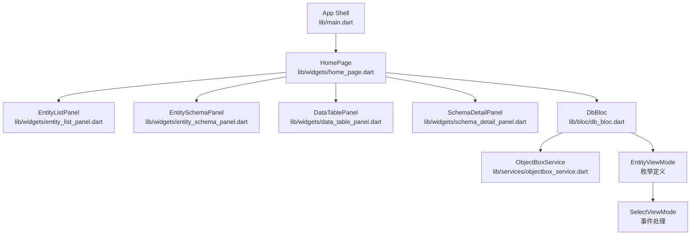
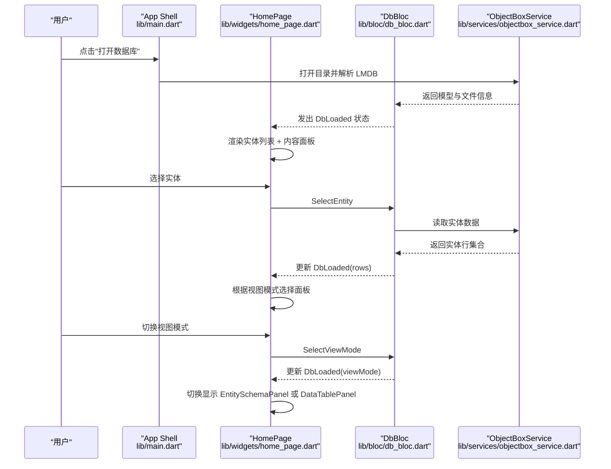
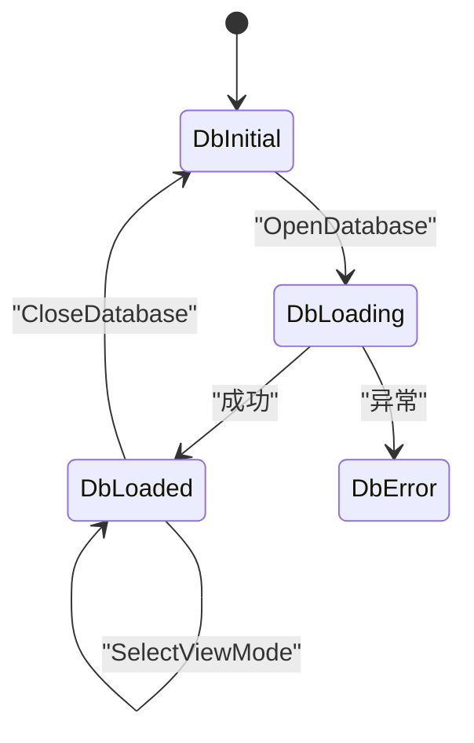
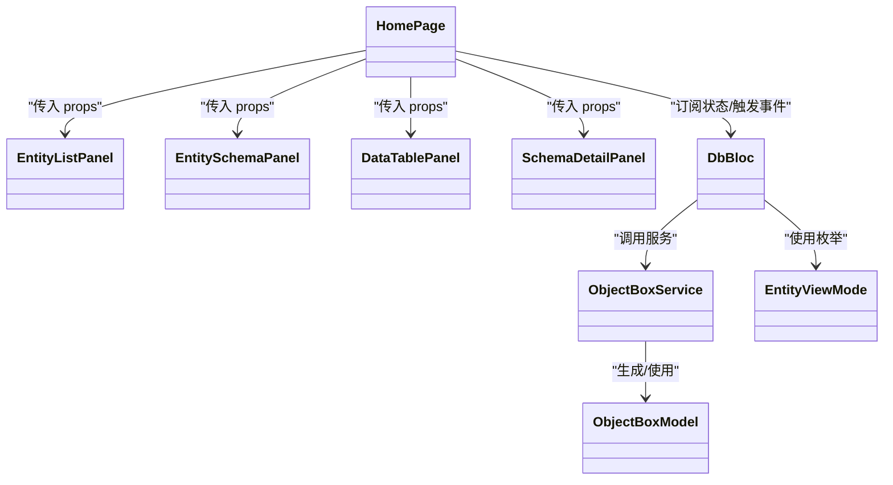

# 主页面布局

<cite>
**本文引用的文件**
- [lib/main.dart](file://lib/main.dart)
- [lib/widgets/home_page.dart](file://lib/widgets/home_page.dart)
- [lib/widgets/entity_list_panel.dart](file://lib/widgets/entity_list_panel.dart)
- [lib/widgets/data_table_panel.dart](file://lib/widgets/data_table_panel.dart)
- [lib/widgets/entity_schema_panel.dart](file://lib/widgets/entity_schema_panel.dart)
- [lib/widgets/schema_detail_panel.dart](file://lib/widgets/schema_detail_panel.dart)
- [lib/bloc/db_bloc.dart](file://lib/bloc/db_bloc.dart)
- [lib/models/objectbox_model.dart](file://lib/models/objectbox_model.dart)
- [lib/services/objectbox_service.dart](file://lib/services/objectbox_service.dart)
</cite>

## 更新摘要
**变更内容**
- 新增视图模式系统，支持在数据视图和 Schema 视图之间切换
- 更新 HomePage 的右侧面板渲染逻辑，根据视图模式动态选择显示组件
- 新增 EntityViewMode 枚举和 SelectViewMode 事件处理
- 更新实体列表面板，添加视图模式切换按钮
- 新增 EntitySchemaPanel 组件用于显示实体 Schema 详情

## 目录
1. [简介](#简介)
2. [项目结构](#项目结构)
3. [核心组件](#核心组件)
4. [架构总览](#架构总览)
5. [详细组件分析](#详细组件分析)
6. [依赖关系分析](#依赖关系分析)
7. [性能考量](#性能考量)
8. [故障排查指南](#故障排查指南)
9. [结论](#结论)

## 简介
本文件聚焦于 ObjectBox Viewer 的主页面布局组件 HomePage，系统性阐述其整体布局结构、状态管理与用户交互流程，覆盖 props 参数、事件处理机制、状态转换逻辑、网格系统与响应式设计、主题应用方式、生命周期管理、错误处理与加载状态、与 BLoC 的集成与数据流、以及欢迎视图、错误视图与发现横幅的实现要点。**更新**：新增视图模式系统，支持在数据视图和 Schema 视图之间动态切换，提供更灵活的数据库浏览体验。

## 项目结构
HomePage 位于 widgets 层，作为应用壳体的 body 内容，通过 BLoC 管理数据库打开、实体选择、视图模式切换、数据刷新等状态；右侧内容区根据当前视图模式和实体选择状态动态显示 Schema 详情或数据表格；顶部实体列表面板负责实体导航、视图模式切换与关闭数据库操作；底部状态栏提供简要提示信息。

**图表来源**
- [lib/main.dart:45-73](file://lib/main.dart#L45-L73)
- [lib/widgets/home_page.dart:9-72](file://lib/widgets/home_page.dart#L9-L72)
- [lib/widgets/entity_list_panel.dart:4-85](file://lib/widgets/entity_list_panel.dart#L4-L85)
- [lib/widgets/entity_schema_panel.dart:4-123](file://lib/widgets/entity_schema_panel.dart#L4-L123)
- [lib/widgets/data_table_panel.dart:5-98](file://lib/widgets/data_table_panel.dart#L5-L98)
- [lib/bloc/db_bloc.dart:91-135](file://lib/bloc/db_bloc.dart#L91-L135)
- [lib/services/objectbox_service.dart:9-41](file://lib/services/objectbox_service.dart#L9-L41)
- [lib/models/objectbox_model.dart:3-61](file://lib/models/objectbox_model.dart#L3-L61)

**章节来源**
- [lib/main.dart:45-95](file://lib/main.dart#L45-L95)
- [lib/widgets/home_page.dart:9-89](file://lib/widgets/home_page.dart#L9-L89)

## 核心组件
- **HomePage**：主布局容器，基于 DbBloc 状态渲染欢迎视图、错误视图、发现横幅、实体列表与内容面板。**更新**：新增视图模式判断逻辑，根据 EntityViewMode 动态选择显示 EntitySchemaPanel 或 DataTablePanel。
- **EntityListPanel**：左侧实体列表，支持实体选择、视图模式切换、关闭数据库、打开新库。**更新**：新增视图模式切换按钮，允许用户在 Data 和 Schema 视图间切换。
- **EntitySchemaPanel**：右侧实体 Schema 详情面板，显示实体的结构信息、属性定义和标志位。**新增**：专门用于展示实体 Schema 的新组件。
- **DataTablePanel**：右侧数据表格面板，显示选中实体的数据行，支持刷新与长文本详情弹窗。**保持不变**：继续提供数据浏览功能。
- **SchemaDetailPanel**：右侧数据库概览面板，显示数据库文件信息和模型详情。**保持不变**：在未选中实体时显示。
- **DbBloc**：BLoC 状态机，处理打开数据库、选择实体、视图模式切换、刷新数据、关闭数据库等事件。**更新**：新增 SelectViewMode 事件处理。
- **ObjectBoxService**：直接解析 LMDB 文件，发现模型与读取实体数据。**保持不变**：继续提供数据服务。
- **ObjectBoxModel 及其子类**：模型、实体、属性、索引、关系与行数据结构。**保持不变**：继续提供数据模型定义。

**章节来源**
- [lib/widgets/home_page.dart:9-89](file://lib/widgets/home_page.dart#L9-L89)
- [lib/widgets/entity_list_panel.dart:4-85](file://lib/widgets/entity_list_panel.dart#L4-L85)
- [lib/widgets/entity_schema_panel.dart:4-123](file://lib/widgets/entity_schema_panel.dart#L4-L123)
- [lib/widgets/data_table_panel.dart:5-98](file://lib/widgets/data_table_panel.dart#L5-L98)
- [lib/bloc/db_bloc.dart:91-135](file://lib/bloc/db_bloc.dart#L91-L135)

## 架构总览
HomePage 通过 BlocBuilder 订阅 DbBloc 状态，按状态分支渲染不同视图；当进入加载态时显示进度指示器；出现错误时渲染错误视图；加载成功后根据是否已发现模型决定是否显示"发现横幅"；在未选中实体时展示 SchemaDetailPanel，在选中实体时根据视图模式显示 EntitySchemaPanel 或 DataTablePanel；EntityListPanel 负责实体导航与数据库操作及视图模式切换。

**图表来源**
- [lib/main.dart:97-115](file://lib/main.dart#L97-L115)
- [lib/widgets/home_page.dart:74-88](file://lib/widgets/home_page.dart#L74-L88)
- [lib/bloc/db_bloc.dart:101-110](file://lib/bloc/db_bloc.dart#L101-L110)
- [lib/bloc/db_bloc.dart:112-124](file://lib/bloc/db_bloc.dart#L112-L124)
- [lib/services/objectbox_service.dart:31-40](file://lib/services/objectbox_service.dart#L31-L40)

## 详细组件分析

### HomePage 布局与状态管理
- **布局结构**
  - 使用 Column 作为根容器，顶部可选显示"发现横幅"，下方 Expanded 区域采用 Row 分割左右两栏。
  - 左侧固定宽度列宽（约 260），嵌入 EntityListPanel；右侧 Expanded 占满剩余空间，**更新**：根据视图模式动态选择 SchemaDetailPanel、EntitySchemaPanel 或 DataTablePanel。
- **状态分支**
  - DbLoading：居中显示进度指示器。
  - DbError：渲染错误视图，提供返回按钮。
  - DbLoaded：根据 selectedEntity 是否为空决定内容面板类型；**更新**：在选中实体时根据 viewMode 决定显示 EntitySchemaPanel 或 DataTablePanel；同时根据 isDiscovered 决定是否显示发现横幅。
  - 其他：默认渲染欢迎视图。
- **事件与交互**
  - 实体选择：调用 DbBloc 的 SelectEntity。
  - 视图模式切换：**新增**调用 DbBloc 的 SelectViewMode。
  - 关闭数据库：调用 DbBloc 的 CloseDatabase。
  - 刷新数据：调用 DbBloc 的 RefreshData（内部重新触发 SelectEntity）。
  - 打开数据库：通过文件选择器获取目录路径，再调用 DbBloc 的 OpenDatabase。
- **Props 与回调**
  - EntityListPanel 接收 model、selectedEntity、viewMode、onEntitySelected、onViewModeChanged、onClose、onOpenDb。
  - DataTablePanel 接收 entity、rows、error、onRefresh、discovered。
  - **更新**：EntitySchemaPanel 接收 entity、discovered。
  - SchemaDetailPanel 接收 model、fileInfo、discovered。
- **错误处理与加载**
  - 加载态：显示进度指示器。
  - 错误态：显示错误视图与返回按钮。
  - 数据态：空数据时显示"无数据"占位；长文本值点击弹出详情对话框并支持复制。
- **响应式与网格系统**
  - 使用 Column/Expanded/Row 实现自适应布局；左侧固定宽度 + 右侧自适应。
  - DataTablePanel 内部使用水平滚动与固定列宽策略适配宽表。
- **主题应用**
  - 通过 Theme.of(context) 获取颜色方案与文本样式，统一应用于各子面板与控件。
- **生命周期**
  - HomePage 为 StatefulWidget，包含动画控制和拖拽调整左侧面板宽度的功能；实际数据加载与状态变更由 DbBloc 驱动。

**章节来源**
- [lib/widgets/home_page.dart:12-72](file://lib/widgets/home_page.dart#L12-L72)
- [lib/widgets/home_page.dart:91-126](file://lib/widgets/home_page.dart#L91-L126)
- [lib/widgets/home_page.dart:128-188](file://lib/widgets/home_page.dart#L128-L188)
- [lib/widgets/home_page.dart:190-217](file://lib/widgets/home_page.dart#L190-L217)

### 视图模式系统
- **功能概述**
  - 支持在数据视图（Data）和 Schema 视图（Schema）之间切换。
  - 数据视图显示实体的实际数据行，Schema 视图显示实体的结构定义。
  - 默认视图为数据视图，便于用户快速浏览数据。
- **实现机制**
  - 通过 EntityViewMode 枚举定义两种视图模式。
  - DbLoaded 状态包含 viewMode 字段，默认为 EntityViewMode.data。
  - SelectViewMode 事件处理程序更新视图模式并按需加载数据。
- **用户交互**
  - 实体列表面板底部提供两个视图模式按钮。
  - Data 按钮：显示 DataTablePanel，展示实体数据。
  - Schema 按钮：显示 EntitySchemaPanel，展示实体结构信息。

**章节来源**
- [lib/bloc/db_bloc.dart:7-8](file://lib/bloc/db_bloc.dart#L7-L8)
- [lib/bloc/db_bloc.dart:32-38](file://lib/bloc/db_bloc.dart#L32-L38)
- [lib/bloc/db_bloc.dart:54-71](file://lib/bloc/db_bloc.dart#L54-L71)
- [lib/bloc/db_bloc.dart:178-203](file://lib/bloc/db_bloc.dart#L178-L203)

### 发现横幅（_DiscoveryBanner）
- 功能：当数据库未包含 objectbox-model.json 时，提示实体从 LMDB 直接发现，字段名与类型为自动推断。
- 交互：提供"打开其他数据库"按钮，触发 DbBloc 的 CloseDatabase 以回到初始状态。

**章节来源**
- [lib/widgets/home_page.dart:91-126](file://lib/widgets/home_page.dart#L91-L126)

### 欢迎视图（_WelcomeView）
- 功能：首次进入或数据库关闭时的引导界面，提供打开数据库目录入口。
- 交互：点击按钮触发文件选择器，随后调用 DbBloc 的 OpenDatabase。

**章节来源**
- [lib/widgets/home_page.dart:128-188](file://lib/widgets/home_page.dart#L128-L188)

### 错误视图（_ErrorView）
- 功能：展示数据库打开或读取过程中的错误信息，并提供返回按钮。
- 交互：点击返回按钮触发 DbBloc 的 CloseDatabase。

**章节来源**
- [lib/widgets/home_page.dart:190-217](file://lib/widgets/home_page.dart#L190-L217)

### 实体列表面板（EntityListPanel）
- **功能**：列出所有实体，支持选择、视图模式切换、关闭数据库、打开新库。
- **交互**：点击实体触发 onEntitySelected；视图模式按钮触发 onViewModeChanged；关闭按钮触发 onClose；打开按钮触发 onOpenDb。
- **视觉**：头部显示标题与关闭按钮；底部统计实体数量与索引数量；选中项高亮；**更新**：底部新增视图模式切换按钮组。
- **视图模式按钮**：**新增**Data 和 Schema 两个按钮，根据当前视图模式高亮显示。

**章节来源**
- [lib/widgets/entity_list_panel.dart:4-85](file://lib/widgets/entity_list_panel.dart#L4-L85)

### 实体 Schema 面板（EntitySchemaPanel）
- **功能**：展示选中实体的结构信息，包括实体基本信息、属性定义和标志位。
- **视觉**：顶部显示实体名称和 ID；主体部分展示实体信息卡片和属性表格；发现模式下突出显示"auto"标识。
- **内容**：
  - 实体基本信息：名称、ID、属性数量、最后属性 ID。
  - 属性表格：显示属性名称、类型、标志位和 ID。
  - 标志位说明：ID、NOT NULL、INDEXED 等。

**章节来源**
- [lib/widgets/entity_schema_panel.dart:4-123](file://lib/widgets/entity_schema_panel.dart#L4-L123)

### 数据表格面板（DataTablePanel）
- 功能：展示选中实体的数据行，支持刷新、长文本详情弹窗、复制到剪贴板。
- 交互：点击单元格弹出详情对话框；点击刷新按钮触发 onRefresh。
- 视觉：表头显示实体名与行数；列头包含字段名与类型标签；空数据时显示占位提示。
- 性能：大文本截断显示；长文本详情对话框避免阻塞主界面。

**章节来源**
- [lib/widgets/data_table_panel.dart:5-98](file://lib/widgets/data_table_panel.dart#L5-L98)
- [lib/widgets/data_table_panel.dart:150-294](file://lib/widgets/data_table_panel.dart#L150-L294)

### Schema 详情面板（SchemaDetailPanel）
- 功能：展示数据库文件信息、模型信息（若非发现模式）、实体概览与关系（若存在）。
- 视觉：卡片化展示文件大小、实体与属性信息；发现模式下突出显示"发现"标识。

**章节来源**
- [lib/widgets/schema_detail_panel.dart:4-123](file://lib/widgets/schema_detail_panel.dart#L4-L123)

### BLoC 状态机（DbBloc）
- **事件**
  - OpenDatabase：打开数据库目录，解析模型与文件信息，进入 DbLoaded。
  - SelectEntity：更新选中实体并清空 rows/error，异步读取实体数据，成功则更新 rows，失败则更新 error。
  - **新增**SelectViewMode：更新视图模式并按需加载数据。
  - RefreshData：重新触发 SelectEntity。
  - CloseDatabase：回到 DbInitial。
- **状态**
  - DbInitial：初始状态。
  - DbLoading：加载中。
  - DbLoaded：已加载，包含 dbPath、model、fileInfo、selectedEntity、rows、error、viewMode。
  - DbError：错误信息。
- **视图模式处理**
  - **新增**SelectViewMode 事件：更新 viewMode 字段，清空 rows 和 error。
  - 当切换到数据视图时，自动加载实体数据。
  - 当切换到 Schema 视图时，不需要加载数据。

**图表来源**
- [lib/bloc/db_bloc.dart:91-135](file://lib/bloc/db_bloc.dart#L91-L135)

**章节来源**
- [lib/bloc/db_bloc.dart:91-135](file://lib/bloc/db_bloc.dart#L91-L135)

### 数据模型（ObjectBoxModel 及相关）
- ObjectBoxModel：包含 entities、indexes、relations、版本号与 discovered 标记。
- EntityInfo：实体名称、属性列表、索引列表、ID 与 discovered 标记。
- PropertyInfo：属性名称、类型、标志位、索引与关系目标。
- IndexInfo、RelationInfo：索引与关系信息。
- EntityRow：单行数据，包含 id 与 values 映射。

**章节来源**
- [lib/models/objectbox_model.dart:3-61](file://lib/models/objectbox_model.dart#L3-L61)
- [lib/models/objectbox_model.dart:63-106](file://lib/models/objectbox_model.dart#L63-L106)
- [lib/models/objectbox_model.dart:144-189](file://lib/models/objectbox_model.dart#L144-L189)
- [lib/models/objectbox_model.dart:191-239](file://lib/models/objectbox_model.dart#L191-L239)
- [lib/models/objectbox_model.dart:242-247](file://lib/models/objectbox_model.dart#L242-L247)

### 服务层（ObjectBoxService）
- 功能：打开数据库目录，解析 data.mdb，构建模型或直接读取实体数据。
- 特点：无需 objectbox-model.json，可从 LMDB 文件中发现实体与属性信息；对 FlatBuffer 结构进行解析与类型推断。

**章节来源**
- [lib/services/objectbox_service.dart:9-41](file://lib/services/objectbox_service.dart#L9-L41)
- [lib/services/objectbox_service.dart:31-40](file://lib/services/objectbox_service.dart#L31-L40)

## 依赖关系分析
- HomePage 依赖 DbBloc 提供的状态与事件；通过 context.read<DbBloc>() 触发事件。
- 子面板（EntityListPanel、EntitySchemaPanel、DataTablePanel、SchemaDetailPanel）接收来自 DbLoaded 的数据 props。
- DbBloc 依赖 ObjectBoxService 进行数据读取与模型发现。
- ObjectBoxService 依赖 ObjectBoxModel 定义数据结构。
- **新增**：DbBloc 依赖 EntityViewMode 枚举和 SelectViewMode 事件处理。

**图表来源**
- [lib/widgets/home_page.dart:9-89](file://lib/widgets/home_page.dart#L9-L89)
- [lib/widgets/entity_list_panel.dart:4-85](file://lib/widgets/entity_list_panel.dart#L4-L85)
- [lib/widgets/entity_schema_panel.dart:4-123](file://lib/widgets/entity_schema_panel.dart#L4-L123)
- [lib/widgets/data_table_panel.dart:5-98](file://lib/widgets/data_table_panel.dart#L5-L98)
- [lib/bloc/db_bloc.dart:91-135](file://lib/bloc/db_bloc.dart#L91-L135)
- [lib/services/objectbox_service.dart:9-41](file://lib/services/objectbox_service.dart#L9-L41)
- [lib/models/objectbox_model.dart:3-61](file://lib/models/objectbox_model.dart#L3-L61)

**章节来源**
- [lib/widgets/home_page.dart:9-89](file://lib/widgets/home_page.dart#L9-L89)
- [lib/bloc/db_bloc.dart:91-135](file://lib/bloc/db_bloc.dart#L91-L135)
- [lib/services/objectbox_service.dart:9-41](file://lib/services/objectbox_service.dart#L9-L41)
- [lib/models/objectbox_model.dart:3-61](file://lib/models/objectbox_model.dart#L3-L61)

## 性能考量
- **列表与表格**
  - EntityListPanel 使用 ListView.builder，按需渲染，适合实体数量较多场景。
  - DataTablePanel 使用水平滚动与固定列宽，避免过宽导致的重排成本；长文本截断显示，详情弹窗按需加载。
- **视图模式切换**
  - **新增**：视图模式切换时只更新状态，不重新加载数据，提高响应速度。
  - 数据视图切换到 Schema 视图时不需要网络请求，立即切换。
- **数据读取**
  - DbBloc 在 SelectEntity 后仅在需要时读取实体数据，避免不必要的 IO。
  - ObjectBoxService 对 LMDB 页面与 FlatBuffer 的解析采用增量扫描与启发式推断，兼顾准确性与性能。
- **布局**
  - 左侧固定宽度 + 右侧 Expanded 的双栏布局，减少尺寸计算复杂度。
  - 避免深层嵌套与频繁重建，合理使用键控与不可变拷贝（DbLoaded.copyWith）。

## 故障排查指南
- **打开数据库失败**
  - 检查数据库目录是否存在 data.mdb；确认目录选择正确。
  - 查看错误视图中的错误信息，点击返回按钮回到初始状态。
- **无法看到实体或数据**
  - 若未包含 objectbox-model.json，系统会以"发现模式"运行，实体与属性为自动推断；可在 SchemaDetailPanel 中确认"发现"标记。
  - 尝试刷新数据（DataTablePanel 的刷新按钮）。
  - **新增**：如果切换到 Schema 视图看不到数据，检查实体是否包含属性。
- **视图模式切换问题**
  - **新增**：如果视图模式切换无效，检查实体是否已选中；只有在选中实体时才显示视图模式按钮。
  - **新增**：如果切换到数据视图时出现错误，检查数据库连接和实体数据完整性。
- **长文本难以阅读**
  - 点击单元格弹出详情对话框，支持复制到剪贴板。
- **界面卡顿**
  - 减少一次性渲染的实体数量；优先选择特定实体查看数据。
  - 检查设备性能与数据库文件大小。

**章节来源**
- [lib/widgets/home_page.dart:190-217](file://lib/widgets/home_page.dart#L190-L217)
- [lib/widgets/data_table_panel.dart:260-294](file://lib/widgets/data_table_panel.dart#L260-L294)
- [lib/bloc/db_bloc.dart:101-110](file://lib/bloc/db_bloc.dart#L101-L110)

## 结论
HomePage 通过清晰的布局结构与完善的 BLoC 状态管理，实现了从数据库打开、实体浏览到数据表格展示的完整工作流。**更新**：新增的视图模式系统进一步增强了用户体验，用户可以在数据视图和 Schema 视图之间灵活切换，既能够快速浏览实体数据，也能够深入了解实体结构定义。借助发现模式与自动类型推断，即使缺少 objectbox-model.json 也能有效解析与展示数据。配合响应式布局与合理的交互设计，为用户提供了直观、稳定的数据库浏览体验。建议在大规模数据场景下进一步优化数据分页与缓存策略，以提升性能与稳定性。