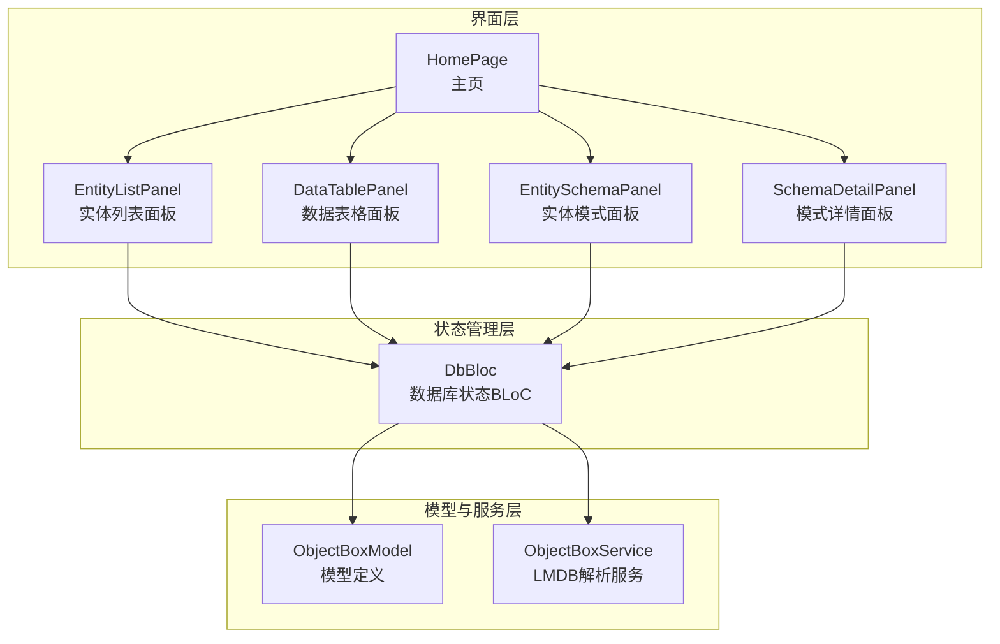
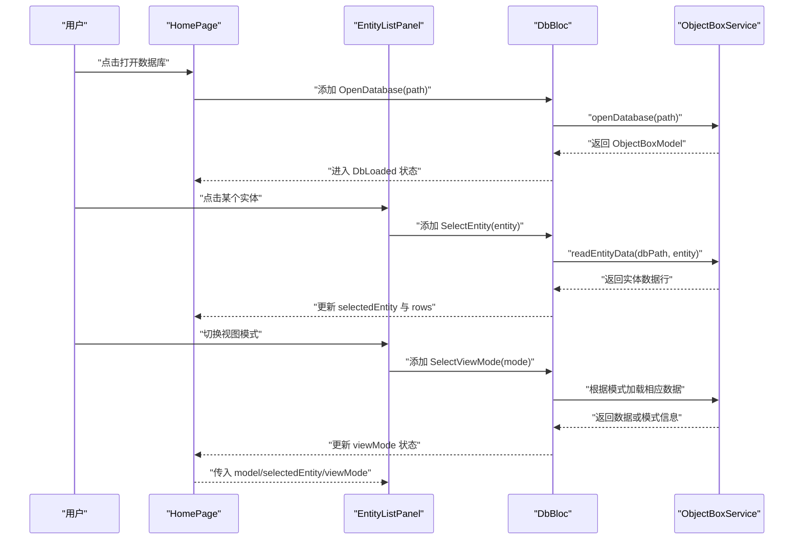
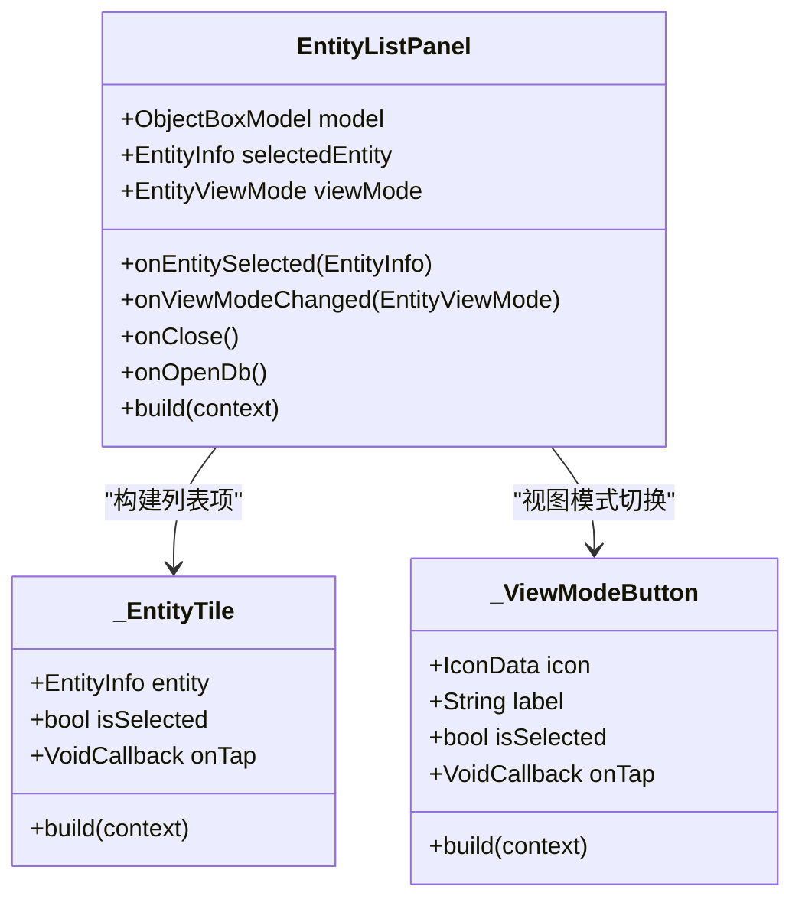
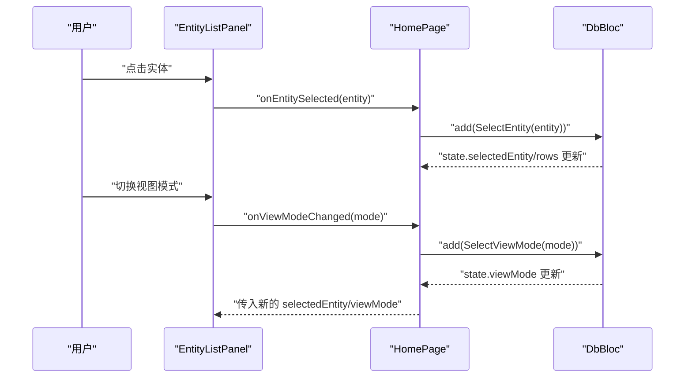
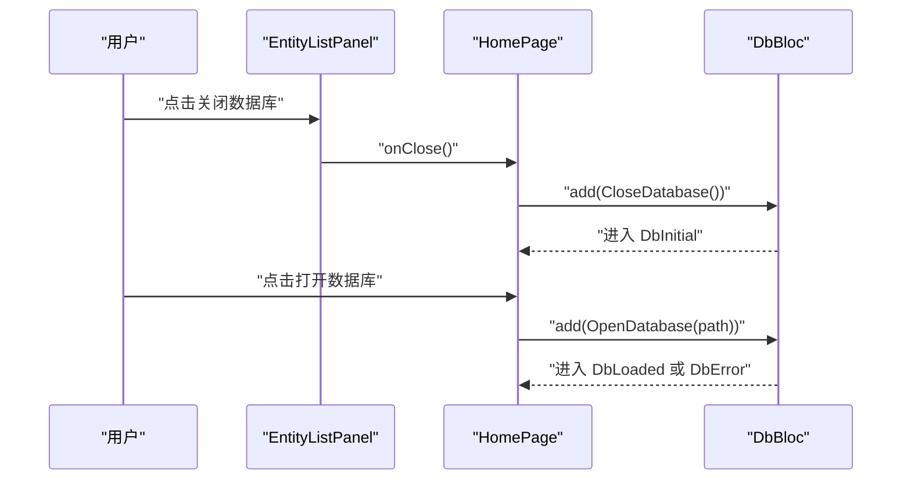
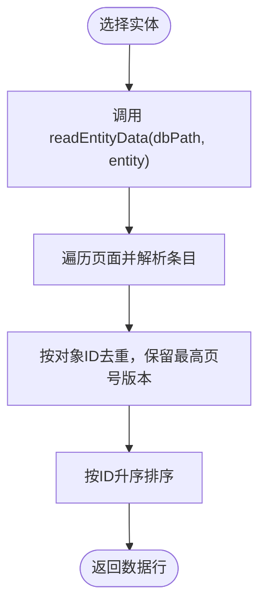
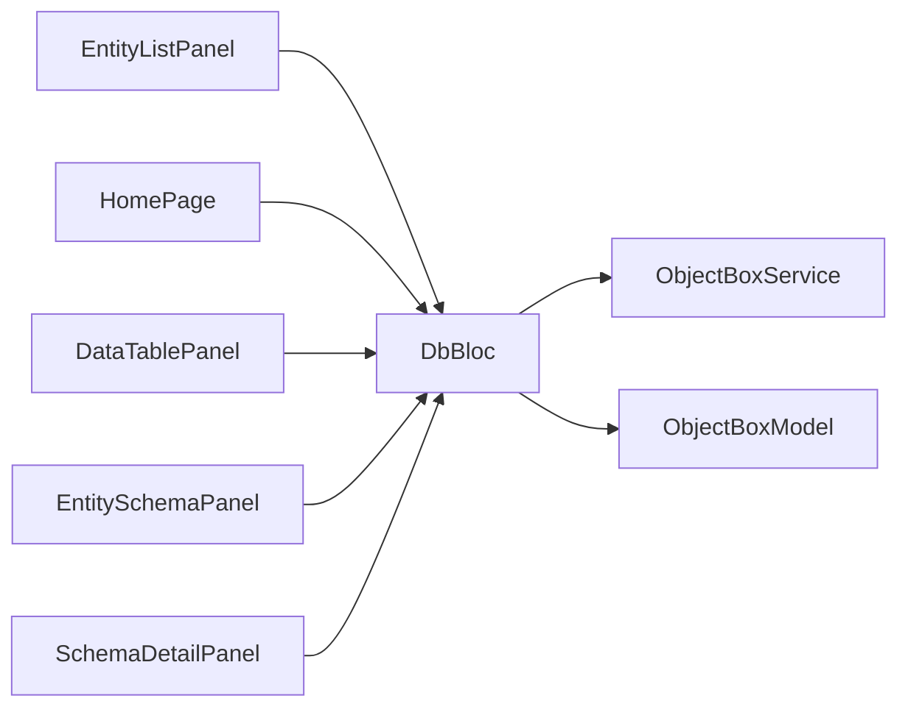

# 实体列表面板

<cite>
**本文引用的文件**
- [lib/widgets/entity_list_panel.dart](file://lib/widgets/entity_list_panel.dart)
- [lib/widgets/home_page.dart](file://lib/widgets/home_page.dart)
- [lib/bloc/db_bloc.dart](file://lib/bloc/db_bloc.dart)
- [lib/models/objectbox_model.dart](file://lib/models/objectbox_model.dart)
- [lib/services/objectbox_service.dart](file://lib/services/objectbox_service.dart)
- [lib/widgets/data_table_panel.dart](file://lib/widgets/data_table_panel.dart)
- [lib/widgets/entity_schema_panel.dart](file://lib/widgets/entity_schema_panel.dart)
- [lib/widgets/schema_detail_panel.dart](file://lib/widgets/schema_detail_panel.dart)
- [lib/main.dart](file://lib/main.dart)
</cite>

## 更新摘要
**变更内容**
- 新增视图模式切换功能，支持数据模式和模式模式的无缝切换
- 实体列表面板现在包含视图模式选择器，允许用户在数据表格和实体模式之间切换
- 视图模式状态通过 BLoC 管理，支持模式切换时的数据加载和状态同步
- 右侧面板根据当前视图模式动态显示相应的内容组件

## 目录
1. [简介](#简介)
2. [项目结构](#项目结构)
3. [核心组件](#核心组件)
4. [架构总览](#架构总览)
5. [详细组件分析](#详细组件分析)
6. [视图模式切换功能](#视图模式切换功能)
7. [依赖关系分析](#依赖关系分析)
8. [性能考虑](#性能考虑)
9. [故障排查指南](#故障排查指南)
10. [结论](#结论)
11. [附录](#附录)

## 简介
本文件针对"实体列表面板"组件进行系统化说明，覆盖以下方面：
- 显示逻辑：实体图标、名称渲染、属性数量与索引统计展示
- 选择交互：点击选中、高亮样式、选中态传递至全局状态
- 状态管理：通过 BLoC 管理数据库打开、关闭、实体选择与数据刷新
- 视图模式切换：支持数据模式和模式模式的无缝切换，增强用户体验
- 数据获取：从 LMDB 文件解析实体模型与实体数据，支持无 schema 模式下的自动发现
- 过滤与排序：当前实现未内置过滤器；实体列表按模型解析顺序排序
- 面板特性：固定宽度、垂直分割布局、底部统计栏、滚动行为与响应式适配
- 扩展能力：搜索、右键菜单、快捷键等可在现有架构上扩展

## 项目结构
实体列表面板位于 widgets 层，配合 BLoC 状态管理与服务层解析 LMDB 数据，最终在主页中以左右分栏形式呈现。新增的视图模式切换功能通过统一的状态管理实现。



**图表来源**
- [lib/widgets/home_page.dart:30-65](file://lib/widgets/home_page.dart#L30-L65)
- [lib/widgets/entity_list_panel.dart:4-86](file://lib/widgets/entity_list_panel.dart#L4-L86)
- [lib/bloc/db_bloc.dart:91-135](file://lib/bloc/db_bloc.dart#L91-L135)
- [lib/services/objectbox_service.dart:9-41](file://lib/services/objectbox_service.dart#L9-L41)
- [lib/models/objectbox_model.dart:3-61](file://lib/models/objectbox_model.dart#L3-L61)

**章节来源**
- [lib/widgets/home_page.dart:12-72](file://lib/widgets/home_page.dart#L12-L72)
- [lib/widgets/entity_list_panel.dart:20-86](file://lib/widgets/entity_list_panel.dart#L20-L86)

## 核心组件
- 实体列表面板（EntityListPanel）
  - 负责头部标题、关闭数据库按钮、实体列表渲染、底部统计信息展示
  - 列表项使用 ListTile，支持选中态高亮与点击回调
  - **新增**：视图模式选择器，支持数据模式和模式模式的切换
- 主页（HomePage）
  - 左侧固定宽度（260）的实体列表面板，右侧内容区根据是否选中实体和视图模式切换显示不同面板
  - 提供打开数据库入口与错误视图
- BLoC（DbBloc）
  - 处理打开数据库、选择实体、**新增**：视图模式切换、刷新数据、关闭数据库等事件
  - 维护 DbLoaded/DbError/DbLoading 等状态，携带模型、选中实体、数据行、**新增**：视图模式与错误信息
- 服务层（ObjectBoxService）
  - 解析 LMDB 文件，构建 ObjectBoxModel 或在无 schema 情况下自动发现模型
  - 读取指定实体的所有数据行
- 模型（ObjectBoxModel/EntityInfo/PropertyInfo/IndexInfo）
  - 定义实体、属性、索引、关系等结构，支持 discovered 模式下的动态推断

**章节来源**
- [lib/widgets/entity_list_panel.dart:4-86](file://lib/widgets/entity_list_panel.dart#L4-L86)
- [lib/widgets/home_page.dart:30-65](file://lib/widgets/home_page.dart#L30-L65)
- [lib/bloc/db_bloc.dart:91-135](file://lib/bloc/db_bloc.dart#L91-L135)
- [lib/services/objectbox_service.dart:9-41](file://lib/services/objectbox_service.dart#L9-L41)
- [lib/models/objectbox_model.dart:3-61](file://lib/models/objectbox_model.dart#L3-L61)

## 架构总览
实体列表面板与全局状态、服务层的交互流程如下：



**图表来源**
- [lib/widgets/home_page.dart:74-88](file://lib/widgets/home_page.dart#L74-L88)
- [lib/widgets/entity_list_panel.dart:58-62](file://lib/widgets/entity_list_panel.dart#L58-L62)
- [lib/bloc/db_bloc.dart:101-124](file://lib/bloc/db_bloc.dart#L101-L124)
- [lib/services/objectbox_service.dart:31-40](file://lib/services/objectbox_service.dart#L31-L40)

## 详细组件分析

### 实体列表面板（EntityListPanel）
- 显示逻辑
  - 头部：标题"Entities"，左侧图标，右侧"关闭数据库"按钮
  - 列表：使用 ListView.builder 渲染 model.entities，每个条目为 _EntityTile
  - **新增**：视图模式选择器区域，仅在选中实体时显示
  - 底部：显示"实体数 · 索引数"的统计信息
- 选择交互
  - 点击条目触发 onEntitySelected 回调，将实体信息传递给父组件（HomePage）
  - 选中态通过 selected 参数与主题色高亮显示
- **新增**：视图模式切换
  - 使用 _ViewModeButton 组件提供数据模式和模式模式切换
  - 支持通过图标（table_chart 和 schema）和标签（Data 和 Schema）区分模式
  - 选中态通过颜色和字体加粗显示
- 状态管理
  - 由父组件 HomePage 将 DbBloc 的状态注入到面板，面板仅负责渲染与交互
- 图标与名称
  - leading 使用 table_chart 图标，选中态变为主色
  - title 显示实体名，subtitle 显示属性数量
  - trailing 使用 chevron_right 指示可进入详情
- 面板宽度与滚动
  - 宽度固定为 260，使用 Expanded 包裹以占满可用高度
  - 列表采用 ListView.builder，具备默认滚动行为
- 响应式适配
  - 通过 Row/Expanded/SizedBox 实现左右分栏布局，适合桌面端窗口缩放



**图表来源**
- [lib/widgets/entity_list_panel.dart:4-86](file://lib/widgets/entity_list_panel.dart#L4-L86)
- [lib/widgets/entity_list_panel.dart:88-131](file://lib/widgets/entity_list_panel.dart#L88-L131)
- [lib/widgets/entity_list_panel.dart:186-237](file://lib/widgets/entity_list_panel.dart#L186-L237)

**章节来源**
- [lib/widgets/entity_list_panel.dart:20-86](file://lib/widgets/entity_list_panel.dart#L20-L86)

### 选择交互与事件处理
- 用户点击实体列表项时，触发 onEntitySelected 回调
- HomePage 接收回调后向 DbBloc 发送 SelectEntity 事件
- DbBloc 更新选中实体并异步加载该实体的数据行
- **新增**：用户切换视图模式时，触发 onViewModeChanged 回调
- **新增**：DbBloc 接收 SelectViewMode 事件，根据模式决定是否加载数据
- 加载完成后，HomePage 决定右侧显示 SchemaDetailPanel、DataTablePanel 还是 EntitySchemaPanel



**图表来源**
- [lib/widgets/entity_list_panel.dart:58-62](file://lib/widgets/entity_list_panel.dart#L58-L62)
- [lib/widgets/home_page.dart:39-41](file://lib/widgets/home_page.dart#L39-L41)
- [lib/bloc/db_bloc.dart:112-124](file://lib/bloc/db_bloc.dart#L112-L124)

**章节来源**
- [lib/widgets/entity_list_panel.dart:58-62](file://lib/widgets/entity_list_panel.dart#L58-L62)
- [lib/widgets/home_page.dart:39-41](file://lib/widgets/home_page.dart#L39-L41)
- [lib/bloc/db_bloc.dart:112-124](file://lib/bloc/db_bloc.dart#L112-L124)

### 关闭数据库与打开新数据库
- 关闭数据库
  - EntityListPanel 头部"关闭数据库"按钮触发 onClose 回调
  - HomePage 将 CloseDatabase 事件发送至 DbBloc，回到初始状态
- 打开新数据库
  - HomePage 提供打开数据库入口，调用 FilePicker 选择目录
  - 将 OpenDatabase 事件发送至 DbBloc，触发服务层解析与状态更新



**图表来源**
- [lib/widgets/entity_list_panel.dart:43-47](file://lib/widgets/entity_list_panel.dart#L43-L47)
- [lib/widgets/home_page.dart:74-88](file://lib/widgets/home_page.dart#L74-L88)
- [lib/bloc/db_bloc.dart:132-134](file://lib/bloc/db_bloc.dart#L132-L134)
- [lib/main.dart:97-115](file://lib/main.dart#L97-L115)

**章节来源**
- [lib/widgets/entity_list_panel.dart:43-47](file://lib/widgets/entity_list_panel.dart#L43-L47)
- [lib/widgets/home_page.dart:74-88](file://lib/widgets/home_page.dart#L74-L88)
- [lib/bloc/db_bloc.dart:132-134](file://lib/bloc/db_bloc.dart#L132-L134)
- [lib/main.dart:97-115](file://lib/main.dart#L97-L115)

### 数据获取、过滤与排序
- 数据获取
  - DbBloc 在收到 SelectEntity 后，调用 ObjectBoxService.readEntityData 获取实体数据
  - 服务层解析 LMDB 文件，按页扫描并去重保留最新版本记录
- 过滤与排序
  - 当前未实现内置过滤器
  - 实体列表按模型解析顺序排序；数据行按 id 升序排列
- 模型来源
  - 若存在 objectbox-model.json，则直接解析生成模型
  - 若缺失，则通过字符串与 FlatBuffer VTable 搜索自动发现实体与属性



**图表来源**
- [lib/bloc/db_bloc.dart:118-120](file://lib/bloc/db_bloc.dart#L118-L120)
- [lib/services/objectbox_service.dart:369-399](file://lib/services/objectbox_service.dart#L369-L399)

**章节来源**
- [lib/bloc/db_bloc.dart:112-124](file://lib/bloc/db_bloc.dart#L112-L124)
- [lib/services/objectbox_service.dart:31-40](file://lib/services/objectbox_service.dart#L31-L40)
- [lib/services/objectbox_service.dart:78-140](file://lib/services/objectbox_service.dart#L78-L140)

### 面板宽度、滚动与响应式适配
- 宽度设置
  - 左侧面板固定宽度 260，右侧内容区自适应
- 滚动行为
  - 列表使用 ListView.builder，默认纵向滚动
- 响应式适配
  - 使用 Row/Expanded/SizedBox 构建左右分栏，适合窗口尺寸变化

**章节来源**
- [lib/widgets/home_page.dart:34-44](file://lib/widgets/home_page.dart#L34-L44)
- [lib/widgets/entity_list_panel.dart:52-65](file://lib/widgets/entity_list_panel.dart#L52-L65)

### 搜索、右键菜单与快捷键支持
- 当前实现未包含搜索框、右键菜单或快捷键绑定
- 可在现有架构上扩展：
  - 搜索：在 EntityListPanel 上方添加 TextField，结合 Debounce 与过滤逻辑更新列表
  - 右键菜单：为 _EntityTile 添加 PopupMenuButton 或 ContextMenu
  - 快捷键：在 HomePage 上注册 Shortcuts/LogicalKeySets 并映射到对应动作

（本节为概念性建议，不涉及具体源码）

## 视图模式切换功能

### 功能概述
实体列表面板新增了视图模式切换功能，允许用户在数据模式和模式模式之间无缝切换，提供更灵活的数据库浏览体验。

### 视图模式类型
- 数据模式（EntityViewMode.data）
  - 显示实体的原始数据内容
  - 通过 DataTablePanel 呈现表格形式的数据
  - 支持分页加载、导出功能
- 模式模式（EntityViewMode.schema）
  - 显示实体的结构信息和模式详情
  - 通过 EntitySchemaPanel 呈现属性和索引信息
  - 提供实体元数据和关系信息

### 视图模式切换机制
- 视图模式状态管理
  - 通过 DbBloc 的 EntityViewMode 枚举管理当前模式
  - 状态包含 viewMode 字段，默认为 data 模式
  - 切换时自动清空数据行和错误信息
- UI 组件实现
  - _ViewModeButton 组件提供可视化的模式切换按钮
  - 使用 Material Design 风格的按钮样式
  - 支持图标和文本标签的组合显示
- 数据加载策略
  - 切换到数据模式时自动加载实体数据
  - 切换到模式模式时不需要加载数据
  - 模式切换不影响实体选择状态

### 状态流转
```mermaid
stateDiagram-v2
[*] --> DataMode : 默认模式
[*] --> SchemaMode : 切换到模式模式
state DataMode {
[*] --> LoadingData : 选择实体
LoadingData --> DataReady : 数据加载成功
LoadingData --> DataError : 数据加载失败
DataReady --> SchemaMode : 切换到模式模式
DataError --> DataReady : 重新加载
}
state SchemaMode {
[*] --> LoadingSchema : 选择实体
LoadingSchema --> SchemaReady : 模式信息加载
SchemaReady --> DataMode : 切换到数据模式
}
state DataReady {
[*] --> DataMode
}
state SchemaReady {
[*] --> SchemaMode
}
state DataError {
[*] --> DataMode
}
```

**图表来源**
- [lib/bloc/db_bloc.dart:7-8](file://lib/bloc/db_bloc.dart#L7-L8)
- [lib/bloc/db_bloc.dart:32-38](file://lib/bloc/db_bloc.dart#L32-L38)
- [lib/bloc/db_bloc.dart:178-203](file://lib/bloc/db_bloc.dart#L178-L203)

### 依赖关系
- 组件耦合
  - EntityListPanel 依赖 DbBloc 的视图模式状态
  - HomePage 根据视图模式动态选择右侧面板
  - DataTablePanel 和 EntitySchemaPanel 分别处理两种模式的内容
- 外部依赖
  - Flutter 生态（Material）
  - flutter_bloc（状态管理）
  - file_picker（文件选择）

**章节来源**
- [lib/widgets/entity_list_panel.dart:66-113](file://lib/widgets/entity_list_panel.dart#L66-L113)
- [lib/bloc/db_bloc.dart:7-8](file://lib/bloc/db_bloc.dart#L7-L8)
- [lib/bloc/db_bloc.dart:32-38](file://lib/bloc/db_bloc.dart#L32-L38)
- [lib/bloc/db_bloc.dart:178-203](file://lib/bloc/db_bloc.dart#L178-L203)

## 依赖关系分析
- 组件耦合
  - EntityListPanel 仅依赖传入的 model/selectedEntity/viewMode/onEntitySelected/onViewModeChanged/onClose/onOpenDb
  - HomePage 作为容器，负责状态注入与事件转发，**新增**：根据视图模式选择不同的右侧面板
  - DbBloc 作为单一事实来源，协调服务层与 UI，**新增**：处理视图模式切换事件
- 外部依赖
  - Flutter 生态（Material）
  - flutter_bloc（状态管理）
  - file_picker（文件选择）



**图表来源**
- [lib/widgets/entity_list_panel.dart:4-18](file://lib/widgets/entity_list_panel.dart#L4-L18)
- [lib/widgets/home_page.dart:36-43](file://lib/widgets/home_page.dart#L36-L43)
- [lib/bloc/db_bloc.dart:91-99](file://lib/bloc/db_bloc.dart#L91-L99)
- [lib/services/objectbox_service.dart:9-19](file://lib/services/objectbox_service.dart#L9-L19)
- [lib/models/objectbox_model.dart:3-22](file://lib/models/objectbox_model.dart#L3-L22)

**章节来源**
- [lib/widgets/entity_list_panel.dart:4-18](file://lib/widgets/entity_list_panel.dart#L4-L18)
- [lib/widgets/home_page.dart:36-43](file://lib/widgets/home_page.dart#L36-L43)
- [lib/bloc/db_bloc.dart:91-99](file://lib/bloc/db_bloc.dart#L91-L99)

## 性能考虑
- 列表渲染
  - 使用 ListView.builder，避免一次性构建所有条目，降低内存占用
- 数据加载
  - 仅在选择实体时加载数据，减少不必要的 IO
  - **新增**：视图模式切换时智能加载，避免重复数据请求
- 去重与排序
  - 服务层按页扫描并按对象 ID 去重，保留最高页号版本，避免重复渲染
  - 最终按 id 排序，保证稳定输出
- **新增**：视图模式优化
  - 模式切换时自动清空数据行，避免内存泄漏
  - 数据模式下的分页加载，支持大数据集浏览
- 大数据集处理建议
  - 分页加载：在读取数据行时增加分页参数，限制单次返回数量
  - 虚拟化：对超大列表启用虚拟列表（如 flutter_staggered_grid_view 或自定义视口裁剪）
  - 缓存：缓存已解析的实体模型与最近访问的数据行，减少重复解析
  - 异步解析：将 FlatBuffer 解析与 UI 线程分离，避免阻塞主线程

（本节为通用性能建议，不涉及具体源码）

## 故障排查指南
- 打不开数据库
  - 确认选择了包含 data.mdb 的目录
  - 检查是否有权限访问目标路径
- 无实体显示
  - 若缺少 objectbox-model.json，系统会尝试自动发现；若仍为空，检查数据文件完整性
- 选择实体后无数据
  - 查看 DbBloc 状态中的 error 字段，确认服务层解析是否抛出异常
- **新增**：视图模式切换问题
  - 检查 DbBloc 中的 viewMode 状态是否正确更新
  - 确认右侧面板是否根据视图模式正确显示
  - 如果切换到数据模式后无数据显示，检查数据加载是否成功
- 刷新无效
  - 使用 RefreshData 事件触发重新加载当前实体数据

**章节来源**
- [lib/bloc/db_bloc.dart:101-110](file://lib/bloc/db_bloc.dart#L101-L110)
- [lib/bloc/db_bloc.dart:126-130](file://lib/bloc/db_bloc.dart#L126-L130)
- [lib/widgets/home_page.dart:19-21](file://lib/widgets/home_page.dart#L19-L21)

## 结论
实体列表面板通过清晰的职责划分与 BLoC 状态管理，实现了稳定的实体浏览体验。**新增的视图模式切换功能进一步增强了用户体验，提供了更灵活的数据库浏览方式。** 其核心优势在于：
- 简洁的 UI 与明确的交互反馈
- **新增**：灵活的视图模式切换，支持数据和模式两种浏览方式
- 基于 LMDB 的可靠数据解析与 discovered 模式兼容
- 可扩展的架构便于后续加入搜索、右键菜单与快捷键等功能

## 附录
- 相关文件路径与用途
  - 实体列表面板：lib/widgets/entity_list_panel.dart
  - 主页容器：lib/widgets/home_page.dart
  - 状态管理：lib/bloc/db_bloc.dart
  - 模型定义：lib/models/objectbox_model.dart
  - 数据服务：lib/services/objectbox_service.dart
  - 数据表格面板：lib/widgets/data_table_panel.dart
  - 实体模式面板：lib/widgets/entity_schema_panel.dart
  - 模式详情面板：lib/widgets/schema_detail_panel.dart
  - 应用入口：lib/main.dart