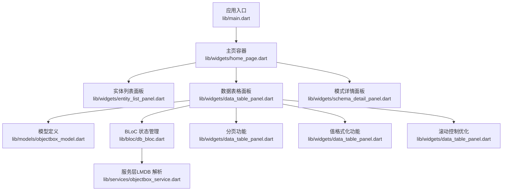
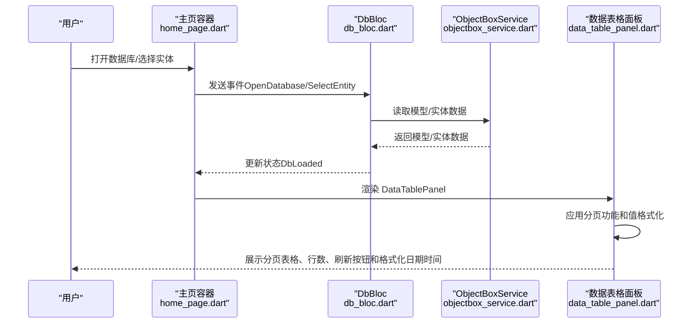
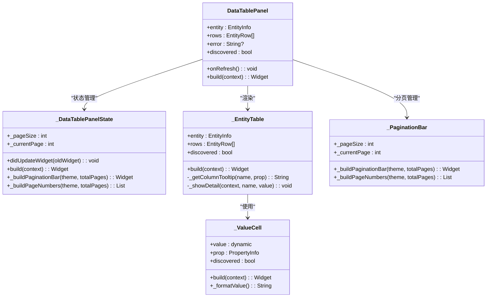
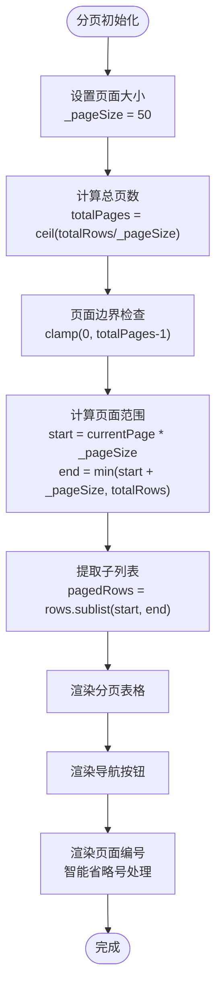
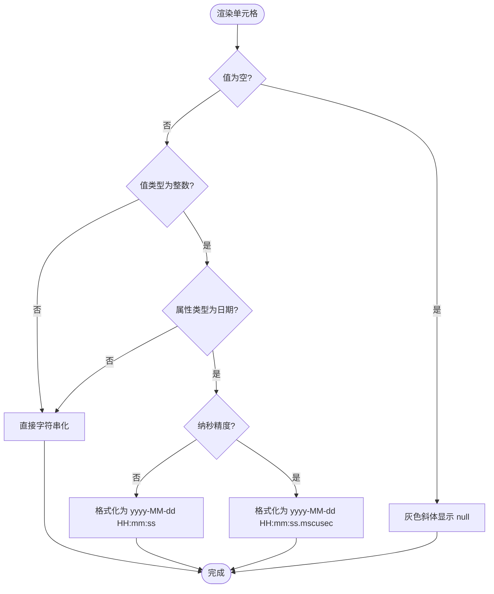
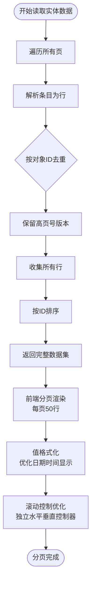
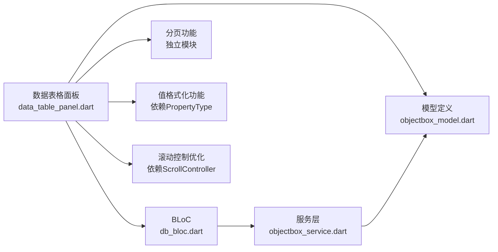
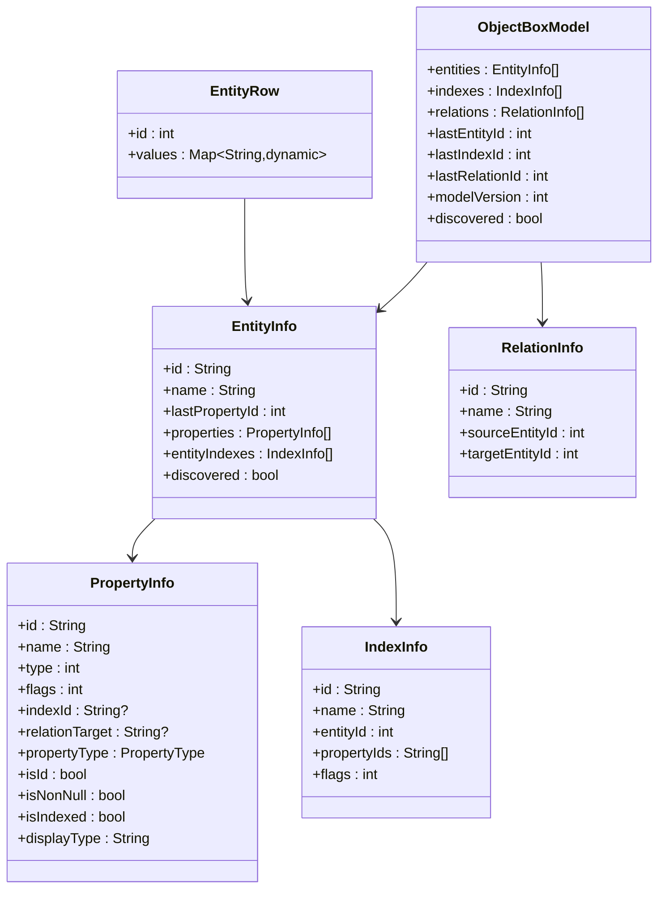

# 数据表格面板

<cite>
**本文引用的文件**
- [lib/main.dart](file://lib/main.dart)
- [lib/widgets/home_page.dart](file://lib/widgets/home_page.dart)
- [lib/widgets/data_table_panel.dart](file://lib/widgets/data_table_panel.dart)
- [lib/widgets/schema_detail_panel.dart](file://lib/widgets/schema_detail_panel.dart)
- [lib/models/objectbox_model.dart](file://lib/models/objectbox_model.dart)
- [lib/bloc/db_bloc.dart](file://lib/bloc/db_bloc.dart)
- [lib/services/objectbox_service.dart](file://lib/services/objectbox_service.dart)
- [tool/find_page_size.dart](file://tool/find_page_size.dart)
</cite>

## 更新摘要
**变更内容**
- 数据表格面板从StatelessWidget转换为StatefulWidget，增强了状态管理和性能优化
- 新增完整的分页功能实现，包括可配置的页面大小、导航按钮和页面编号指示器
- 添加智能分页栏管理，支持省略号处理和页面边界智能控制
- 更新分页加载机制，从服务层获取完整数据集并进行前端分页
- 增强大数据集处理能力，支持高效的数据分页展示
- **新增增强的值格式化功能**：支持毫秒和纳秒精度的日期/时间显示，包括毫秒精度的Date类型和纳秒精度的DateNano类型
- **新增滚动控制优化**：实体表格使用独立的水平和垂直滚动控制器，提升滚动性能和用户体验

## 目录
1. [简介](#简介)
2. [项目结构](#项目结构)
3. [核心组件](#核心组件)
4. [架构总览](#架构总览)
5. [详细组件分析](#详细组件分析)
6. [依赖关系分析](#依赖关系分析)
7. [性能考虑](#性能考虑)
8. [故障排查指南](#故障排查指南)
9. [结论](#结论)
10. [附录](#附录)

## 简介
本文件面向"数据表格面板"组件，系统性说明其在对象数据库浏览工具中的职责与实现：包括表格数据的渲染、排序与筛选能力；数据行的动态生成、列宽与单元格格式化；**分页加载、无限滚动与大数据集处理机制**；排序列点击、多列排序与自定义排序规则；数据刷新、缓存策略与性能优化；导出、复制与编辑模式支持；以及主题定制、响应式布局与无障碍访问实现。

该组件基于 Flutter 构建，采用 BLoC 状态管理，直接解析 LMDB 文件以读取实体数据，支持从 schema JSON 与无 JSON 的"发现模式"两种方式构建模型。

**更新** 数据表格面板已从StatelessWidget转换为StatefulWidget，增强了状态管理和性能优化。新增完整的分页功能，支持可配置的页面大小（默认50行/页）、智能分页导航和大数据集高效展示。**新增增强的值格式化功能**，支持毫秒和纳秒精度的日期/时间显示，包括毫秒精度的Date类型和纳秒精度的DateNano类型。**新增滚动控制优化**，实体表格使用独立的水平和垂直滚动控制器，提升滚动性能和用户体验。

## 项目结构
- 应用入口与主题配置位于应用根部，负责打开数据库目录、初始化主题与导航壳体。
- 主界面由左侧实体列表、右侧内容区组成，内容区根据当前状态展示模式详情或数据表格面板。
- 数据表格面板负责渲染实体数据表、提供刷新与详情查看、复制等交互，**现已集成完整的分页功能和增强的值格式化功能**。
- 模型层抽象了对象模型、实体、属性与行数据结构，包含对日期/时间类型的完整支持。
- BLoC 层负责事件到状态的转换，协调服务层读取数据。
- 服务层直接解析 LMDB 文件，按实体读取数据并进行去重与排序。

**图表来源**
- [lib/main.dart:13-43](file://lib/main.dart#L13-L43)
- [lib/widgets/home_page.dart:30-62](file://lib/widgets/home_page.dart#L30-L62)
- [lib/widgets/data_table_panel.dart:8-26](file://lib/widgets/data_table_panel.dart#L8-L26)
- [lib/models/objectbox_model.dart:1-248](file://lib/models/objectbox_model.dart#L1-L248)
- [lib/bloc/db_bloc.dart:91-136](file://lib/bloc/db_bloc.dart#L91-L136)
- [lib/services/objectbox_service.dart:1-41](file://lib/services/objectbox_service.dart#L1-L41)
- [lib/widgets/data_table_panel.dart:28-338](file://lib/widgets/data_table_panel.dart#L28-L338)

**章节来源**
- [lib/main.dart:1-147](file://lib/main.dart#L1-L147)
- [lib/widgets/home_page.dart:1-218](file://lib/widgets/home_page.dart#L1-L218)

## 核心组件
- 数据表格面板（DataTablePanel）
  - **已从StatelessWidget转换为StatefulWidget**，负责渲染实体数据表、显示行数统计、提供刷新按钮。
  - **新增分页功能**：支持可配置的页面大小、导航按钮和页面编号指示器。
  - **新增状态管理**：内部维护当前页码和页面大小状态，支持页面边界检查和状态同步。
  - 内部通过实体表（_EntityTable）生成列头与行数据，支持列提示与单元格点击查看详情。
- 实体表（_EntityTable）
  - **已从StatelessWidget转换为StatefulWidget**，动态生成列集合（含 id 列），根据实体属性映射生成 DataCell。
  - **新增滚动控制优化**：使用独立的水平和垂直滚动控制器，支持更好的滚动性能和用户体验。
  - 支持列宽估算与横向滚动，单元格内容按类型进行格式化与截断。
- 值单元格（_ValueCell）
  - 对空值、超长文本、不同数据类型（bool/int/double/String）进行样式区分与溢出处理。
  - **新增增强的日期/时间格式化**：支持毫秒精度（Date类型）和纳秒精度（DateNano类型）的日期时间显示。
- BLoC（DbBloc）
  - 处理打开数据库、选择实体、刷新数据、关闭数据库等事件，驱动服务层读取数据并更新状态。
- 服务层（ObjectBoxService）
  - 直接解析 LMDB 文件，发现模型或读取实体数据，按页扫描并去重，最终排序返回结果。
- 模型（ObjectBoxModel/EntityInfo/PropertyInfo/EntityRow）
  - 抽象对象模型、实体、属性与单行数据，支持"发现模式"。
  - **包含完整的日期/时间类型支持**：支持毫秒精度的Date类型和纳秒精度的DateNano类型。

**章节来源**
- [lib/widgets/data_table_panel.dart:8-338](file://lib/widgets/data_table_panel.dart#L8-L338)
- [lib/bloc/db_bloc.dart:1-136](file://lib/bloc/db_bloc.dart#L1-L136)
- [lib/services/objectbox_service.dart:1-800](file://lib/services/objectbox_service.dart#L1-L800)
- [lib/models/objectbox_model.dart:1-248](file://lib/models/objectbox_model.dart#L1-L248)

## 架构总览
下图展示了从用户交互到数据呈现的整体流程：用户在主页触发打开数据库或选择实体，BLoC 接收事件后调用服务层解析 LMDB 并返回实体数据，随后 UI 通过数据表格面板渲染，**现已集成分页功能和增强的值格式化功能**。

**图表来源**
- [lib/widgets/home_page.dart:54-61](file://lib/widgets/home_page.dart#L54-L61)
- [lib/bloc/db_bloc.dart:101-130](file://lib/bloc/db_bloc.dart#L101-L130)
- [lib/services/objectbox_service.dart:31-40](file://lib/services/objectbox_service.dart#L31-L40)
- [lib/widgets/data_table_panel.dart:41-138](file://lib/widgets/data_table_panel.dart#L41-L138)

## 详细组件分析

### 数据表格面板（DataTablePanel）
- **架构变更**
  - **已从StatelessWidget转换为StatefulWidget**，新增状态管理能力
  - 新增分页状态管理（`_currentPage`）和页面大小常量（`_pageSize`）
  - 新增页面状态同步机制，在实体变化时自动重置到第一页
- 功能要点
  - 顶部栏：显示实体名、自动发现标记、行数统计、刷新按钮。
  - **分页栏**：底部显示页面编号指示器和导航按钮，支持首页、上一页、下一页、末页跳转。
  - 内容区：错误状态、加载中、无数据、或进入实体表渲染。
- 设计细节
  - 使用 Material 的 DataTable 组件，设置表头背景色与默认排序索引与方向。
  - **分页状态管理**：内部维护当前页码和页面大小常量，支持页面边界检查。
  - 列头包含字段名与可选的类型标签（发现模式时）。
  - 行内单元格支持点击弹窗查看完整值并支持复制到剪贴板。

**图表来源**
- [lib/widgets/data_table_panel.dart:8-338](file://lib/widgets/data_table_panel.dart#L8-L338)
- [lib/widgets/data_table_panel.dart:28-338](file://lib/widgets/data_table_panel.dart#L28-L338)
- [lib/widgets/data_table_panel.dart:340-517](file://lib/widgets/data_table_panel.dart#L340-L517)

**章节来源**
- [lib/widgets/data_table_panel.dart:8-338](file://lib/widgets/data_table_panel.dart#L8-L338)
- [lib/widgets/data_table_panel.dart:28-138](file://lib/widgets/data_table_panel.dart#L28-L138)

### 分页功能实现
- **页面大小配置**
  - 静态常量 `_pageSize = 50` 定义每页显示的行数
  - 页面大小可配置，便于适应不同屏幕尺寸和数据量需求
- **分页栏设计**
  - 页面编号指示器显示"第X页 共Y页"
  - 导航按钮：首页、上一页、下一页、末页
  - 智能页面编号显示，支持省略号处理
- **页面导航逻辑**
  - 首页/末页按钮在相应边界时禁用
  - 上一页/下一页按钮根据当前页码动态启用/禁用
  - 页面编号点击跳转到指定页面
- **智能分页管理**
  - 最大可见页面数为7个，超出范围显示省略号
  - 当前页面居中显示，前后各显示2个相邻页面
  - 边界情况自动调整显示范围

**图表来源**
- [lib/widgets/data_table_panel.dart:29-48](file://lib/widgets/data_table_panel.dart#L29-L48)
- [lib/widgets/data_table_panel.dart:140-194](file://lib/widgets/data_table_panel.dart#L140-L194)
- [lib/widgets/data_table_panel.dart:196-255](file://lib/widgets/data_table_panel.dart#L196-L255)

**章节来源**
- [lib/widgets/data_table_panel.dart:29-48](file://lib/widgets/data_table_panel.dart#L29-L48)
- [lib/widgets/data_table_panel.dart:140-194](file://lib/widgets/data_table_panel.dart#L140-L194)
- [lib/widgets/data_table_panel.dart:196-255](file://lib/widgets/data_table_panel.dart#L196-L255)

### 实体表（_EntityTable）与列宽、单元格格式化
- **架构变更**
  - **已从StatelessWidget转换为StatefulWidget**，新增滚动控制能力
  - 新增独立的水平和垂直滚动控制器
- 列宽与横向滚动
  - 通过外层 SingleChildScrollView 配合固定宽度容器实现横向滚动，列宽按列数线性增长。
  - **新增滚动控制优化**：使用独立的水平和垂直滚动控制器，提升滚动性能
- 单元格格式化
  - id 列使用等宽字体；其他列根据类型设置颜色与溢出策略。
  - 超长文本截断并显示省略号；null 值使用灰色斜体样式。
  - **新增增强的日期/时间格式化**：支持毫秒精度（Date类型）和纳秒精度（DateNano类型）的日期时间显示。
- 列头提示
  - 提供列头 tooltip，包含类型、是否非空、是否主键等信息。

**图表来源**
- [lib/widgets/data_table_panel.dart:560-586](file://lib/widgets/data_table_panel.dart#L560-L586)

**章节来源**
- [lib/widgets/data_table_panel.dart:355-475](file://lib/widgets/data_table_panel.dart#L355-L475)
- [lib/widgets/data_table_panel.dart:560-586](file://lib/widgets/data_table_panel.dart#L560-L586)

### 增强的值格式化功能
- **毫秒精度日期格式化**
  - 对于 `PropertyType.date` 类型的属性，使用 `DateTime.fromMillisecondsSinceEpoch(value)` 进行转换
  - 显示格式为 `yyyy-MM-dd HH:mm:ss`
- **纳秒精度日期格式化**
  - 对于 `PropertyType.dateNano` 类型的属性，使用 `DateTime.fromMicrosecondsSinceEpoch(value ~/ 1000)` 进行转换
  - 显示格式为 `yyyy-MM-dd HH:mm:ss.mscusec`，其中：
    - `msc` 表示毫秒（3位数字）
    - `cusec` 表示微秒（3位数字）
- **格式化逻辑**
  - 仅对整数值进行日期格式化处理
  - 成功转换的日期值按指定格式显示
  - 非日期值或转换失败的值保持原始字符串表示

**章节来源**
- [lib/widgets/data_table_panel.dart:560-586](file://lib/widgets/data_table_panel.dart#L560-L586)
- [lib/models/objectbox_model.dart:134-179](file://lib/models/objectbox_model.dart#L134-L179)

### 排序与筛选
- 排序
  - DataTable 设置了默认排序索引与方向，但未绑定交互回调，因此当前版本不支持用户点击列头进行排序。
- 筛选
  - 当前未实现客户端筛选逻辑，筛选能力需在上层扩展（如在 BLoC 中增加过滤状态并在渲染前预处理 rows）。
- 自定义排序规则
  - 可通过在 BLoC 中维护排序状态（列索引、方向、多列规则），在读取数据后进行二次排序。

**章节来源**
- [lib/widgets/data_table_panel.dart:397-398](file://lib/widgets/data_table_panel.dart#L397-L398)

### 大数据集处理机制
- **分页加载策略**
  - 服务层按页扫描 LMDB 文件，逐页解析条目，使用 Map 以对象 ID 去重，保留高页号版本（最新写入）。
  - **前端分页**：UI 层接收完整数据集，通过分页功能进行前端分页展示。
- **性能优化**
  - 服务层已完成去重与排序，UI 层通过分页减少一次性渲染的数据量。
  - 支持大数据集的高效展示，避免内存压力和渲染卡顿。
  - **增强的值格式化**：优化了日期/时间值的格式化性能，避免不必要的字符串转换。
  - **新增滚动控制优化**：使用独立的滚动控制器，提升大数据集的滚动性能。
- **内存管理**
  - 每次只渲染当前页的数据，减少内存占用。
  - 页面切换时保持数据完整性，避免重复加载。

**图表来源**
- [lib/services/objectbox_service.dart:369-399](file://lib/services/objectbox_service.dart#L369-L399)
- [lib/widgets/data_table_panel.dart:29-48](file://lib/widgets/data_table_panel.dart#L29-L48)
- [lib/widgets/data_table_panel.dart:355-364](file://lib/widgets/data_table_panel.dart#L355-L364)

**章节来源**
- [lib/services/objectbox_service.dart:369-399](file://lib/services/objectbox_service.dart#L369-L399)
- [lib/widgets/data_table_panel.dart:29-48](file://lib/widgets/data_table_panel.dart#L29-L48)

### 数据刷新、缓存策略与性能优化
- 刷新
  - 通过 BLoC 的 RefreshData 事件触发重新读取当前实体数据。
- 缓存策略
  - 当前未实现跨请求缓存；可在 BLoC 中引入内存缓存（按实体与查询条件作为键）。
- 性能优化
  - 服务层已做去重与排序，UI 层通过分页功能减少一次性渲染的数据量。
  - 对于超长文本，建议仅在点击时按需展开或使用对话框展示。
  - **值格式化优化**：仅对整数类型的日期值进行格式化，避免对其他类型进行不必要的处理。
  - **新增滚动性能优化**：使用独立的滚动控制器，提升大数据集的滚动性能。

**章节来源**
- [lib/bloc/db_bloc.dart:126-130](file://lib/bloc/db_bloc.dart#L126-L130)
- [lib/widgets/data_table_panel.dart:287-292](file://lib/widgets/data_table_panel.dart#L287-L292)

### 导出、复制与编辑模式
- 复制
  - 单元格点击弹窗后提供"复制到剪贴板"按钮，复制成功通过 SnackBar 提示。
- 导出
  - **新增 JSON 导出功能**：支持将当前实体数据导出为 JSON 文件。
  - 导出包含实体名称和对象数组，每个对象包含 id 和所有属性值。
- 编辑
  - 当前未实现编辑功能；可在表格中加入可编辑单元格与保存事件，结合服务层写入逻辑扩展。

**章节来源**
- [lib/widgets/data_table_panel.dart:287-292](file://lib/widgets/data_table_panel.dart#L287-L292)
- [lib/widgets/data_table_panel.dart:294-337](file://lib/widgets/data_table_panel.dart#L294-L337)

### 主题定制、响应式布局与无障碍访问
- 主题定制
  - 应用使用 Material3 主题，支持明暗切换；表格表头背景色与文本样式均基于主题变量。
  - **分页栏主题适配**：分页按钮和页面编号使用一致的主题色彩方案。
- 响应式布局
  - 左右分栏布局，右侧内容区占主导，适配桌面端窗口尺寸变化。
  - **分页栏自适应**：页面编号区域居中显示，支持不同屏幕尺寸。
- 无障碍访问
  - 使用标准 Material 组件与图标，具备基础可访问性；建议为按钮添加语义标签与键盘导航支持。

**章节来源**
- [lib/main.dart:28-42](file://lib/main.dart#L28-L42)
- [lib/widgets/home_page.dart:30-62](file://lib/widgets/home_page.dart#L30-L62)

## 依赖关系分析
- 组件耦合
  - DataTablePanel 依赖模型与 BLoC；BLoC 依赖服务层；服务层依赖模型定义。
  - **新增分页功能依赖**：分页功能独立于数据加载，通过状态管理实现。
  - **值格式化功能依赖**：值格式化功能依赖 PropertyType 枚举定义。
  - **新增滚动控制依赖**：滚动控制优化依赖 Flutter 的 ScrollController。
- 外部依赖
  - 使用 Flutter Material 组件、flutter_bloc、file_picker 等。
- 循环依赖
  - 未见循环依赖，模块边界清晰。

**图表来源**
- [lib/widgets/data_table_panel.dart:1-596](file://lib/widgets/data_table_panel.dart#L1-L596)
- [lib/bloc/db_bloc.dart:1-136](file://lib/bloc/db_bloc.dart#L1-L136)
- [lib/services/objectbox_service.dart:1-41](file://lib/services/objectbox_service.dart#L1-L41)
- [lib/models/objectbox_model.dart:1-248](file://lib/models/objectbox_model.dart#L1-L248)

**章节来源**
- [lib/widgets/data_table_panel.dart:1-596](file://lib/widgets/data_table_panel.dart#L1-L596)
- [lib/bloc/db_bloc.dart:1-136](file://lib/bloc/db_bloc.dart#L1-L136)
- [lib/services/objectbox_service.dart:1-41](file://lib/services/objectbox_service.dart#L1-L41)
- [lib/models/objectbox_model.dart:1-248](file://lib/models/objectbox_model.dart#L1-L248)

## 性能考虑
- 读取与解析
  - 服务层按页扫描并解析 FlatBuffer，去重与排序在内存中完成，适合中小规模数据。
- UI 渲染
  - **分页优化**：通过分页功能减少一次性渲染的数据量，提升大表格的渲染性能。
  - **值格式化优化**：仅对整数类型的日期值进行格式化，避免对其他类型进行不必要的处理。
  - **新增滚动性能优化**：使用独立的水平和垂直滚动控制器，提升大数据集的滚动性能。
  - 建议在大规模数据场景继续优化，可考虑虚拟化或更细粒度的分页。
- 网络与 I/O
  - 本地文件读取，建议避免频繁重复读取，可通过 BLoC 缓存与懒加载优化。

## 故障排查指南
- 打不开数据库
  - 确认选择了包含 data.mdb 的目录；若缺少必要文件，将抛出异常。
- 无法显示数据
  - 若实体无 schema JSON，将启用"发现模式"，属性名与类型可能为推断值；可尝试重新打开数据库。
- **分页问题**
  - **页面显示异常**：检查页面大小配置和总页数计算逻辑。
  - **导航按钮失效**：确认当前页码边界检查是否正确执行。
  - **页面编号显示错误**：验证省略号处理和页面范围计算。
- **日期/时间格式化问题**
  - **纳秒精度显示异常**：检查 `PropertyType.dateNano` 类型的值是否为正确的纳秒时间戳。
  - **毫秒精度显示异常**：检查 `PropertyType.date` 类型的值是否为正确的毫秒时间戳。
  - **格式化失败**：确认值为整数类型且在有效的日期范围内。
- **滚动性能问题**
  - **滚动卡顿**：检查是否正确使用了独立的水平和垂直滚动控制器。
  - **滚动位置丢失**：确认滚动控制器的生命周期管理是否正确。
- 表格空白或加载过久
  - 检查实体数据量大小；**分页功能可有效缓解大数据集加载压力**。
- 复制失败
  - 确保设备剪贴板可用；复制成功会显示提示。

**章节来源**
- [lib/bloc/db_bloc.dart:101-110](file://lib/bloc/db_bloc.dart#L101-L110)
- [lib/widgets/data_table_panel.dart:355-364](file://lib/widgets/data_table_panel.dart#L355-L364)

## 结论
数据表格面板实现了对象数据库实体数据的可视化展示，具备基础的列头提示、单元格格式化与复制能力。**最新版本进行了重大架构改进**，从StatelessWidget转换为StatefulWidget，增强了状态管理和性能优化。**新增完整的分页功能**，包括可配置的页面大小、智能分页导航和页面编号指示器，显著提升了大数据集的展示体验。**新增增强的值格式化功能**，支持毫秒和纳秒精度的日期/时间显示，包括毫秒精度的Date类型和纳秒精度的DateNano类型。**新增滚动控制优化**，实体表格使用独立的水平和垂直滚动控制器，提升滚动性能和用户体验。

当前版本未内置排序交互与筛选功能，也未实现编辑功能。通过在 BLoC 中扩展排序与筛选状态、在服务层引入缓存与分页、在 UI 层引入虚拟化与分页渲染，以及优化值格式化性能，可进一步提升大数据集下的用户体验与性能表现。

## 附录
- 数据模型概览

**图表来源**
- [lib/models/objectbox_model.dart:1-248](file://lib/models/objectbox_model.dart#L1-L248)

- **分页功能配置示例**
  - 页面大小：`static const int _pageSize = 50;`
  - 最大可见页面数：`const maxVisible = 7;`
  - 页面导航按钮：首页、上一页、下一页、末页
  - 省略号处理：超出范围时显示"..."

- **日期/时间格式化配置示例**
  - 毫秒精度格式：`yyyy-MM-dd HH:mm:ss`
  - 纳秒精度格式：`yyyy-MM-dd HH:mm:ss.mscusec`
  - 支持类型：`PropertyType.date`（毫秒）、`PropertyType.dateNano`（纳秒）

- **架构变更配置示例**
  - StatefulWidget 状态管理：`_DataTablePanelState`
  - 分页状态：`_currentPage`、`_pageSize`
  - 滚动控制：`_horizontalController`、`_verticalController`

**章节来源**
- [lib/widgets/data_table_panel.dart:29-48](file://lib/widgets/data_table_panel.dart#L29-L48)
- [lib/widgets/data_table_panel.dart:355-364](file://lib/widgets/data_table_panel.dart#L355-L364)
- [lib/widgets/data_table_panel.dart:560-586](file://lib/widgets/data_table_panel.dart#L560-L586)
- [lib/models/objectbox_model.dart:134-179](file://lib/models/objectbox_model.dart#L134-L179)
- [tool/find_page_size.dart:1-49](file://tool/find_page_size.dart#L1-L49)