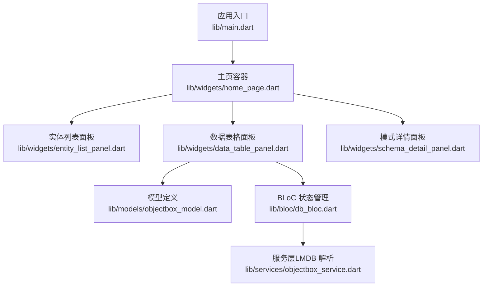
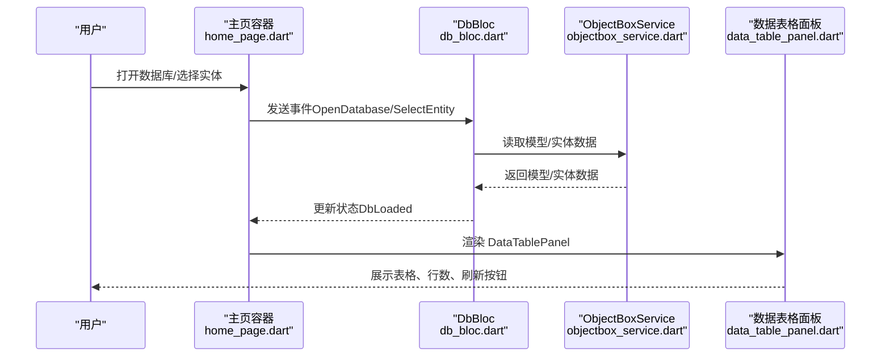
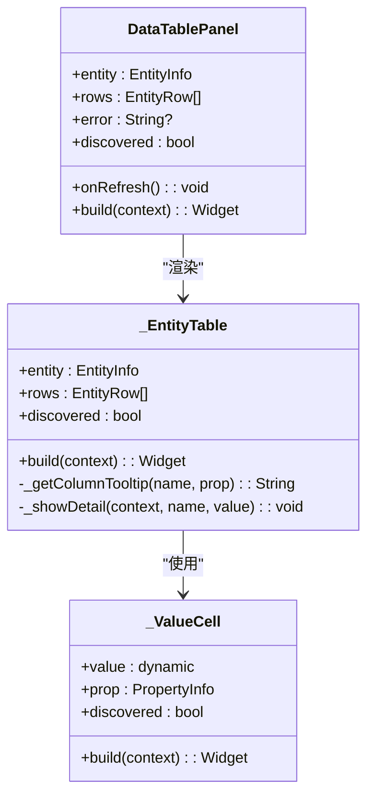
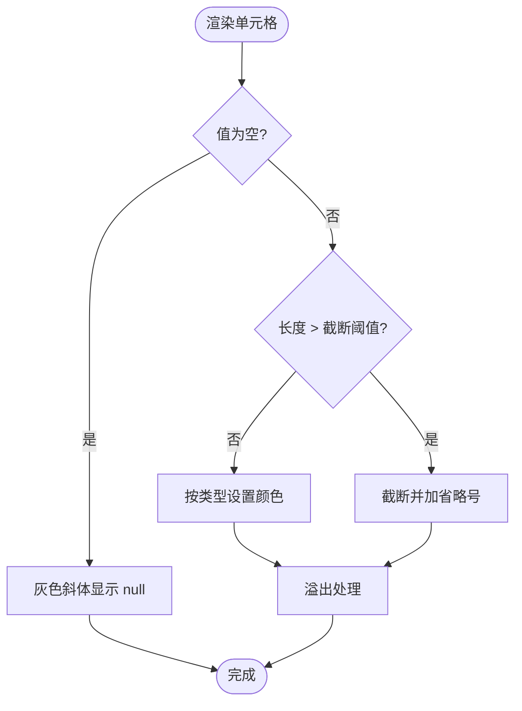
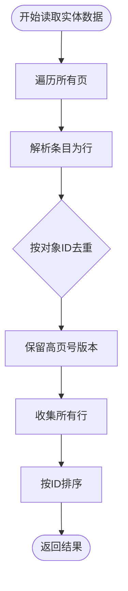
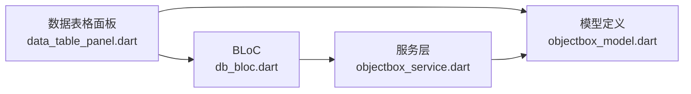
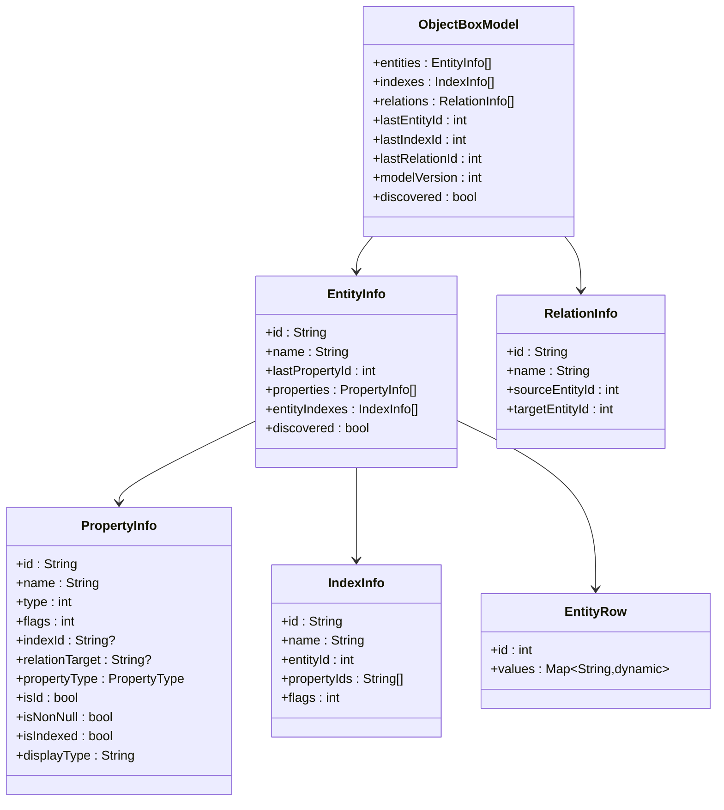

# 数据表格面板

<cite>
**本文引用的文件**
- [lib/main.dart](file://lib/main.dart)
- [lib/widgets/home_page.dart](file://lib/widgets/home_page.dart)
- [lib/widgets/data_table_panel.dart](file://lib/widgets/data_table_panel.dart)
- [lib/widgets/schema_detail_panel.dart](file://lib/widgets/schema_detail_panel.dart)
- [lib/models/objectbox_model.dart](file://lib/models/objectbox_model.dart)
- [lib/bloc/db_bloc.dart](file://lib/bloc/db_bloc.dart)
- [lib/services/objectbox_service.dart](file://lib/services/objectbox_service.dart)
</cite>

## 目录
1. [简介](#简介)
2. [项目结构](#项目结构)
3. [核心组件](#核心组件)
4. [架构总览](#架构总览)
5. [详细组件分析](#详细组件分析)
6. [依赖关系分析](#依赖关系分析)
7. [性能考虑](#性能考虑)
8. [故障排查指南](#故障排查指南)
9. [结论](#结论)
10. [附录](#附录)

## 简介
本文件面向“数据表格面板”组件，系统性说明其在对象数据库浏览工具中的职责与实现：包括表格数据的渲染、排序与筛选能力；数据行的动态生成、列宽与单元格格式化；分页加载、无限滚动与大数据集处理机制；排序列点击、多列排序与自定义排序规则；数据刷新、缓存策略与性能优化；导出、复制与编辑模式支持；以及主题定制、响应式布局与无障碍访问实现。

该组件基于 Flutter 构建，采用 BLoC 状态管理，直接解析 LMDB 文件以读取实体数据，支持从 schema JSON 与无 JSON 的“发现模式”两种方式构建模型。

## 项目结构
- 应用入口与主题配置位于应用根部，负责打开数据库目录、初始化主题与导航壳体。
- 主界面由左侧实体列表、右侧内容区组成，内容区根据当前状态展示模式详情或数据表格面板。
- 数据表格面板负责渲染实体数据表、提供刷新与详情查看、复制等交互。
- 模型层抽象了对象模型、实体、属性与行数据结构。
- BLoC 层负责事件到状态的转换，协调服务层读取数据。
- 服务层直接解析 LMDB 文件，按实体读取数据并进行去重与排序。

图表来源
- [lib/main.dart:13-43](file://lib/main.dart#L13-L43)
- [lib/widgets/home_page.dart:30-62](file://lib/widgets/home_page.dart#L30-L62)
- [lib/widgets/data_table_panel.dart:5-19](file://lib/widgets/data_table_panel.dart#L5-L19)
- [lib/models/objectbox_model.dart:1-248](file://lib/models/objectbox_model.dart#L1-L248)
- [lib/bloc/db_bloc.dart:91-136](file://lib/bloc/db_bloc.dart#L91-L136)
- [lib/services/objectbox_service.dart:1-41](file://lib/services/objectbox_service.dart#L1-L41)

章节来源
- [lib/main.dart:1-147](file://lib/main.dart#L1-L147)
- [lib/widgets/home_page.dart:1-218](file://lib/widgets/home_page.dart#L1-L218)

## 核心组件
- 数据表格面板（DataTablePanel）
  - 负责渲染实体数据表、显示行数统计、提供刷新按钮。
  - 内部通过实体表（_EntityTable）生成列头与行数据，支持列提示与单元格点击查看详情。
- 实体表（_EntityTable）
  - 动态生成列集合（含 id 列），根据实体属性映射生成 DataCell。
  - 支持列宽估算与横向滚动，单元格内容按类型进行格式化与截断。
- 值单元格（_ValueCell）
  - 对空值、超长文本、不同数据类型（bool/int/double/String）进行样式区分与溢出处理。
- BLoC（DbBloc）
  - 处理打开数据库、选择实体、刷新数据、关闭数据库等事件，驱动服务层读取数据并更新状态。
- 服务层（ObjectBoxService）
  - 直接解析 LMDB 文件，发现模型或读取实体数据，按页扫描并去重，最终排序返回结果。
- 模型（ObjectBoxModel/EntityInfo/PropertyInfo/EntityRow）
  - 抽象对象模型、实体、属性与单行数据，支持“发现模式”。

章节来源
- [lib/widgets/data_table_panel.dart:5-345](file://lib/widgets/data_table_panel.dart#L5-L345)
- [lib/bloc/db_bloc.dart:1-136](file://lib/bloc/db_bloc.dart#L1-L136)
- [lib/services/objectbox_service.dart:1-800](file://lib/services/objectbox_service.dart#L1-L800)
- [lib/models/objectbox_model.dart:1-248](file://lib/models/objectbox_model.dart#L1-L248)

## 架构总览
下图展示了从用户交互到数据呈现的整体流程：用户在主页触发打开数据库或选择实体，BLoC 接收事件后调用服务层解析 LMDB 并返回实体数据，随后 UI 通过数据表格面板渲染。

图表来源
- [lib/widgets/home_page.dart:54-61](file://lib/widgets/home_page.dart#L54-L61)
- [lib/bloc/db_bloc.dart:101-130](file://lib/bloc/db_bloc.dart#L101-L130)
- [lib/services/objectbox_service.dart:31-40](file://lib/services/objectbox_service.dart#L31-L40)
- [lib/widgets/data_table_panel.dart:146](file://lib/widgets/data_table_panel.dart#L146)

## 详细组件分析

### 数据表格面板（DataTablePanel）
- 功能要点
  - 顶部栏：显示实体名、自动发现标记、行数统计、刷新按钮。
  - 内容区：错误状态、加载中、无数据、或进入实体表渲染。
- 设计细节
  - 使用 Material 的 DataTable 组件，设置表头背景色与默认排序索引与方向。
  - 列头包含字段名与可选的类型标签（发现模式时）。
  - 行内单元格支持点击弹窗查看完整值并支持复制到剪贴板。

图表来源
- [lib/widgets/data_table_panel.dart:5-345](file://lib/widgets/data_table_panel.dart#L5-L345)

章节来源
- [lib/widgets/data_table_panel.dart:21-147](file://lib/widgets/data_table_panel.dart#L21-L147)
- [lib/widgets/data_table_panel.dart:150-294](file://lib/widgets/data_table_panel.dart#L150-L294)

### 实体表（_EntityTable）与列宽、单元格格式化
- 列宽与横向滚动
  - 通过外层 SingleChildScrollView 配合固定宽度容器实现横向滚动，列宽按列数线性增长。
- 单元格格式化
  - id 列使用等宽字体；其他列根据类型设置颜色与溢出策略。
  - 超长文本截断并显示省略号；null 值使用灰色斜体样式。
- 列头提示
  - 提供列头 tooltip，包含类型、是否非空、是否主键等信息。

图表来源
- [lib/widgets/data_table_panel.dart:296-344](file://lib/widgets/data_table_panel.dart#L296-L344)

章节来源
- [lib/widgets/data_table_panel.dart:170-252](file://lib/widgets/data_table_panel.dart#L170-L252)
- [lib/widgets/data_table_panel.dart:296-344](file://lib/widgets/data_table_panel.dart#L296-L344)

### 排序与筛选
- 排序
  - DataTable 设置了默认排序索引与方向，但未绑定交互回调，因此当前版本不支持用户点击列头进行排序。
- 筛选
  - 当前未实现客户端筛选逻辑，筛选能力需在上层扩展（如在 BLoC 中增加过滤状态并在渲染前预处理 rows）。
- 自定义排序规则
  - 可通过在 BLoC 中维护排序状态（列索引、方向、多列规则），在读取数据后进行二次排序。

章节来源
- [lib/widgets/data_table_panel.dart:179-181](file://lib/widgets/data_table_panel.dart#L179-L181)

### 分页加载、无限滚动与大数据集处理
- 分页加载
  - 服务层按页扫描 LMDB 文件，逐页解析条目，使用 Map 以对象 ID 去重，保留高页号版本（最新写入）。
- 无限滚动
  - 表格内容通过横向滚动容器承载，列宽随列数线性增长，适合中等规模数据的横向浏览。
- 大数据集处理
  - 服务层对每页条目进行去重与排序，最终返回有序列表；建议在 UI 层引入虚拟化或分页分批渲染以进一步提升性能。

图表来源
- [lib/services/objectbox_service.dart:369-399](file://lib/services/objectbox_service.dart#L369-L399)

章节来源
- [lib/services/objectbox_service.dart:369-399](file://lib/services/objectbox_service.dart#L369-L399)

### 数据刷新、缓存策略与性能优化
- 刷新
  - 通过 BLoC 的 RefreshData 事件触发重新读取当前实体数据。
- 缓存策略
  - 当前未实现跨请求缓存；可在 BLoC 中引入内存缓存（按实体与查询条件作为键）。
- 性能优化
  - 服务层已做去重与排序，UI 层可结合虚拟化、延迟加载与列宽估算减少重排。
  - 对于超长文本，建议仅在点击时按需展开或使用对话框展示。

章节来源
- [lib/bloc/db_bloc.dart:126-130](file://lib/bloc/db_bloc.dart#L126-L130)
- [lib/widgets/data_table_panel.dart:260-293](file://lib/widgets/data_table_panel.dart#L260-L293)

### 导出、复制与编辑模式
- 复制
  - 单元格点击弹窗后提供“复制到剪贴板”按钮，复制成功通过 SnackBar 提示。
- 导出
  - 当前未实现导出功能；可在 BLoC 中增加导出事件，调用服务层读取全量数据并输出 CSV/JSON。
- 编辑
  - 当前未实现编辑功能；可在表格中加入可编辑单元格与保存事件，结合服务层写入逻辑扩展。

章节来源
- [lib/widgets/data_table_panel.dart:260-293](file://lib/widgets/data_table_panel.dart#L260-L293)

### 主题定制、响应式布局与无障碍访问
- 主题定制
  - 应用使用 Material3 主题，支持明暗切换；表格表头背景色与文本样式均基于主题变量。
- 响应式布局
  - 左右分栏布局，右侧内容区占主导，适配桌面端窗口尺寸变化。
- 无障碍访问
  - 使用标准 Material 组件与图标，具备基础可访问性；建议为按钮添加语义标签与键盘导航支持。

章节来源
- [lib/main.dart:28-42](file://lib/main.dart#L28-L42)
- [lib/widgets/home_page.dart:30-62](file://lib/widgets/home_page.dart#L30-L62)

## 依赖关系分析
- 组件耦合
  - DataTablePanel 依赖模型与 BLoC；BLoC 依赖服务层；服务层依赖模型定义。
- 外部依赖
  - 使用 Flutter Material 组件、flutter_bloc、file_picker 等。
- 循环依赖
  - 未见循环依赖，模块边界清晰。

图表来源
- [lib/widgets/data_table_panel.dart:1-345](file://lib/widgets/data_table_panel.dart#L1-L345)
- [lib/bloc/db_bloc.dart:1-136](file://lib/bloc/db_bloc.dart#L1-L136)
- [lib/services/objectbox_service.dart:1-41](file://lib/services/objectbox_service.dart#L1-L41)
- [lib/models/objectbox_model.dart:1-248](file://lib/models/objectbox_model.dart#L1-L248)

章节来源
- [lib/widgets/data_table_panel.dart:1-345](file://lib/widgets/data_table_panel.dart#L1-L345)
- [lib/bloc/db_bloc.dart:1-136](file://lib/bloc/db_bloc.dart#L1-L136)
- [lib/services/objectbox_service.dart:1-41](file://lib/services/objectbox_service.dart#L1-L41)
- [lib/models/objectbox_model.dart:1-248](file://lib/models/objectbox_model.dart#L1-L248)

## 性能考虑
- 读取与解析
  - 服务层按页扫描并解析 FlatBuffer，去重与排序在内存中完成，适合中小规模数据。
- UI 渲染
  - 表格采用 Material DataTable，建议在大规模数据场景引入虚拟化或分页分批渲染。
- 网络与 I/O
  - 本地文件读取，建议避免频繁重复读取，可通过 BLoC 缓存与懒加载优化。

## 故障排查指南
- 打不开数据库
  - 确认选择了包含 data.mdb 的目录；若缺少必要文件，将抛出异常。
- 无法显示数据
  - 若实体无 schema JSON，将启用“发现模式”，属性名与类型可能为推断值；可尝试重新打开数据库。
- 表格空白或加载过久
  - 检查实体数据量大小；建议等待加载完成或考虑分页/虚拟化方案。
- 复制失败
  - 确保设备剪贴板可用；复制成功会显示提示。

章节来源
- [lib/bloc/db_bloc.dart:101-110](file://lib/bloc/db_bloc.dart#L101-L110)
- [lib/widgets/data_table_panel.dart:101-144](file://lib/widgets/data_table_panel.dart#L101-L144)

## 结论
数据表格面板实现了对象数据库实体数据的可视化展示，具备基础的列头提示、单元格格式化与复制能力。当前版本未内置排序交互与筛选功能，也未实现导出与编辑。通过在 BLoC 中扩展排序与筛选状态、在服务层引入缓存与分页、在 UI 层引入虚拟化与分页渲染，可显著提升大数据集下的用户体验与性能表现。

## 附录
- 数据模型概览

图表来源
- [lib/models/objectbox_model.dart:1-248](file://lib/models/objectbox_model.dart#L1-L248)