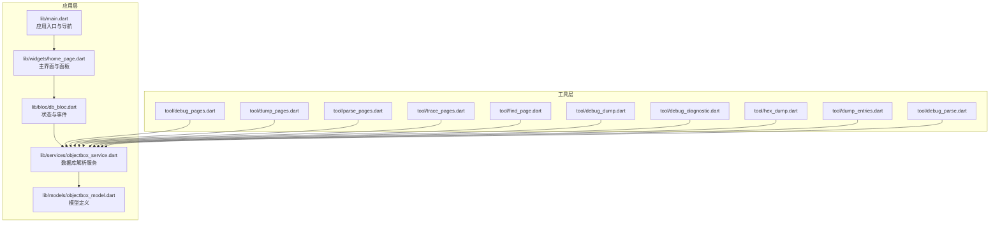
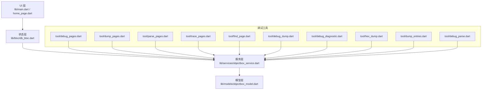
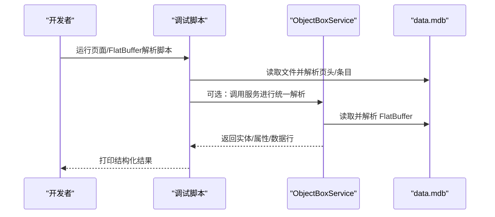
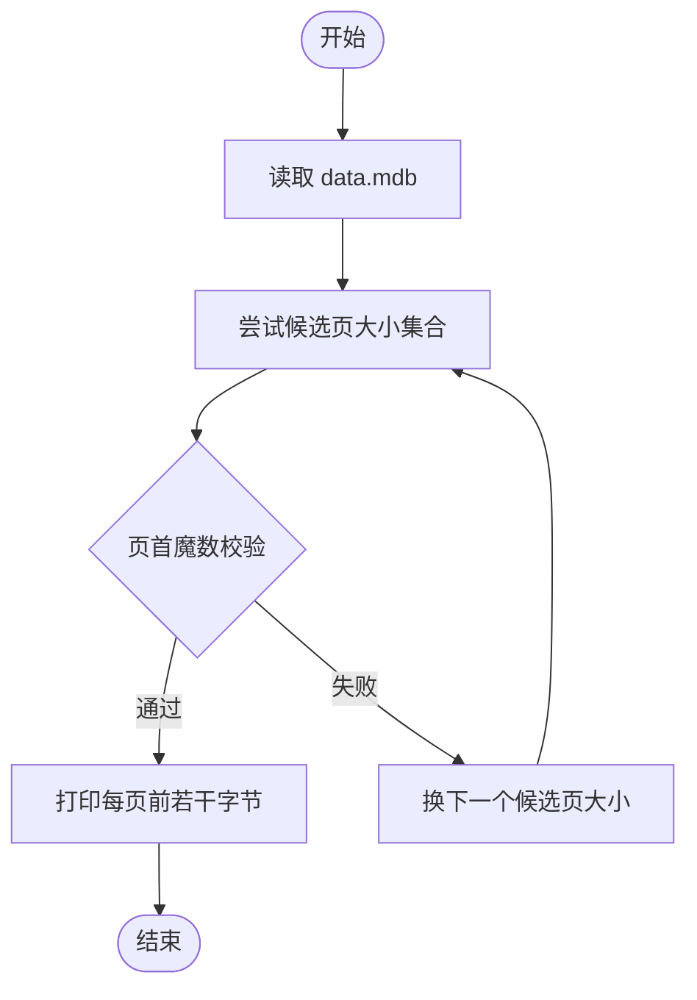
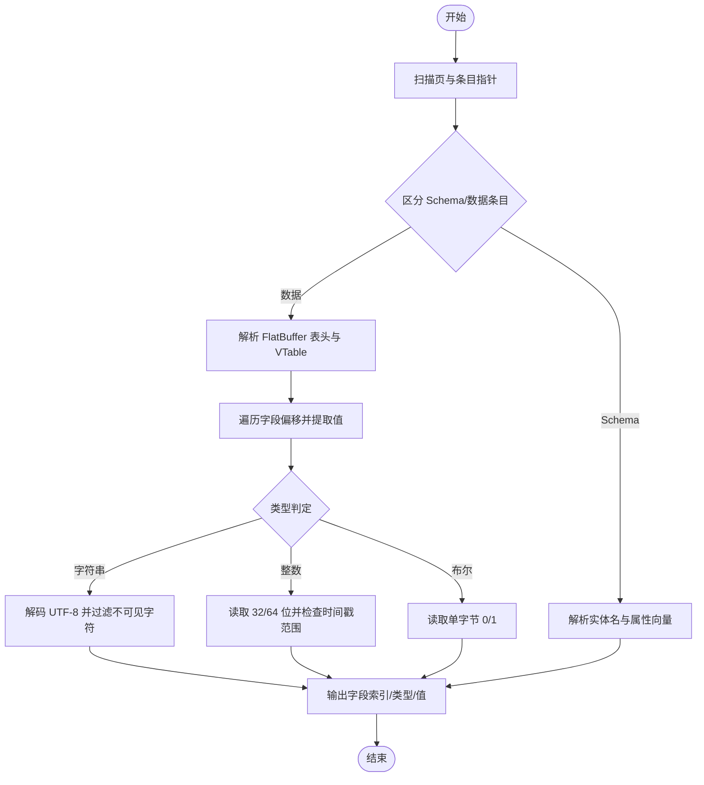
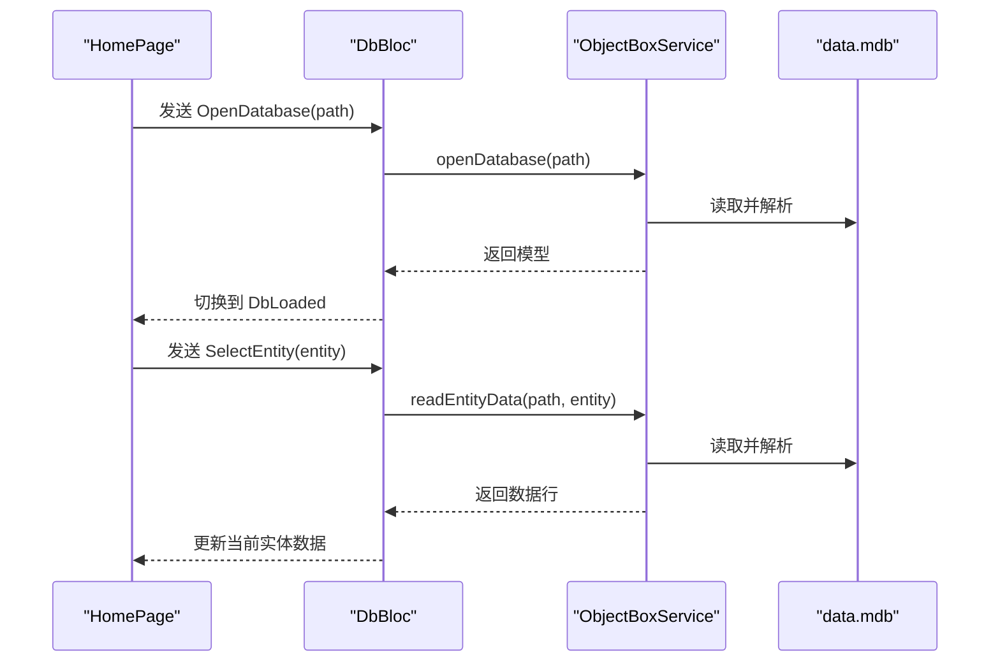
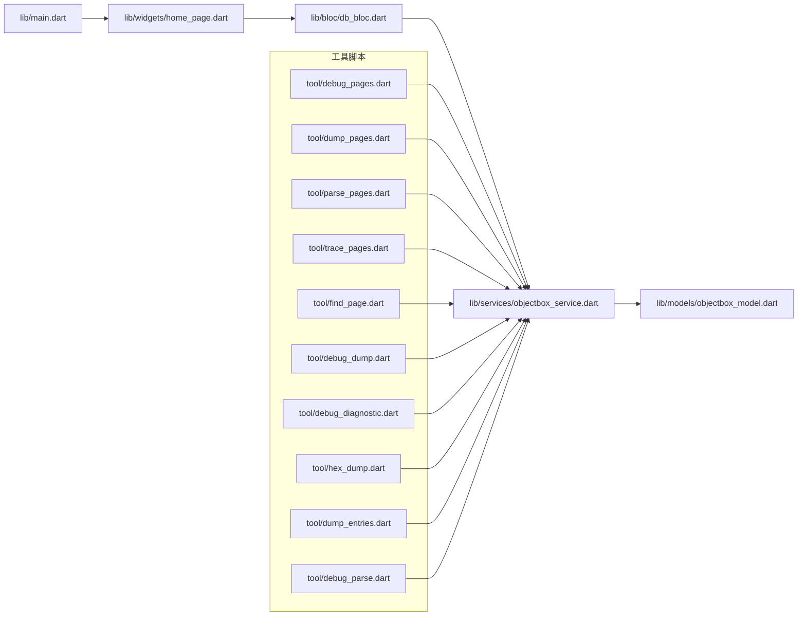

# 开发工具

<cite>
**本文引用的文件**
- [README.md](file://README.md)
- [pubspec.yaml](file://pubspec.yaml)
- [lib/main.dart](file://lib/main.dart)
- [lib/bloc/db_bloc.dart](file://lib/bloc/db_bloc.dart)
- [lib/widgets/home_page.dart](file://lib/widgets/home_page.dart)
- [lib/models/objectbox_model.dart](file://lib/models/objectbox_model.dart)
- [lib/services/objectbox_service.dart](file://lib/services/objectbox_service.dart)
- [tool/debug_dump.dart](file://tool/debug_dump.dart)
- [tool/debug_pages.dart](file://tool/debug_pages.dart)
- [tool/dump_pages.dart](file://tool/dump_pages.dart)
- [tool/find_page.dart](file://tool/find_page.dart)
- [tool/debug_diagnostic.dart](file://tool/debug_diagnostic.dart)
- [tool/debug_parse.dart](file://tool/debug_parse.dart)
- [tool/trace_pages.dart](file://tool/trace_pages.dart)
- [tool/parse_pages.dart](file://tool/parse_pages.dart)
- [tool/hex_dump.dart](file://tool/hex_dump.dart)
- [tool/dump_entries.dart](file://tool/dump_entries.dart)
</cite>

## 目录
1. [简介](#简介)
2. [项目结构](#项目结构)
3. [核心组件](#核心组件)
4. [架构总览](#架构总览)
5. [详细组件分析](#详细组件分析)
6. [依赖关系分析](#依赖关系分析)
7. [性能考虑](#性能考虑)
8. [故障排查指南](#故障排查指南)
9. [结论](#结论)
10. [附录](#附录)

## 简介
本文件面向 ObjectBox Viewer 的开发者与调试人员，系统化梳理仓库中的开发与调试工具链，覆盖数据解析调试、诊断工具、页面与模式识别、错误排查与性能分析等主题。文档以“工具—用法—输出—最佳实践”的方式组织，帮助读者快速定位问题、验证假设并优化数据库读取与展示流程。

## 项目结构
该项目采用 Flutter 应用结构，配合一组独立的 Dart 调试脚本（位于 tool/ 目录），用于直接解析 ObjectBox/LMDB 数据文件，辅助 UI 层的数据浏览与诊断。

- 应用层
  - 入口与界面：lib/main.dart、lib/widgets/home_page.dart
  - 状态管理：lib/bloc/db_bloc.dart
  - 模型定义：lib/models/objectbox_model.dart
  - 数据服务：lib/services/objectbox_service.dart
- 工具层（调试脚本）
  - 页面与页眉解析：tool/debug_pages.dart、tool/dump_pages.dart、tool/parse_pages.dart、tool/trace_pages.dart、tool/find_page.dart
  - 数据转储与 FlatBuffer 解析：tool/debug_dump.dart、tool/debug_diagnostic.dart、tool/hex_dump.dart、tool/dump_entries.dart
  - 集成测试与服务调用：tool/debug_parse.dart

**图表来源**
- [lib/main.dart:1-147](file://lib/main.dart#L1-L147)
- [lib/widgets/home_page.dart:1-218](file://lib/widgets/home_page.dart#L1-L218)
- [lib/bloc/db_bloc.dart:1-136](file://lib/bloc/db_bloc.dart#L1-L136)
- [lib/models/objectbox_model.dart:1-248](file://lib/models/objectbox_model.dart#L1-L248)
- [lib/services/objectbox_service.dart:1-800](file://lib/services/objectbox_service.dart#L1-L800)
- [tool/debug_pages.dart:1-67](file://tool/debug_pages.dart#L1-L67)
- [tool/dump_pages.dart:1-49](file://tool/dump_pages.dart#L1-L49)
- [tool/parse_pages.dart:1-71](file://tool/parse_pages.dart#L1-L71)
- [tool/trace_pages.dart:1-260](file://tool/trace_pages.dart#L1-L260)
- [tool/find_page.dart:1-45](file://tool/find_page.dart#L1-L45)
- [tool/debug_dump.dart:1-159](file://tool/debug_dump.dart#L1-L159)
- [tool/debug_diagnostic.dart:1-345](file://tool/debug_diagnostic.dart#L1-L345)
- [tool/hex_dump.dart:1-61](file://tool/hex_dump.dart#L1-L61)
- [tool/dump_entries.dart:1-48](file://tool/dump_entries.dart#L1-L48)
- [tool/debug_parse.dart:1-38](file://tool/debug_parse.dart#L1-L38)

**章节来源**
- [README.md:1-18](file://README.md#L1-L18)
- [pubspec.yaml:1-96](file://pubspec.yaml#L1-L96)
- [lib/main.dart:1-147](file://lib/main.dart#L1-L147)
- [lib/widgets/home_page.dart:1-218](file://lib/widgets/home_page.dart#L1-L218)
- [lib/bloc/db_bloc.dart:1-136](file://lib/bloc/db_bloc.dart#L1-L136)
- [lib/models/objectbox_model.dart:1-248](file://lib/models/objectbox_model.dart#L1-L248)
- [lib/services/objectbox_service.dart:1-800](file://lib/services/objectbox_service.dart#L1-L800)

## 核心组件
- 应用入口与导航
  - 提供打开数据库目录、状态栏提示与底部状态条，支持通过文件选择器定位 data.mdb 所在目录，并自动探测子目录中的数据库文件。
- 状态管理（BLoC）
  - 统一处理打开数据库、选择实体、刷新数据与关闭数据库等事件，维护加载、成功、错误三种状态。
- 模型定义
  - 定义实体、属性、索引、关系等模型，支持从 JSON 或直接从数据库中发现模型。
- 数据服务
  - 直接解析 data.mdb 文件，无需 objectbox-model.json；支持发现模型、读取实体数据、去重保留最新写入版本。
- 调试工具
  - 页面扫描、页头打印、页大小猜测、FlatBuffer 解析、字符串搜索、十六进制转储、条目导出等，覆盖从底层页到上层数据的全链路诊断。

**章节来源**
- [lib/main.dart:97-147](file://lib/main.dart#L97-L147)
- [lib/bloc/db_bloc.dart:91-136](file://lib/bloc/db_bloc.dart#L91-L136)
- [lib/models/objectbox_model.dart:1-248](file://lib/models/objectbox_model.dart#L1-L248)
- [lib/services/objectbox_service.dart:10-41](file://lib/services/objectbox_service.dart#L10-L41)
- [tool/debug_pages.dart:1-67](file://tool/debug_pages.dart#L1-L67)
- [tool/dump_pages.dart:1-49](file://tool/dump_pages.dart#L1-L49)
- [tool/parse_pages.dart:1-71](file://tool/parse_pages.dart#L1-L71)
- [tool/trace_pages.dart:1-260](file://tool/trace_pages.dart#L1-L260)
- [tool/find_page.dart:1-45](file://tool/find_page.dart#L1-L45)
- [tool/debug_dump.dart:1-159](file://tool/debug_dump.dart#L1-L159)
- [tool/debug_diagnostic.dart:1-345](file://tool/debug_diagnostic.dart#L1-L345)
- [tool/hex_dump.dart:1-61](file://tool/hex_dump.dart#L1-L61)
- [tool/dump_entries.dart:1-48](file://tool/dump_entries.dart#L1-L48)
- [tool/debug_parse.dart:1-38](file://tool/debug_parse.dart#L1-L38)

## 架构总览
下图展示了 UI 与调试工具之间的关系：UI 通过 BLoC 与服务层交互；调试脚本可独立运行，直接解析 data.mdb 并输出结构化信息，辅助 UI 层的正确性与性能优化。

**图表来源**
- [lib/main.dart:1-147](file://lib/main.dart#L1-L147)
- [lib/widgets/home_page.dart:1-218](file://lib/widgets/home_page.dart#L1-L218)
- [lib/bloc/db_bloc.dart:1-136](file://lib/bloc/db_bloc.dart#L1-L136)
- [lib/models/objectbox_model.dart:1-248](file://lib/models/objectbox_model.dart#L1-L248)
- [lib/services/objectbox_service.dart:1-800](file://lib/services/objectbox_service.dart#L1-L800)
- [tool/debug_pages.dart:1-67](file://tool/debug_pages.dart#L1-L67)
- [tool/dump_pages.dart:1-49](file://tool/dump_pages.dart#L1-L49)
- [tool/parse_pages.dart:1-71](file://tool/parse_pages.dart#L1-L71)
- [tool/trace_pages.dart:1-260](file://tool/trace_pages.dart#L1-L260)
- [tool/find_page.dart:1-45](file://tool/find_page.dart#L1-L45)
- [tool/debug_dump.dart:1-159](file://tool/debug_dump.dart#L1-L159)
- [tool/debug_diagnostic.dart:1-345](file://tool/debug_diagnostic.dart#L1-L345)
- [tool/hex_dump.dart:1-61](file://tool/hex_dump.dart#L1-L61)
- [tool/dump_entries.dart:1-48](file://tool/dump_entries.dart#L1-L48)
- [tool/debug_parse.dart:1-38](file://tool/debug_parse.dart#L1-L38)

## 详细组件分析

### 数据解析与诊断工具族
- 页面扫描与页头解析
  - 功能：打印所有页的页头字段（魔数、标志位、上下界、页数），或尝试不同候选页大小，打印每页前若干字节。
  - 使用场景：确认文件头部、页大小是否符合预期；定位页边界与魔数位置。
  - 输出要点：页号、偏移、魔数、标志、上下界、页数；或候选页大小列表与每页前 64 字节十六进制。
  - 示例路径：
    - [tool/debug_pages.dart:1-67](file://tool/debug_pages.dart#L1-L67)
    - [tool/dump_pages.dart:1-49](file://tool/dump_pages.dart#L1-L49)
    - [tool/parse_pages.dart:1-71](file://tool/parse_pages.dart#L1-L71)
    - [tool/trace_pages.dart:1-260](file://tool/trace_pages.dart#L1-L260)
    - [tool/find_page.dart:1-45](file://tool/find_page.dart#L1-L45)
- FlatBuffer 数据转储与字段解析
  - 功能：扫描页内条目，区分 Schema 与数据条目；对数据条目解析 FlatBuffer 表头、VTable、字段偏移，提取字符串、整数、布尔、时间戳等。
  - 使用场景：验证 FlatBuffer 布局一致性；定位实体名称、属性类型与值域。
  - 输出要点：条目类型（Schema/数据）、实体 ID、对象 ID、值长度、字段索引、类型与值；或按页打印条目数据区域。
  - 示例路径：
    - [tool/debug_dump.dart:1-159](file://tool/debug_dump.dart#L1-L159)
    - [tool/debug_diagnostic.dart:1-345](file://tool/debug_diagnostic.dart#L1-L345)
    - [tool/hex_dump.dart:1-61](file://tool/hex_dump.dart#L1-L61)
    - [tool/dump_entries.dart:1-48](file://tool/dump_entries.dart#L1-L48)
- 集成解析与服务调用
  - 功能：通过 ObjectBoxService 打开数据库、读取实体数据，结合 UI 层事件驱动。
  - 使用场景：端到端验证解析逻辑与 UI 展示一致性。
  - 示例路径：
    - [tool/debug_parse.dart:1-38](file://tool/debug_parse.dart#L1-L38)
    - [lib/services/objectbox_service.dart:10-41](file://lib/services/objectbox_service.dart#L10-L41)
    - [lib/bloc/db_bloc.dart:101-130](file://lib/bloc/db_bloc.dart#L101-L130)

**图表来源**
- [tool/debug_pages.dart:1-67](file://tool/debug_pages.dart#L1-L67)
- [tool/debug_dump.dart:1-159](file://tool/debug_dump.dart#L1-L159)
- [tool/debug_diagnostic.dart:1-345](file://tool/debug_diagnostic.dart#L1-L345)
- [tool/debug_parse.dart:1-38](file://tool/debug_parse.dart#L1-L38)
- [lib/services/objectbox_service.dart:10-41](file://lib/services/objectbox_service.dart#L10-L41)

**章节来源**
- [tool/debug_pages.dart:1-67](file://tool/debug_pages.dart#L1-L67)
- [tool/dump_pages.dart:1-49](file://tool/dump_pages.dart#L1-L49)
- [tool/parse_pages.dart:1-71](file://tool/parse_pages.dart#L1-L71)
- [tool/trace_pages.dart:1-260](file://tool/trace_pages.dart#L1-L260)
- [tool/find_page.dart:1-45](file://tool/find_page.dart#L1-L45)
- [tool/debug_dump.dart:1-159](file://tool/debug_dump.dart#L1-L159)
- [tool/debug_diagnostic.dart:1-345](file://tool/debug_diagnostic.dart#L1-L345)
- [tool/hex_dump.dart:1-61](file://tool/hex_dump.dart#L1-L61)
- [tool/dump_entries.dart:1-48](file://tool/dump_entries.dart#L1-L48)
- [tool/debug_parse.dart:1-38](file://tool/debug_parse.dart#L1-L38)
- [lib/services/objectbox_service.dart:10-41](file://lib/services/objectbox_service.dart#L10-L41)
- [lib/bloc/db_bloc.dart:101-130](file://lib/bloc/db_bloc.dart#L101-L130)

### 页面扫描与页大小确定流程

**图表来源**
- [tool/dump_pages.dart:1-49](file://tool/dump_pages.dart#L1-L49)
- [tool/find_page.dart:1-45](file://tool/find_page.dart#L1-L45)

**章节来源**
- [tool/dump_pages.dart:1-49](file://tool/dump_pages.dart#L1-L49)
- [tool/find_page.dart:1-45](file://tool/find_page.dart#L1-L45)

### FlatBuffer 解析与字段提取流程

**图表来源**
- [tool/debug_dump.dart:1-159](file://tool/debug_dump.dart#L1-L159)
- [tool/debug_diagnostic.dart:1-345](file://tool/debug_diagnostic.dart#L1-L345)

**章节来源**
- [tool/debug_dump.dart:1-159](file://tool/debug_dump.dart#L1-L159)
- [tool/debug_diagnostic.dart:1-345](file://tool/debug_diagnostic.dart#L1-L345)

### UI 与服务交互序列

**图表来源**
- [lib/widgets/home_page.dart:74-89](file://lib/widgets/home_page.dart#L74-L89)
- [lib/bloc/db_bloc.dart:101-130](file://lib/bloc/db_bloc.dart#L101-L130)
- [lib/services/objectbox_service.dart:10-41](file://lib/services/objectbox_service.dart#L10-L41)

**章节来源**
- [lib/widgets/home_page.dart:1-218](file://lib/widgets/home_page.dart#L1-L218)
- [lib/bloc/db_bloc.dart:1-136](file://lib/bloc/db_bloc.dart#L1-L136)
- [lib/services/objectbox_service.dart:1-800](file://lib/services/objectbox_service.dart#L1-L800)

## 依赖关系分析
- 应用层依赖
  - lib/main.dart 依赖 lib/widgets/home_page.dart 与 lib/bloc/db_bloc.dart
  - lib/widgets/home_page.dart 依赖 lib/bloc/db_bloc.dart 与 lib/services/objectbox_service.dart
  - lib/bloc/db_bloc.dart 依赖 lib/models/objectbox_model.dart 与 lib/services/objectbox_service.dart
  - lib/services/objectbox_service.dart 依赖 dart:io、dart:typed_data、path 等标准库
- 工具层依赖
  - 大多数脚本仅依赖 dart:io 与 dart:typed_data，部分脚本引入 path 用于路径拼接
  - 调试脚本与服务层共享解析逻辑，便于交叉验证

**图表来源**
- [lib/main.dart:1-147](file://lib/main.dart#L1-L147)
- [lib/widgets/home_page.dart:1-218](file://lib/widgets/home_page.dart#L1-L218)
- [lib/bloc/db_bloc.dart:1-136](file://lib/bloc/db_bloc.dart#L1-L136)
- [lib/models/objectbox_model.dart:1-248](file://lib/models/objectbox_model.dart#L1-L248)
- [lib/services/objectbox_service.dart:1-800](file://lib/services/objectbox_service.dart#L1-L800)
- [tool/debug_pages.dart:1-67](file://tool/debug_pages.dart#L1-L67)
- [tool/dump_pages.dart:1-49](file://tool/dump_pages.dart#L1-L49)
- [tool/parse_pages.dart:1-71](file://tool/parse_pages.dart#L1-L71)
- [tool/trace_pages.dart:1-260](file://tool/trace_pages.dart#L1-L260)
- [tool/find_page.dart:1-45](file://tool/find_page.dart#L1-L45)
- [tool/debug_dump.dart:1-159](file://tool/debug_dump.dart#L1-L159)
- [tool/debug_diagnostic.dart:1-345](file://tool/debug_diagnostic.dart#L1-L345)
- [tool/hex_dump.dart:1-61](file://tool/hex_dump.dart#L1-L61)
- [tool/dump_entries.dart:1-48](file://tool/dump_entries.dart#L1-L48)
- [tool/debug_parse.dart:1-38](file://tool/debug_parse.dart#L1-L38)

**章节来源**
- [lib/main.dart:1-147](file://lib/main.dart#L1-L147)
- [lib/widgets/home_page.dart:1-218](file://lib/widgets/home_page.dart#L1-L218)
- [lib/bloc/db_bloc.dart:1-136](file://lib/bloc/db_bloc.dart#L1-L136)
- [lib/models/objectbox_model.dart:1-248](file://lib/models/objectbox_model.dart#L1-L248)
- [lib/services/objectbox_service.dart:1-800](file://lib/services/objectbox_service.dart#L1-L800)
- [tool/debug_pages.dart:1-67](file://tool/debug_pages.dart#L1-L67)
- [tool/dump_pages.dart:1-49](file://tool/dump_pages.dart#L1-L49)
- [tool/parse_pages.dart:1-71](file://tool/parse_pages.dart#L1-L71)
- [tool/trace_pages.dart:1-260](file://tool/trace_pages.dart#L1-L260)
- [tool/find_page.dart:1-45](file://tool/find_page.dart#L1-L45)
- [tool/debug_dump.dart:1-159](file://tool/debug_dump.dart#L1-L159)
- [tool/debug_diagnostic.dart:1-345](file://tool/debug_diagnostic.dart#L1-L345)
- [tool/hex_dump.dart:1-61](file://tool/hex_dump.dart#L1-L61)
- [tool/dump_entries.dart:1-48](file://tool/dump_entries.dart#L1-L48)
- [tool/debug_parse.dart:1-38](file://tool/debug_parse.dart#L1-L38)

## 性能考虑
- 页大小与页边界
  - 使用候选页大小扫描与魔数校验，避免硬编码页大小导致的解析失败。
  - 参考：[tool/dump_pages.dart:13-26](file://tool/dump_pages.dart#L13-L26)、[tool/find_page.dart:26-43](file://tool/find_page.dart#L26-L43)
- 去重与最新版本保留
  - 服务层基于 LMDB 的写时复制特性，按页号保留最新版本，减少重复记录带来的 UI 渲染压力。
  - 参考：[lib/services/objectbox_service.dart:369-399](file://lib/services/objectbox_service.dart#L369-L399)
- 类型推断与启发式解析
  - 在未知类型时进行启发式推断，降低 UI 层显示成本；同时为后续 schema 发现提供依据。
  - 参考：[lib/services/objectbox_service.dart:762-768](file://lib/services/objectbox_service.dart#L762-L768)
- I/O 与内存占用
  - 脚本建议分页读取与限制输出数量（如仅打印前若干条目），避免大文件一次性读入造成内存峰值过高。
  - 参考：[tool/parse_pages.dart:46-68](file://tool/parse_pages.dart#L46-L68)、[tool/debug_dump.dart:17-135](file://tool/debug_dump.dart#L17-L135)

**章节来源**
- [tool/dump_pages.dart:1-49](file://tool/dump_pages.dart#L1-L49)
- [tool/find_page.dart:1-45](file://tool/find_page.dart#L1-L45)
- [lib/services/objectbox_service.dart:369-399](file://lib/services/objectbox_service.dart#L369-L399)
- [lib/services/objectbox_service.dart:762-768](file://lib/services/objectbox_service.dart#L762-L768)
- [tool/parse_pages.dart:1-71](file://tool/parse_pages.dart#L1-L71)
- [tool/debug_dump.dart:1-159](file://tool/debug_dump.dart#L1-L159)

## 故障排查指南
- 无法打开数据库
  - 确认选择了包含 data.mdb 的目录；若目录下无该文件，UI 会尝试在子目录中查找。
  - 参考：[lib/main.dart:117-145](file://lib/main.dart#L117-L145)
- 页大小不匹配
  - 使用页大小扫描与魔数校验，确认候选页大小集合中存在有效值。
  - 参考：[tool/dump_pages.dart:13-26](file://tool/dump_pages.dart#L13-L26)、[tool/trace_pages.dart:34-43](file://tool/trace_pages.dart#L34-L43)
- FlatBuffer 结构异常
  - 使用 FlatBuffer 解析脚本定位表头、VTable 与字段偏移，核对字段类型与长度边界。
  - 参考：[tool/debug_dump.dart:48-135](file://tool/debug_dump.dart#L48-L135)、[tool/debug_diagnostic.dart:257-329](file://tool/debug_diagnostic.dart#L257-L329)
- 实体名称或属性缺失
  - 若未提供 objectbox-model.json，服务层会通过字符串搜索与 VTable 扫描进行发现；必要时手动比对十六进制转储。
  - 参考：[lib/services/objectbox_service.dart:78-111](file://lib/services/objectbox_service.dart#L78-L111)、[tool/hex_dump.dart:13-60](file://tool/hex_dump.dart#L13-L60)
- 时间戳误判
  - 解析脚本会对大整数进行时间戳范围判断；若出现异常时间，请检查数据来源与单位。
  - 参考：[tool/debug_dump.dart:118-124](file://tool/debug_dump.dart#L118-L124)、[tool/debug_diagnostic.dart:309-318](file://tool/debug_diagnostic.dart#L309-L318)

**章节来源**
- [lib/main.dart:117-145](file://lib/main.dart#L117-L145)
- [tool/dump_pages.dart:1-49](file://tool/dump_pages.dart#L1-L49)
- [tool/trace_pages.dart:1-260](file://tool/trace_pages.dart#L1-L260)
- [tool/debug_dump.dart:1-159](file://tool/debug_dump.dart#L1-L159)
- [tool/debug_diagnostic.dart:1-345](file://tool/debug_diagnostic.dart#L1-L345)
- [lib/services/objectbox_service.dart:78-111](file://lib/services/objectbox_service.dart#L78-L111)
- [tool/hex_dump.dart:1-61](file://tool/hex_dump.dart#L1-L61)

## 结论
本仓库提供了从 UI 到底层解析的完整工具链：UI 层负责交互与展示，服务层负责解析与去重，工具层提供多维度的诊断能力。通过组合使用页面扫描、FlatBuffer 解析与集成测试脚本，开发者可以高效完成数据解析调试、模式识别与性能优化，从而提升整体开发效率与稳定性。

## 附录
- 参数与输出约定（通用）
  - 输入：data.mdb 文件路径（或目录路径，由 UI 自动探测）
  - 输出：结构化文本（页头、条目、实体/属性、字段类型与值、错误信息等）
- 最佳实践
  - 先用页面扫描与页大小检测确认基础结构
  - 再用 FlatBuffer 解析脚本验证实体与属性布局
  - 最后通过集成脚本与 UI 对照验证数据一致性
  - 对于大文件，优先分页读取与限制输出数量，避免内存峰值