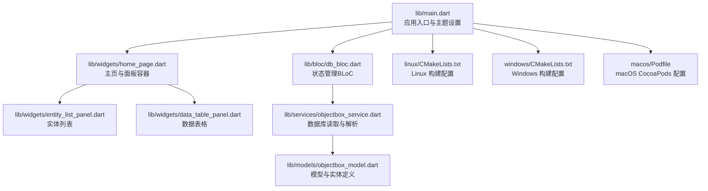
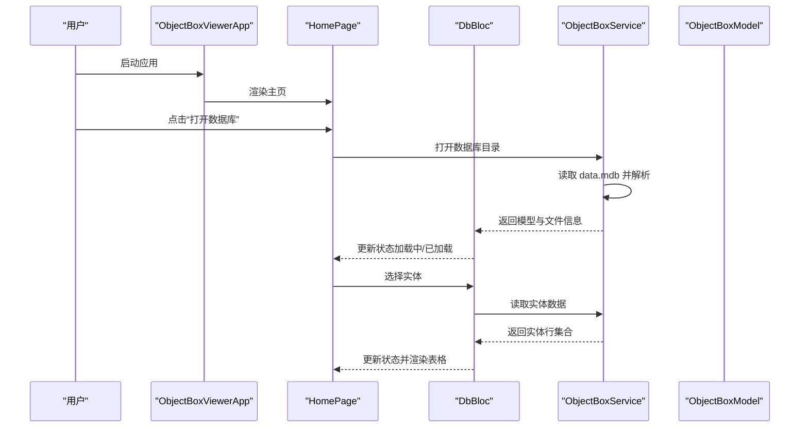
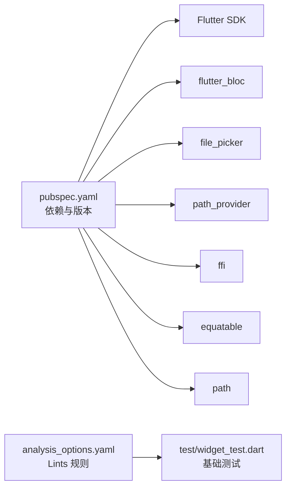

# 快速开始

<cite>
**本文引用的文件**
- [README.md](file://README.md)
- [pubspec.yaml](file://pubspec.yaml)
- [main.dart](file://lib/main.dart)
- [db_bloc.dart](file://lib/bloc/db_bloc.dart)
- [home_page.dart](file://lib/widgets/home_page.dart)
- [objectbox_model.dart](file://lib/models/objectbox_model.dart)
- [objectbox_service.dart](file://lib/services/objectbox_service.dart)
- [entity_list_panel.dart](file://lib/widgets/entity_list_panel.dart)
- [data_table_panel.dart](file://lib/widgets/data_table_panel.dart)
- [linux/CMakeLists.txt](file://linux/CMakeLists.txt)
- [windows/CMakeLists.txt](file://windows/CMakeLists.txt)
- [macos/Podfile](file://macos/Podfile)
- [analysis_options.yaml](file://analysis_options.yaml)
- [widget_test.dart](file://test/widget_test.dart)
- [2026-05-22-breakthrough.md](file://artifacts/2026-05-22-breakthrough.md)
</cite>

## 目录
1. [简介](#简介)
2. [项目结构](#项目结构)
3. [核心组件](#核心组件)
4. [架构总览](#架构总览)
5. [详细组件分析](#详细组件分析)
6. [依赖关系分析](#依赖关系分析)
7. [性能与平台特性](#性能与平台特性)
8. [故障排除指南](#故障排除指南)
9. [结论](#结论)
10. [附录：安装与使用步骤](#附录安装与使用步骤)

## 简介
本指南面向希望快速上手 ObjectBox Viewer 的用户，覆盖从环境准备、项目构建到打开数据库文件并浏览实体数据的完整流程。该工具可在 Windows、macOS 和 Linux 平台上运行，无需依赖对象模型文件即可直接解析 LMDB 数据库中的数据。

## 项目结构
该项目采用标准 Flutter 工程布局，核心逻辑集中在 lib 目录中，包含主入口、状态管理（BLoC）、模型定义、服务层以及 UI 组件。跨平台构建脚本位于各平台目录下。

**图表来源**
- [main.dart:1-147](file://lib/main.dart#L1-L147)
- [home_page.dart:1-218](file://lib/widgets/home_page.dart#L1-L218)
- [entity_list_panel.dart:1-131](file://lib/widgets/entity_list_panel.dart#L1-L131)
- [data_table_panel.dart:1-345](file://lib/widgets/data_table_panel.dart#L1-L345)
- [db_bloc.dart:1-136](file://lib/bloc/db_bloc.dart#L1-L136)
- [objectbox_service.dart:1-1006](file://lib/services/objectbox_service.dart#L1-L1006)
- [objectbox_model.dart:1-248](file://lib/models/objectbox_model.dart#L1-L248)
- [linux/CMakeLists.txt:1-129](file://linux/CMakeLists.txt#L1-L129)
- [windows/CMakeLists.txt:1-109](file://windows/CMakeLists.txt#L1-L109)
- [macos/Podfile:1-43](file://macos/Podfile#L1-L43)

**章节来源**
- [main.dart:1-147](file://lib/main.dart#L1-L147)
- [pubspec.yaml:1-96](file://pubspec.yaml#L1-L96)

## 核心组件
- 应用入口与主题：在入口中初始化应用、设置主题与导航栏，并通过 BlocProvider 提供状态管理。
- 主页与面板：根据状态渲染欢迎视图、错误视图或实体列表与数据表格。
- 状态管理（BLoC）：处理打开数据库、选择实体、刷新数据与关闭数据库等事件。
- 服务层：负责直接读取 LMDB 文件并解析为可展示的数据模型。
- 模型定义：描述实体、属性、索引与关系等结构，支持“发现模式”自动推断字段类型。
- 跨平台构建：Linux、Windows、macOS 分别提供 CMake 或 CocoaPods 配置以完成打包与安装。

**章节来源**
- [main.dart:1-147](file://lib/main.dart#L1-L147)
- [home_page.dart:1-218](file://lib/widgets/home_page.dart#L1-L218)
- [db_bloc.dart:1-136](file://lib/bloc/db_bloc.dart#L1-L136)
- [objectbox_model.dart:1-248](file://lib/models/objectbox_model.dart#L1-L248)
- [objectbox_service.dart:1-1006](file://lib/services/objectbox_service.dart#L1-L1006)

## 架构总览
应用采用“入口 -> 状态管理 -> 服务层 -> 模型 -> 视图”的分层架构。用户通过打开数据库目录触发事件，BLoC 在服务层解析 LMDB 文件，生成模型与数据行，最终由视图组件渲染。

**图表来源**
- [main.dart:97-145](file://lib/main.dart#L97-L145)
- [home_page.dart:74-88](file://lib/widgets/home_page.dart#L74-L88)
- [db_bloc.dart:101-130](file://lib/bloc/db_bloc.dart#L101-L130)
- [objectbox_service.dart:10-40](file://lib/services/objectbox_service.dart#L10-L40)

## 详细组件分析

### 应用入口与导航
- 初始化应用、设置主题与暗色主题、注册根页面与底部状态栏。
- 导航栏提供“打开数据库”按钮，调用文件选择器并定位数据库目录。

**章节来源**
- [main.dart:13-43](file://lib/main.dart#L13-L43)
- [main.dart:45-95](file://lib/main.dart#L45-L95)
- [main.dart:97-145](file://lib/main.dart#L97-L145)

### 主页与面板容器
- 根据状态渲染欢迎视图、错误视图或实体列表与数据表格。
- 支持“发现模式”横幅提示与重新打开数据库操作。
- 提供打开数据库、刷新数据、关闭数据库等交互。

**章节来源**
- [home_page.dart:9-72](file://lib/widgets/home_page.dart#L9-L72)
- [home_page.dart:91-126](file://lib/widgets/home_page.dart#L91-L126)
- [home_page.dart:128-188](file://lib/widgets/home_page.dart#L128-L188)

### 实体列表面板
- 展示数据库中的实体名称与属性数量。
- 支持点击选择实体，触发状态更新与数据读取。

**章节来源**
- [entity_list_panel.dart:4-86](file://lib/widgets/entity_list_panel.dart#L4-L86)
- [entity_list_panel.dart:88-131](file://lib/widgets/entity_list_panel.dart#L88-L131)

### 数据表格面板
- 渲染实体数据为可排序的表格，支持复制长文本、查看列类型提示。
- 当处于“发现模式”时，显示字段类型标注。

**章节来源**
- [data_table_panel.dart:5-98](file://lib/widgets/data_table_panel.dart#L5-L98)
- [data_table_panel.dart:150-252](file://lib/widgets/data_table_panel.dart#L150-L252)
- [data_table_panel.dart:296-345](file://lib/widgets/data_table_panel.dart#L296-L345)

### 状态管理（BLoC）
- 定义事件：打开数据库、选择实体、刷新数据、关闭数据库。
- 定义状态：初始、加载中、已加载、错误。
- 处理事件并调用服务层进行数据库解析与数据读取。

**章节来源**
- [db_bloc.dart:7-37](file://lib/bloc/db_bloc.dart#L7-L37)
- [db_bloc.dart:91-136](file://lib/bloc/db_bloc.dart#L91-L136)

### 服务层：LMDB 解析与模型发现
- 直接读取 data.mdb 并解析为对象模型，支持无对象模型文件的“发现模式”。
- 解析 FlatBuffer 结构，提取实体名、属性与值，自动推断字段类型。

**章节来源**
- [objectbox_service.dart:9-41](file://lib/services/objectbox_service.dart#L9-L41)
- [objectbox_service.dart:47-140](file://lib/services/objectbox_service.dart#L47-L140)
- [objectbox_service.dart:369-399](file://lib/services/objectbox_service.dart#L369-L399)

### 模型定义
- 描述实体、属性、索引与关系，支持“发现模式”生成通用实体与属性占位。
- 属性类型枚举覆盖常见类型，并提供“发现模式”下的推断类型。

**章节来源**
- [objectbox_model.dart:3-61](file://lib/models/objectbox_model.dart#L3-L61)
- [objectbox_model.dart:63-106](file://lib/models/objectbox_model.dart#L63-L106)
- [objectbox_model.dart:108-189](file://lib/models/objectbox_model.dart#L108-L189)
- [objectbox_model.dart:241-248](file://lib/models/objectbox_model.dart#L241-L248)

## 依赖关系分析
- 依赖管理：Flutter SDK 版本与第三方包在 pubspec 中声明。
- 开发依赖：测试与 Lint 规则在 analysis_options 中配置。
- 跨平台构建：Linux 使用 CMake，Windows 使用 CMake，macOS 使用 CocoaPods。

**图表来源**
- [pubspec.yaml:30-53](file://pubspec.yaml#L30-L53)
- [analysis_options.yaml:10-29](file://analysis_options.yaml#L10-L29)
- [widget_test.dart:1-10](file://test/widget_test.dart#L1-L10)

**章节来源**
- [pubspec.yaml:21-29](file://pubspec.yaml#L21-L29)
- [pubspec.yaml:30-53](file://pubspec.yaml#L30-L53)
- [analysis_options.yaml:10-29](file://analysis_options.yaml#L10-L29)
- [widget_test.dart:1-10](file://test/widget_test.dart#L1-L10)

## 性能与平台特性
- 跨平台支持：Windows、macOS、Linux 均提供构建配置，满足桌面端运行需求。
- 发现模式：无需对象模型文件即可解析数据库，适合快速预览与调试。
- UI 响应：采用 Material 3 主题与 BLoC 状态管理，界面流畅、状态清晰。

**章节来源**
- [linux/CMakeLists.txt:1-129](file://linux/CMakeLists.txt#L1-L129)
- [windows/CMakeLists.txt:1-109](file://windows/CMakeLists.txt#L1-L109)
- [macos/Podfile:1-43](file://macos/Podfile#L1-L43)
- [objectbox_service.dart:7-111](file://lib/services/objectbox_service.dart#L7-L111)

## 故障排除指南
- 打不开数据库目录
  - 确认选择了包含 data.mdb 的数据库目录；若目录内未找到模型文件，应用会尝试在子目录中查找。
  - 参考入口中的目录查找逻辑与错误提示。
- 解析失败或报错
  - 检查 data.mdb 是否完整且未被占用；错误信息会在错误视图中显示。
  - 若数据库为“发现模式”，部分字段类型可能为推断类型，后续可按需调整。
- 平台相关问题
  - Windows/macOS/Linux 构建前请确保已安装对应开发工具链与依赖。
  - 如遇权限问题，请以管理员或当前用户权限运行应用。

**章节来源**
- [main.dart:97-145](file://lib/main.dart#L97-L145)
- [home_page.dart:190-218](file://lib/widgets/home_page.dart#L190-L218)
- [objectbox_service.dart:10-29](file://lib/services/objectbox_service.dart#L10-L29)

## 结论
ObjectBox Viewer 提供了无需对象模型文件即可浏览 ObjectBox 数据库的能力，结合 BLoC 状态管理与直观的 UI，能够快速定位实体、查看数据并进行调试。通过本文档的安装与使用步骤，您可以迅速完成环境搭建并在多平台上运行该工具。

## 附录：安装与使用步骤

### 系统要求
- Flutter SDK：在 pubspec 中声明了具体版本，请按需安装匹配版本。
- 平台支持：Windows、macOS、Linux 均提供构建配置，满足桌面端运行。

**章节来源**
- [pubspec.yaml:21-29](file://pubspec.yaml#L21-L29)
- [linux/CMakeLists.txt:1-129](file://linux/CMakeLists.txt#L1-L129)
- [windows/CMakeLists.txt:1-109](file://windows/CMakeLists.txt#L1-L109)
- [macos/Podfile:1-43](file://macos/Podfile#L1-L43)

### 安装步骤
- 克隆仓库后，进入项目根目录执行依赖安装与构建命令（以 Flutter 官方文档为准）。
- 在 Windows 上，使用 CMake 生成解决方案并编译；在 macOS 上使用 CocoaPods 安装依赖；在 Linux 上使用 CMake 进行构建。
- 构建完成后，运行应用并打开数据库目录。

**章节来源**
- [README.md:5-17](file://README.md#L5-L17)
- [linux/CMakeLists.txt:1-129](file://linux/CMakeLists.txt#L1-L129)
- [windows/CMakeLists.txt:1-109](file://windows/CMakeLists.txt#L1-L109)
- [macos/Podfile:1-43](file://macos/Podfile#L1-L43)

### 使用教程
- 打开数据库文件
  - 在应用顶部导航栏点击“打开数据库”，选择包含 data.mdb 的目录。
  - 若目录中未找到对象模型文件，应用会提示“发现模式”，字段名与类型将自动推断。
- 浏览实体数据
  - 在左侧实体列表中选择实体，右侧将显示数据表格。
  - 表格支持排序、复制长文本、查看列类型提示。
- 常见配置与提示
  - 若数据库为“发现模式”，可点击“刷新”重新解析。
  - 如需切换数据库，可使用“关闭数据库”后重新打开。

**章节来源**
- [main.dart:97-145](file://lib/main.dart#L97-L145)
- [home_page.dart:74-88](file://lib/widgets/home_page.dart#L74-L88)
- [home_page.dart:128-188](file://lib/widgets/home_page.dart#L128-L188)
- [entity_list_panel.dart:4-86](file://lib/widgets/entity_list_panel.dart#L4-L86)
- [data_table_panel.dart:5-98](file://lib/widgets/data_table_panel.dart#L5-L98)

### 实际使用示例与截图说明
- 示例场景
  - 打开数据库目录后，应用会解析 data.mdb 并列出实体；选择某个实体后，表格展示其记录。
  - 若数据库为“发现模式”，表格右上角会显示“auto”标识，字段类型旁会显示推断类型。
- 截图建议
  - 欢迎视图与“打开数据库”按钮
  - 实体列表与数据表格
  - “发现模式”横幅与表格类型标注
  - 错误视图与“关闭数据库”按钮

**章节来源**
- [home_page.dart:128-188](file://lib/widgets/home_page.dart#L128-L188)
- [data_table_panel.dart:48-66](file://lib/widgets/data_table_panel.dart#L48-L66)
- [data_table_panel.dart:150-252](file://lib/widgets/data_table_panel.dart#L150-L252)

### 技术细节补充
- 数据库解析依据
  - 通过解析 LMDB 文件结构与 FlatBuffer 表头，提取实体名、属性与值。
  - 参考突破性文档中的解析思路与实现要点。
- 事件与状态流转
  - 通过 BLoC 事件驱动状态更新，保证 UI 与数据层解耦。

**章节来源**
- [2026-05-22-breakthrough.md:1-35](file://artifacts/2026-05-22-breakthrough.md#L1-L35)
- [db_bloc.dart:91-136](file://lib/bloc/db_bloc.dart#L91-L136)
- [objectbox_service.dart:47-140](file://lib/services/objectbox_service.dart#L47-L140)