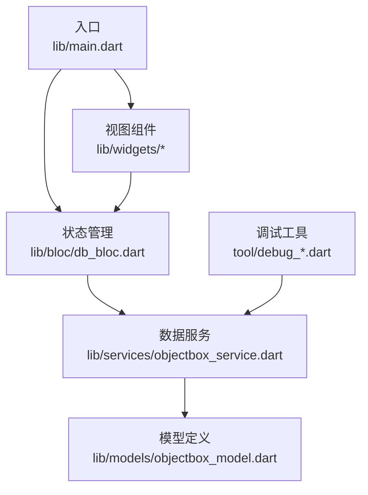
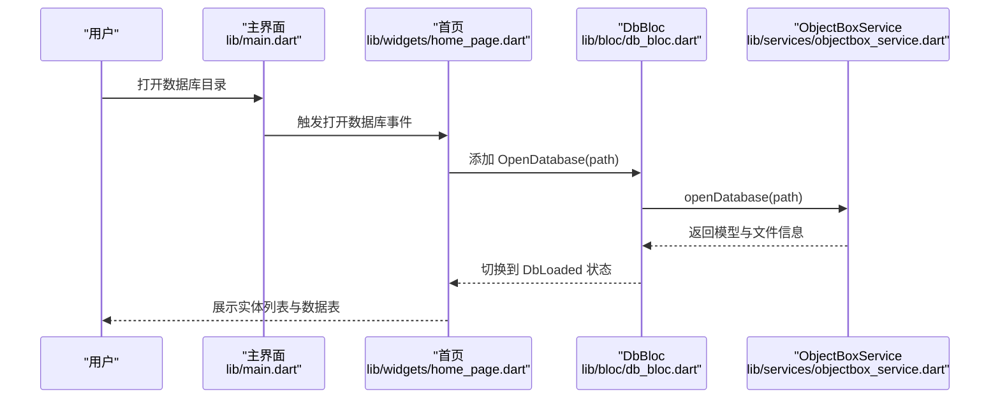
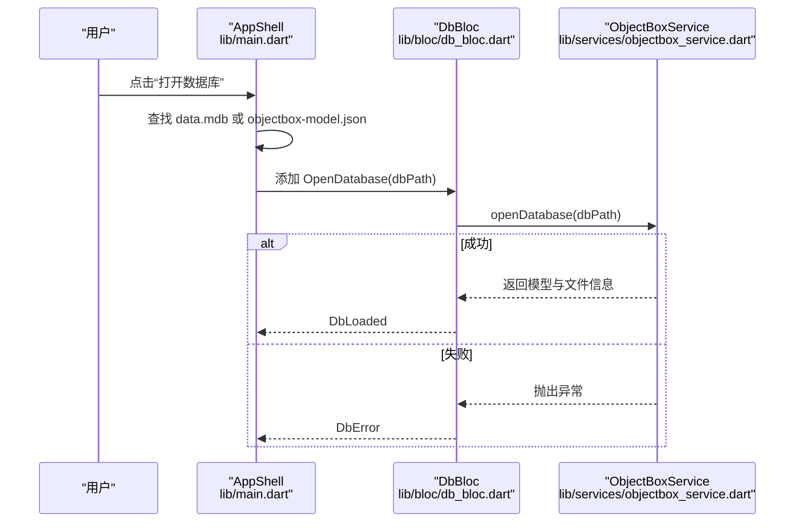
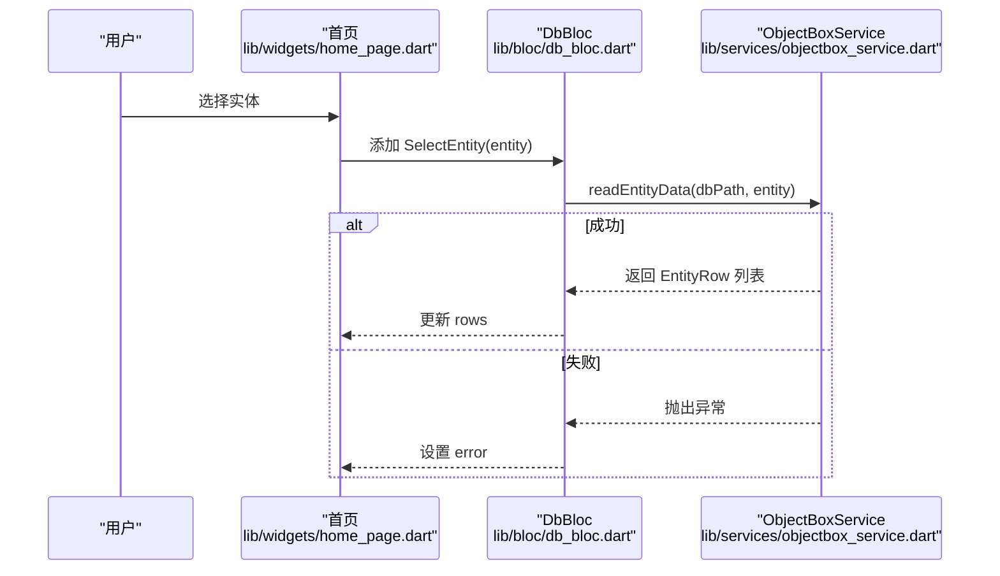
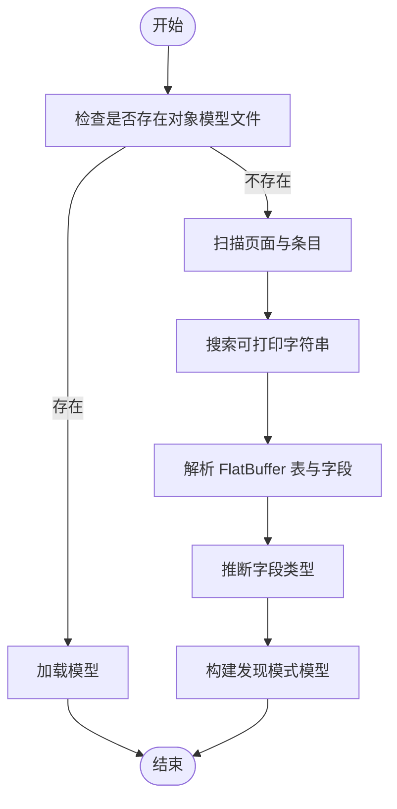
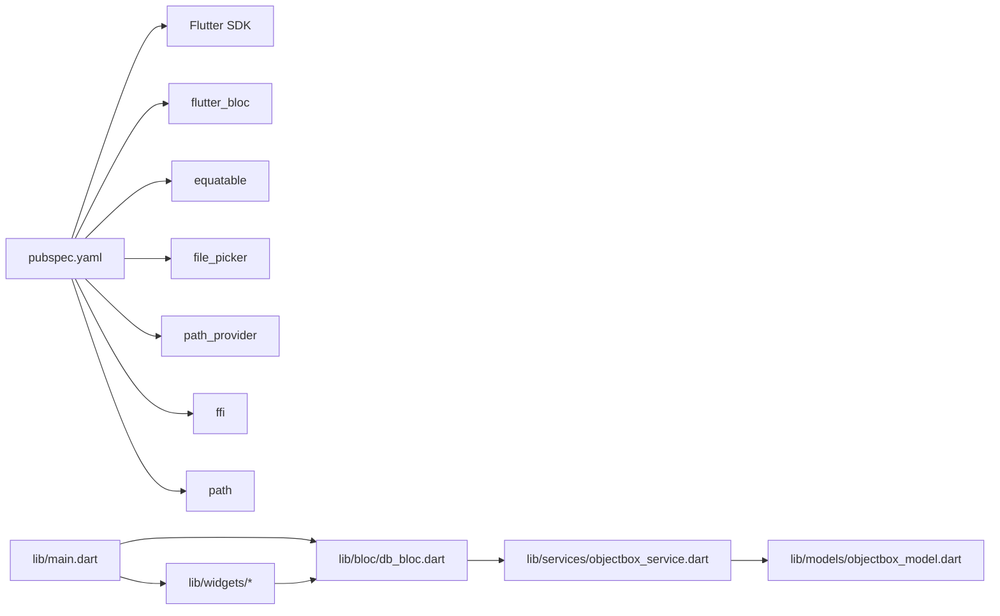

# 故障排除

<cite>
**本文引用的文件**
- [README.md](file://README.md)
- [pubspec.yaml](file://pubspec.yaml)
- [lib/main.dart](file://lib/main.dart)
- [lib/bloc/db_bloc.dart](file://lib/bloc/db_bloc.dart)
- [lib/services/objectbox_service.dart](file://lib/services/objectbox_service.dart)
- [lib/models/objectbox_model.dart](file://lib/models/objectbox_model.dart)
- [lib/widgets/home_page.dart](file://lib/widgets/home_page.dart)
- [lib/widgets/entity_list_panel.dart](file://lib/widgets/entity_list_panel.dart)
- [lib/widgets/data_table_panel.dart](file://lib/widgets/data_table_panel.dart)
- [lib/widgets/schema_detail_panel.dart](file://lib/widgets/schema_detail_panel.dart)
- [tool/debug_diagnostic.dart](file://tool/debug_diagnostic.dart)
- [tool/debug_dump.dart](file://tool/debug_dump.dart)
- [tool/debug_check.dart](file://tool/debug_check.dart)
</cite>

## 目录
1. [简介](#简介)
2. [项目结构](#项目结构)
3. [核心组件](#核心组件)
4. [架构总览](#架构总览)
5. [详细组件分析](#详细组件分析)
6. [依赖关系分析](#依赖关系分析)
7. [性能考虑](#性能考虑)
8. [故障排除指南](#故障排除指南)
9. [结论](#结论)
10. [附录](#附录)

## 简介
本文件面向使用者与开发者，提供 ObjectBox Viewer 的系统化故障排除与常见问题解答。内容覆盖错误诊断、性能问题识别与优化、兼容性处理、日志与错误追踪方法、调试工具使用、预防性维护与健康检查、以及紧急情况处理流程与恢复策略，帮助快速定位并解决问题。

## 项目结构
该应用采用 Flutter 应用结构，核心模块包括：
- 入口与应用壳：lib/main.dart
- 状态管理（BLoC）：lib/bloc/db_bloc.dart
- 数据服务与解析：lib/services/objectbox_service.dart
- 模型定义：lib/models/objectbox_model.dart
- 视图组件：lib/widgets 下各面板
- 工具脚本：tool/ 下的调试与诊断脚本

**图表来源**
- [lib/main.dart:1-147](file://lib/main.dart#L1-L147)
- [lib/bloc/db_bloc.dart:1-136](file://lib/bloc/db_bloc.dart#L1-L136)
- [lib/services/objectbox_service.dart:1-1006](file://lib/services/objectbox_service.dart#L1-L1006)
- [lib/models/objectbox_model.dart:1-248](file://lib/models/objectbox_model.dart#L1-L248)
- [lib/widgets/home_page.dart:1-218](file://lib/widgets/home_page.dart#L1-L218)
- [tool/debug_diagnostic.dart:1-345](file://tool/debug_diagnostic.dart#L1-L345)

**章节来源**
- [README.md:1-18](file://README.md#L1-L18)
- [pubspec.yaml:1-96](file://pubspec.yaml#L1-L96)
- [lib/main.dart:1-147](file://lib/main.dart#L1-L147)
- [lib/bloc/db_bloc.dart:1-136](file://lib/bloc/db_bloc.dart#L1-L136)
- [lib/services/objectbox_service.dart:1-1006](file://lib/services/objectbox_service.dart#L1-L1006)
- [lib/models/objectbox_model.dart:1-248](file://lib/models/objectbox_model.dart#L1-L248)
- [lib/widgets/home_page.dart:1-218](file://lib/widgets/home_page.dart#L1-L218)
- [tool/debug_diagnostic.dart:1-345](file://tool/debug_diagnostic.dart#L1-L345)

## 核心组件
- 应用入口与导航：负责打开数据库目录、构建主题与底部状态栏。
- BLoC 状态机：统一处理打开数据库、选择实体、刷新数据、关闭数据库等事件，并在 UI 中呈现加载、错误、已加载状态。
- 数据服务：校验数据文件存在性、解析 LMDB/ObjectBox 文件、发现模型与实体数据。
- 模型定义：描述实体、属性、索引、关系及推断模式下的字段类型。
- 视图组件：首页、实体列表、数据表格、模式详情面板，分别承担不同展示职责。
- 调试工具：用于诊断页结构、FlatBuffer 字段、字符串与数值类型等。

**章节来源**
- [lib/main.dart:97-146](file://lib/main.dart#L97-L146)
- [lib/bloc/db_bloc.dart:91-135](file://lib/bloc/db_bloc.dart#L91-L135)
- [lib/services/objectbox_service.dart:10-41](file://lib/services/objectbox_service.dart#L10-L41)
- [lib/models/objectbox_model.dart:1-248](file://lib/models/objectbox_model.dart#L1-L248)
- [lib/widgets/home_page.dart:9-89](file://lib/widgets/home_page.dart#L9-L89)
- [lib/widgets/entity_list_panel.dart:1-131](file://lib/widgets/entity_list_panel.dart#L1-L131)
- [lib/widgets/data_table_panel.dart:1-345](file://lib/widgets/data_table_panel.dart#L1-L345)
- [lib/widgets/schema_detail_panel.dart:1-283](file://lib/widgets/schema_detail_panel.dart#L1-L283)

## 架构总览
应用采用“入口 → BLoC → 服务 → 解析器”的分层架构。UI 通过 BLoC 发起事件，服务层负责文件访问与二进制解析，解析器从 LMDB 文件中提取模式与数据，模型定义承载结构信息，视图组件根据状态渲染界面。

**图表来源**
- [lib/main.dart:97-146](file://lib/main.dart#L97-L146)
- [lib/widgets/home_page.dart:74-88](file://lib/widgets/home_page.dart#L74-L88)
- [lib/bloc/db_bloc.dart:101-110](file://lib/bloc/db_bloc.dart#L101-L110)
- [lib/services/objectbox_service.dart:10-19](file://lib/services/objectbox_service.dart#L10-L19)

## 详细组件分析

### 组件一：数据库打开与状态流转
- 交互路径：点击“打开数据库”触发目录选择，随后查找 data.mdb 或 objectbox-model.json 并尝试打开数据库。
- 错误处理：捕获异常并通过 SnackBar 展示错误信息；BLoC 将状态切换为 DbError。
- 推断模式：若未找到对象模型文件，将进入“发现模式”，自动从 LMDB 文件解析实体与字段。

**图表来源**
- [lib/main.dart:97-146](file://lib/main.dart#L97-L146)
- [lib/bloc/db_bloc.dart:101-110](file://lib/bloc/db_bloc.dart#L101-L110)
- [lib/services/objectbox_service.dart:10-19](file://lib/services/objectbox_service.dart#L10-L19)

**章节来源**
- [lib/main.dart:97-146](file://lib/main.dart#L97-L146)
- [lib/bloc/db_bloc.dart:101-110](file://lib/bloc/db_bloc.dart#L101-L110)
- [lib/services/objectbox_service.dart:10-19](file://lib/services/objectbox_service.dart#L10-L19)

### 组件二：实体数据读取与表格展示
- 交互路径：选择实体后，BLoC 调用服务读取实体数据，解析 FlatBuffer 字段，生成行集合并在表格中展示。
- 错误处理：读取失败时在表格面板显示错误信息与刷新按钮。
- 发现模式提示：当模型为“发现模式”时，列头会标注类型推断标记。

**图表来源**
- [lib/widgets/home_page.dart:39-42](file://lib/widgets/home_page.dart#L39-L42)
- [lib/bloc/db_bloc.dart:112-124](file://lib/bloc/db_bloc.dart#L112-L124)
- [lib/services/objectbox_service.dart:31-40](file://lib/services/objectbox_service.dart#L31-L40)

**章节来源**
- [lib/widgets/home_page.dart:22-72](file://lib/widgets/home_page.dart#L22-L72)
- [lib/bloc/db_bloc.dart:112-124](file://lib/bloc/db_bloc.dart#L112-L124)
- [lib/services/objectbox_service.dart:31-40](file://lib/services/objectbox_service.dart#L31-L40)
- [lib/widgets/data_table_panel.dart:100-147](file://lib/widgets/data_table_panel.dart#L100-L147)

### 组件三：模型发现与类型推断
- 模式发现：当未找到对象模型文件时，服务会扫描 LMDB 文件中的 FlatBuffer 结构，提取实体名与属性，生成“发现模式”模型。
- 类型推断：对未知字段类型，按值域特征（如整数范围、布尔值、字符串可打印性）进行推断，并在 UI 中标注“?”类型。

**图表来源**
- [lib/services/objectbox_service.dart:78-111](file://lib/services/objectbox_service.dart#L78-L111)
- [lib/services/objectbox_service.dart:158-185](file://lib/services/objectbox_service.dart#L158-L185)
- [lib/services/objectbox_service.dart:187-217](file://lib/services/objectbox_service.dart#L187-L217)
- [lib/models/objectbox_model.dart:43-60](file://lib/models/objectbox_model.dart#L43-L60)

**章节来源**
- [lib/services/objectbox_service.dart:78-111](file://lib/services/objectbox_service.dart#L78-L111)
- [lib/models/objectbox_model.dart:43-60](file://lib/models/objectbox_model.dart#L43-L60)

## 依赖关系分析
- 运行时依赖：Flutter SDK、flutter_bloc、equatable、file_picker、path_provider、ffi、path。
- 关键耦合点：DbBloc 依赖 ObjectBoxService；ObjectBoxService 依赖二进制解析器；视图组件依赖 BLoC 状态。
- 可能的循环依赖：当前结构为单向依赖，无明显循环。

**图表来源**
- [pubspec.yaml:30-43](file://pubspec.yaml#L30-L43)
- [lib/main.dart:1-11](file://lib/main.dart#L1-L11)
- [lib/bloc/db_bloc.dart:1-6](file://lib/bloc/db_bloc.dart#L1-L6)
- [lib/services/objectbox_service.dart:1-6](file://lib/services/objectbox_service.dart#L1-L6)
- [lib/models/objectbox_model.dart:1-3](file://lib/models/objectbox_model.dart#L1-L3)

**章节来源**
- [pubspec.yaml:30-43](file://pubspec.yaml#L30-L43)
- [lib/main.dart:1-11](file://lib/main.dart#L1-L11)
- [lib/bloc/db_bloc.dart:1-6](file://lib/bloc/db_bloc.dart#L1-L6)
- [lib/services/objectbox_service.dart:1-6](file://lib/services/objectbox_service.dart#L1-L6)
- [lib/models/objectbox_model.dart:1-3](file://lib/models/objectbox_model.dart#L1-L3)

## 性能考虑
- 页面扫描与去重：解析时按页扫描条目指针，去重后仅保留高页号版本，避免重复记录影响性能。
- 字段类型推断：在“发现模式”下，对未知类型进行启发式判断，减少 UI 渲染负担。
- UI 延迟加载：数据为空或正在读取时显示进度指示器，避免阻塞主线程。
- 优化建议：
  - 对大型数据库，优先选择实体再读取数据，减少一次性解析量。
  - 使用刷新功能重新加载数据，避免重复打开数据库。
  - 在发现模式下，尽量通过 UI 提示确认字段类型，减少后续推断成本。

**章节来源**
- [lib/services/objectbox_service.dart:369-399](file://lib/services/objectbox_service.dart#L369-L399)
- [lib/widgets/data_table_panel.dart:126-147](file://lib/widgets/data_table_panel.dart#L126-L147)

## 故障排除指南

### 一、常见错误与解决方案
- 无法打开数据库目录
  - 现象：弹出错误提示或停留在欢迎页。
  - 排查：确认选择了包含 data.mdb 的目录；若目录内无模型文件，应用会自动在子目录中查找。
  - 处理：选择正确的数据库根目录，确保 data.mdb 存在。
  - 参考路径：[lib/main.dart:97-146](file://lib/main.dart#L97-L146)

- 未找到对象模型文件（objectbox-model.json）
  - 现象：界面顶部出现“未发现模型”的提示，字段名为 field_0、field_1 等。
  - 排查：确认数据库是否为新版本或未生成模型文件。
  - 处理：无需模型文件即可查看数据；可在 UI 中确认字段类型后继续使用。
  - 参考路径：[lib/widgets/home_page.dart:25-30](file://lib/widgets/home_page.dart#L25-L30)，[lib/models/objectbox_model.dart:43-60](file://lib/models/objectbox_model.dart#L43-L60)

- 实体数据读取失败
  - 现象：表格面板显示“读取数据失败”并给出错误信息。
  - 排查：检查 data.mdb 是否被其他进程占用、磁盘空间是否充足、文件是否损坏。
  - 处理：关闭占用程序、释放空间、重新打开数据库；必要时使用调试工具导出页与字段信息。
  - 参考路径：[lib/bloc/db_bloc.dart:118-123](file://lib/bloc/db_bloc.dart#L118-L123)，[lib/widgets/data_table_panel.dart:100-124](file://lib/widgets/data_table_panel.dart#L100-L124)

- UI 显示异常或空白
  - 现象：界面卡在加载或空白。
  - 排查：确认网络/磁盘访问正常；检查 SnackBar 是否弹出错误。
  - 处理：点击“返回”清理状态，重新选择数据库；或使用“刷新”按钮重试。
  - 参考路径：[lib/widgets/home_page.dart:16-21](file://lib/widgets/home_page.dart#L16-L21)，[lib/widgets/home_page.dart:190-217](file://lib/widgets/home_page.dart#L190-L217)

### 二、系统性诊断方法与排查步骤
- 步骤一：确认数据库文件完整性
  - 检查 data.mdb 是否存在且可读；使用调试脚本导出页与条目信息，验证魔数、页大小与条目类型。
  - 参考路径：[tool/debug_dump.dart:1-159](file://tool/debug_dump.dart#L1-159)

- 步骤二：对比模式解析与实际数据字段
  - 使用诊断脚本同时解析模式条目与数据条目，核对实体名、属性数量与类型一致性。
  - 参考路径：[tool/debug_diagnostic.dart:1-345](file://tool/debug_diagnostic.dart#L1-345)

- 步骤三：定位特定页与偏移
  - 通过检查脚本输出绝对偏移与字节值，定位可疑字段或越界访问。
  - 参考路径：[tool/debug_check.dart:1-29](file://tool/debug_check.dart#L1-29)

- 步骤四：验证 FlatBuffer 结构
  - 检查 vtable 偏移、字段偏移与类型，确认字符串、整数、时间戳等字段是否正确解析。
  - 参考路径：[tool/debug_dump.dart:76-133](file://tool/debug_dump.dart#L76-L133)

### 三、性能问题识别与优化建议
- 问题识别
  - 加载缓慢：可能由于数据库过大或多次重复读取。
  - UI 卡顿：大量长文本字段导致渲染压力。
- 优化建议
  - 优先选择实体再读取，避免全库扫描。
  - 使用“刷新”而非重新打开数据库。
  - 长文本字段建议复制到外部工具查看，减少 UI 呈现压力。
  - 参考路径：[lib/widgets/data_table_panel.dart:260-293](file://lib/widgets/data_table_panel.dart#L260-L293)

### 四、兼容性问题与替代方案
- 平台差异
  - 不同平台的文件权限与路径分隔符可能影响目录选择与文件读取。
  - 处理：确保应用具有读取目标目录的权限；使用系统默认对话框选择目录。
  - 参考路径：[lib/main.dart:99-101](file://lib/main.dart#L99-L101)

- 文件格式变化
  - 新旧版本的 FlatBuffer 布局可能存在差异，解析器已兼容多版本布局。
  - 处理：若出现字段顺序不一致，以实际值为准；必要时结合诊断脚本核对。
  - 参考路径：[lib/services/objectbox_service.dart:474-528](file://lib/services/objectbox_service.dart#L474-L528)

### 五、用户支持常见问题
- 如何打开数据库？
  - 点击顶部“打开数据库”图标，选择包含 data.mdb 的目录。
  - 参考路径：[lib/main.dart:62-68](file://lib/main.dart#L62-L68)，[lib/widgets/home_page.dart:157-161](file://lib/widgets/home_page.dart#L157-L161)

- 为什么字段名是 field_0？
  - 因为未提供对象模型文件，系统自动推断字段名；可在 UI 中确认类型后继续使用。
  - 参考路径：[lib/widgets/schema_detail_panel.dart:63-75](file://lib/widgets/schema_detail_panel.dart#L63-L75)

- 如何刷新数据？
  - 在实体数据面板点击“刷新”按钮，重新读取当前实体的数据。
  - 参考路径：[lib/widgets/data_table_panel.dart:86-90](file://lib/widgets/data_table_panel.dart#L86-L90)

### 六、日志分析与错误追踪
- 日志来源
  - UI 层：通过 SnackBar 展示错误消息；DbError 状态携带错误字符串。
  - 服务层：抛出异常时由 BLoC 捕获并转为错误状态。
- 追踪步骤
  - 记录错误消息与发生时间；检查对应事件（打开数据库、选择实体、刷新）。
  - 使用调试脚本导出页与字段，比对解析结果与 UI 显示。
  - 参考路径：[lib/bloc/db_bloc.dart:107-109](file://lib/bloc/db_bloc.dart#L107-L109)，[lib/widgets/home_page.dart:190-217](file://lib/widgets/home_page.dart#L190-L217)

### 七、调试工具使用
- 导出页与条目
  - 使用调试脚本遍历所有页，输出页类型、条目键与值长度，辅助定位异常条目。
  - 参考路径：[tool/debug_dump.dart:17-135](file://tool/debug_dump.dart#L17-L135)

- 对比模式与数据字段
  - 同时解析模式条目与数据条目，核对实体名与属性列表一致性。
  - 参考路径：[tool/debug_diagnostic.dart:13-130](file://tool/debug_diagnostic.dart#L13-L130)

- 定位偏移与字节值
  - 输出指定页与偏移处的字节值，辅助分析 FlatBuffer 字段。
  - 参考路径：[tool/debug_check.dart:20-27](file://tool/debug_check.dart#L20-L27)

### 八、预防性维护与健康检查
- 健康检查清单
  - 确认 data.mdb 存在且可读写。
  - 检查磁盘空间充足，避免写入失败。
  - 定期备份数据库目录，防止意外覆盖。
  - 使用“刷新”功能定期同步最新数据。
- 参考路径：[lib/services/objectbox_service.dart:10-29](file://lib/services/objectbox_service.dart#L10-L29)，[lib/widgets/data_table_panel.dart:86-90](file://lib/widgets/data_table_panel.dart#L86-L90)

### 九、紧急情况处理与恢复策略
- 数据库被占用
  - 现象：打开失败或读取异常。
  - 处理：关闭占用数据库的进程，释放锁文件后再试。
  - 参考路径：[lib/services/objectbox_service.dart:14-16](file://lib/services/objectbox_service.dart#L14-L16)

- 文件损坏或不完整
  - 现象：解析失败或部分实体缺失。
  - 处理：从备份恢复；若无备份，尝试使用诊断脚本导出可恢复数据。
  - 参考路径：[tool/debug_dump.dart:1-159](file://tool/debug_dump.dart#L1-159)

- UI 卡死或崩溃
  - 现象：界面无响应或闪退。
  - 处理：强制退出应用，重启后重新打开数据库；如问题持续，导出日志并反馈。
  - 参考路径：[lib/widgets/home_page.dart:16-21](file://lib/widgets/home_page.dart#L16-L21)

## 结论
通过系统化的诊断流程、调试工具与状态管理机制，ObjectBox Viewer 能够有效定位并解决大多数数据库浏览过程中的问题。建议在日常使用中遵循健康检查清单，出现问题时结合调试脚本与错误信息快速定位根因，并采取相应恢复策略。

## 附录
- 快速参考
  - 打开数据库：顶部菜单 → “打开数据库”
  - 刷新数据：实体数据面板 → “刷新”
  - 查看模式：未发现模型时，界面顶部会有提示
  - 导出诊断：使用 tool/debug_*.dart 脚本导出页与字段信息