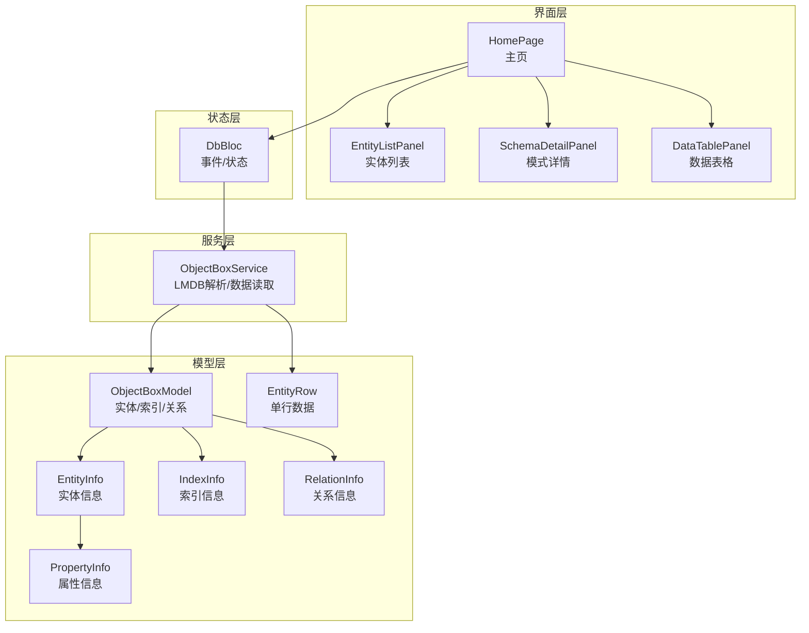
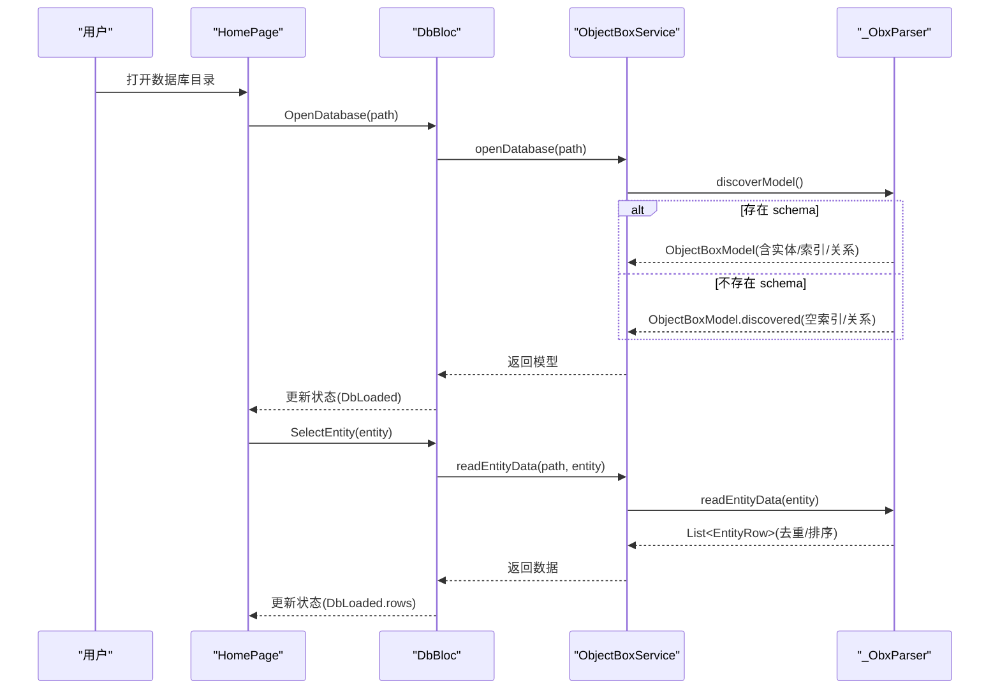
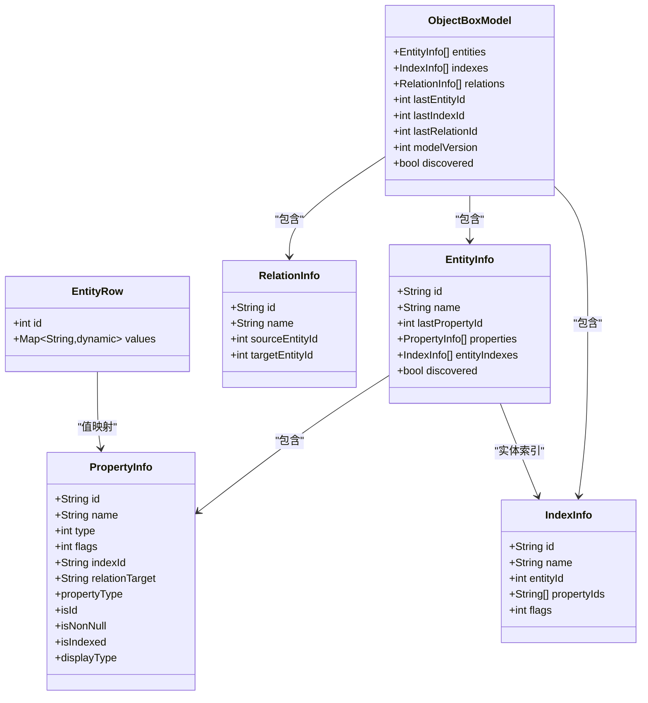

# 数据模型

<cite>
**本文引用的文件**
- [lib/models/objectbox_model.dart](file://lib/models/objectbox_model.dart)
- [lib/services/objectbox_service.dart](file://lib/services/objectbox_service.dart)
- [lib/bloc/db_bloc.dart](file://lib/bloc/db_bloc.dart)
- [lib/widgets/home_page.dart](file://lib/widgets/home_page.dart)
- [lib/widgets/entity_list_panel.dart](file://lib/widgets/entity_list_panel.dart)
- [lib/widgets/schema_detail_panel.dart](file://lib/widgets/schema_detail_panel.dart)
- [lib/widgets/data_table_panel.dart](file://lib/widgets/data_table_panel.dart)
- [pubspec.yaml](file://pubspec.yaml)
</cite>

## 目录
1. [简介](#简介)
2. [项目结构](#项目结构)
3. [核心组件](#核心组件)
4. [架构总览](#架构总览)
5. [详细组件分析](#详细组件分析)
6. [依赖分析](#依赖分析)
7. [性能考量](#性能考量)
8. [故障排查指南](#故障排查指南)
9. [结论](#结论)
10. [附录](#附录)

## 简介
本文件系统性梳理 ObjectBox Viewer 的数据模型与解析流程，聚焦以下目标：
- 全面解释 ObjectBoxModel 结构：实体、属性、索引、关系及其来源（来自 JSON 或直接从 LMDB 发现）。
- 规范 EntityInfo 与 PropertyInfo：主键/外键识别、索引与约束标记、数据类型映射。
- 阐述数据验证规则与业务规则：字段可见性、类型推断、唯一性与最新写入保留策略。
- 提供数据库模式图与示例数据说明，帮助用户快速理解结构。
- 解释数据访问模式、缓存策略与性能考虑：页面扫描、去重与排序。
- 指定数据生命周期、保留策略与归档建议：基于 LMDB 写入顺序与页号去重。
- 覆盖数据迁移路径与版本管理：模型版本号与发现模式切换。
- 涵盖数据安全、隐私与访问控制：仅本地读取、无网络依赖。
- 提供使用示例与最佳实践：如何打开数据库、浏览实体与数据。

## 项目结构
该项目采用 Flutter 应用结构，围绕“模型-服务-界面”分层组织：
- 模型层：定义 ObjectBoxModel 及其子结构（EntityInfo、PropertyInfo、IndexInfo、RelationInfo、EntityRow）。
- 服务层：解析 LMDB 文件，构建模型与实体数据；提供文件信息查询。
- 界面层：通过 BLoC 管理状态，展示实体列表、模式详情与数据表格。
- 配置层：依赖声明与应用入口。

图表来源
- [lib/widgets/home_page.dart:12-72](file://lib/widgets/home_page.dart#L12-L72)
- [lib/bloc/db_bloc.dart:91-135](file://lib/bloc/db_bloc.dart#L91-L135)
- [lib/services/objectbox_service.dart:9-41](file://lib/services/objectbox_service.dart#L9-L41)
- [lib/models/objectbox_model.dart:3-61](file://lib/models/objectbox_model.dart#L3-L61)

章节来源
- [lib/widgets/home_page.dart:12-72](file://lib/widgets/home_page.dart#L12-L72)
- [lib/bloc/db_bloc.dart:91-135](file://lib/bloc/db_bloc.dart#L91-L135)
- [lib/services/objectbox_service.dart:9-41](file://lib/services/objectbox_service.dart#L9-L41)
- [lib/models/objectbox_model.dart:3-61](file://lib/models/objectbox_model.dart#L3-L61)

## 核心组件
本节对数据模型的核心类进行深入解析，覆盖字段定义、工厂构造器、派生属性与行为。

- ObjectBoxModel
  - 字段：实体列表、索引列表、关系列表、最后实体/索引/关系ID、模型版本、是否“发现模式”。
  - 行为：支持从 JSON 构建；在无 JSON 时以“发现模式”生成通用实体。
  - 关键点：发现模式下实体名称来源于 LMDB 中的子数据库或 FlatBuffer 名称；属性在运行时由 FlatBuffer VTable 探测填充。

- EntityInfo
  - 字段：实体ID、名称、最后属性ID、属性列表、实体索引列表、是否“发现模式”。
  - 行为：从 JSON 构建；在发现模式下生成占位属性，后续由解析器替换。
  - 关键点：发现模式下的属性名与类型会在读取数据时逐步推断与更新。

- PropertyInfo
  - 字段：属性ID、名称、类型值、标志位、索引ID、关系目标。
  - 行为：从 JSON 构建；在发现模式下按字段序号生成占位属性。
  - 派生属性：isId、isNonNull、isIndexed、displayType。
  - 类型映射：通过 PropertyType 枚举，将数值类型映射到显示名称。

- PropertyType
  - 定义：布尔、字节、短整型、字符、整型、长整型、浮点、双精度、字符串、日期、纳秒日期、关系、向量等。
  - 特殊值：unknown、discovered* 系列用于发现模式下的类型推断。

- IndexInfo
  - 字段：索引ID、名称、实体ID、属性ID列表、标志位。
  - 行为：从 JSON 构建；在发现模式下为空集合。

- RelationInfo
  - 字段：关系ID、名称、源实体ID、目标实体ID。
  - 行为：从 JSON 构建；在发现模式下为空集合。

- EntityRow
  - 字段：对象ID、值映射（列名为键，值为内容）。
  - 行为：表示单条实体记录，用于表格渲染。

章节来源
- [lib/models/objectbox_model.dart:3-248](file://lib/models/objectbox_model.dart#L3-L248)

## 架构总览
ObjectBox Viewer 的数据流自上而下如下：
- 用户通过界面选择数据库目录，触发打开数据库事件。
- BLoC 处理事件，调用服务层解析 LMDB 文件，构建 ObjectBoxModel。
- 若存在 objectbox-model.json，则直接解析 JSON；否则进入“发现模式”，通过 FlatBuffer 解析实体与属性。
- 用户选择实体后，服务层读取对应实体的所有数据行，按页去重并排序，返回给界面渲染。

图表来源
- [lib/widgets/home_page.dart:74-88](file://lib/widgets/home_page.dart#L74-L88)
- [lib/bloc/db_bloc.dart:101-124](file://lib/bloc/db_bloc.dart#L101-L124)
- [lib/services/objectbox_service.dart:10-41](file://lib/services/objectbox_service.dart#L10-L41)
- [lib/services/objectbox_service.dart:369-399](file://lib/services/objectbox_service.dart#L369-L399)

## 详细组件分析

### 对象模型类图

图表来源
- [lib/models/objectbox_model.dart:3-248](file://lib/models/objectbox_model.dart#L3-L248)

章节来源
- [lib/models/objectbox_model.dart:3-248](file://lib/models/objectbox_model.dart#L3-L248)

### 属性类型与约束
- 主键/外键
  - 主键：通过 flags 的最低位判断；或当属性名为“id”时视为主键。
  - 外键：通过 relationTarget 标识关系目标；关系信息由 RelationInfo 描述。
- 索引
  - 通过 indexId 标记该属性被索引；IndexInfo 记录实体ID与属性ID列表。
- 约束
  - 非空：通过 isNonNull 判断（flags 第二位）。
- 类型
  - 使用 PropertyType 映射数值类型到显示名称；发现模式下 unknown/discovered* 用于动态推断。

章节来源
- [lib/models/objectbox_model.dart:144-189](file://lib/models/objectbox_model.dart#L144-L189)
- [lib/models/objectbox_model.dart:191-216](file://lib/models/objectbox_model.dart#L191-L216)
- [lib/models/objectbox_model.dart:218-239](file://lib/models/objectbox_model.dart#L218-L239)

### 数据验证与业务规则
- 唯一性与去重
  - LMDB 采用写时复制，同一记录可能出现在多页；解析器按最高页号保留最新版本，确保每条记录唯一。
- 类型一致性
  - 当类型未知时，解析器根据值范围与格式进行启发式推断，并更新 PropertyInfo 的类型。
- 可见性
  - 主键字段在表格中单独显示；若为主键且非显式ID命名，仍会排除重复显示。
- 错误处理
  - 读取失败时返回错误消息；界面提供“刷新”按钮重新加载数据。

章节来源
- [lib/services/objectbox_service.dart:369-399](file://lib/services/objectbox_service.dart#L369-L399)
- [lib/services/objectbox_service.dart:762-768](file://lib/services/objectbox_service.dart#L762-L768)
- [lib/widgets/data_table_panel.dart:100-147](file://lib/widgets/data_table_panel.dart#L100-L147)

### 数据访问模式与缓存策略
- 访问模式
  - 逐页扫描：遍历所有页，提取数据条目。
  - 条目过滤：跳过 schema 条目，仅处理数据条目。
  - 去重策略：以对象ID为键，保留最高页号的版本，保证最新写入优先。
  - 排序：最终结果按对象ID升序排列。
- 缓存策略
  - 无持久化缓存：每次打开数据库或刷新时重新解析。
  - 内存缓存：当前选中实体的数据行在状态中缓存，避免重复读取。

章节来源
- [lib/services/objectbox_service.dart:369-399](file://lib/services/objectbox_service.dart#L369-L399)
- [lib/bloc/db_bloc.dart:112-124](file://lib/bloc/db_bloc.dart#L112-L124)

### 性能特性与优化建议
- 页面大小与边界
  - 解析器根据文件头计算页面大小与页数，确保按页对齐读取。
- 字符串与可打印字符检测
  - 在发现模式下，通过可打印字符比例筛选候选实体名与属性名，减少误判。
- 启发式类型推断
  - 当类型未知时，按 long、string、double、int32、bool 的顺序尝试解析，提升兼容性。

章节来源
- [lib/services/objectbox_service.dart:47-70](file://lib/services/objectbox_service.dart#L47-L70)
- [lib/services/objectbox_service.dart:878-917](file://lib/services/objectbox_service.dart#L878-L917)
- [lib/services/objectbox_service.dart:831-875](file://lib/services/objectbox_service.dart#L831-L875)

### 数据生命周期、保留策略与归档
- 生命周期
  - 仅在应用运行期间驻留内存；关闭数据库或切换目录后释放。
- 保留策略
  - 依据 LMDB 的写时复制机制，解析器保留最高页号的记录，实现“最近写入优先”的保留策略。
- 归档建议
  - 由于解析器不修改数据，可直接备份 data.mdb 作为归档；如需导出，可在界面中复制表格内容。

章节来源
- [lib/services/objectbox_service.dart:369-399](file://lib/services/objectbox_service.dart#L369-L399)
- [lib/bloc/db_bloc.dart:132-135](file://lib/bloc/db_bloc.dart#L132-L135)

### 迁移路径与版本管理
- 模型版本
  - ObjectBoxModel 包含 modelVersion 字段；当存在 objectbox-model.json 时，该值来自 JSON。
- 发现模式
  - 当缺少 objectbox-model.json 时，进入“发现模式”，模型版本为 0，实体与属性在运行时发现与填充。
- 迁移建议
  - 若 schema 发生变更，应确保 objectbox-model.json 最新；否则使用发现模式时，属性名与类型可能需要人工确认。

章节来源
- [lib/models/objectbox_model.dart:24-39](file://lib/models/objectbox_model.dart#L24-L39)
- [lib/models/objectbox_model.dart:43-60](file://lib/models/objectbox_model.dart#L43-L60)

### 数据安全、隐私与访问控制
- 本地访问
  - 仅从本地文件系统读取数据库文件，无网络请求，保障数据隐私。
- 文件权限
  - 依赖操作系统文件权限；建议在受信任环境中运行。
- 无内置鉴权
  - 不涉及用户认证与授权逻辑，遵循平台默认权限模型。

章节来源
- [lib/services/objectbox_service.dart:9-41](file://lib/services/objectbox_service.dart#L9-L41)
- [lib/widgets/home_page.dart:74-88](file://lib/widgets/home_page.dart#L74-L88)

### 使用示例与最佳实践
- 打开数据库
  - 通过界面选择包含 data.mdb 的目录；若目录内未找到，工具会自动在子目录中查找。
- 浏览实体
  - 左侧实体列表显示实体数量与属性数量；点击进入数据视图。
- 查看模式详情
  - 在模式详情面板查看数据库文件信息、模型版本（若可用）、实体概览与关系（若可用）。
- 导航与刷新
  - 数据表格支持刷新；长文本值可弹窗复制；可随时切换数据库。

章节来源
- [lib/widgets/home_page.dart:74-88](file://lib/widgets/home_page.dart#L74-L88)
- [lib/widgets/entity_list_panel.dart:52-84](file://lib/widgets/entity_list_panel.dart#L52-L84)
- [lib/widgets/schema_detail_panel.dart:97-123](file://lib/widgets/schema_detail_panel.dart#L97-L123)
- [lib/widgets/data_table_panel.dart:100-147](file://lib/widgets/data_table_panel.dart#L100-L147)

## 依赖分析
- 依赖关系
  - DbBloc 依赖 ObjectBoxService；ObjectBoxService 依赖 _ObxParser 与模型类。
  - 界面组件依赖模型类与 BLoC 状态。
- 外部依赖
  - Flutter 生态与第三方包（如 file_picker、flutter_bloc、ffi 等）在 pubspec 中声明。

图表来源
- [lib/bloc/db_bloc.dart:91-135](file://lib/bloc/db_bloc.dart#L91-L135)
- [lib/services/objectbox_service.dart:9-41](file://lib/services/objectbox_service.dart#L9-L41)
- [lib/models/objectbox_model.dart:3-248](file://lib/models/objectbox_model.dart#L3-L248)

章节来源
- [pubspec.yaml:30-43](file://pubspec.yaml#L30-L43)
- [lib/bloc/db_bloc.dart:91-135](file://lib/bloc/db_bloc.dart#L91-L135)
- [lib/services/objectbox_service.dart:9-41](file://lib/services/objectbox_service.dart#L9-L41)

## 性能考量
- 读取复杂度
  - 逐页扫描：O(P)（P 为页数）；每页内条目线性处理。
- 去重与排序
  - 使用哈希表按对象ID去重，时间复杂度近似 O(N)；最终排序 O(N log N)。
- 类型推断
  - 启发式解析在未知类型时进行多次尝试，增加常数开销但提升兼容性。
- 建议
  - 大型数据库建议分实体浏览；避免一次性加载过多实体。
  - 使用刷新功能重新解析，确保获取最新数据。

[本节为通用指导，无需特定文件来源]

## 故障排查指南
- 无法打开数据库
  - 确认选择了包含 data.mdb 的目录；若目录内无该文件，工具会自动在子目录中查找。
- 无实体或属性
  - 若 objectbox-model.json 不存在，将进入“发现模式”，实体与属性名可能为 field_0、field_1 等；首次点击实体后会触发数据读取与属性推断。
- 读取失败
  - 检查 data.mdb 是否损坏；尝试刷新；必要时重新打开数据库。
- 类型显示为 unknown
  - 属于发现模式的临时状态；读取数据后会根据值推断类型并更新。

章节来源
- [lib/widgets/home_page.dart:117-145](file://lib/widgets/home_page.dart#L117-L145)
- [lib/widgets/schema_detail_panel.dart:50-75](file://lib/widgets/schema_detail_panel.dart#L50-L75)
- [lib/widgets/data_table_panel.dart:100-147](file://lib/widgets/data_table_panel.dart#L100-L147)
- [lib/services/objectbox_service.dart:762-768](file://lib/services/objectbox_service.dart#L762-L768)

## 结论
ObjectBox Viewer 通过“发现模式”与 JSON 模式两种路径解析 ObjectBox 数据库，既保证了灵活性，又提供了稳定的可视化体验。数据模型以 FlatBuffer 为核心，结合 LMDB 页结构实现高效解析与去重。界面层通过 BLoC 管理状态，使用户能够直观地浏览实体、模式与数据。建议在生产环境中配合 objectbox-model.json 使用，以获得更准确的模式信息；同时注意本地文件权限与数据备份。

[本节为总结，无需特定文件来源]

## 附录

### 示例数据说明
- 单行数据结构
  - 对象ID：整型，唯一标识。
  - 值映射：列名为属性名，值为对应字段内容；未知类型时可能为字符串或数字。
- 实体数据读取流程
  - 逐页扫描 → 过滤 schema → 解析 FlatBuffer → 去重（按最高页号）→ 排序 → 渲染。

章节来源
- [lib/models/objectbox_model.dart:242-248](file://lib/models/objectbox_model.dart#L242-L248)
- [lib/services/objectbox_service.dart:369-399](file://lib/services/objectbox_service.dart#L369-L399)