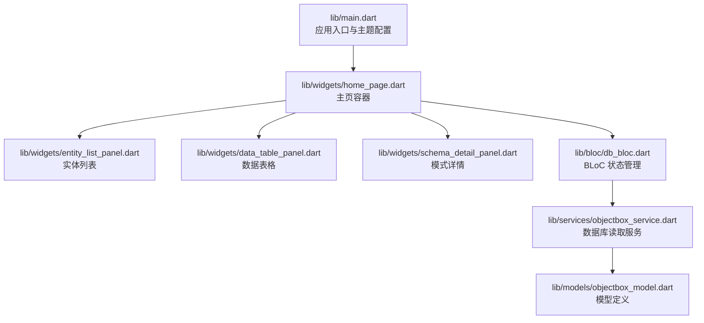
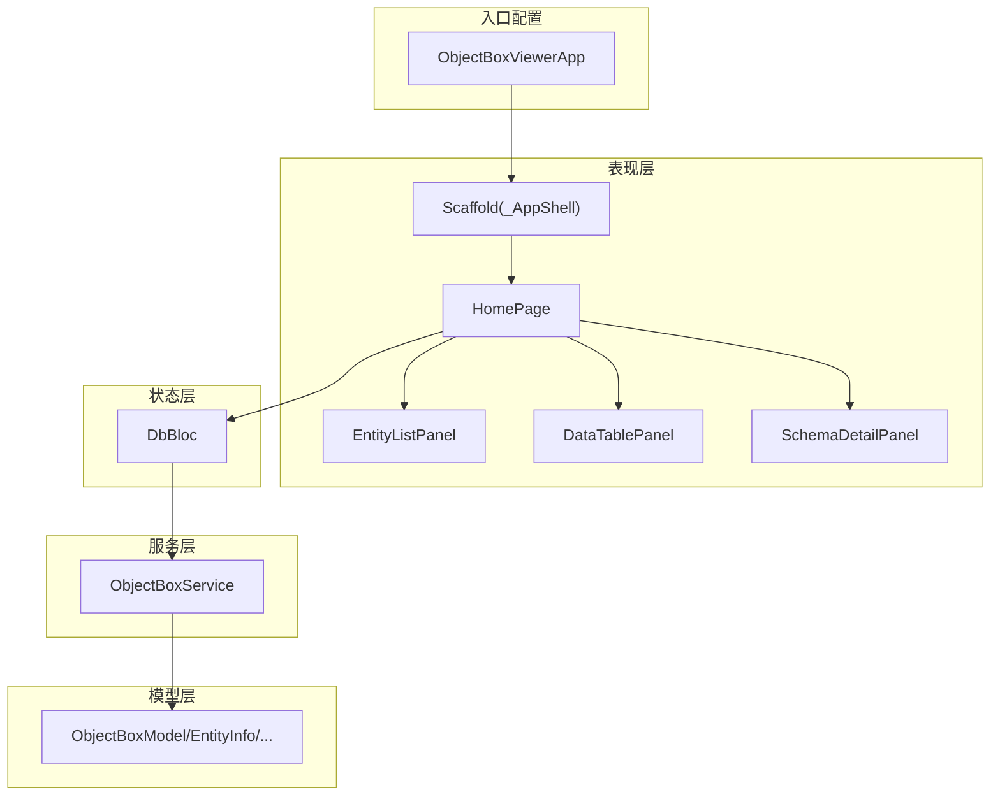
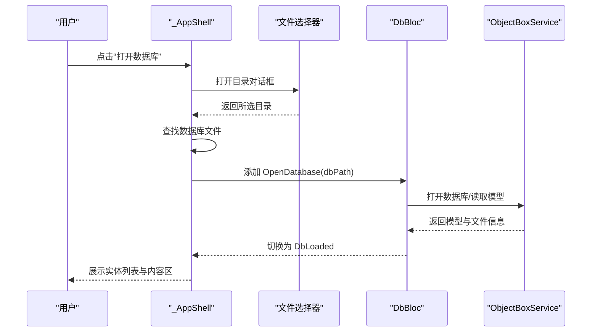
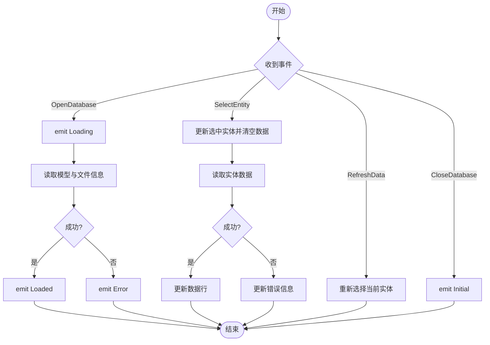
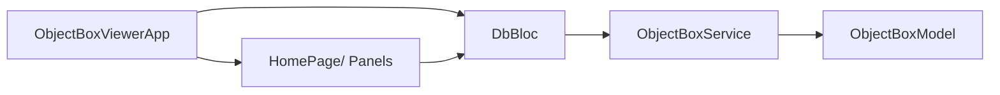

# 整体架构概览

<cite>
**本文引用的文件**
- [lib/main.dart](file://lib/main.dart)
- [lib/bloc/db_bloc.dart](file://lib/bloc/db_bloc.dart)
- [lib/services/objectbox_service.dart](file://lib/services/objectbox_service.dart)
- [lib/models/objectbox_model.dart](file://lib/models/objectbox_model.dart)
- [lib/widgets/home_page.dart](file://lib/widgets/home_page.dart)
- [lib/widgets/entity_list_panel.dart](file://lib/widgets/entity_list_panel.dart)
- [lib/widgets/data_table_panel.dart](file://lib/widgets/data_table_panel.dart)
- [lib/widgets/schema_detail_panel.dart](file://lib/widgets/schema_detail_panel.dart)
- [pubspec.yaml](file://pubspec.yaml)
- [README.md](file://README.md)
</cite>

## 目录
1. [简介](#简介)
2. [项目结构](#项目结构)
3. [核心组件](#核心组件)
4. [架构总览](#架构总览)
5. [详细组件分析](#详细组件分析)
6. [依赖分析](#依赖分析)
7. [性能考虑](#性能考虑)
8. [故障排查指南](#故障排查指南)
9. [结论](#结论)

## 简介
本项目是一个基于 Flutter 的跨平台数据库浏览工具，用于可视化查看 ObjectBox Dart 数据库（Windows、macOS、Linux）。应用采用 Material Design 3 主题与暗色模式支持，结合 BLoC 全局状态管理，提供数据库打开、实体发现、表数据浏览与模式详情展示等能力。

## 项目结构
应用采用按功能分层的目录组织方式：
- 根入口：lib/main.dart
- 状态层：lib/bloc/db_bloc.dart
- 模型层：lib/models/objectbox_model.dart
- 服务层：lib/services/objectbox_service.dart
- 视图层：lib/widgets/*（主页、实体列表、数据表格、模式详情）
- 依赖声明：pubspec.yaml

**图表来源**
- [lib/main.dart:1-147](file://lib/main.dart#L1-L147)
- [lib/widgets/home_page.dart:1-218](file://lib/widgets/home_page.dart#L1-L218)
- [lib/bloc/db_bloc.dart:1-136](file://lib/bloc/db_bloc.dart#L1-L136)
- [lib/services/objectbox_service.dart:1-1006](file://lib/services/objectbox_service.dart#L1-L1006)
- [lib/models/objectbox_model.dart:1-248](file://lib/models/objectbox_model.dart#L1-L248)

**章节来源**
- [lib/main.dart:1-147](file://lib/main.dart#L1-L147)
- [pubspec.yaml:1-96](file://pubspec.yaml#L1-L96)

## 核心组件
- 应用入口与壳层
  - ObjectBoxViewerApp：设置标题、禁用调试横幅、配置 Material 3 主题与暗色模式、设定主题模式为跟随系统，并通过 BlocProvider 初始化 DbBloc，作为根组件包裹 App 壳层。
  - _AppShell：实现 Scaffold 结构，包含 AppBar（图标+标题+打开数据库按钮）、主体内容 HomePage 与底部状态栏（显示提示信息）。
- 全局状态管理
  - DbBloc：定义数据库相关事件（打开、选择实体、刷新、关闭），以及 DbInitial、DbLoading、DbLoaded、DbError 等状态；负责调用服务层读取模型与数据，并通过状态变化驱动 UI 更新。
- 服务层
  - ObjectBoxService：从 data.mdb 文件解析数据库，支持从 FlatBuffer 中发现模型与实体数据；提供数据库文件信息查询。
- 模型层
  - ObjectBoxModel、EntityInfo、PropertyInfo、IndexInfo、RelationInfo、EntityRow：描述数据库模型、实体、属性、索引、关系与单行数据。
- 视图层
  - HomePage：根据 DbState 渲染欢迎页、加载中、错误视图或主界面（实体列表 + 内容区）。
  - 实体列表面板：展示实体列表与统计信息。
  - 数据表格面板：以可滚动表格展示实体数据，支持刷新与长文本复制。
  - 模式详情面板：展示数据库文件信息、模型信息（非发现模式下）、实体与关系概览。

**章节来源**
- [lib/main.dart:13-43](file://lib/main.dart#L13-L43)
- [lib/main.dart:45-146](file://lib/main.dart#L45-L146)
- [lib/bloc/db_bloc.dart:7-136](file://lib/bloc/db_bloc.dart#L7-L136)
- [lib/services/objectbox_service.dart:1-41](file://lib/services/objectbox_service.dart#L1-L41)
- [lib/models/objectbox_model.dart:1-248](file://lib/models/objectbox_model.dart#L1-L248)
- [lib/widgets/home_page.dart:9-89](file://lib/widgets/home_page.dart#L9-L89)
- [lib/widgets/entity_list_panel.dart:4-86](file://lib/widgets/entity_list_panel.dart#L4-L86)
- [lib/widgets/data_table_panel.dart:5-148](file://lib/widgets/data_table_panel.dart#L5-L148)
- [lib/widgets/schema_detail_panel.dart:4-123](file://lib/widgets/schema_detail_panel.dart#L4-L123)

## 架构总览
应用采用“入口配置 → 壳层容器 → 视图层 → BLoC → 服务层 → 模型层”的分层架构，数据自下而上流动，事件自上而下触发。

**图表来源**
- [lib/main.dart:13-43](file://lib/main.dart#L13-L43)
- [lib/main.dart:45-146](file://lib/main.dart#L45-L146)
- [lib/widgets/home_page.dart:9-89](file://lib/widgets/home_page.dart#L9-L89)
- [lib/bloc/db_bloc.dart:91-135](file://lib/bloc/db_bloc.dart#L91-L135)
- [lib/services/objectbox_service.dart:1-41](file://lib/services/objectbox_service.dart#L1-L41)
- [lib/models/objectbox_model.dart:1-248](file://lib/models/objectbox_model.dart#L1-L248)

## 详细组件分析

### 应用入口与主题配置（ObjectBoxViewerApp）
- 职责
  - 设置应用标题与调试横幅。
  - 构建 Material 3 主题：使用种子色生成亮/暗两套 ColorScheme，并配置 AppBarTheme。
  - 设定主题模式为系统跟随。
  - 使用 BlocProvider 初始化 DbBloc 并注入到 App 壳层。
- 设计要点
  - 使用 ColorScheme.fromSeed 动态生成色彩体系，确保明暗模式一致性。
  - AppBarTheme 与颜色方案解耦，便于统一风格。
  - 将 DbBloc 作为全局状态源，贯穿整个应用生命周期。

**章节来源**
- [lib/main.dart:13-43](file://lib/main.dart#L13-L43)

### 应用壳层（_AppShell）
- 职责
  - 提供 Scaffold 容器，包含顶部 AppBar、中间主体与底部状态栏。
  - AppBar：左侧图标与标题，右侧打开数据库按钮，点击后弹出目录选择器，定位数据库路径并触发 DbBloc 打开数据库。
  - 主体：HomePage，根据 DbState 渲染不同内容。
  - 底部状态栏：显示简要提示信息，使用 surfaceContainerLow 背景与 dividerColor 边框。
- 交互流程
  - 用户点击打开数据库 → 选择目录 → 查找 data.mdb 或 objectbox-model.json → 发送 OpenDatabase 事件 → DbBloc 切换为 Loading → 成功后切换为 Loaded，失败则切换为 Error。

**图表来源**
- [lib/main.dart:97-145](file://lib/main.dart#L97-L145)
- [lib/bloc/db_bloc.dart:101-110](file://lib/bloc/db_bloc.dart#L101-L110)
- [lib/services/objectbox_service.dart:10-19](file://lib/services/objectbox_service.dart#L10-L19)

**章节来源**
- [lib/main.dart:45-146](file://lib/main.dart#L45-L146)

### 全局状态管理（DbBloc）
- 事件与状态
  - 事件：OpenDatabase、SelectEntity、RefreshData、CloseDatabase。
  - 状态：DbInitial、DbLoading、DbLoaded（含模型、文件信息、选中实体、数据行、错误信息）、DbError。
- 处理逻辑
  - 打开数据库：进入 Loading → 读取模型与文件信息 → 切换为 Loaded；异常则切换为 Error。
  - 选择实体：更新选中实体并清空数据 → 异步读取实体数据 → 成功更新数据行；异常更新错误信息。
  - 刷新数据：重新触发 SelectEntity。
  - 关闭数据库：回到初始状态。
- 性能与健壮性
  - 使用异步读取避免阻塞 UI。
  - 错误捕获与状态回退，保证 UI 稳定。

**图表来源**
- [lib/bloc/db_bloc.dart:91-135](file://lib/bloc/db_bloc.dart#L91-L135)

**章节来源**
- [lib/bloc/db_bloc.dart:7-136](file://lib/bloc/db_bloc.dart#L7-L136)

### 服务层（ObjectBoxService）
- 职责
  - 从 data.mdb 解析数据库，支持两种模式：
    - 正常模式：解析 objectbox-model.json 生成模型。
    - 发现模式：直接从 LMDB 文件中解析 FlatBuffer，自动发现实体与字段。
  - 提供数据库文件信息（文件名与大小）。
- 技术细节
  - 解析 LMDB 页面、FlatBuffer VTable 与字符串，推断实体名称与属性类型。
  - 对于未找到 objectbox-model.json 的情况，返回 discovered 模型，后续在运行时逐步完善字段信息。

**章节来源**
- [lib/services/objectbox_service.dart:1-41](file://lib/services/objectbox_service.dart#L1-L41)
- [lib/services/objectbox_service.dart:47-140](file://lib/services/objectbox_service.dart#L47-L140)
- [lib/services/objectbox_service.dart:369-399](file://lib/services/objectbox_service.dart#L369-L399)

### 模型层（ObjectBoxModel 及相关）
- 职责
  - 描述数据库模型、实体、属性、索引、关系与单行数据。
  - 支持从 JSON 构造与“发现模式”构造。
- 特性
  - discovered 字段标识是否为发现模式生成。
  - PropertyType 提供类型枚举与显示名映射。

**章节来源**
- [lib/models/objectbox_model.dart:1-248](file://lib/models/objectbox_model.dart#L1-L248)

### 视图层组件
- HomePage
  - 根据 DbState 渲染欢迎页、加载中、错误视图或主界面。
  - 主界面采用 Column + Row 布局：左侧实体列表、右侧内容区（SchemaDetailPanel 或 DataTablePanel）。
- 实体列表面板（EntityListPanel）
  - 展示实体列表与统计信息，支持选择实体并回调给 DbBloc。
- 数据表格面板（DataTablePanel）
  - 展示实体数据为可横向滚动的表格，支持刷新、长文本复制、列头类型标注（发现模式）。
- 模式详情面板（SchemaDetailPanel）
  - 展示数据库文件信息、模型信息（非发现模式）、实体与关系概览。

**章节来源**
- [lib/widgets/home_page.dart:9-89](file://lib/widgets/home_page.dart#L9-L89)
- [lib/widgets/entity_list_panel.dart:4-86](file://lib/widgets/entity_list_panel.dart#L4-L86)
- [lib/widgets/data_table_panel.dart:5-148](file://lib/widgets/data_table_panel.dart#L5-L148)
- [lib/widgets/schema_detail_panel.dart:4-123](file://lib/widgets/schema_detail_panel.dart#L4-L123)

## 依赖分析
- 运行时依赖
  - flutter、flutter_bloc、file_picker、path、ffi、equatable、path_provider。
- 作用
  - flutter：UI 框架与 Material 组件。
  - flutter_bloc：状态管理。
  - file_picker：目录选择。
  - equatable：简化状态相等性判断。
  - path/ffi：文件路径与底层读取。
- 开发依赖
  - flutter_test、flutter_lints。

**图表来源**
- [pubspec.yaml:30-42](file://pubspec.yaml#L30-L42)
- [lib/main.dart:1-7](file://lib/main.dart#L1-L7)
- [lib/bloc/db_bloc.dart:1-6](file://lib/bloc/db_bloc.dart#L1-L6)
- [lib/services/objectbox_service.dart:1-5](file://lib/services/objectbox_service.dart#L1-L5)
- [lib/models/objectbox_model.dart:1-3](file://lib/models/objectbox_model.dart#L1-L3)

**章节来源**
- [pubspec.yaml:30-42](file://pubspec.yaml#L30-L42)

## 性能考虑
- 异步加载：数据库打开与实体数据读取均采用异步，避免阻塞主线程。
- 首次渲染优化：在 DbLoading 状态显示进度指示器，提升感知速度。
- 数据去重：读取实体数据时按对象 ID 保留最高页号版本，减少重复记录。
- 表格渲染：对长文本进行截断与可选弹窗查看，避免大文本影响渲染性能。
- 发现模式：在缺少 objectbox-model.json 时，延迟完善字段类型与名称，降低首屏复杂度。

## 故障排查指南
- 打不开数据库
  - 现象：出现错误视图或底部状态栏提示。
  - 排查：确认所选目录包含 data.mdb；检查权限与路径有效性；查看错误消息并重试。
- 无数据或空白表格
  - 现象：表格为空或仅显示“无数据”。
  - 排查：确认实体存在记录；尝试刷新；检查实体是否被正确发现。
- 发现模式字段类型不准确
  - 现象：列头显示“未知类型”或“?”。
  - 排查：首次加载时类型为推断，选择该实体后会自动完善类型信息。
- 文件过大导致渲染卡顿
  - 建议：使用横向滚动与分页策略（如未来扩展）；避免一次性渲染超大数据集。

**章节来源**
- [lib/widgets/home_page.dart:190-217](file://lib/widgets/home_page.dart#L190-L217)
- [lib/widgets/data_table_panel.dart:100-147](file://lib/widgets/data_table_panel.dart#L100-L147)
- [lib/bloc/db_bloc.dart:112-124](file://lib/bloc/db_bloc.dart#L112-L124)

## 结论
本项目以清晰的分层架构实现了跨平台的 ObjectBox 数据库浏览工具。通过 Material 3 主题与暗色模式、BLoC 状态管理与服务层抽象，应用具备良好的可维护性与扩展性。未来可在以下方面进一步增强：引入分页与搜索、完善错误恢复机制、增加导出功能与多语言支持。