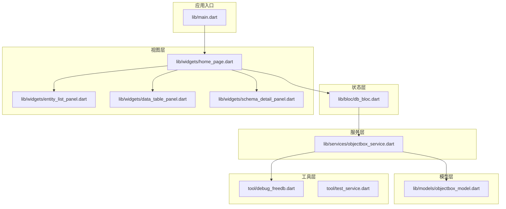
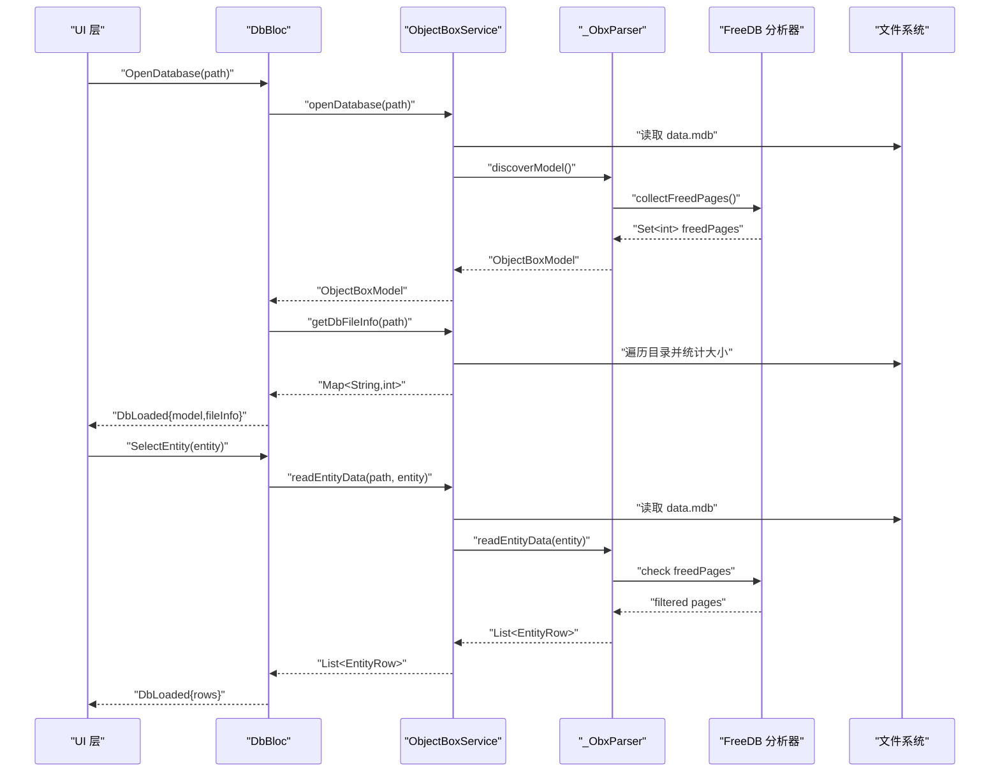
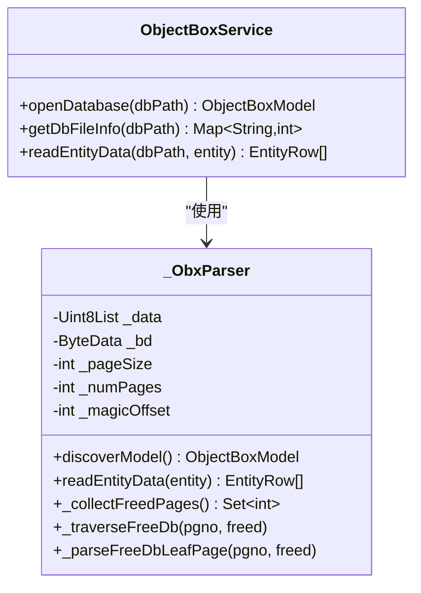
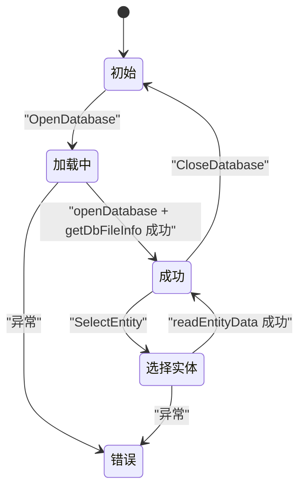
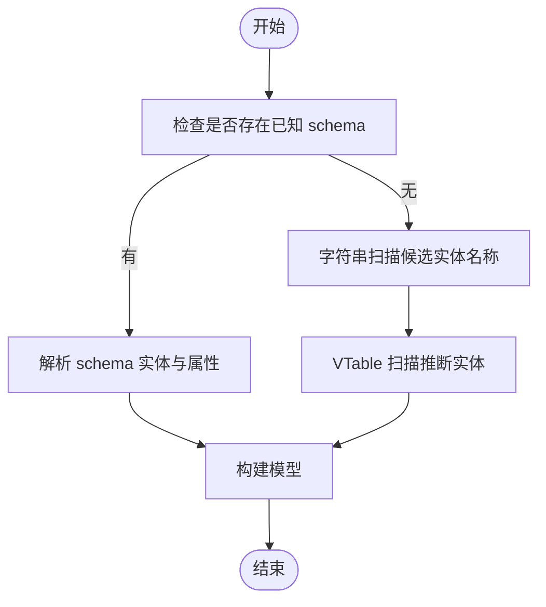
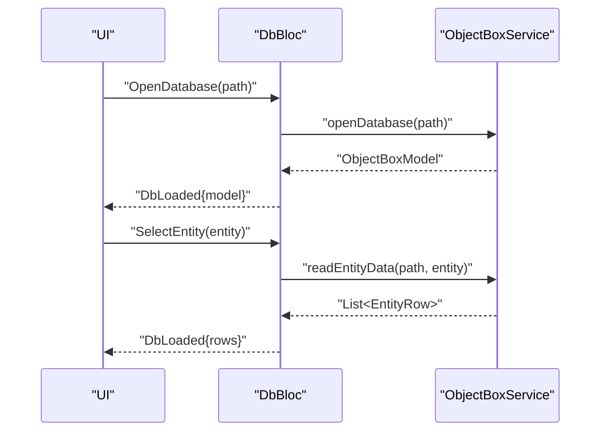
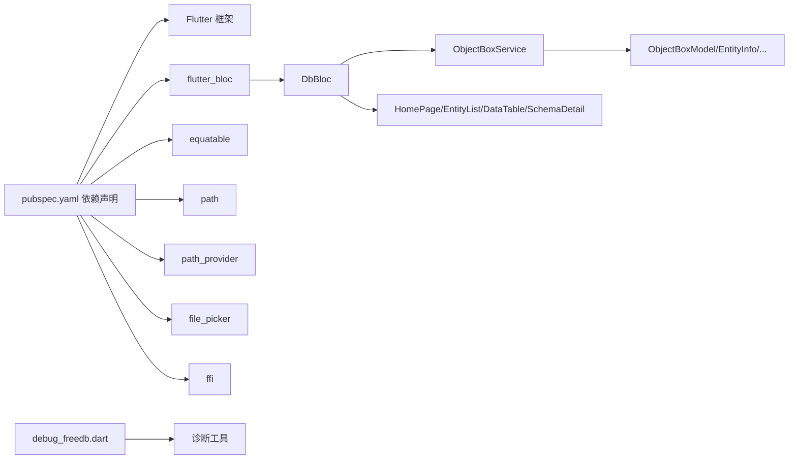

# 服务层架构

<cite>
**本文档引用的文件**
- [lib/main.dart](file://lib/main.dart)
- [lib/bloc/db_bloc.dart](file://lib/bloc/db_bloc.dart)
- [lib/services/objectbox_service.dart](file://lib/services/objectbox_service.dart)
- [lib/models/objectbox_model.dart](file://lib/models/objectbox_model.dart)
- [lib/widgets/home_page.dart](file://lib/widgets/home_page.dart)
- [lib/widgets/entity_list_panel.dart](file://lib/widgets/entity_list_panel.dart)
- [lib/widgets/data_table_panel.dart](file://lib/widgets/data_table_panel.dart)
- [lib/widgets/schema_detail_panel.dart](file://lib/widgets/schema_detail_panel.dart)
- [pubspec.yaml](file://pubspec.yaml)
- [tool/test_service.dart](file://tool/test_service.dart)
- [tool/test_service2.dart](file://tool/test_service2.dart)
- [tool/debug_parse.dart](file://tool/debug_parse.dart)
- [tool/debug_freedb.dart](file://tool/debug_freedb.dart)
</cite>

## 更新摘要
**变更内容**
- 新增 freed page 检测和收集功能，增强数据库解析能力
- 改进实体数据读取逻辑以正确处理 LMDB 复制写入语义
- 优化页面扫描算法，提高数据读取的准确性和性能

## 目录
1. [引言](#引言)
2. [项目结构](#项目结构)
3. [核心组件](#核心组件)
4. [架构总览](#架构总览)
5. [详细组件分析](#详细组件分析)
6. [依赖关系分析](#依赖关系分析)
7. [性能考虑](#性能考虑)
8. [故障排查指南](#故障排查指南)
9. [结论](#结论)
10. [附录](#附录)

## 引言
本文件面向 ObjectBox Viewer 的服务层（Service Layer）进行系统化架构文档梳理，重点围绕 ObjectBoxService 的设计与实现，阐明其职责边界、数据解析流程、实体发现机制，以及与 UI 层（Widgets）和状态管理层（BLoC）的交互模式。同时覆盖异步处理与错误传播策略、依赖注入与生命周期管理、扩展与定制建议等主题，帮助开发者在不依赖 objectbox-model.json 的前提下直接从 LMDB 数据文件中解析并展示 ObjectBox 数据。

**更新** 本次更新反映了服务层架构的增强，包括 freed page 检测、LMDB 复制写入语义处理等新功能。

## 项目结构
ObjectBox Viewer 采用典型的 Flutter 应用分层组织方式：
- 入口与应用壳层：lib/main.dart 负责应用初始化、主题配置与根路由；顶层容器通过 BlocProvider 提供 DbBloc。
- 状态管理层：lib/bloc/db_bloc.dart 定义事件、状态与业务逻辑编排，协调服务层调用与 UI 更新。
- 服务层：lib/services/objectbox_service.dart 封装 LMDB 文件解析、实体发现与数据读取，包含 freed page 检测功能。
- 模型层：lib/models/objectbox_model.dart 定义对象模型（ObjectBoxModel、EntityInfo、PropertyInfo、EntityRow 等）。
- 视图层：lib/widgets/* 提供实体列表、数据表格、模式详情等 UI 组件。
- 工具与测试：tool/* 包含调试与测试脚本，辅助验证服务层行为，包括 freed page 分析工具。

**图表来源**
- [lib/main.dart:1-147](file://lib/main.dart#L1-L147)
- [lib/bloc/db_bloc.dart:1-136](file://lib/bloc/db_bloc.dart#L1-L136)
- [lib/services/objectbox_service.dart:1-1114](file://lib/services/objectbox_service.dart#L1-L1114)
- [lib/models/objectbox_model.dart:1-248](file://lib/models/objectbox_model.dart#L1-L248)
- [lib/widgets/home_page.dart:1-218](file://lib/widgets/home_page.dart#L1-L218)
- [tool/debug_freedb.dart:1-111](file://tool/debug_freedb.dart#L1-L111)

**章节来源**
- [lib/main.dart:1-147](file://lib/main.dart#L1-L147)
- [pubspec.yaml:1-96](file://pubspec.yaml#L1-L96)

## 核心组件
- ObjectBoxService：服务层核心，负责打开数据库、获取文件信息、解析 FlatBuffers 并发现实体与属性、读取实体数据，**新增 freed page 检测功能**。
- DbBloc：状态编排器，接收用户事件（打开数据库、选择实体、刷新数据、关闭数据库），调用服务层执行异步任务，并向 UI 发出状态变更。
- ObjectBoxModel/EntityInfo/PropertyInfo/EntityRow：模型定义，承载解析后的数据库结构与数据行。
- 视图组件：HomePage、EntityListPanel、DataTablePanel、SchemaDetailPanel 响应状态变化并触发事件。
- **新增** freed page 分析工具：debug_freedb.dart 用于诊断和验证 freed page 检测功能。

**章节来源**
- [lib/services/objectbox_service.dart:1-1114](file://lib/services/objectbox_service.dart#L1-L1114)
- [lib/bloc/db_bloc.dart:1-136](file://lib/bloc/db_bloc.dart#L1-L136)
- [lib/models/objectbox_model.dart:1-248](file://lib/models/objectbox_model.dart#L1-L248)
- [tool/debug_freedb.dart:1-111](file://tool/debug_freedb.dart#L1-L111)

## 架构总览
服务层以"无 JSON 依赖"的方式直接解析 LMDB 文件（data.mdb）。其核心流程包括：
- 打开数据库：校验目录与 data.mdb 存在性，读取二进制数据，构建解析器并尝试从 schema 中发现实体；若失败则回退到基于字符串与 FlatBuffers VTable 的启发式扫描。
- 获取文件信息：遍历数据库目录，统计文件名与大小，用于界面展示。
- **新增** freed page 检测：扫描 LMDB 元数据中的 freeDB，识别并收集已释放的页面，避免读取无效数据。
- 读取实体数据：按页扫描 LMDB 页面，解析 FlatBuffers 表，提取字段值，**处理 LMDB 复制写入语义**，去重保留最新版本记录，最终输出有序数据行。

**更新** 架构现在包含了 freed page 检测和 LMDB 复制写入语义处理两个重要增强功能。

**图表来源**
- [lib/bloc/db_bloc.dart:101-124](file://lib/bloc/db_bloc.dart#L101-L124)
- [lib/services/objectbox_service.dart:10-41](file://lib/services/objectbox_service.dart#L10-L41)
- [lib/services/objectbox_service.dart:78-140](file://lib/services/objectbox_service.dart#L78-L140)
- [lib/services/objectbox_service.dart:369-399](file://lib/services/objectbox_service.dart#L369-L399)
- [lib/services/objectbox_service.dart:448-472](file://lib/services/objectbox_service.dart#L448-L472)

## 详细组件分析

### ObjectBoxService 设计与职责
- 职责分离
  - 数据库连接管理：通过文件系统读取 data.mdb，确保路径存在且可访问。
  - 数据解析：委托内部解析器 _ObxParser 完成 FlatBuffers 解析、页面扫描与实体发现。
  - 实体发现：优先从 schema 中解析实体与属性；当 schema 不可用时，回退到字符串搜索与 VTable 扫描。
  - **新增** freed page 检测：扫描 LMDB 元数据中的 freeDB，识别已释放页面，避免读取无效数据。
  - 数据读取：按实体维度扫描页面，解析 FlatBuffers 字段，**处理 LMDB 复制写入语义**，去重并排序返回结果。
- 关键方法
  - openDatabase：校验路径与文件，读取字节并交由解析器发现模型。
  - getDbFileInfo：遍历目录文件，返回文件名到大小的映射。
  - **更新** readEntityData：读取实体数据，按页扫描并解析 FlatBuffers，**过滤 freed pages**，保留最新版本记录。
- 错误处理
  - 对于缺失目录或文件的情况抛出异常；上层 BLoC 捕获后转换为错误状态并反馈 UI。

**更新** ObjectBoxService 现在包含了 freed page 检测功能，显著提升了数据读取的准确性和可靠性。

**图表来源**
- [lib/services/objectbox_service.dart:9-41](file://lib/services/objectbox_service.dart#L9-L41)
- [lib/services/objectbox_service.dart:47-140](file://lib/services/objectbox_service.dart#L47-L140)
- [lib/services/objectbox_service.dart:369-399](file://lib/services/objectbox_service.dart#L369-L399)
- [lib/services/objectbox_service.dart:448-558](file://lib/services/objectbox_service.dart#L448-L558)

**章节来源**
- [lib/services/objectbox_service.dart:1-1114](file://lib/services/objectbox_service.dart#L1-L1114)

### DbBloc 与 UI 的交互模式
- 事件驱动：DbBloc 接收 OpenDatabase、SelectEntity、RefreshData、CloseDatabase 等事件。
- 状态管理：DbBloc 在加载、成功、错误三种状态间切换，并通过 copyWith 生成新状态。
- 异步处理：所有服务调用均在 async 方法中执行，UI 通过 BlocBuilder 响应状态变化。
- 错误传播：捕获异常后发出错误状态，UI 展示错误视图并允许用户返回初始状态。

**图表来源**
- [lib/bloc/db_bloc.dart:39-88](file://lib/bloc/db_bloc.dart#L39-L88)
- [lib/bloc/db_bloc.dart:101-134](file://lib/bloc/db_bloc.dart#L101-L134)

**章节来源**
- [lib/bloc/db_bloc.dart:1-136](file://lib/bloc/db_bloc.dart#L1-L136)
- [lib/widgets/home_page.dart:14-72](file://lib/widgets/home_page.dart#L14-L72)

### 数据模型与实体发现
- 模型结构：ObjectBoxModel、EntityInfo、PropertyInfo、EntityRow 分别对应数据库、实体、属性与数据行。
- 实体发现：支持两种模式
  - 已知 schema：从 schema 条目中解析实体与属性。
  - 自动发现：通过字符串匹配与 FlatBuffers VTable 扫描推断实体名称与属性数量，后续在读取数据时根据字段类型动态推断属性类型。
- 类型推断：读取数据时根据字段值的实际类型推断 PropertyType（如 bool/int/double/String），并在模型中更新属性类型。

**图表来源**
- [lib/services/objectbox_service.dart:78-111](file://lib/services/objectbox_service.dart#L78-L111)
- [lib/services/objectbox_service.dart:158-185](file://lib/services/objectbox_service.dart#L158-L185)
- [lib/services/objectbox_service.dart:187-217](file://lib/services/objectbox_service.dart#L187-L217)
- [lib/models/objectbox_model.dart:108-142](file://lib/models/objectbox_model.dart#L108-L142)

**章节来源**
- [lib/models/objectbox_model.dart:1-248](file://lib/models/objectbox_model.dart#L1-L248)
- [lib/services/objectbox_service.dart:78-217](file://lib/services/objectbox_service.dart#L78-L217)

### UI 层与服务层的集成点
- 打开数据库：UI 通过 FilePicker 选择目录，随后派发 OpenDatabase 事件；DbBloc 调用服务层并更新状态。
- 选择实体：UI 从实体列表点击实体，派发 SelectEntity 事件；DbBloc 调用服务层读取数据并更新状态。
- 刷新数据：UI 点击刷新按钮，派发 RefreshData 事件；DbBloc 再次派发 SelectEntity 以重新读取。
- 错误处理：DbBloc 将异常转换为错误状态，UI 展示错误视图并提供返回选项。

**图表来源**
- [lib/widgets/home_page.dart:74-88](file://lib/widgets/home_page.dart#L74-L88)
- [lib/widgets/home_page.dart:174-187](file://lib/widgets/home_page.dart#L174-L187)
- [lib/bloc/db_bloc.dart:101-124](file://lib/bloc/db_bloc.dart#L101-L124)

**章节来源**
- [lib/widgets/home_page.dart:1-218](file://lib/widgets/home_page.dart#L1-L218)
- [lib/bloc/db_bloc.dart:101-124](file://lib/bloc/db_bloc.dart#L101-L124)

### 异步操作与错误传播策略
- 异步处理：DbBloc 中所有事件处理器均为 async，确保 UI 不阻塞。
- 错误传播：服务层抛出异常，DbBloc 捕获后发出错误状态；UI 通过 BlocBuilder 渲染错误视图。
- 用户体验：错误视图提供返回按钮，便于用户重新选择数据库或修复问题后重试。

**章节来源**
- [lib/bloc/db_bloc.dart:101-124](file://lib/bloc/db_bloc.dart#L101-L124)
- [lib/widgets/home_page.dart:190-217](file://lib/widgets/home_page.dart#L190-L217)

### 依赖注入与生命周期管理
- 依赖注入：DbBloc 在构造函数中直接实例化 ObjectBoxService，形成紧耦合依赖。该方式简单直接，适合小型应用或演示场景。
- 生命周期：DbBloc 作为 BlocProvider 的子树状态容器，随页面挂载与卸载自动管理；ObjectBoxService 为无状态类，无需额外生命周期管理。
- 改进建议：可在应用启动阶段集中注入服务实例，或通过工厂/接口抽象解耦，以便单元测试与替换实现。

**章节来源**
- [lib/bloc/db_bloc.dart:92-99](file://lib/bloc/db_bloc.dart#L92-L99)
- [lib/main.dart:24](file://lib/main.dart#L24)

### 扩展与自定义指导
- 新增解析能力：可在 _ObxParser 中扩展新的 FlatBuffers 字段解析逻辑，或增加对新版本 schema 的兼容。
- 多数据库支持：可扩展 getDbFileInfo 以支持多子数据库（SubDB）枚举与统计。
- 性能优化：对大数据库可引入分页读取、缓存最近查询结果、延迟解析非活跃实体等策略。
- 可测试性：工具脚本（如 tool/test_service.dart、tool/test_service2.dart、tool/debug_parse.dart）展示了如何独立调用服务层方法进行验证，建议在新增功能时补充类似测试用例。
- **新增** freed page 诊断：使用 tool/debug_freedb.dart 进行 freed page 分析和验证。

**更新** 新增了 freed page 诊断工具的使用指导。

**章节来源**
- [tool/test_service.dart:1-108](file://tool/test_service.dart#L1-L108)
- [tool/test_service2.dart:1-53](file://tool/test_service2.dart#L1-L53)
- [tool/debug_parse.dart:1-38](file://tool/debug_parse.dart#L1-L38)
- [tool/debug_freedb.dart:1-111](file://tool/debug_freedb.dart#L1-L111)

## 依赖关系分析
- 外部依赖：Flutter 生态（flutter_bloc、equatable、path、path_provider、file_picker、ffi 等）。
- 内部依赖：DbBloc 依赖 ObjectBoxService；ObjectBoxService 依赖模型层；UI 依赖状态层与模型层。
- **新增** 工具依赖：debug_freedb.dart 作为独立的诊断工具，不依赖主应用框架。

**图表来源**
- [pubspec.yaml:30-43](file://pubspec.yaml#L30-L43)
- [lib/bloc/db_bloc.dart:1-6](file://lib/bloc/db_bloc.dart#L1-L6)
- [lib/services/objectbox_service.dart:1-6](file://lib/services/objectbox_service.dart#L1-L6)

**章节来源**
- [pubspec.yaml:1-96](file://pubspec.yaml#L1-L96)
- [lib/bloc/db_bloc.dart:1-6](file://lib/bloc/db_bloc.dart#L1-L6)
- [lib/services/objectbox_service.dart:1-6](file://lib/services/objectbox_service.dart#L1-L6)

## 性能考虑
- I/O 优化：尽量避免重复读取 data.mdb，可在 DbBloc 中缓存已解析的模型与文件信息。
- 解析优化：FlatBuffers 解析与页面扫描为 CPU 密集型操作，建议在后台线程或使用异步流分批处理。
- UI 响应：大数据量表格渲染时启用虚拟滚动与列宽自适应，减少不必要的重建。
- 缓存策略：对最近选择的实体数据进行缓存，刷新时仅增量更新。
- **新增** freed page 过滤：通过 _freedPages 集合快速过滤已释放页面，避免无效 I/O 操作。

**更新** 新增了 freed page 过滤对性能的积极影响。

## 故障排查指南
- 常见错误
  - 目录不存在或 data.mdb 缺失：服务层会抛出异常，DbBloc 捕获后进入错误状态。
  - FlatBuffers 结构异常：解析器会跳过无效条目并回退到启发式扫描；若仍无法解析，UI 将显示错误视图。
  - **新增** freed page 诊断：使用 tool/debug_freedb.dart 分析 freeDB 结构，验证 freed page 检测准确性。
- 排查步骤
  - 使用工具脚本（如 tool/debug_parse.dart）单独验证服务层方法的行为与返回值。
  - 检查数据库目录是否包含 data.mdb 与 lock.mdb，确认文件权限与完整性。
  - **新增** 使用 tool/debug_freedb.dart 分析 LMDB 元数据中的 freeDB，验证 freed page 检测逻辑。
  - 在 UI 中查看错误视图提供的错误消息，必要时重新选择数据库目录。

**更新** 新增了 freed page 诊断工具的使用指导。

**章节来源**
- [lib/services/objectbox_service.dart:10-19](file://lib/services/objectbox_service.dart#L10-L19)
- [lib/bloc/db_bloc.dart:107-109](file://lib/bloc/db_bloc.dart#L107-L109)
- [tool/debug_parse.dart:1-38](file://tool/debug_parse.dart#L1-L38)
- [tool/debug_freedb.dart:1-111](file://tool/debug_freedb.dart#L1-L111)

## 结论
ObjectBoxService 通过直接解析 LMDB 文件实现了对 ObjectBox 数据的无 JSON 依赖访问，DbBloc 则提供了清晰的状态编排与 UI 集成。整体架构遵循职责分离原则，具备良好的可扩展性与可测试性。

**更新** 本次更新显著增强了服务层的功能，包括 freed page 检测和 LMDB 复制写入语义处理，大幅提升了数据读取的准确性和可靠性。未来可在依赖注入、性能优化与缓存策略方面进一步增强，以支撑更大规模的数据浏览场景。

## 附录
- 测试与调试：工具脚本展示了如何独立调用服务层方法进行验证，建议在新增功能时补充类似测试用例。
- 模型参考：ObjectBoxModel/EntityInfo/PropertyInfo/EntityRow 的字段与语义定义可作为扩展实现的依据。
- **新增** freed page 诊断：debug_freedb.dart 提供了完整的 freed page 分析功能，可用于验证和调试 freed page 检测逻辑。

**更新** 新增了 freed page 诊断工具的使用说明。