# CRUD 服务层

<cite>
**本文档引用的文件**
- [lib/services/objectbox_crud_service.dart](file://lib/services/objectbox_crud_service.dart)
- [lib/services/obx_c_api.dart](file://lib/services/obx_c_api.dart)
- [lib/services/flat_buffer_builder.dart](file://lib/services/flat_buffer_builder.dart)
- [lib/services/objectbox_service.dart](file://lib/services/objectbox_service.dart)
- [lib/services/backup_service.dart](file://lib/services/backup_service.dart)
- [lib/services/simple_viewer.dart](file://lib/services/simple_viewer.dart)
- [lib/models/objectbox_model.dart](file://lib/models/objectbox_model.dart)
</cite>

## 目录
1. [简介](#简介)
2. [项目结构](#项目结构)
3. [核心组件](#核心组件)
4. [架构概览](#架构概览)
5. [详细组件分析](#详细组件分析)
6. [依赖关系分析](#依赖关系分析)
7. [性能考虑](#性能考虑)
8. [故障排除指南](#故障排除指南)
9. [结论](#结论)

## 简介

ObjectBox Viewer 是一个用于查看和编辑 ObjectBox 数据库的桌面应用程序。本项目的核心是 CRUD（创建、读取、更新、删除）服务层，它提供了对 ObjectBox 数据库进行完整数据操作的能力。

CRUD 服务层通过直接访问 ObjectBox 的 C API 和 FlatBuffer 格式，实现了对数据库的底层操作。该服务层支持多种数据库打开模式，包括从内部模型读取、从 JSON 模型文件读取以及从数据库文件中发现模型等策略。

## 项目结构

项目采用模块化设计，主要包含以下关键目录和文件：

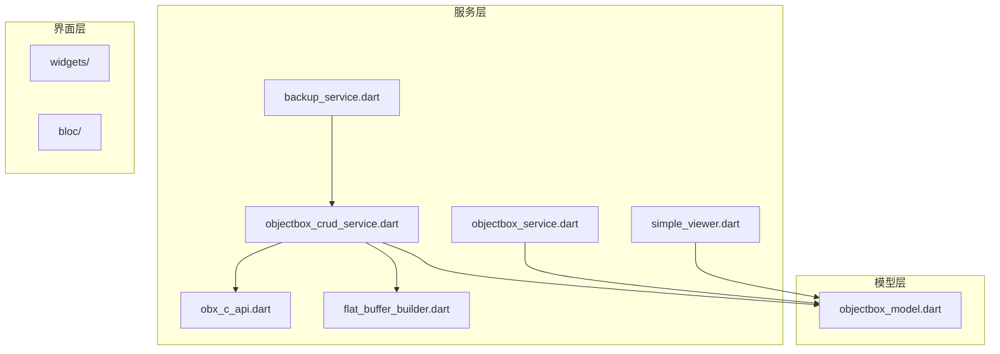

**图表来源**
- [lib/services/objectbox_crud_service.dart:1-463](file://lib/services/objectbox_crud_service.dart#L1-L463)
- [lib/services/obx_c_api.dart:1-353](file://lib/services/obx_c_api.dart#L1-L353)
- [lib/services/flat_buffer_builder.dart:1-149](file://lib/services/flat_buffer_builder.dart#L1-L149)
- [lib/services/objectbox_service.dart:1-800](file://lib/services/objectbox_service.dart#L1-L800)
- [lib/services/backup_service.dart:1-56](file://lib/services/backup_service.dart#L1-L56)
- [lib/services/simple_viewer.dart:1-190](file://lib/services/simple_viewer.dart#L1-L190)
- [lib/models/objectbox_model.dart:1-352](file://lib/models/objectbox_model.dart#L1-L352)

**章节来源**
- [lib/services/objectbox_crud_service.dart:1-463](file://lib/services/objectbox_crud_service.dart#L1-L463)
- [lib/services/obx_c_api.dart:1-353](file://lib/services/obx_c_api.dart#L1-L353)
- [lib/services/flat_buffer_builder.dart:1-149](file://lib/services/flat_buffer_builder.dart#L1-L149)
- [lib/services/objectbox_service.dart:1-800](file://lib/services/objectbox_service.dart#L1-L800)
- [lib/services/backup_service.dart:1-56](file://lib/services/backup_service.dart#L1-L56)
- [lib/services/simple_viewer.dart:1-190](file://lib/services/simple_viewer.dart#L1-L190)
- [lib/models/objectbox_model.dart:1-352](file://lib/models/objectbox_model.dart#L1-L352)

## 核心组件

CRUD 服务层由多个相互协作的组件组成，每个组件都有特定的职责：

### 主要组件概述

1. **ObjectBoxCrudService**: 核心 CRUD 操作服务
2. **ObxCApi**: C API 包装器
3. **ObjectBoxFbBuilder**: FlatBuffer 构建器
4. **ObjectBoxService**: 数据库读取服务
5. **BackupService**: 备份服务
6. **SimpleObjectBoxViewer**: 简化查看器

### 组件关系图

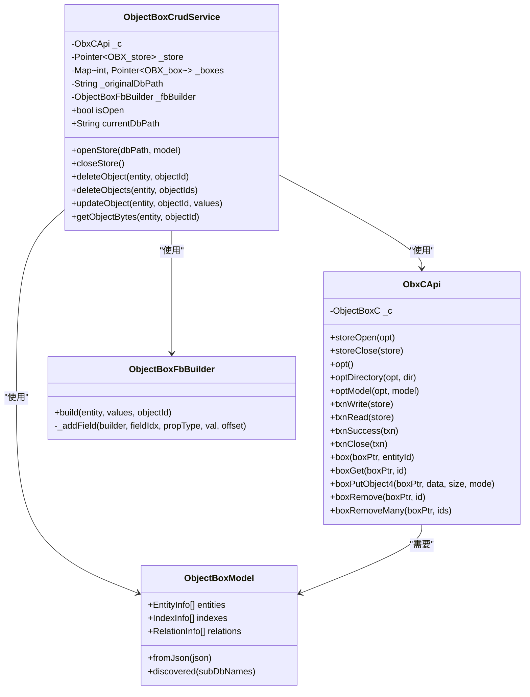

**图表来源**
- [lib/services/objectbox_crud_service.dart:22-340](file://lib/services/objectbox_crud_service.dart#L22-L340)
- [lib/services/obx_c_api.dart:14-336](file://lib/services/obx_c_api.dart#L14-L336)
- [lib/services/flat_buffer_builder.dart:12-83](file://lib/services/flat_buffer_builder.dart#L12-L83)
- [lib/models/objectbox_model.dart:30-106](file://lib/models/objectbox_model.dart#L30-L106)

**章节来源**
- [lib/services/objectbox_crud_service.dart:22-340](file://lib/services/objectbox_crud_service.dart#L22-L340)
- [lib/services/obx_c_api.dart:14-336](file://lib/services/obx_c_api.dart#L14-L336)
- [lib/services/flat_buffer_builder.dart:12-83](file://lib/services/flat_buffer_builder.dart#L12-L83)
- [lib/models/objectbox_model.dart:30-106](file://lib/models/objectbox_model.dart#L30-L106)

## 架构概览

CRUD 服务层采用分层架构设计，确保了清晰的关注点分离和可维护性。

### 整体架构流程

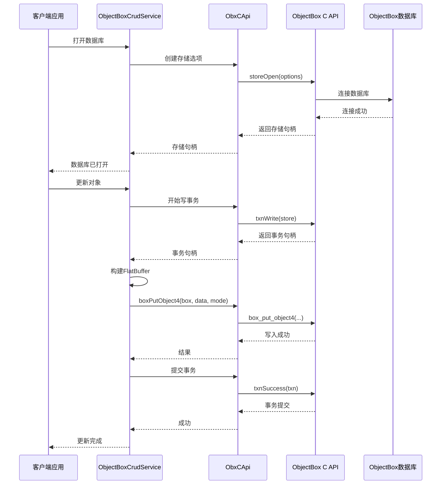

**图表来源**
- [lib/services/objectbox_crud_service.dart:42-98](file://lib/services/objectbox_crud_service.dart#L42-L98)
- [lib/services/objectbox_crud_service.dart:241-297](file://lib/services/objectbox_crud_service.dart#L241-L297)
- [lib/services/obx_c_api.dart:32-43](file://lib/services/obx_c_api.dart#L32-L43)
- [lib/services/obx_c_api.dart:171-193](file://lib/services/obx_c_api.dart#L171-L193)

### 数据流架构

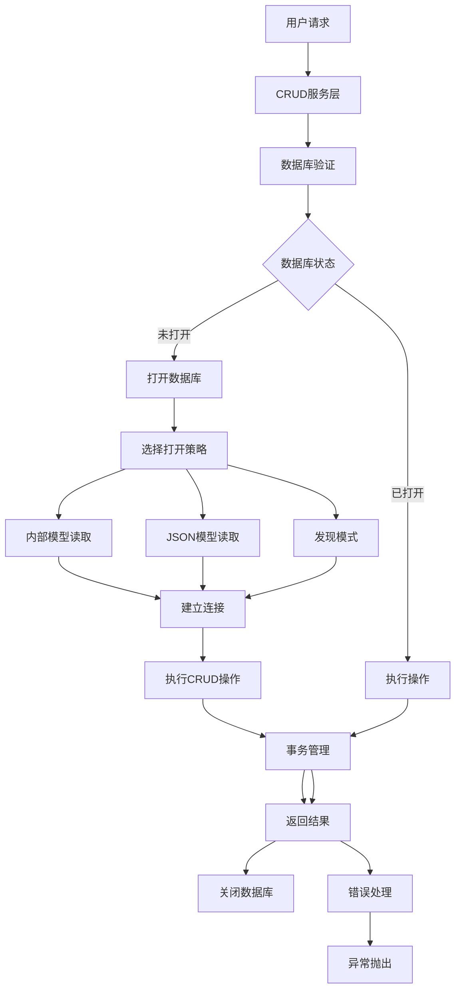

**图表来源**
- [lib/services/objectbox_crud_service.dart:42-98](file://lib/services/objectbox_crud_service.dart#L42-L98)
- [lib/services/objectbox_crud_service.dart:198-233](file://lib/services/objectbox_crud_service.dart#L198-L233)
- [lib/services/obx_c_api.dart:285-335](file://lib/services/obx_c_api.dart#L285-L335)

**章节来源**
- [lib/services/objectbox_crud_service.dart:42-98](file://lib/services/objectbox_crud_service.dart#L42-L98)
- [lib/services/objectbox_crud_service.dart:198-233](file://lib/services/objectbox_crud_service.dart#L198-L233)
- [lib/services/obx_c_api.dart:285-335](file://lib/services/obx_c_api.dart#L285-L335)

## 详细组件分析

### ObjectBoxCrudService 分析

ObjectBoxCrudService 是整个 CRUD 服务层的核心，负责所有数据库操作。

#### 关键功能特性

1. **多策略数据库打开**
   - 内部模型读取模式
   - JSON 模型文件读取模式
   - 发现模式（无模型文件）

2. **完整的 CRUD 操作**
   - 单个对象删除
   - 批量对象删除
   - 对象更新（支持部分字段更新）
   - 原始字节获取

#### 打开数据库策略流程

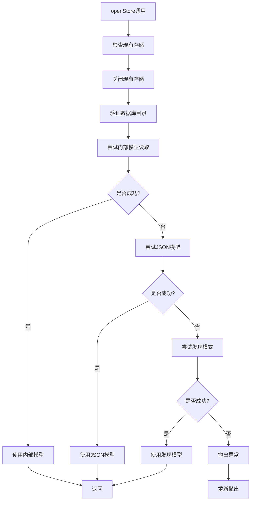

**图表来源**
- [lib/services/objectbox_crud_service.dart:42-98](file://lib/services/objectbox_crud_service.dart#L42-L98)
- [lib/services/objectbox_crud_service.dart:101-177](file://lib/services/objectbox_crud_service.dart#L101-L177)

#### 对象更新流程

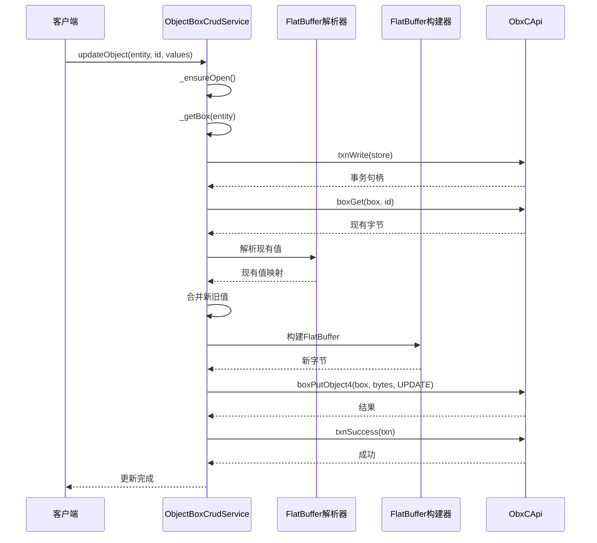

**图表来源**
- [lib/services/objectbox_crud_service.dart:241-297](file://lib/services/objectbox_crud_service.dart#L241-L297)
- [lib/services/flat_buffer_builder.dart:18-83](file://lib/services/flat_buffer_builder.dart#L18-L83)

**章节来源**
- [lib/services/objectbox_crud_service.dart:42-98](file://lib/services/objectbox_crud_service.dart#L42-L98)
- [lib/services/objectbox_crud_service.dart:101-177](file://lib/services/objectbox_crud_service.dart#L101-L177)
- [lib/services/objectbox_crud_service.dart:241-297](file://lib/services/objectbox_crud_service.dart#L241-L297)

### ObxCApi 分析

ObxCApi 提供了对 ObjectBox C API 的封装，确保了类型安全和错误处理。

#### 关键接口设计

1. **存储生命周期管理**
   - storeOpen: 打开数据库存储
   - storeClose: 关闭数据库存储

2. **事务管理**
   - txnWrite: 创建写事务
   - txnRead: 创建读事务
   - txnSuccess: 提交事务
   - txnClose: 关闭事务

3. **模型构建**
   - modelEntity: 添加实体到模型
   - modelProperty: 添加属性到模型
   - modelLastEntityId: 设置最后实体ID

#### 错误处理机制

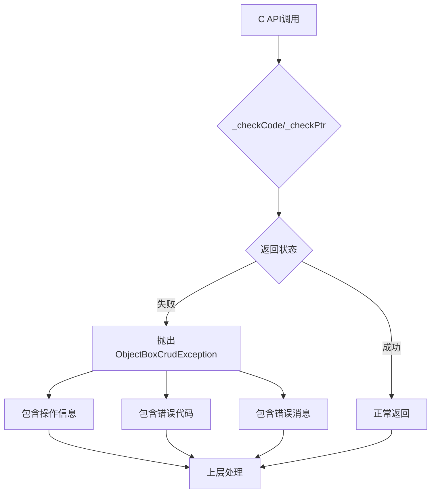

**图表来源**
- [lib/services/obx_c_api.dart:285-335](file://lib/services/obx_c_api.dart#L285-L335)
- [lib/services/obx_c_api.dart:338-352](file://lib/services/obx_c_api.dart#L338-L352)

**章节来源**
- [lib/services/obx_c_api.dart:14-336](file://lib/services/obx_c_api.dart#L14-L336)
- [lib/services/obx_c_api.dart:338-352](file://lib/services/obx_c_api.dart#L338-L352)

### FlatBuffer 构建器分析

ObjectBoxFbBuilder 负责将 Dart 对象转换为 ObjectBox 兼容的 FlatBuffer 格式。

#### FlatBuffer 结构设计

ObjectBox 使用特殊的 FlatBuffer 布局：

```
字段布局:
- 字段[0]: int64 对象ID (propertyId = 1)
- 字段[N]: 属性值 (字段索引 = propertyId - 1)
- vtable大小: 从最大propertyId计算
```

#### 构建流程

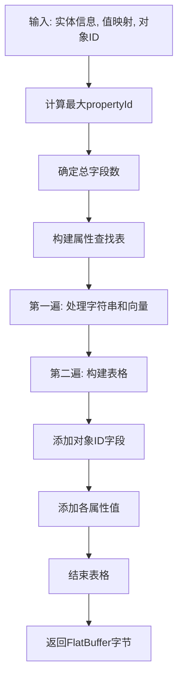

**图表来源**
- [lib/services/flat_buffer_builder.dart:18-83](file://lib/services/flat_buffer_builder.dart#L18-L83)

**章节来源**
- [lib/services/flat_buffer_builder.dart:12-83](file://lib/services/flat_buffer_builder.dart#L12-L83)

### 备份服务分析

BackupService 提供了数据库写操作前的自动备份功能。

#### 备份策略

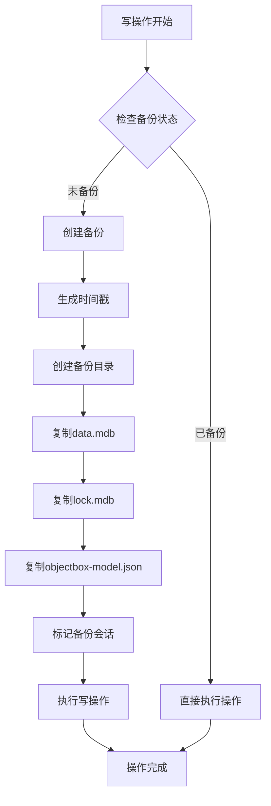

**图表来源**
- [lib/services/backup_service.dart:12-39](file://lib/services/backup_service.dart#L12-L39)

**章节来源**
- [lib/services/backup_service.dart:1-56](file://lib/services/backup_service.dart#L1-L56)

## 依赖关系分析

CRUD 服务层的依赖关系体现了清晰的分层架构和关注点分离。

### 组件依赖图

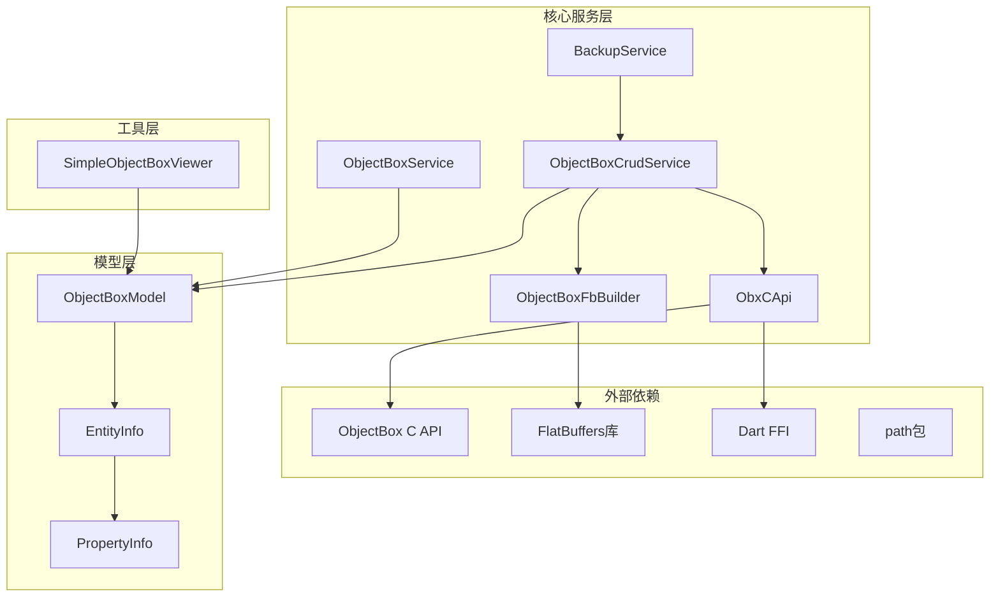

**图表来源**
- [lib/services/objectbox_crud_service.dart:1-10](file://lib/services/objectbox_crud_service.dart#L1-L10)
- [lib/services/obx_c_api.dart:1-8](file://lib/services/obx_c_api.dart#L1-L8)
- [lib/services/flat_buffer_builder.dart:1-4](file://lib/services/flat_buffer_builder.dart#L1-L4)
- [lib/models/objectbox_model.dart:1-352](file://lib/models/objectbox_model.dart#L1-L352)

### 数据模型关系

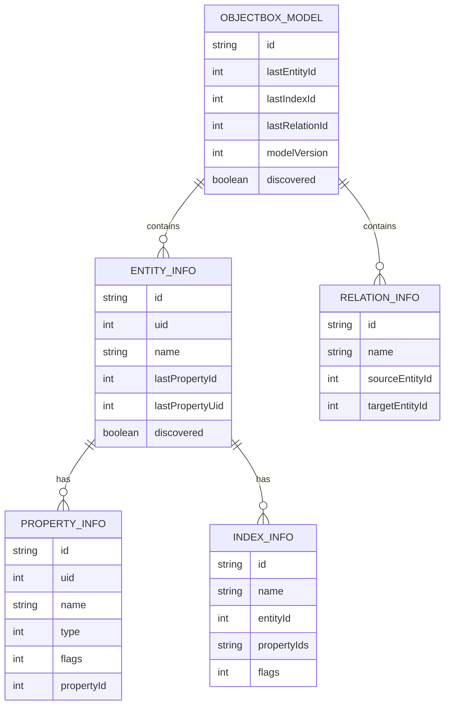

**图表来源**
- [lib/models/objectbox_model.dart:30-343](file://lib/models/objectbox_model.dart#L30-L343)

**章节来源**
- [lib/services/objectbox_crud_service.dart:1-10](file://lib/services/objectbox_crud_service.dart#L1-L10)
- [lib/services/obx_c_api.dart:1-8](file://lib/services/obx_c_api.dart#L1-L8)
- [lib/services/flat_buffer_builder.dart:1-4](file://lib/services/flat_buffer_builder.dart#L1-L4)
- [lib/models/objectbox_model.dart:30-343](file://lib/models/objectbox_model.dart#L30-L343)

## 性能考虑

CRUD 服务层在设计时充分考虑了性能优化和资源管理。

### 性能优化策略

1. **内存管理**
   - 使用 TypedData 进行高效的字节操作
   - 及时释放 FFI 分配的内存
   - 缓存 Box 句柄避免重复创建

2. **事务优化**
   - 批量操作使用单个事务
   - 读写操作分离减少锁竞争
   - 及时提交和关闭事务

3. **数据访问优化**
   - 预过滤减少不必要的解析
   - 使用属性ID映射提高字段查找效率
   - 避免重复的数据库查询

### 内存使用分析

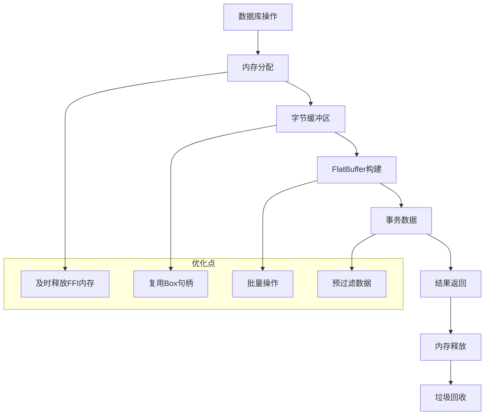

[本节提供一般性指导，无需特定文件分析]

## 故障排除指南

CRUD 服务层提供了完善的错误处理和诊断机制。

### 常见问题及解决方案

#### 数据库打开失败

**症状**: `open store failed` 异常

**可能原因**:
1. 数据库目录不存在
2. 权限不足
3. 数据库损坏
4. 模型不匹配

**解决步骤**:
1. 验证数据库路径存在且可访问
2. 检查文件权限设置
3. 尝试使用发现模式打开
4. 检查数据库完整性

#### 事务相关错误

**症状**: 事务提交失败或超时

**可能原因**:
1. 长时间持有锁
2. 内存不足
3. 并发冲突

**解决步骤**:
1. 确保及时提交事务
2. 减少单次操作的数据量
3. 重试机制处理并发冲突

#### FlatBuffer 构建错误

**症状**: 对象更新失败

**可能原因**:
1. 属性类型不匹配
2. ID 字段冲突
3. 数据格式错误

**解决步骤**:
1. 验证属性类型定义
2. 检查 ID 字段的唯一性
3. 使用调试工具验证数据格式

**章节来源**
- [lib/services/obx_c_api.dart:285-335](file://lib/services/obx_c_api.dart#L285-L335)
- [lib/services/objectbox_crud_service.dart:318-326](file://lib/services/objectbox_crud_service.dart#L318-L326)

## 结论

ObjectBox Viewer 的 CRUD 服务层通过精心设计的架构和实现，提供了强大而灵活的数据库操作能力。该服务层的主要优势包括：

1. **多策略兼容性**: 支持多种数据库打开模式，适应不同的使用场景
2. **类型安全**: 通过严格的类型检查和错误处理确保操作安全性
3. **性能优化**: 采用内存管理和事务优化策略提升操作效率
4. **扩展性**: 清晰的分层架构便于功能扩展和维护

该服务层为上层应用提供了稳定可靠的数据库操作基础，支持从简单的数据查看到复杂的编辑操作，满足了 ObjectBox Viewer 的各种使用需求。