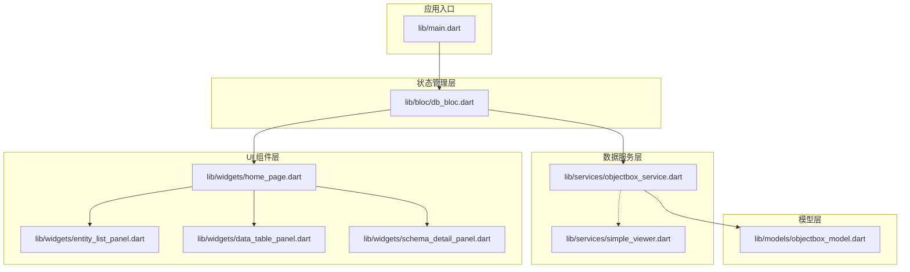
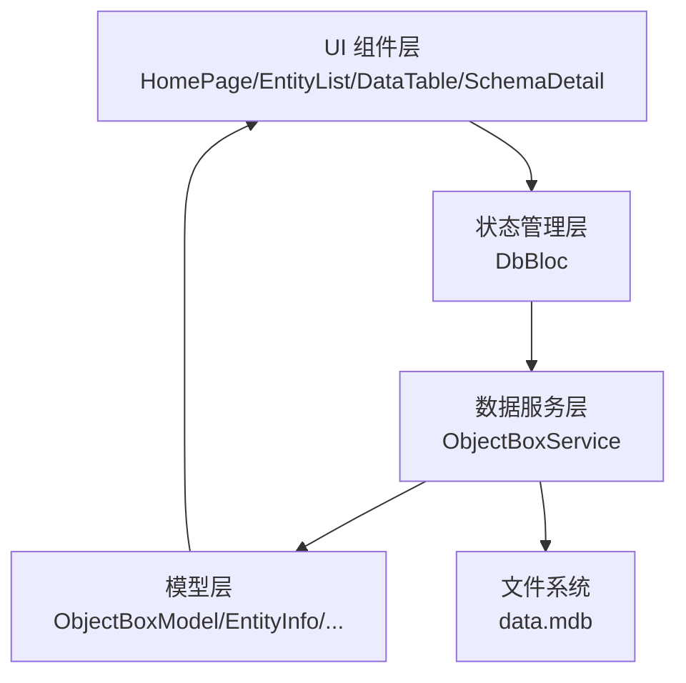
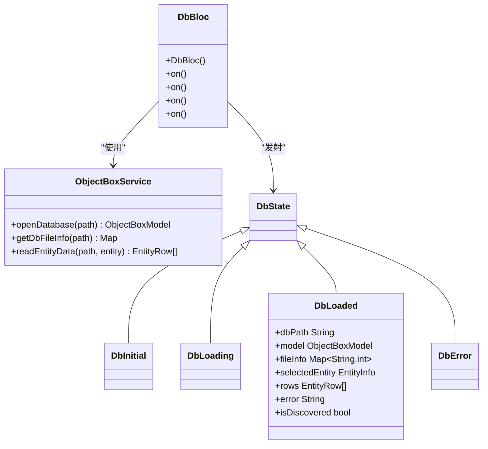
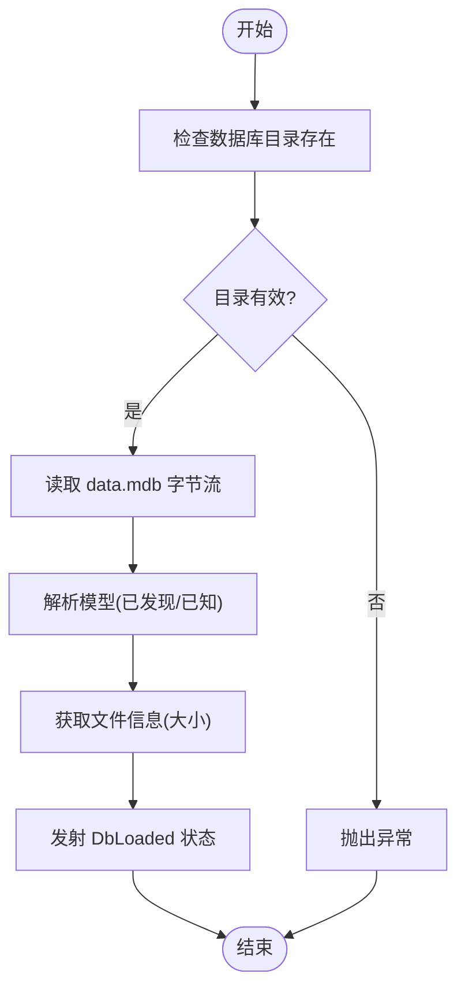
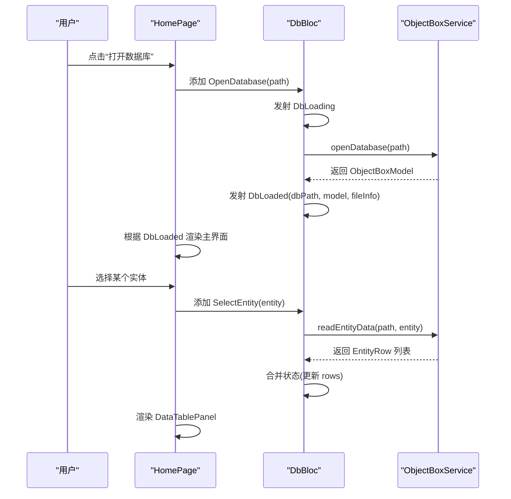
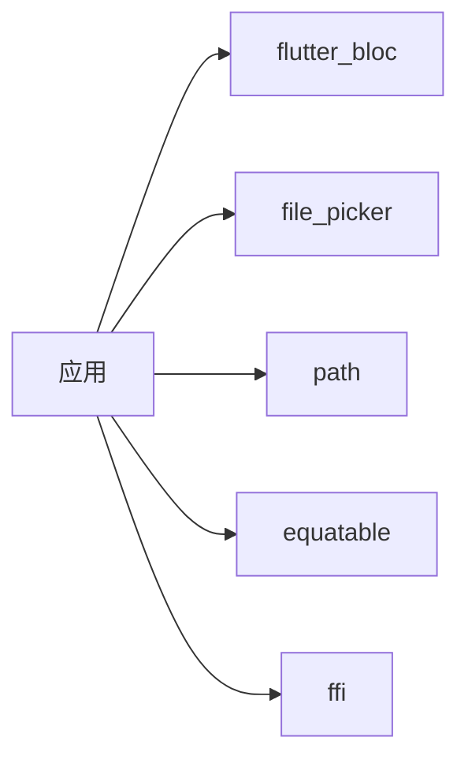
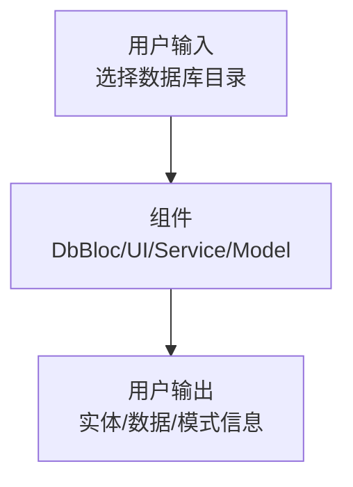

# 架构设计

<cite>
**本文引用的文件**
- [lib/main.dart](file://lib/main.dart)
- [lib/bloc/db_bloc.dart](file://lib/bloc/db_bloc.dart)
- [lib/services/objectbox_service.dart](file://lib/services/objectbox_service.dart)
- [lib/services/simple_viewer.dart](file://lib/services/simple_viewer.dart)
- [lib/models/objectbox_model.dart](file://lib/models/objectbox_model.dart)
- [lib/widgets/home_page.dart](file://lib/widgets/home_page.dart)
- [lib/widgets/entity_list_panel.dart](file://lib/widgets/entity_list_panel.dart)
- [lib/widgets/data_table_panel.dart](file://lib/widgets/data_table_panel.dart)
- [lib/widgets/schema_detail_panel.dart](file://lib/widgets/schema_detail_panel.dart)
- [pubspec.yaml](file://pubspec.yaml)
- [tool/test_service.dart](file://tool/test_service.dart)
- [README.md](file://README.md)
</cite>

## 目录
1. [简介](#简介)
2. [项目结构](#项目结构)
3. [核心组件](#核心组件)
4. [架构总览](#架构总览)
5. [详细组件分析](#详细组件分析)
6. [依赖分析](#依赖分析)
7. [性能考量](#性能考量)
8. [故障排查指南](#故障排查指南)
9. [结论](#结论)
10. [附录](#附录)

## 简介
本项目是一个跨平台的 ObjectBox 数据库查看器，基于 Flutter 框架构建，支持在 Windows、macOS 和 Linux 上浏览 ObjectBox Dart 数据库。应用采用 BLoC（业务逻辑组件）状态管理模式与分层架构设计，UI 层通过 Flutter 组件响应状态变化；数据访问层直接解析 LMDB 文件（无需 objectbox-model.json），并通过自研解析器发现实体与属性信息；DbBloc 负责协调事件与状态转换。

## 项目结构
项目采用按职责分层的目录组织方式：
- lib/main.dart：应用入口与主题配置，提供顶层 App Shell 与数据库打开流程
- lib/bloc：状态管理，DbBloc 定义事件、状态与处理逻辑
- lib/services：数据服务层，ObjectBoxService 提供数据库打开、文件信息查询与实体数据读取；simple_viewer.dart 提供简化版实现思路
- lib/models：数据模型定义，包含对象框模型、实体、属性、索引、关系与行数据
- lib/widgets：UI 组件层，包含首页、实体列表、数据表格、模式详情等面板
- tool：辅助工具脚本，用于测试与调试解析逻辑
- pubspec.yaml：依赖与版本声明

**图表来源**
- [lib/main.dart:1-147](file://lib/main.dart#L1-L147)
- [lib/bloc/db_bloc.dart:1-136](file://lib/bloc/db_bloc.dart#L1-L136)
- [lib/services/objectbox_service.dart:1-1006](file://lib/services/objectbox_service.dart#L1-L1006)
- [lib/services/simple_viewer.dart:1-188](file://lib/services/simple_viewer.dart#L1-L188)
- [lib/models/objectbox_model.dart:1-248](file://lib/models/objectbox_model.dart#L1-L248)
- [lib/widgets/home_page.dart:1-218](file://lib/widgets/home_page.dart#L1-L218)
- [lib/widgets/entity_list_panel.dart:1-131](file://lib/widgets/entity_list_panel.dart#L1-L131)
- [lib/widgets/data_table_panel.dart:1-345](file://lib/widgets/data_table_panel.dart#L1-L345)
- [lib/widgets/schema_detail_panel.dart:1-283](file://lib/widgets/schema_detail_panel.dart#L1-L283)

**章节来源**
- [lib/main.dart:1-147](file://lib/main.dart#L1-L147)
- [pubspec.yaml:1-96](file://pubspec.yaml#L1-L96)

## 核心组件
- 应用入口与壳层
  - ObjectBoxViewerApp：设置主题、暗色模式与根页面
  - _AppShell：提供顶部栏、底部状态栏与打开数据库入口
- 状态管理
  - DbBloc：集中处理数据库打开、实体选择、刷新与关闭事件，维护 DbInitial/DbLoading/DbLoaded/DbError 等状态
- 数据服务
  - ObjectBoxService：直接解析 data.mdb，发现模型与实体数据，支持“已发现”模式（无 objectbox-model.json）
  - simple_viewer.dart：演示性简化实现，展示实体发现与属性计数思路
- 模型
  - ObjectBoxModel、EntityInfo、PropertyInfo、IndexInfo、RelationInfo、EntityRow：定义数据库模式与数据行结构
- UI 组件
  - HomePage：根据状态渲染欢迎页、加载、错误或主界面（左右分栏）
  - EntityListPanel：列出实体并高亮选中项
  - DataTablePanel：以表格形式展示实体数据，支持列类型提示与长值复制
  - SchemaDetailPanel：展示数据库文件信息、模型概览与实体详情

**章节来源**
- [lib/main.dart:13-147](file://lib/main.dart#L13-L147)
- [lib/bloc/db_bloc.dart:7-136](file://lib/bloc/db_bloc.dart#L7-L136)
- [lib/services/objectbox_service.dart:1-1006](file://lib/services/objectbox_service.dart#L1-L1006)
- [lib/models/objectbox_model.dart:1-248](file://lib/models/objectbox_model.dart#L1-L248)
- [lib/widgets/home_page.dart:1-218](file://lib/widgets/home_page.dart#L1-L218)
- [lib/widgets/entity_list_panel.dart:1-131](file://lib/widgets/entity_list_panel.dart#L1-L131)
- [lib/widgets/data_table_panel.dart:1-345](file://lib/widgets/data_table_panel.dart#L1-L345)
- [lib/widgets/schema_detail_panel.dart:1-283](file://lib/widgets/schema_detail_panel.dart#L1-L283)

## 架构总览
系统采用分层架构与 BLoC 状态管理：
- 表现层：Flutter Widgets 响应 DbBloc 状态，动态渲染内容
- 领域层：DbBloc 处理用户交互事件，驱动状态流转
- 数据访问层：ObjectBoxService 解析 LMDB 文件，生成模型与数据行
- 模型层：统一的数据结构定义，支持“已发现”模式

**图表来源**
- [lib/widgets/home_page.dart:14-72](file://lib/widgets/home_page.dart#L14-L72)
- [lib/bloc/db_bloc.dart:91-136](file://lib/bloc/db_bloc.dart#L91-L136)
- [lib/services/objectbox_service.dart:10-41](file://lib/services/objectbox_service.dart#L10-L41)
- [lib/models/objectbox_model.dart:1-248](file://lib/models/objectbox_model.dart#L1-L248)

## 详细组件分析

### DbBloc 状态管理
- 事件
  - OpenDatabase：打开指定路径数据库
  - SelectEntity：选择实体并触发数据读取
  - RefreshData：刷新当前实体数据
  - CloseDatabase：重置到初始状态
- 状态
  - DbInitial/DbLoading/DbLoaded/DbError：覆盖不同 UI 场景
  - DbLoaded 支持 isDiscovered 标识“已发现”模式
- 处理流程
  - 打开数据库：调用服务获取模型与文件信息，进入 DbLoaded
  - 选择实体：更新选中实体与清空数据，异步读取实体数据后合并状态
  - 刷新：重新触发 SelectEntity 事件
  - 关闭：回到 DbInitial

**图表来源**
- [lib/bloc/db_bloc.dart:7-136](file://lib/bloc/db_bloc.dart#L7-L136)
- [lib/services/objectbox_service.dart:10-41](file://lib/services/objectbox_service.dart#L10-L41)
- [lib/models/objectbox_model.dart:1-248](file://lib/models/objectbox_model.dart#L1-L248)

**章节来源**
- [lib/bloc/db_bloc.dart:7-136](file://lib/bloc/db_bloc.dart#L7-L136)

### 数据服务层：ObjectBoxService
- 功能
  - 打开数据库：校验目录与 data.mdb 存在性，读取字节并解析模型
  - 获取文件信息：统计目录内文件大小
  - 读取实体数据：遍历页与条目，解析 FlatBuffer，去重保留最新写入版本
- 解析策略
  - “已发现”模式：未找到 objectbox-model.json 时，从 LMDB 文件直接扫描实体名与属性向量，推断字段类型
  - “已知”模式：解析 schema 条目，提取实体与属性元数据
- 性能与健壮性
  - 使用 ByteData 进行小端读取，避免重复解析
  - 对页大小与边界进行严格校验，防止越界
  - 对字符串与 FlatBuffer 字段进行容错处理

**图表来源**
- [lib/services/objectbox_service.dart:10-41](file://lib/services/objectbox_service.dart#L10-L41)
- [lib/bloc/db_bloc.dart:101-110](file://lib/bloc/db_bloc.dart#L101-L110)

**章节来源**
- [lib/services/objectbox_service.dart:1-1006](file://lib/services/objectbox_service.dart#L1-L1006)

### UI 组件层：交互与状态绑定
- HomePage
  - 根据 DbState 渲染加载、错误、欢迎页或主界面
  - 左侧实体列表，右侧内容区随实体选择切换 SchemaDetailPanel 或 DataTablePanel
- EntityListPanel
  - 列出所有实体，高亮选中项，触发 DbBloc.SelectEntity
- DataTablePanel
  - 展示实体数据表，支持刷新、列类型提示与长值弹窗复制
- SchemaDetailPanel
  - 展示数据库文件信息、模型概览与实体详情卡片

**图表来源**
- [lib/widgets/home_page.dart:14-72](file://lib/widgets/home_page.dart#L14-L72)
- [lib/bloc/db_bloc.dart:101-124](file://lib/bloc/db_bloc.dart#L101-L124)
- [lib/services/objectbox_service.dart:31-40](file://lib/services/objectbox_service.dart#L31-L40)

**章节来源**
- [lib/widgets/home_page.dart:1-218](file://lib/widgets/home_page.dart#L1-L218)
- [lib/widgets/entity_list_panel.dart:1-131](file://lib/widgets/entity_list_panel.dart#L1-L131)
- [lib/widgets/data_table_panel.dart:1-345](file://lib/widgets/data_table_panel.dart#L1-L345)
- [lib/widgets/schema_detail_panel.dart:1-283](file://lib/widgets/schema_detail_panel.dart#L1-L283)

## 依赖分析
- 技术栈与版本
  - Flutter SDK：^3.11.4
  - 状态管理：flutter_bloc ^9.1.1
  - 文件选择：file_picker ^11.0.2
  - 路径与等价比较：path ^1.9.1、equatable ^2.0.8
  - FFI：ffi ^2.2.0
- 外部接口
  - 本地文件系统：读取 data.mdb、锁文件与目录信息
  - Flutter 生态：Material 设计、主题与对话框

**图表来源**
- [pubspec.yaml:30-42](file://pubspec.yaml#L30-L42)

**章节来源**
- [pubspec.yaml:1-96](file://pubspec.yaml#L1-L96)

## 性能考量
- 解析效率
  - 使用 ByteData 小端读取，减少装箱与边界检查
  - 页扫描限制指针数量上限，避免超大页导致的 O(n^2) 风险
- 内存占用
  - 仅在需要时读取 data.mdb，避免一次性加载整个数据库
  - 去重策略按 ObjectId 保留最高页号版本，控制行集合规模
- UI 响应
  - 使用滚动视图与固定列宽，避免大数据表格渲染阻塞
  - 加载与错误状态快速反馈，提升交互体验

[本节为通用性能讨论，不直接分析具体文件]

## 故障排查指南
- 常见问题
  - 无法打开数据库：确认所选目录包含 data.mdb；若无 objectbox-model.json，系统将以“已发现”模式运行
  - 实体数据为空：检查实体是否存在数据或解析是否成功
  - 解析异常：查看错误状态消息，确认页大小与魔数字偏移是否正确
- 调试工具
  - tool/test_service.dart：对数据库进行原始扫描与实体计数，验证页大小与条目分布
- 建议流程
  - 打开数据库后优先查看“数据库信息”与“实体概览”，确认实体数量与文件大小
  - 若为“已发现”模式，点击实体后等待解析完成，再进行数据查看

**章节来源**
- [lib/widgets/home_page.dart:190-218](file://lib/widgets/home_page.dart#L190-L218)
- [tool/test_service.dart:1-108](file://tool/test_service.dart#L1-L108)

## 结论
本项目通过清晰的分层架构与 BLoC 状态管理，实现了跨平台的 ObjectBox 数据库查看能力。数据服务层直接解析 LMDB 文件，支持“已发现”模式，降低对 schema 文件的依赖；UI 组件层以状态驱动渲染，具备良好的可维护性与扩展性。建议后续在大型数据库场景下引入分页读取与缓存机制，并完善日志与监控体系以增强可观测性。

[本节为总结性内容，不直接分析具体文件]

## 附录

### 系统边界与组件分解
- 边界
  - 输入：用户选择数据库目录
  - 处理：DbBloc 状态机、ObjectBoxService 解析器
  - 输出：实体列表、数据表格、模式详情
- 组件
  - 入口：ObjectBoxViewerApp、_AppShell
  - 状态：DbBloc、DbState
  - 服务：ObjectBoxService、simple_viewer.dart
  - 模型：ObjectBoxModel、EntityInfo、PropertyInfo、EntityRow
  - 视图：HomePage、EntityListPanel、DataTablePanel、SchemaDetailPanel

[本图为概念性边界示意，不对应具体源码文件]

### 技术决策与权衡
- 选择 BLoC 的原因
  - 明确的状态与事件分离，便于测试与调试
  - 与 Flutter 生态契合，组件解耦更清晰
- 跨平台兼容性
  - Flutter 使 UI 与状态逻辑复用，平台差异主要体现在文件系统与打包
  - 通过 path_provider 与 file_picker 提升跨平台文件操作一致性
- “已发现”模式的优势与代价
  - 优势：无需 objectbox-model.json，自动推断实体与属性
  - 代价：字段名与类型需运行时推断，可能产生不确定性

[本节为总体性讨论，不直接分析具体文件]