# 状态管理设计

<cite>
**本文档引用的文件**
- [main.dart](file://lib/main.dart)
- [db_bloc.dart](file://lib/bloc/db_bloc.dart)
- [home_page.dart](file://lib/widgets/home_page.dart)
- [entity_list_panel.dart](file://lib/widgets/entity_list_panel.dart)
- [data_table_panel.dart](file://lib/widgets/data_table_panel.dart)
- [schema_detail_panel.dart](file://lib/widgets/schema_detail_panel.dart)
- [objectbox_model.dart](file://lib/models/objectbox_model.dart)
- [objectbox_service.dart](file://lib/services/objectbox_service.dart)
</cite>

## 目录
1. [简介](#简介)
2. [项目结构](#项目结构)
3. [核心组件](#核心组件)
4. [架构概览](#架构概览)
5. [详细组件分析](#详细组件分析)
6. [依赖关系分析](#依赖关系分析)
7. [性能考虑](#性能考虑)
8. [故障排除指南](#故障排除指南)
9. [结论](#结论)

## 简介

ObjectBox Viewer 是一个基于 Flutter 的数据库查看工具，采用 BLoC（Business Logic Component）模式进行状态管理。该项目展示了如何在实际应用中实现响应式的状态管理，通过事件驱动的方式处理用户交互和数据加载。

本项目的核心是 DbBloc，它负责管理数据库连接、实体选择、数据加载等业务逻辑。通过使用 Flutter Bloc 库，实现了清晰的状态分离和可预测的状态转换。

## 项目结构

项目采用模块化的目录结构，主要包含以下关键目录：

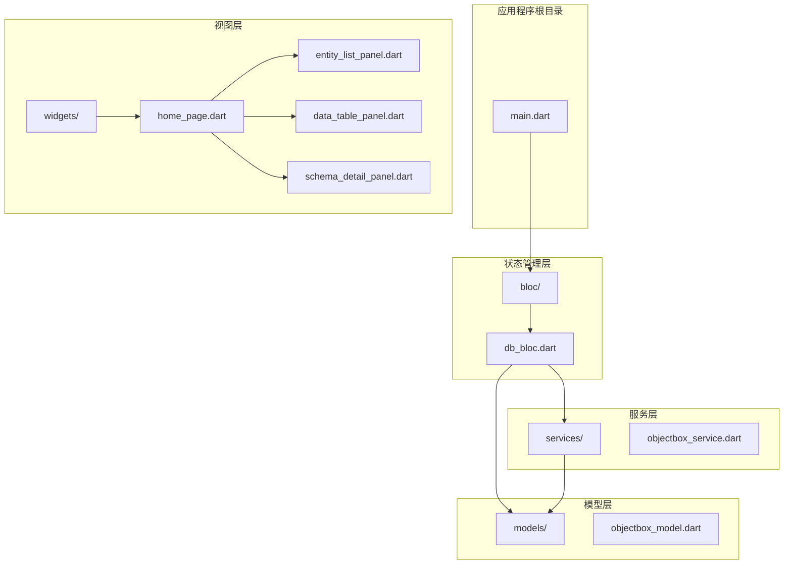

**图表来源**
- [main.dart:1-147](file://lib/main.dart#L1-L147)
- [db_bloc.dart:1-136](file://lib/bloc/db_bloc.dart#L1-L136)

**章节来源**
- [main.dart:1-147](file://lib/main.dart#L1-L147)
- [db_bloc.dart:1-136](file://lib/bloc/db_bloc.dart#L1-L136)

## 核心组件

### DbBloc - 主要业务逻辑组件

DbBloc 是整个应用的核心状态管理器，继承自 `Bloc<DbEvent, DbState>`，负责处理所有与数据库相关的业务逻辑。

#### 事件类型

系统定义了四种核心事件：

1. **OpenDatabase**: 打开指定路径的数据库
2. **SelectEntity**: 选择特定的实体进行数据展示
3. **RefreshData**: 刷新当前选中实体的数据
4. **CloseDatabase**: 关闭当前打开的数据库

#### 状态类型

系统定义了三种核心状态：

1. **DbInitial**: 初始状态，没有任何数据库连接
2. **DbLoading**: 加载状态，正在进行数据库操作
3. **DbLoaded**: 加载完成状态，包含数据库信息和可选的实体数据
4. **DbError**: 错误状态，包含错误信息

#### 状态转换图

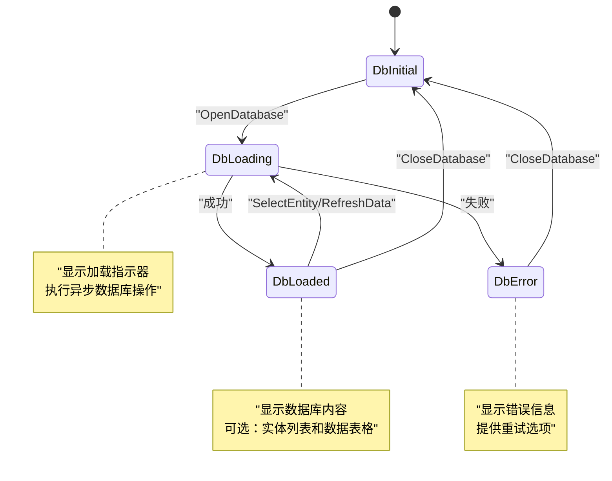

**图表来源**
- [db_bloc.dart:39-88](file://lib/bloc/db_bloc.dart#L39-L88)
- [db_bloc.dart:91-136](file://lib/bloc/db_bloc.dart#L91-L136)

**章节来源**
- [db_bloc.dart:7-136](file://lib/bloc/db_bloc.dart#L7-L136)

## 架构概览

### 整体架构设计

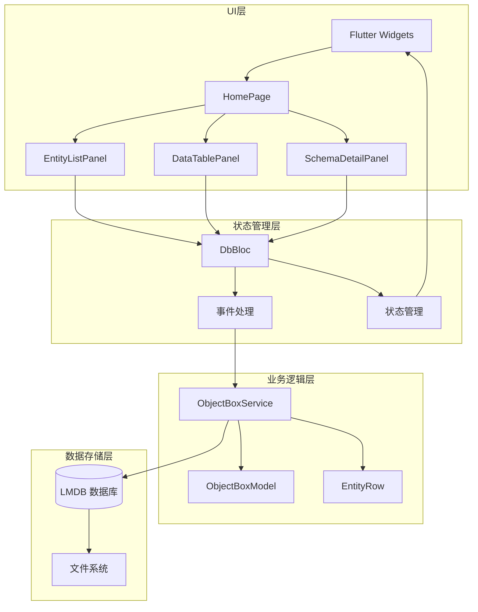

**图表来源**
- [main.dart:24](file://lib/main.dart#L24)
- [home_page.dart:14-72](file://lib/widgets/home_page.dart#L14-L72)
- [db_bloc.dart:91-136](file://lib/bloc/db_bloc.dart#L91-L136)

### 事件驱动机制

系统采用纯函数式的事件驱动架构，每个事件都触发相应的状态转换：

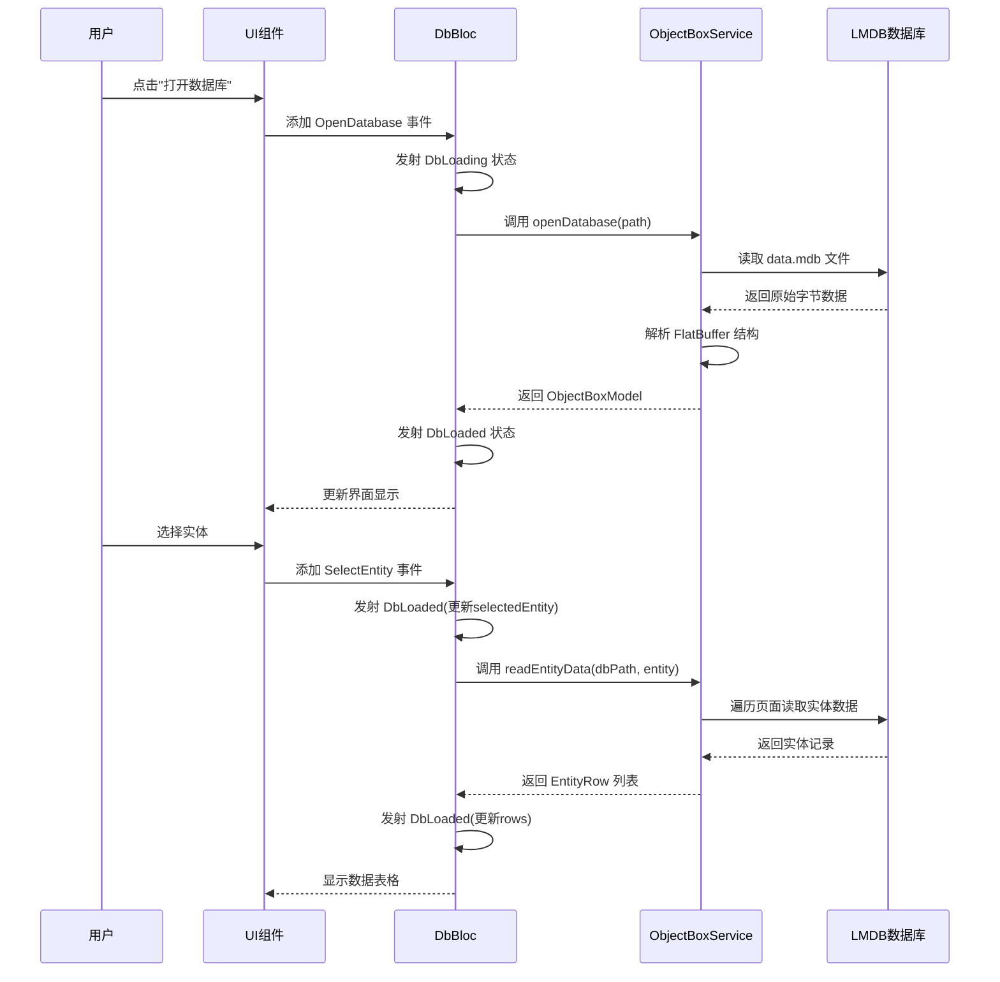

**图表来源**
- [main.dart:97-115](file://lib/main.dart#L97-L115)
- [home_page.dart:74-88](file://lib/widgets/home_page.dart#L74-L88)
- [db_bloc.dart:101-124](file://lib/bloc/db_bloc.dart#L101-L124)

**章节来源**
- [main.dart:97-115](file://lib/main.dart#L97-L115)
- [home_page.dart:74-88](file://lib/widgets/home_page.dart#L74-L88)
- [db_bloc.dart:101-124](file://lib/bloc/db_bloc.dart#L101-L124)

## 详细组件分析

### DbBloc 实现详解

#### 事件处理器设计

DbBloc 通过 `on<Event>()` 方法注册事件处理器，每个处理器都遵循相同的模式：

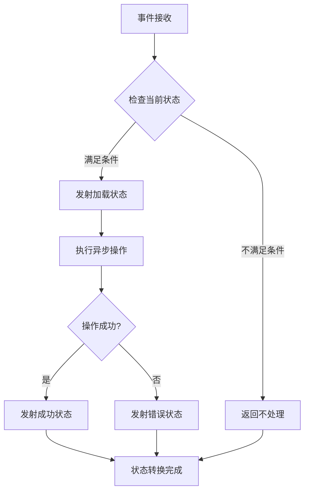

**图表来源**
- [db_bloc.dart:101-134](file://lib/bloc/db_bloc.dart#L101-L134)

#### 状态管理策略

DbBloc 使用不可变状态设计，通过 `copyWith` 方法创建新的状态实例：

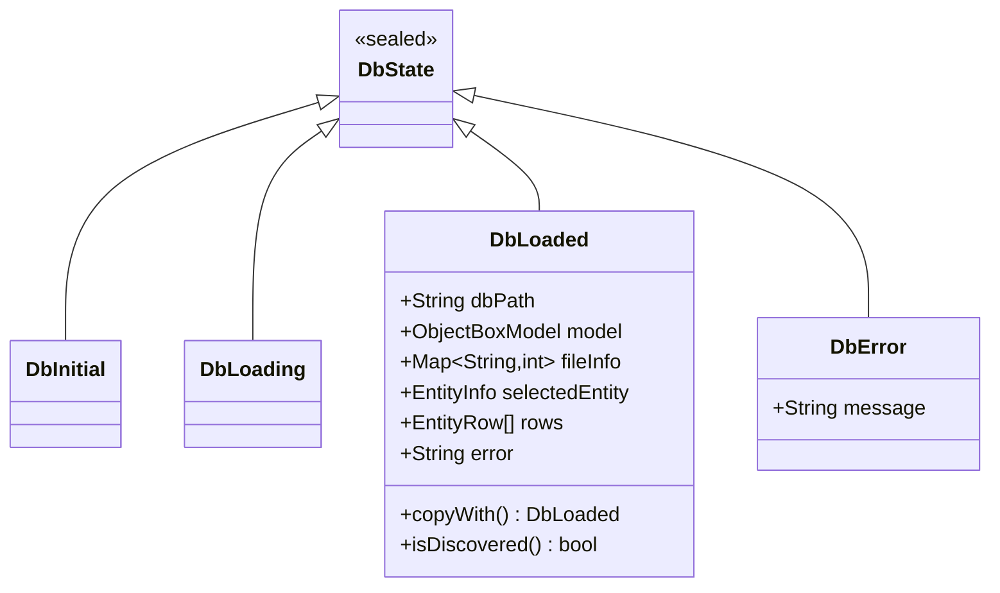

**图表来源**
- [db_bloc.dart:34-88](file://lib/bloc/db_bloc.dart#L34-L88)

**章节来源**
- [db_bloc.dart:34-88](file://lib/bloc/db_bloc.dart#L34-L88)

### 视图层集成

#### HomePage - 主界面协调器

HomePage 作为主要的协调器，使用 `BlocBuilder` 监听状态变化并相应地渲染不同的 UI 组件：

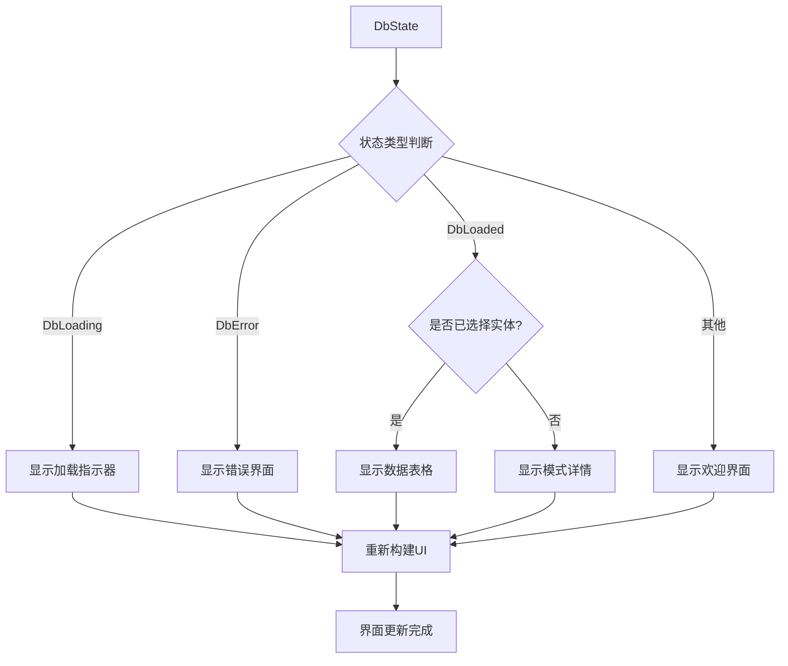

**图表来源**
- [home_page.dart:14-72](file://lib/widgets/home_page.dart#L14-L72)

#### 组件间通信模式

系统采用单向数据流模式，所有用户交互都通过事件传递到 DbBloc：

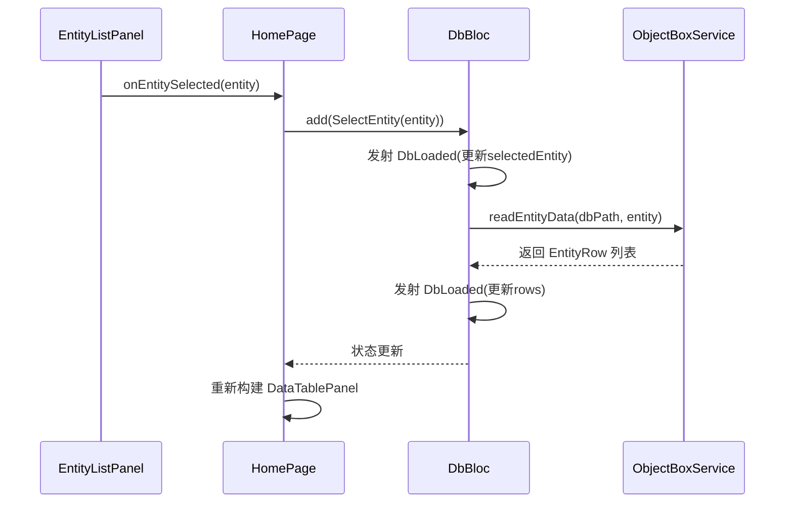

**图表来源**
- [entity_list_panel.dart:58-62](file://lib/widgets/entity_list_panel.dart#L58-L62)
- [home_page.dart:39-41](file://lib/widgets/home_page.dart#L39-L41)

**章节来源**
- [home_page.dart:14-72](file://lib/widgets/home_page.dart#L14-L72)
- [entity_list_panel.dart:58-62](file://lib/widgets/entity_list_panel.dart#L58-L62)

### 数据模型设计

#### ObjectBoxModel - 数据结构定义

系统定义了完整的数据模型结构，支持从 JSON 和直接解析两种模式：

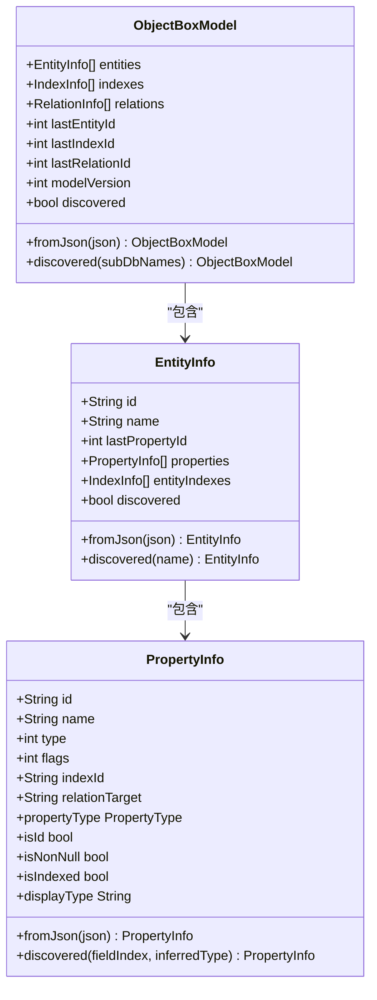

**图表来源**
- [objectbox_model.dart:3-248](file://lib/models/objectbox_model.dart#L3-L248)

**章节来源**
- [objectbox_model.dart:3-248](file://lib/models/objectbox_model.dart#L3-L248)

## 依赖关系分析

### 外部依赖

系统主要依赖以下外部库：

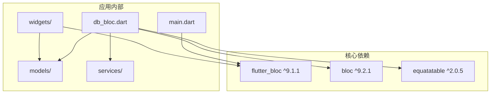

**图表来源**
- [main.dart:2](file://lib/main.dart#L2)
- [db_bloc.dart:2-3](file://lib/bloc/db_bloc.dart#L2-L3)

### 内部模块耦合

系统采用了松耦合的设计原则：

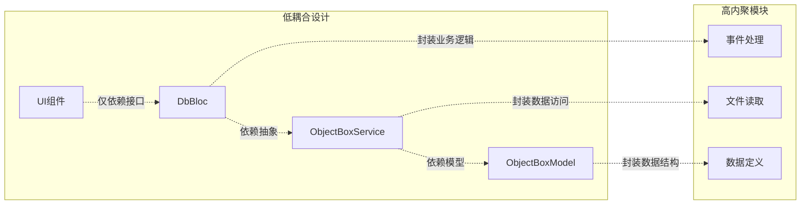

**图表来源**
- [db_bloc.dart:92](file://lib/bloc/db_bloc.dart#L92)
- [objectbox_service.dart:9](file://lib/services/objectbox_service.dart#L9)

**章节来源**
- [db_bloc.dart:92](file://lib/bloc/db_bloc.dart#L92)
- [objectbox_service.dart:9](file://lib/services/objectbox_service.dart#L9)

## 性能考虑

### 异步操作优化

系统在处理大量数据时采用了多种优化策略：

1. **增量加载**: 数据表格采用分页加载，避免一次性加载所有数据
2. **缓存机制**: DbLoaded 状态包含 `copyWith` 方法，支持局部状态更新
3. **懒加载**: 实体属性在首次访问时才进行解析

### 内存管理

```mermaid
flowchart TD
DATA[原始数据库数据] --> PARSE[解析FlatBuffer]
PARSE --> MODEL[ObjectBoxModel]
MODEL --> STATE[DbLoaded状态]
STATE --> UI[UI组件]
UI --> TABLE[DataTablePanel]
TABLE --> ROWS[EntityRow列表]
ROWS --> RENDER[按需渲染]
RENDER --> GC[垃圾回收]
note right of PARSE : "内存占用优化<br/>避免重复解析相同数据"
note right of STATE : "状态共享<br/>减少UI重建次数"
note right of RENDER : "虚拟滚动<br/>只渲染可见行"
```

### 错误处理策略

系统实现了多层次的错误处理机制：

1. **事件级错误处理**: 每个事件处理器都有独立的异常捕获
2. **状态级错误显示**: DbError 状态专门用于显示错误信息
3. **用户友好的错误提示**: 提供明确的错误描述和重试选项

**章节来源**
- [db_bloc.dart:107-109](file://lib/bloc/db_bloc.dart#L107-L109)
- [home_page.dart:190-217](file://lib/widgets/home_page.dart#L190-L217)

## 故障排除指南

### 常见问题诊断

#### 数据库打开失败

当遇到数据库打开失败时，系统会显示详细的错误信息：

1. **检查数据库路径**: 确认选择了正确的数据库目录
2. **验证文件完整性**: 确保 `data.mdb` 文件存在且完整
3. **权限检查**: 确认应用有读取数据库文件的权限

#### 实体数据加载问题

如果实体数据加载失败：

1. **检查实体名称**: 确认实体名称正确无误
2. **验证FlatBuffer格式**: 检查数据库文件的 FlatBuffer 结构
3. **查看日志输出**: 分析具体的解析错误原因

### 调试技巧

1. **启用开发者模式**: 在调试版本中启用详细的日志输出
2. **使用 BlocObserver**: 监控状态变化和事件处理过程
3. **单元测试**: 为关键业务逻辑编写测试用例

**章节来源**
- [db_bloc.dart:107-109](file://lib/bloc/db_bloc.dart#L107-L109)
- [objectbox_service.dart:10-19](file://lib/services/objectbox_service.dart#L10-L19)

## 结论

ObjectBox Viewer 展示了一个优秀的 BLoC 模式实现案例，具有以下特点：

1. **清晰的架构分离**: UI、业务逻辑、数据访问层职责分明
2. **响应式的状态管理**: 通过事件驱动实现可预测的状态转换
3. **良好的扩展性**: 模块化设计便于功能扩展和维护
4. **完善的错误处理**: 多层次的错误处理机制提升用户体验

该实现为 Flutter 应用的状态管理提供了最佳实践参考，特别是在处理复杂数据结构和异步操作方面展现了优秀的工程实践。