# 状态管理设计

<cite>
**本文档引用的文件**
- [main.dart](file://lib/main.dart)
- [db_bloc.dart](file://lib/bloc/db_bloc.dart)
- [home_page.dart](file://lib/widgets/home_page.dart)
- [entity_list_panel.dart](file://lib/widgets/entity_list_panel.dart)
- [data_table_panel.dart](file://lib/widgets/data_table_panel.dart)
- [entity_schema_panel.dart](file://lib/widgets/entity_schema_panel.dart)
- [schema_detail_panel.dart](file://lib/widgets/schema_detail_panel.dart)
- [objectbox_model.dart](file://lib/models/objectbox_model.dart)
- [objectbox_service.dart](file://lib/services/objectbox_service.dart)
- [objectbox_crud_service.dart](file://lib/services/objectbox_crud_service.dart)
</cite>

## 更新摘要
**变更内容**
- 新增完整的 CRUD（创建、读取、更新、删除）状态管理和事件处理
- DbBloc 现在支持 DeleteObjects 和 UpdateObject 事件
- 新增 isWriting 和 crudMessage 状态字段
- 增强了数据写入操作的状态反馈机制
- 完善了 CRUD 操作的错误处理和自动刷新功能

## 目录
1. [简介](#简介)
2. [项目结构](#项目结构)
3. [核心组件](#核心组件)
4. [架构概览](#架构概览)
5. [详细组件分析](#详细组件分析)
6. [CRUD 状态管理](#crud-状态管理)
7. [依赖关系分析](#依赖关系分析)
8. [性能考虑](#性能考虑)
9. [故障排除指南](#故障排除指南)
10. [结论](#结论)

## 简介

ObjectBox Viewer 是一个基于 Flutter 的数据库查看工具，采用 BLoC（Business Logic Component）模式进行状态管理。该项目展示了如何在实际应用中实现响应式的状态管理，通过事件驱动的方式处理用户交互和数据加载。

本项目的核心是 DbBloc，它负责管理数据库连接、实体选择、数据加载以及视图模式切换等业务逻辑。通过使用 Flutter Bloc 库，实现了清晰的状态分离和可预测的状态转换。

**更新** 新增了完整的 CRUD（创建、读取、更新、删除）功能，支持数据库对象的增删改操作，包括写入状态管理和操作结果反馈机制。

## 项目结构

项目采用模块化的目录结构，主要包含以下关键目录：

```mermaid
graph TB
subgraph "应用程序根目录"
APP[main.dart]
END
subgraph "状态管理层"
BLOC[bloc/]
DB_BLOC[db_bloc.dart]
END
subgraph "视图层"
WIDGETS[widgets/]
HOME_PAGE[home_page.dart]
ENTITY_LIST[entity_list_panel.dart]
DATA_TABLE[data_table_panel.dart]
ENTITY_SCHEMA[entity_schema_panel.dart]
SCHEMA_DETAIL[schema_detail_panel.dart]
END
subgraph "模型层"
MODELS[models/]
OBJECTBOX_MODEL[objectbox_model.dart]
END
subgraph "服务层"
SERVICES[services/]
OBJECTBOX_SERVICE[objectbox_service.dart]
OBJECTBOX_CRUD_SERVICE[objectbox_crud_service.dart]
BACKUP_SERVICE[backup_service.dart]
END
APP --> BLOC
BLOC --> DB_BLOC
DB_BLOC --> SERVICES
SERVICES --> OBJECTBOX_SERVICE
SERVICES --> OBJECTBOX_CRUD_SERVICE
SERVICES --> BACKUP_SERVICE
WIDGETS --> HOME_PAGE
HOME_PAGE --> ENTITY_LIST
HOME_PAGE --> DATA_TABLE
HOME_PAGE --> ENTITY_SCHEMA
HOME_PAGE --> SCHEMA_DETAIL
DB_BLOC --> MODELS
OBJECTBOX_SERVICE --> MODELS
OBJECTBOX_CRUD_SERVICE --> MODELS
```

**图表来源**
- [main.dart:1-147](file://lib/main.dart#L1-L147)
- [db_bloc.dart:1-345](file://lib/bloc/db_bloc.dart#L1-L345)

**章节来源**
- [main.dart:1-147](file://lib/main.dart#L1-L147)
- [db_bloc.dart:1-345](file://lib/bloc/db_bloc.dart#L1-L345)

## 核心组件

### DbBloc - 主要业务逻辑组件

DbBloc 是整个应用的核心状态管理器，继承自 `Bloc<DbEvent, DbState>`，负责处理所有与数据库相关的业务逻辑，包括新增的 CRUD 操作。

#### 事件类型

系统定义了七种核心事件：

1. **OpenDatabase**: 打开指定路径的数据库
2. **SelectEntity**: 选择特定的实体进行数据展示
3. **SelectViewMode**: 切换视图模式（数据视图或模式视图）
4. **RefreshData**: 刷新当前选中实体的数据
5. **CloseDatabase**: 关闭当前打开的数据库
6. **DeleteObjects**: 删除指定的对象集合
7. **UpdateObject**: 更新指定对象的数据

#### 状态类型

系统定义了四种核心状态：

1. **DbInitial**: 初始状态，没有任何数据库连接
2. **DbLoading**: 加载状态，正在进行数据库操作
3. **DbLoaded**: 加载完成状态，包含数据库信息、实体数据和视图模式
4. **DbError**: 错误状态，包含错误信息

#### CRUD 状态字段

DbLoaded 状态现在包含两个重要的 CRUD 相关字段：

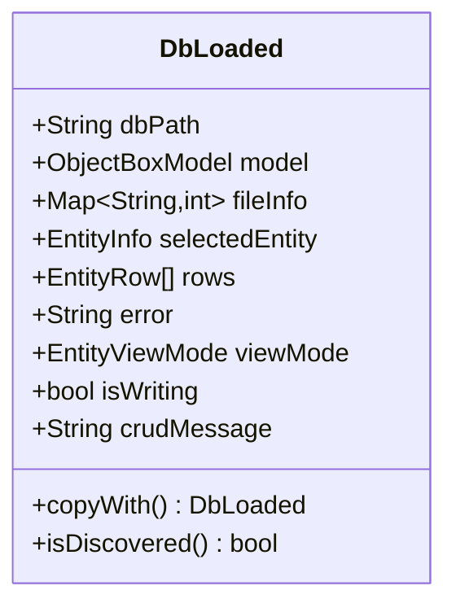
```mermaid
classDiagram
class DbLoaded {
+String dbPath
+ObjectBoxModel model
+Map~String,int~ fileInfo
+EntityInfo selectedEntity
+EntityRow[] rows
+String error
+EntityViewMode viewMode
+bool isWriting
+String crudMessage
+copyWith() DbLoaded
+isDiscovered() bool
}
```

**图表来源**
- [db_bloc.dart:74-137](file://lib/bloc/db_bloc.dart#L74-L137)

#### 状态转换图

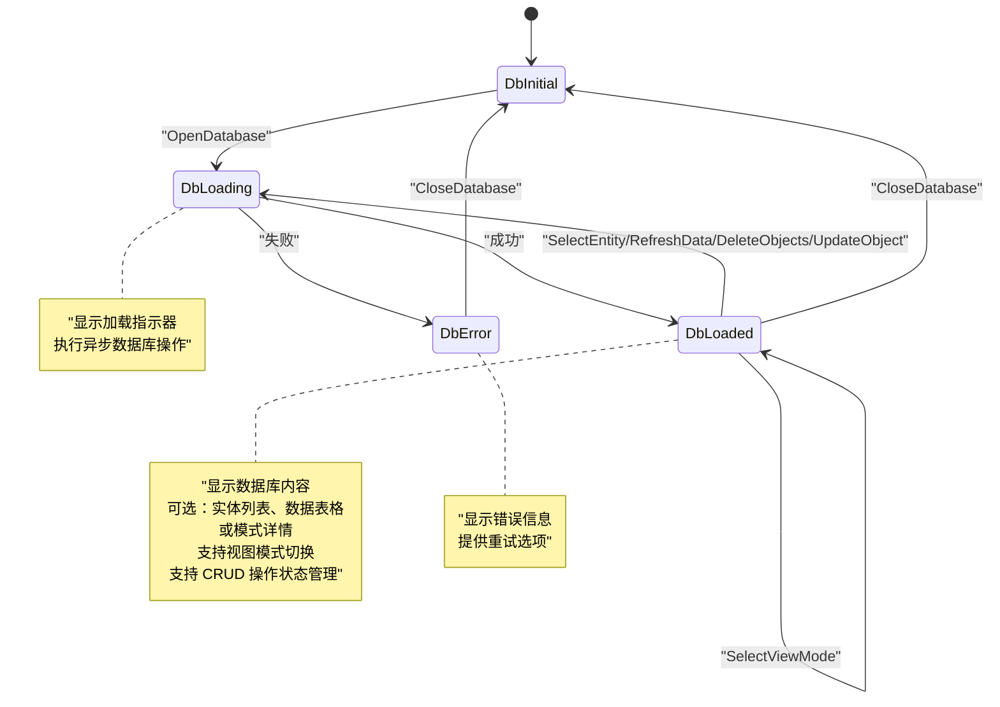
```mermaid
stateDiagram-v2
[*] --> DbInitial
DbInitial --> DbLoading : "OpenDatabase"
DbLoading --> DbLoaded : "成功"
DbLoading --> DbError : "失败"
DbLoaded --> DbLoading : "SelectEntity/RefreshData/DeleteObjects/UpdateObject"
DbLoaded --> DbInitial : "CloseDatabase"
DbLoaded --> DbLoaded : "SelectViewMode"
DbError --> DbInitial : "CloseDatabase"
note right of DbLoading : "显示加载指示器<br/>执行异步数据库操作"
note right of DbLoaded : "显示数据库内容<br/>可选：实体列表、数据表格或模式详情<br/>支持视图模式切换<br/>支持 CRUD 操作状态管理"
note right of DbError : "显示错误信息<br/>提供重试选项"
```

**图表来源**
- [db_bloc.dart:148-345](file://lib/bloc/db_bloc.dart#L148-L345)

**章节来源**
- [db_bloc.dart:1-345](file://lib/bloc/db_bloc.dart#L1-L345)

## 架构概览

### 整体架构设计

```mermaid
graph TB
subgraph "UI层"
UI[Flutter Widgets]
HOME[HomePage]
ENTITY_LIST[EntityListPanel]
DATA_TABLE[DataTablePanel]
ENTITY_SCHEMA[EntitySchemaPanel]
SCHEMA_DETAIL[SchemaDetailPanel]
END
subgraph "状态管理层"
BLOC[DbBloc]
EVENTS[事件处理]
STATE[状态管理]
CRUD[CRUD 状态管理]
VIEW_MODE[视图模式管理]
END
subgraph "业务逻辑层"
SERVICE[ObjectBoxService]
CRUD_SERVICE[ObjectBoxCrudService]
MODEL[ObjectBoxModel]
ROWS[EntityRow]
END
subgraph "数据存储层"
DB[(LMDB 数据库)]
FILE_SYSTEM[文件系统]
END
UI --> HOME
HOME --> ENTITY_LIST
HOME --> DATA_TABLE
HOME --> ENTITY_SCHEMA
HOME --> SCHEMA_DETAIL
ENTITY_LIST --> BLOC
DATA_TABLE --> BLOC
ENTITY_SCHEMA --> BLOC
SCHEMA_DETAIL --> BLOC
BLOC --> EVENTS
EVENTS --> VIEW_MODE
EVENTS --> CRUD
EVENTS --> SERVICE
EVENTS --> CRUD_SERVICE
SERVICE --> MODEL
SERVICE --> ROWS
SERVICE --> DB
CRUD_SERVICE --> MODEL
CRUD_SERVICE --> DB
DB --> FILE_SYSTEM
BLOC --> STATE
STATE --> UI
```

**图表来源**
- [main.dart:24](file://lib/main.dart#L24)
- [home_page.dart:14-132](file://lib/widgets/home_page.dart#L14-L132)
- [db_bloc.dart:148-345](file://lib/bloc/db_bloc.dart#L148-L345)

### 事件驱动机制

系统采用纯函数式的事件驱动架构，每个事件都触发相应的状态转换，包括新增的 CRUD 操作：

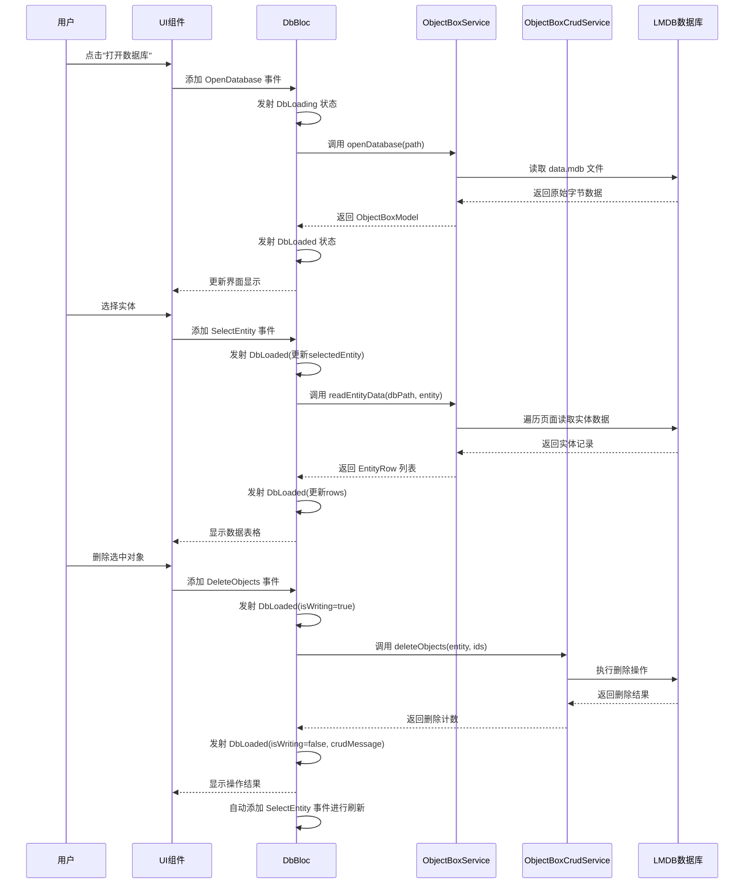
```mermaid
sequenceDiagram
participant User as 用户
participant UI as UI组件
participant Bloc as DbBloc
participant Service as ObjectBoxService
participant CrudService as ObjectBoxCrudService
participant DB as LMDB数据库
User->>UI : 点击"打开数据库"
UI->>Bloc : 添加 OpenDatabase 事件
Bloc->>Bloc : 发射 DbLoading 状态
Bloc->>Service : 调用 openDatabase(path)
Service->>DB : 读取 data.mdb 文件
DB-->>Service : 返回原始字节数据
Service-->>Bloc : 返回 ObjectBoxModel
Bloc->>Bloc : 发射 DbLoaded 状态
Bloc-->>UI : 更新界面显示
User->>UI : 选择实体
UI->>Bloc : 添加 SelectEntity 事件
Bloc->>Bloc : 发射 DbLoaded(更新selectedEntity)
Bloc->>Service : 调用 readEntityData(dbPath, entity)
Service->>DB : 遍历页面读取实体数据
DB-->>Service : 返回实体记录
Service-->>Bloc : 返回 EntityRow 列表
Bloc->>Bloc : 发射 DbLoaded(更新rows)
Bloc-->>UI : 显示数据表格
User->>UI : 删除选中对象
UI->>Bloc : 添加 DeleteObjects 事件
Bloc->>Bloc : 发射 DbLoaded(isWriting=true)
Bloc->>CrudService : 调用 deleteObjects(entity, ids)
CrudService->>DB : 执行删除操作
DB-->>CrudService : 返回删除结果
CrudService-->>Bloc : 返回删除计数
Bloc->>Bloc : 发射 DbLoaded(isWriting=false, crudMessage)
Bloc-->>UI : 显示操作结果
Bloc->>Bloc : 自动添加 SelectEntity 事件进行刷新
```

**图表来源**
- [main.dart:97-115](file://lib/main.dart#L97-L115)
- [home_page.dart:111-132](file://lib/widgets/home_page.dart#L111-L132)
- [db_bloc.dart:274-341](file://lib/bloc/db_bloc.dart#L274-L341)

**章节来源**
- [main.dart:97-115](file://lib/main.dart#L97-L115)
- [home_page.dart:111-132](file://lib/widgets/home_page.dart#L111-L132)
- [db_bloc.dart:274-341](file://lib/bloc/db_bloc.dart#L274-L341)

## 详细组件分析

### DbBloc 实现详解

#### 事件处理器设计

DbBloc 通过 `on<Event>()` 方法注册事件处理器，每个处理器都遵循相同的模式，包括新增的 CRUD 处理：

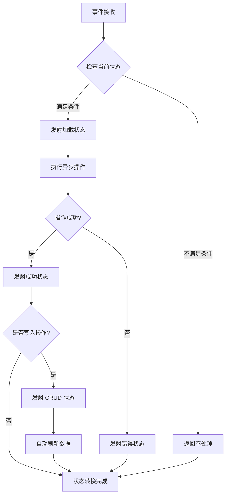
```mermaid
flowchart TD
START[事件接收] --> CHECK_STATE{检查当前状态}
CHECK_STATE --> |不满足条件| RETURN[返回不处理]
CHECK_STATE --> |满足条件| EMIT_LOADING[发射加载状态]
EMIT_LOADING --> EXECUTE[执行异步操作]
EXECUTE --> SUCCESS{操作成功?}
SUCCESS --> |是| EMIT_SUCCESS[发射成功状态]
SUCCESS --> |否| EMIT_ERROR[发射错误状态]
EMIT_SUCCESS --> CHECK_WRITING{是否写入操作?}
CHECK_WRITING --> |是| EMIT_CRUD[发射 CRUD 状态]
CHECK_WRITING --> |否| END[状态转换完成]
EMIT_CRUD --> AUTO_REFRESH[自动刷新数据]
AUTO_REFRESH --> END
EMIT_ERROR --> END
RETURN --> END
```

**图表来源**
- [db_bloc.dart:162-341](file://lib/bloc/db_bloc.dart#L162-L341)

#### 状态管理策略

DbBloc 使用不可变状态设计，通过 `copyWith` 方法创建新的状态实例，包括新增的 CRUD 字段：

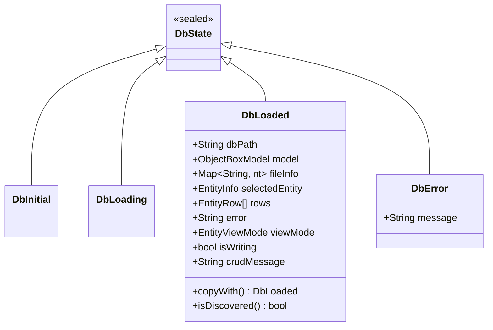
```mermaid
classDiagram
class DbState {
<<sealed>>
}
class DbInitial {
}
class DbLoading {
}
class DbLoaded {
+String dbPath
+ObjectBoxModel model
+Map~String,int~ fileInfo
+EntityInfo selectedEntity
+EntityRow[] rows
+String error
+EntityViewMode viewMode
+bool isWriting
+String crudMessage
+copyWith() DbLoaded
+isDiscovered() bool
}
class DbError {
+String message
}
DbState <|-- DbInitial
DbState <|-- DbLoading
DbState <|-- DbLoaded
DbState <|-- DbError
```

**图表来源**
- [db_bloc.dart:65-145](file://lib/bloc/db_bloc.dart#L65-L145)

**章节来源**
- [db_bloc.dart:65-145](file://lib/bloc/db_bloc.dart#L65-L145)

### 视图模式管理

#### 视图模式切换机制

系统新增了完整的视图模式管理功能，支持在数据视图和模式视图之间切换：

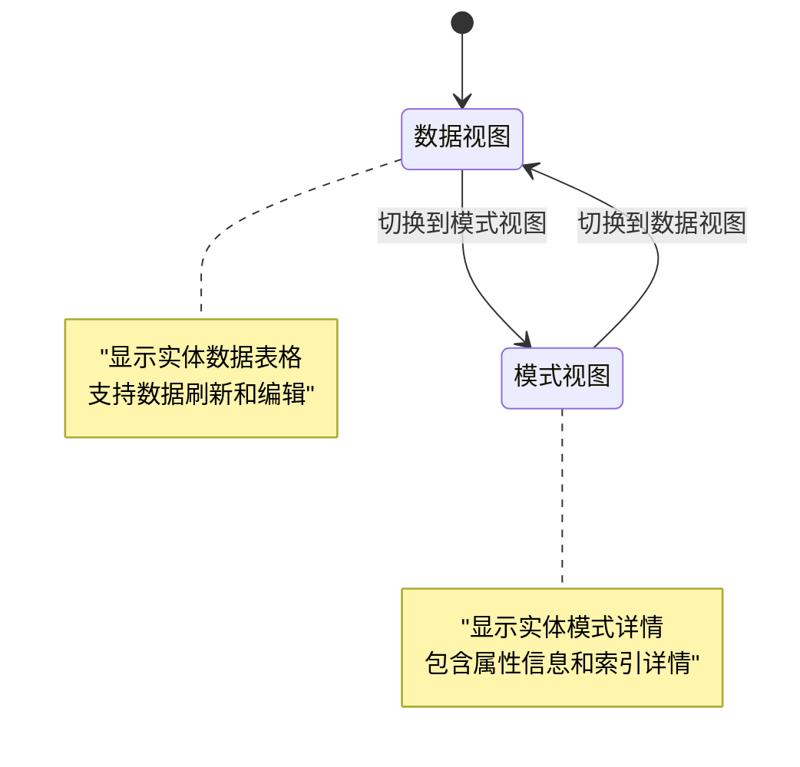
```mermaid
stateDiagram-v2
[*] --> DataMode
DataMode : 数据视图
DataMode --> SchemaMode : 切换到模式视图
SchemaMode : 模式视图
SchemaMode --> DataMode : 切换到数据视图
note right of DataMode : "显示实体数据表格<br/>支持数据刷新和编辑"
note right of SchemaMode : "显示实体模式详情<br/>包含属性信息和索引详情"
```

**图表来源**
- [db_bloc.dart:8-9](file://lib/bloc/db_bloc.dart#L8-L9)
- [entity_list_panel.dart:90-113](file://lib/widgets/entity_list_panel.dart#L90-L113)

#### 视图模式按钮组件

EntityListPanel 包含视图模式切换按钮，提供直观的用户界面：

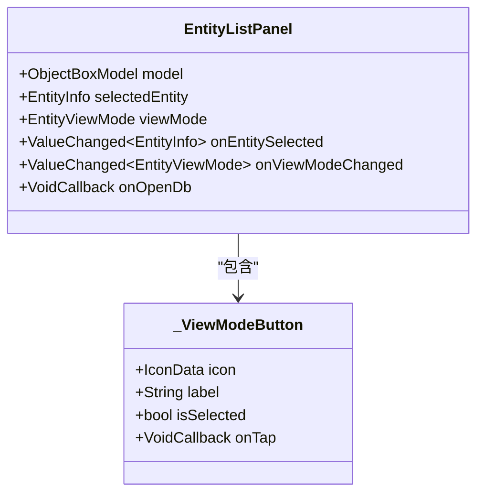
```mermaid
classDiagram
class EntityListPanel {
+ObjectBoxModel model
+EntityInfo selectedEntity
+EntityViewMode viewMode
+ValueChanged~EntityInfo~ onEntitySelected
+ValueChanged~EntityViewMode~ onViewModeChanged
+VoidCallback onOpenDb
}
class _ViewModeButton {
+IconData icon
+String label
+bool isSelected
+VoidCallback onTap
}
EntityListPanel --> _ViewModeButton : "包含"
```

**图表来源**
- [entity_list_panel.dart:5-238](file://lib/widgets/entity_list_panel.dart#L5-L238)

**章节来源**
- [entity_list_panel.dart:5-238](file://lib/widgets/entity_list_panel.dart#L5-L238)

### 视图层集成

#### HomePage - 主界面协调器

HomePage 作为主要的协调器，使用 `BlocListener` 监听 CRUD 消息并显示用户反馈：

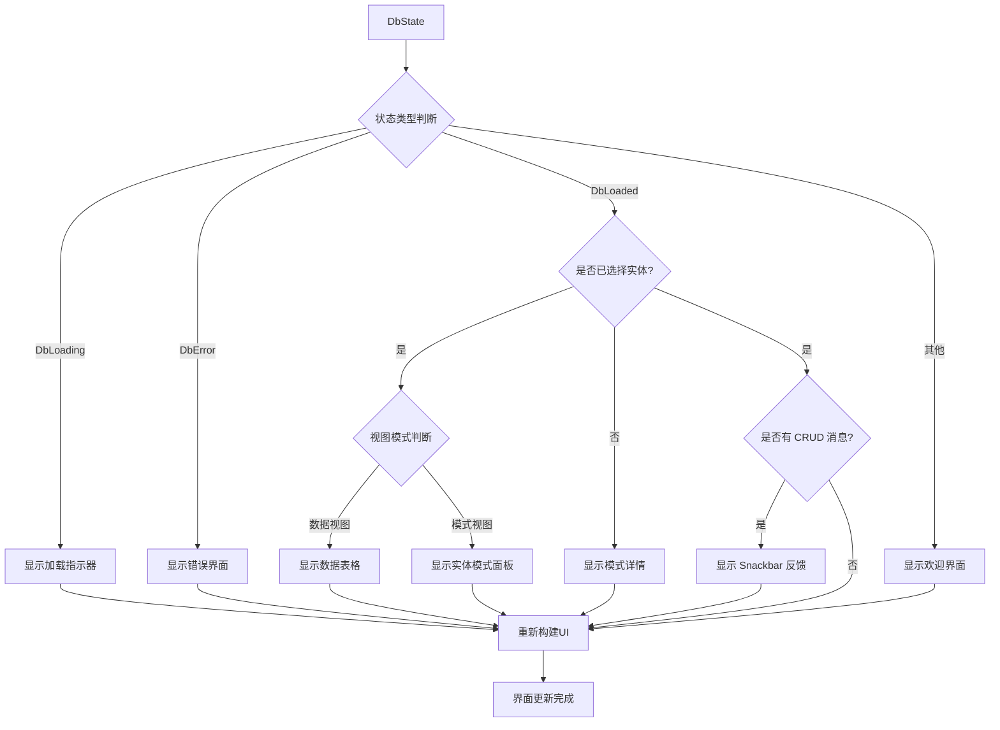
```mermaid
flowchart TD
STATE[DbState] --> CHECK{状态类型判断}
CHECK --> |DbLoading| LOADING[显示加载指示器]
CHECK --> |DbError| ERROR[显示错误界面]
CHECK --> |DbLoaded| CHECK_LOADED{是否已选择实体?}
CHECK --> |其他| WELCOME[显示欢迎界面]
CHECK_LOADED --> |是| CHECK_VIEW_MODE{视图模式判断}
CHECK_LOADED --> |否| SCHEMA[显示模式详情]
CHECK_VIEW_MODE --> |数据视图| TABLE[显示数据表格]
CHECK_VIEW_MODE --> |模式视图| SCHEMA_PANEL[显示实体模式面板]
CHECK_LOADED --> |是| CHECK_CRUD{是否有 CRUD 消息?}
CHECK_CRUD --> |是| SNACKBAR[显示 Snackbar 反馈]
CHECK_CRUD --> |否| RENDER[重新构建UI]
LOADING --> RENDER
ERROR --> RENDER
TABLE --> RENDER
SCHEMA_PANEL --> RENDER
SCHEMA --> RENDER
WELCOME --> RENDER
SNACKBAR --> RENDER
RENDER --> END[界面更新完成]
```

**图表来源**
- [home_page.dart:27-132](file://lib/widgets/home_page.dart#L27-L132)

#### 组件间通信模式

系统采用单向数据流模式，所有用户交互都通过事件传递到 DbBloc：

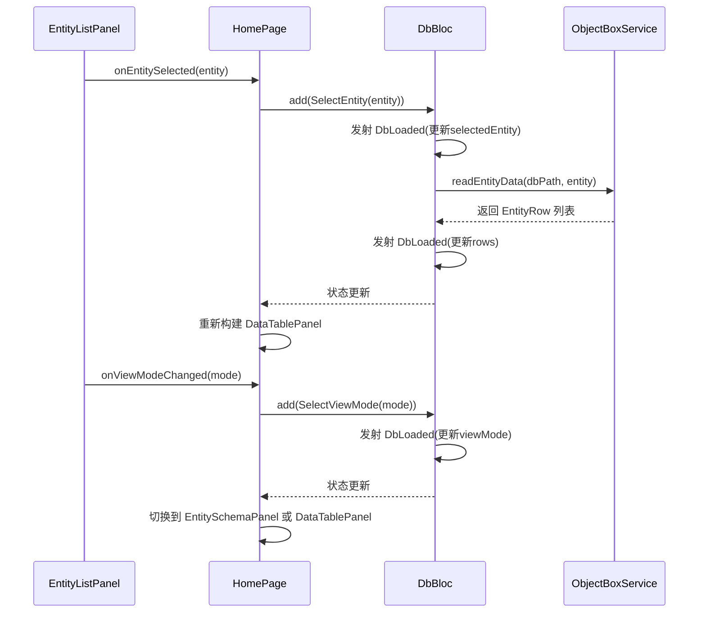
```mermaid
sequenceDiagram
participant Panel as EntityListPanel
participant Home as HomePage
participant Bloc as DbBloc
participant Service as ObjectBoxService
Panel->>Home : onEntitySelected(entity)
Home->>Bloc : add(SelectEntity(entity))
Bloc->>Bloc : 发射 DbLoaded(更新selectedEntity)
Bloc->>Service : readEntityData(dbPath, entity)
Service-->>Bloc : 返回 EntityRow 列表
Bloc->>Bloc : 发射 DbLoaded(更新rows)
Bloc-->>Home : 状态更新
Home->>Home : 重新构建 DataTablePanel
Panel->>Home : onViewModeChanged(mode)
Home->>Bloc : add(SelectViewMode(mode))
Bloc->>Bloc : 发射 DbLoaded(更新viewMode)
Bloc-->>Home : 状态更新
Home->>Home : 切换到 EntitySchemaPanel 或 DataTablePanel
```

**图表来源**
- [entity_list_panel.dart:58-62](file://lib/widgets/entity_list_panel.dart#L58-L62)
- [home_page.dart:52-57](file://lib/widgets/home_page.dart#L52-L57)
- [db_bloc.dart:233-258](file://lib/bloc/db_bloc.dart#L233-L258)

**章节来源**
- [home_page.dart:27-132](file://lib/widgets/home_page.dart#L27-L132)
- [entity_list_panel.dart:58-62](file://lib/widgets/entity_list_panel.dart#L58-L62)

### 数据模型设计

#### ObjectBoxModel - 数据结构定义

系统定义了完整的数据模型结构，支持从 JSON 和直接解析两种模式：

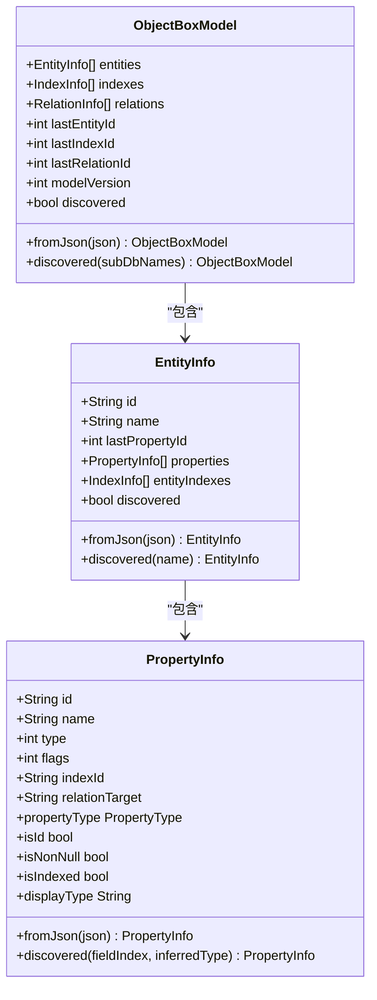
```mermaid
classDiagram
class ObjectBoxModel {
+EntityInfo[] entities
+IndexInfo[] indexes
+RelationInfo[] relations
+int lastEntityId
+int lastIndexId
+int lastRelationId
+int modelVersion
+bool discovered
+fromJson(json) ObjectBoxModel
+discovered(subDbNames) ObjectBoxModel
}
class EntityInfo {
+String id
+String name
+int lastPropertyId
+PropertyInfo[] properties
+IndexInfo[] entityIndexes
+bool discovered
+fromJson(json) EntityInfo
+discovered(name) EntityInfo
}
class PropertyInfo {
+String id
+String name
+int type
+int flags
+String indexId
+String relationTarget
+propertyType PropertyType
+isId bool
+isNonNull bool
+isIndexed bool
+displayType String
+fromJson(json) PropertyInfo
+discovered(fieldIndex, inferredType) PropertyInfo
}
ObjectBoxModel --> EntityInfo : "包含"
EntityInfo --> PropertyInfo : "包含"
```

**图表来源**
- [objectbox_model.dart:3-248](file://lib/models/objectbox_model.dart#L3-L248)

**章节来源**
- [objectbox_model.dart:3-248](file://lib/models/objectbox_model.dart#L3-L248)

## CRUD 状态管理

### CRUD 事件处理

DbBloc 现在支持完整的 CRUD 操作，包括删除和更新功能：

#### DeleteObjects 事件处理

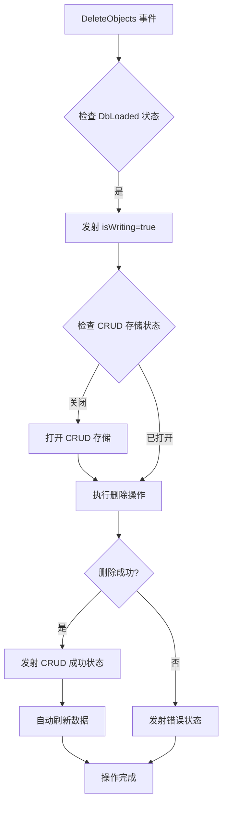
```mermaid
flowchart TD
DELETE_EVENT[DeleteObjects 事件] --> CHECK_LOADED{检查 DbLoaded 状态}
CHECK_LOADED --> |是| EMIT_WRITING[发射 isWriting=true]
EMIT_WRITING --> CHECK_STORE{检查 CRUD 存储状态}
CHECK_STORE --> |关闭| OPEN_STORE[打开 CRUD 存储]
OPEN_STORE --> DELETE_OBJECTS[执行删除操作]
CHECK_STORE --> |已打开| DELETE_OBJECTS
DELETE_OBJECTS --> SUCCESS{删除成功?}
SUCCESS --> |是| EMIT_SUCCESS[发射 CRUD 成功状态]
SUCCESS --> |否| EMIT_ERROR[发射错误状态]
EMIT_SUCCESS --> AUTO_REFRESH[自动刷新数据]
AUTO_REFRESH --> END[操作完成]
EMIT_ERROR --> END
```

**图表来源**
- [db_bloc.dart:274-306](file://lib/bloc/db_bloc.dart#L274-L306)

#### UpdateObject 事件处理

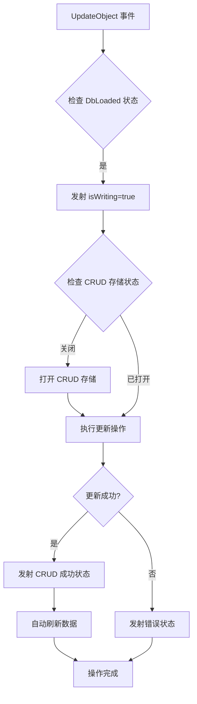
```mermaid
flowchart TD
UPDATE_EVENT[UpdateObject 事件] --> CHECK_LOADED{检查 DbLoaded 状态}
CHECK_LOADED --> |是| EMIT_WRITING[发射 isWriting=true]
EMIT_WRITING --> CHECK_STORE{检查 CRUD 存储状态}
CHECK_STORE --> |关闭| OPEN_STORE[打开 CRUD 存储]
OPEN_STORE --> UPDATE_OBJECT[执行更新操作]
CHECK_STORE --> |已打开| UPDATE_OBJECT
UPDATE_OBJECT --> SUCCESS{更新成功?}
SUCCESS --> |是| EMIT_SUCCESS[发射 CRUD 成功状态]
SUCCESS --> |否| EMIT_ERROR[发射错误状态]
EMIT_SUCCESS --> AUTO_REFRESH[自动刷新数据]
AUTO_REFRESH --> END[操作完成]
EMIT_ERROR --> END
```

**图表来源**
- [db_bloc.dart:308-341](file://lib/bloc/db_bloc.dart#L308-L341)

### CRUD 状态字段

DbLoaded 状态现在包含两个重要的 CRUD 相关字段：

1. **isWriting**: 布尔值，指示当前是否有写入操作正在进行
2. **crudMessage**: 字符串，包含 CRUD 操作的结果消息

这些字段通过 `copyWith` 方法进行状态更新，确保状态的不可变性和可预测性。

### CRUD 服务集成

系统引入了 `ObjectBoxCrudService` 来处理数据库的写入操作：

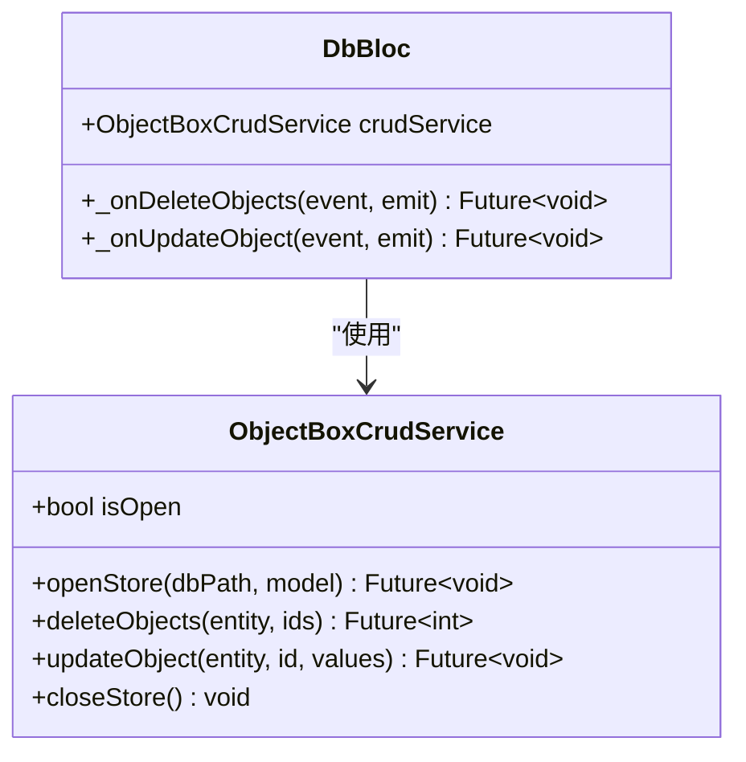
```mermaid
classDiagram
class ObjectBoxCrudService {
+bool isOpen
+openStore(dbPath, model) Future~void~
+deleteObjects(entity, ids) Future~int~
+updateObject(entity, id, values) Future~void~
+closeStore() void
}
class DbBloc {
+ObjectBoxCrudService crudService
+_onDeleteObjects(event, emit) Future~void~
+_onUpdateObject(event, emit) Future~void~
}
DbBloc --> ObjectBoxCrudService : "使用"
```

**图表来源**
- [db_bloc.dart:6](file://lib/bloc/db_bloc.dart#L6)
- [db_bloc.dart:149-151](file://lib/bloc/db_bloc.dart#L149-L151)

**章节来源**
- [db_bloc.dart:6](file://lib/bloc/db_bloc.dart#L6)
- [db_bloc.dart:149-151](file://lib/bloc/db_bloc.dart#L149-L151)

## 依赖关系分析

### 外部依赖

系统主要依赖以下外部库：

```mermaid
graph TB
subgraph "核心依赖"
FLUTTER_BLOC[flutter_bloc ^9.1.1]
BLOC[bloc ^9.2.1]
EQUATABLE[equatatable ^2.0.5]
FILE_PICKER[file_picker ^6.2.1]
END
subgraph "应用内部"
MAIN[main.dart]
DB_BLOC[db_bloc.dart]
MODELS[models/]
SERVICES[services/]
WIDGETS[widgets/]
END
MAIN --> FLUTTER_BLOC
DB_BLOC --> BLOC
DB_BLOC --> EQUATABLE
DB_BLOC --> MODELS
DB_BLOC --> SERVICES
WIDGETS --> FLUTTER_BLOC
WIDGETS --> MODELS
WIDGETS --> FILE_PICKER
```

**图表来源**
- [main.dart:2](file://lib/main.dart#L2)
- [db_bloc.dart:2-3](file://lib/bloc/db_bloc.dart#L2-L3)

### 内部模块耦合

系统采用了松耦合的设计原则，包括新增的 CRUD 服务：

```mermaid
graph LR
subgraph "低耦合设计"
UI[UI组件] -.->|仅依赖接口| BLOC[DbBloc]
BLOC -.->|依赖抽象| SERVICE[ObjectBoxService]
BLOC -.->|依赖抽象| CRUD_SERVICE[ObjectBoxCrudService]
SERVICE -.->|依赖模型| MODELS[ObjectBoxModel]
CRUD_SERVICE -.->|依赖模型| MODELS
END
subgraph "高内聚模块"
BLOC -.->|封装业务逻辑| BLOC_LOGIC[事件处理]
SERVICE -.->|封装数据访问| DATA_ACCESS[文件读取]
CRUD_SERVICE -.->|封装 CRUD 操作| CRUD_ACCESS[数据库写入]
MODELS -.->|封装数据结构| DATA_STRUCT[数据定义]
END
subgraph "视图模式组件"
ENTITY_LIST[EntityListPanel] -.->|管理视图模式| VIEW_MODE[EntityViewMode]
DATA_TABLE[DataTablePanel] -.->|显示数据| VIEW_MODE
ENTITY_SCHEMA[EntitySchemaPanel] -.->|显示模式| VIEW_MODE
END
```

**图表来源**
- [db_bloc.dart:148](file://lib/bloc/db_bloc.dart#L148)
- [objectbox_service.dart:9](file://lib/services/objectbox_service.dart#L9)
- [objectbox_crud_service.dart](file://lib/services/objectbox_crud_service.dart)

**章节来源**
- [db_bloc.dart:148](file://lib/bloc/db_bloc.dart#L148)
- [objectbox_service.dart:9](file://lib/services/objectbox_service.dart#L9)

## 性能考虑

### 异步操作优化

系统在处理大量数据时采用了多种优化策略：

1. **增量加载**: 数据表格采用分页加载，避免一次性加载所有数据
2. **缓存机制**: DbLoaded 状态包含 `copyWith` 方法，支持局部状态更新
3. **懒加载**: 实体属性在首次访问时才进行解析
4. **视图模式优化**: 切换视图模式时智能加载数据，避免不必要的操作
5. **写入操作优化**: CRUD 操作使用 isWriting 状态防止并发写入冲突

### 内存管理

```mermaid
flowchart TD
DATA[原始数据库数据] --> PARSE[解析FlatBuffer]
PARSE --> MODEL[ObjectBoxModel]
MODEL --> STATE[DbLoaded状态]
STATE --> UI[UI组件]
UI --> TABLE[DataTablePanel]
UI --> SCHEMA[EntitySchemaPanel]
TABLE --> ROWS[EntityRow列表]
SCHEMA --> ENTITY[EntityInfo]
ROWS --> RENDER[按需渲染]
ENTITY --> RENDER
RENDER --> GC[垃圾回收]
note right of PARSE : "内存占用优化<br/>避免重复解析相同数据"
note right of STATE : "状态共享<br/>减少UI重建次数"
note right of RENDER : "虚拟滚动<br/>只渲染可见行"
```

### 错误处理策略

系统实现了多层次的错误处理机制：

1. **事件级错误处理**: 每个事件处理器都有独立的异常捕获
2. **状态级错误显示**: DbError 状态专门用于显示错误信息
3. **用户友好的错误提示**: 提供明确的错误描述和重试选项
4. **CRUD 操作错误恢复**: 写入操作失败时自动清理 isWriting 状态
5. **视图模式错误恢复**: 切换视图模式时的错误处理和状态恢复

**章节来源**
- [db_bloc.dart:171-181](file://lib/bloc/db_bloc.dart#L171-L181)
- [home_page.dart:255-282](file://lib/widgets/home_page.dart#L255-L282)

## 故障排除指南

### 常见问题诊断

#### 数据库打开失败

当遇到数据库打开失败时，系统会显示详细的错误信息：

1. **检查数据库路径**: 确认选择了正确的数据库目录
2. **验证文件完整性**: 确保 `data.mdb` 文件存在且完整
3. **权限检查**: 确认应用有读取数据库文件的权限

#### 实体数据加载问题

如果实体数据加载失败：

1. **检查实体名称**: 确认实体名称正确无误
2. **验证FlatBuffer格式**: 检查数据库文件的 FlatBuffer 结构
3. **查看日志输出**: 分析具体的解析错误原因

#### 视图模式切换问题

如果视图模式切换出现问题：

1. **检查实体选择**: 确认已选择有效的实体
2. **验证视图模式状态**: 检查 DbLoaded 状态中的 viewMode 字段
3. **查看组件状态**: 分析 EntityListPanel 和 HomePage 的状态同步

#### CRUD 操作失败

如果 CRUD 操作失败：

1. **检查写入权限**: 确认数据库文件具有写入权限
2. **验证对象 ID**: 检查要删除或更新的对象 ID 是否有效
3. **查看 CRUD 服务状态**: 确认 ObjectBoxCrudService 已正确初始化
4. **检查 isWriting 状态**: 确保没有并发的写入操作

### 调试技巧

1. **启用开发者模式**: 在调试版本中启用详细的日志输出
2. **使用 BlocObserver**: 监控状态变化和事件处理过程
3. **单元测试**: 为关键业务逻辑编写测试用例
4. **CRUD 测试**: 验证删除和更新操作的正确性
5. **视图模式测试**: 验证数据视图和模式视图的切换功能

**章节来源**
- [db_bloc.dart:171-181](file://lib/bloc/db_bloc.dart#L171-L181)
- [objectbox_service.dart:10-19](file://lib/services/objectbox_service.dart#L10-L19)

## 结论

ObjectBox Viewer 展示了一个优秀的 BLoC 模式实现案例，具有以下特点：

1. **清晰的架构分离**: UI、业务逻辑、数据访问层职责分明
2. **响应式的状态管理**: 通过事件驱动实现可预测的状态转换
3. **良好的扩展性**: 模块化设计便于功能扩展和维护
4. **完善的错误处理**: 多层次的错误处理机制提升用户体验
5. **灵活的视图管理**: 支持数据视图和模式视图的动态切换
6. **完整的 CRUD 功能**: 支持数据库对象的增删改查操作

**更新** 新增的 CRUD 状态管理功能进一步增强了应用的实用性，为用户提供了完整的数据库操作能力。该实现为 Flutter 应用的状态管理提供了最佳实践参考，特别是在处理复杂数据结构、异步操作、多视图模式和数据库写入操作方面展现了优秀的工程实践。

DbBloc 的设计体现了现代 Flutter 应用开发的最佳实践，包括：
- 不可变状态设计
- 事件驱动架构
- 清晰的职责分离
- 完善的错误处理
- 用户友好的反馈机制
- 性能优化策略

这些特性使得 ObjectBox Viewer 成为了一个功能完整、用户体验优秀、代码质量高的数据库查看工具。