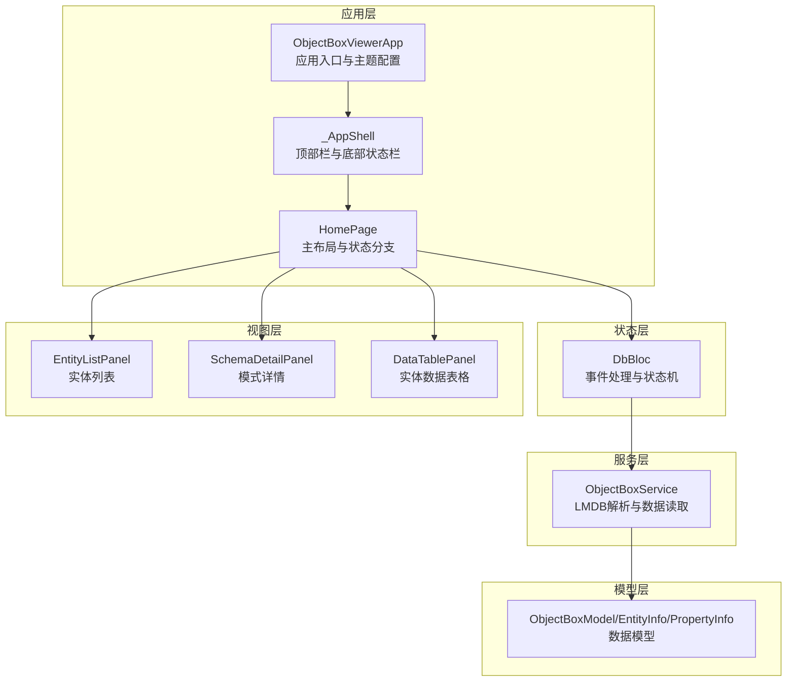
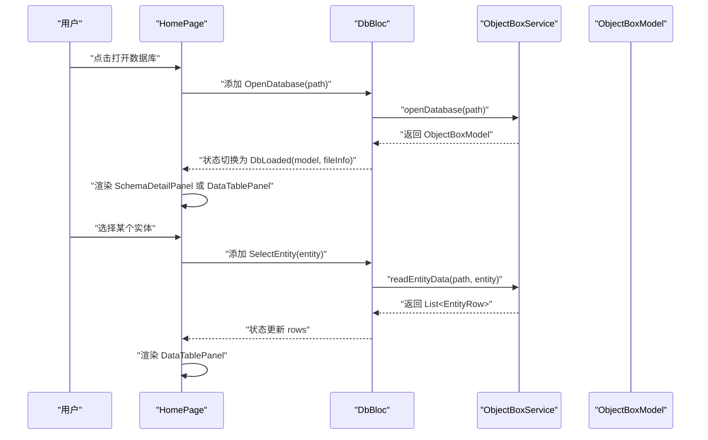
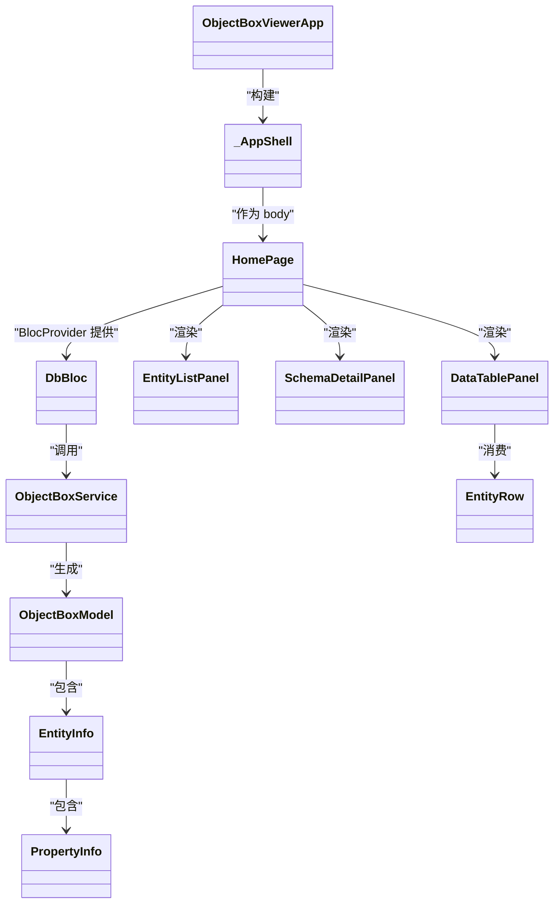
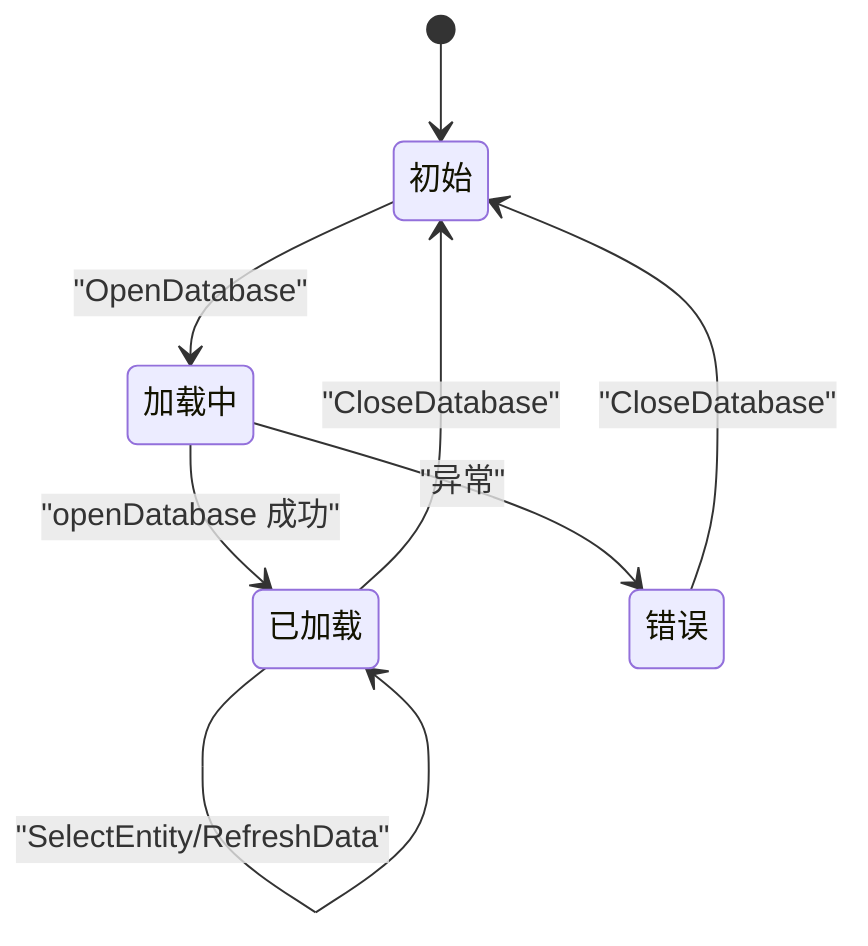
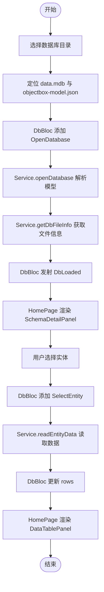
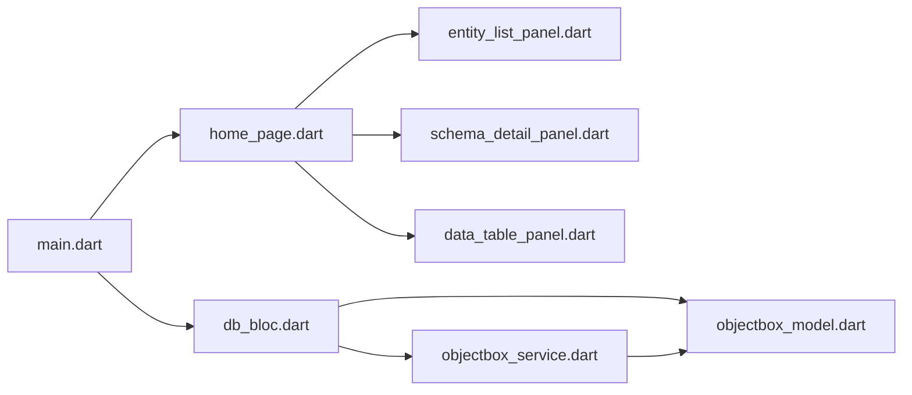

# 组件交互模式

<cite>
**本文引用的文件**
- [lib/main.dart](file://lib/main.dart)
- [lib/bloc/db_bloc.dart](file://lib/bloc/db_bloc.dart)
- [lib/widgets/home_page.dart](file://lib/widgets/home_page.dart)
- [lib/widgets/entity_list_panel.dart](file://lib/widgets/entity_list_panel.dart)
- [lib/widgets/data_table_panel.dart](file://lib/widgets/data_table_panel.dart)
- [lib/widgets/schema_detail_panel.dart](file://lib/widgets/schema_detail_panel.dart)
- [lib/services/objectbox_service.dart](file://lib/services/objectbox_service.dart)
- [lib/services/simple_viewer.dart](file://lib/services/simple_viewer.dart)
- [lib/models/objectbox_model.dart](file://lib/models/objectbox_model.dart)
- [pubspec.yaml](file://pubspec.yaml)
</cite>

## 目录
1. [简介](#简介)
2. [项目结构](#项目结构)
3. [核心组件](#核心组件)
4. [架构总览](#架构总览)
5. [详细组件分析](#详细组件分析)
6. [依赖关系分析](#依赖关系分析)
7. [性能考量](#性能考量)
8. [故障排查指南](#故障排查指南)
9. [结论](#结论)
10. [附录](#附录)

## 简介
本文件系统性梳理 ObjectBox Viewer 的组件交互模式，聚焦以下目标：
- 描述用户操作到数据展示的完整数据流（文件选择、数据库打开、实体加载与数据渲染）。
- 阐述组件间的解耦设计与依赖关系管理（BLoC、Widgets、Services、Models）。
- 解释事件传播机制与状态同步策略（事件驱动、单向数据流）。
- 提供组件交互时序图与数据流向图。
- 总结最佳实践与性能优化建议。

## 项目结构
该项目采用 Flutter 应用结构，按功能域分层组织：
- 应用入口与主题：lib/main.dart
- 状态管理：lib/bloc/db_bloc.dart
- 视图组件：lib/widgets/*（主页、实体列表、数据表、模式详情）
- 数据服务：lib/services/*（对象框解析与数据读取）
- 数据模型：lib/models/objectbox_model.dart

图表来源
- [lib/main.dart:13-43](file://lib/main.dart#L13-L43)
- [lib/bloc/db_bloc.dart:91-136](file://lib/bloc/db_bloc.dart#L91-L136)
- [lib/widgets/home_page.dart:9-89](file://lib/widgets/home_page.dart#L9-L89)
- [lib/widgets/entity_list_panel.dart:4-85](file://lib/widgets/entity_list_panel.dart#L4-L85)
- [lib/widgets/schema_detail_panel.dart:4-123](file://lib/widgets/schema_detail_panel.dart#L4-L123)
- [lib/widgets/data_table_panel.dart:5-148](file://lib/widgets/data_table_panel.dart#L5-L148)
- [lib/services/objectbox_service.dart:9-41](file://lib/services/objectbox_service.dart#L9-L41)
- [lib/models/objectbox_model.dart:3-61](file://lib/models/objectbox_model.dart#L3-L61)

章节来源
- [lib/main.dart:1-147](file://lib/main.dart#L1-L147)
- [pubspec.yaml:30-43](file://pubspec.yaml#L30-L43)

## 核心组件
- 应用入口与壳层
  - ObjectBoxViewerApp：构建 MaterialApp，设置主题与全局 Provider。
  - _AppShell：提供顶部“打开数据库”按钮、底部状态栏与内容区。
- 主页与状态分支
  - HomePage：根据 DbBloc 状态渲染欢迎页、加载中、错误或主界面；主界面左右分栏：左侧实体列表、右侧内容面板。
- 状态管理（BLoC）
  - DbBloc：定义事件（打开数据库、选择实体、刷新、关闭）、状态（初始、加载、已加载、错误），封装与服务层交互。
- 视图组件
  - EntityListPanel：列出实体并支持选中。
  - SchemaDetailPanel：展示数据库文件信息、实体概览与关系（在非发现模式下）。
  - DataTablePanel：以表格形式展示实体数据，支持刷新与长值复制。
- 服务层
  - ObjectBoxService：负责打开数据库、读取文件信息、解析 LMDB 并读取实体数据。
- 模型层
  - ObjectBoxModel/EntityInfo/PropertyInfo/EntityRow：统一的数据模型抽象，支持“发现模式”。

章节来源
- [lib/main.dart:13-147](file://lib/main.dart#L13-L147)
- [lib/bloc/db_bloc.dart:7-136](file://lib/bloc/db_bloc.dart#L7-L136)
- [lib/widgets/home_page.dart:9-218](file://lib/widgets/home_page.dart#L9-L218)
- [lib/widgets/entity_list_panel.dart:4-131](file://lib/widgets/entity_list_panel.dart#L4-L131)
- [lib/widgets/schema_detail_panel.dart:4-283](file://lib/widgets/schema_detail_panel.dart#L4-L283)
- [lib/widgets/data_table_panel.dart:5-345](file://lib/widgets/data_table_panel.dart#L5-L345)
- [lib/services/objectbox_service.dart:9-1006](file://lib/services/objectbox_service.dart#L9-L1006)
- [lib/models/objectbox_model.dart:3-248](file://lib/models/objectbox_model.dart#L3-L248)

## 架构总览
整体采用“单向数据流 + BLoC”的架构：
- 用户通过 UI 发起事件（打开数据库、选择实体、刷新）。
- DbBloc 接收事件并更新状态。
- HomePage 基于状态进行条件渲染，驱动子组件更新。
- 服务层负责与底层 LMDB 文件交互，返回模型与数据。
- 模型层提供稳定的领域对象，屏蔽解析细节。

图表来源
- [lib/main.dart:97-145](file://lib/main.dart#L97-L145)
- [lib/bloc/db_bloc.dart:101-124](file://lib/bloc/db_bloc.dart#L101-L124)
- [lib/services/objectbox_service.dart:10-40](file://lib/services/objectbox_service.dart#L10-L40)
- [lib/widgets/home_page.dart:36-61](file://lib/widgets/home_page.dart#L36-L61)

## 详细组件分析

### 组件类关系图（代码级）

图表来源
- [lib/main.dart:13-73](file://lib/main.dart#L13-L73)
- [lib/bloc/db_bloc.dart:91-136](file://lib/bloc/db_bloc.dart#L91-L136)
- [lib/services/objectbox_service.dart:9-41](file://lib/services/objectbox_service.dart#L9-L41)
- [lib/models/objectbox_model.dart:3-248](file://lib/models/objectbox_model.dart#L3-L248)
- [lib/widgets/home_page.dart:9-89](file://lib/widgets/home_page.dart#L9-L89)
- [lib/widgets/entity_list_panel.dart:4-85](file://lib/widgets/entity_list_panel.dart#L4-L85)
- [lib/widgets/schema_detail_panel.dart:4-123](file://lib/widgets/schema_detail_panel.dart#L4-L123)
- [lib/widgets/data_table_panel.dart:5-148](file://lib/widgets/data_table_panel.dart#L5-L148)

章节来源
- [lib/main.dart:13-147](file://lib/main.dart#L13-L147)
- [lib/bloc/db_bloc.dart:91-136](file://lib/bloc/db_bloc.dart#L91-L136)
- [lib/services/objectbox_service.dart:9-1006](file://lib/services/objectbox_service.dart#L9-L1006)
- [lib/models/objectbox_model.dart:3-248](file://lib/models/objectbox_model.dart#L3-L248)
- [lib/widgets/home_page.dart:9-218](file://lib/widgets/home_page.dart#L9-L218)
- [lib/widgets/entity_list_panel.dart:4-131](file://lib/widgets/entity_list_panel.dart#L4-L131)
- [lib/widgets/schema_detail_panel.dart:4-283](file://lib/widgets/schema_detail_panel.dart#L4-L283)
- [lib/widgets/data_table_panel.dart:5-345](file://lib/widgets/data_table_panel.dart#L5-L345)

### 事件传播与状态同步
- 事件来源
  - 打开数据库：来自 AppShell 的“打开数据库”按钮与 HomePage 的欢迎页按钮。
  - 选择实体：来自 EntityListPanel 的列表项点击。
  - 刷新数据：来自 DataTablePanel 的刷新按钮。
  - 关闭数据库：来自 Banner 或 EntityListPanel 的关闭按钮。
- 状态流转
  - DbInitial → DbLoading → DbLoaded（成功）或 DbError（失败）。
  - 选择实体后，仅更新选中实体与数据，保留路径与模型信息。
- 同步策略
  - 使用 BlocProvider 在根部注入 DbBloc，子组件通过 context.read 访问。
  - HomePage 通过 BlocBuilder 监听状态变化并重绘。

图表来源
- [lib/bloc/db_bloc.dart:91-136](file://lib/bloc/db_bloc.dart#L91-L136)
- [lib/widgets/home_page.dart:14-72](file://lib/widgets/home_page.dart#L14-L72)

章节来源
- [lib/bloc/db_bloc.dart:91-136](file://lib/bloc/db_bloc.dart#L91-L136)
- [lib/widgets/home_page.dart:14-72](file://lib/widgets/home_page.dart#L14-L72)

### 数据加载与渲染流程（算法视角）

图表来源
- [lib/main.dart:97-145](file://lib/main.dart#L97-L145)
- [lib/bloc/db_bloc.dart:101-124](file://lib/bloc/db_bloc.dart#L101-L124)
- [lib/services/objectbox_service.dart:10-40](file://lib/services/objectbox_service.dart#L10-L40)
- [lib/widgets/home_page.dart:36-61](file://lib/widgets/home_page.dart#L36-L61)

章节来源
- [lib/main.dart:97-145](file://lib/main.dart#L97-L145)
- [lib/bloc/db_bloc.dart:101-124](file://lib/bloc/db_bloc.dart#L101-L124)
- [lib/services/objectbox_service.dart:10-40](file://lib/services/objectbox_service.dart#L10-L40)
- [lib/widgets/home_page.dart:36-61](file://lib/widgets/home_page.dart#L36-L61)

### 组件职责与耦合
- 解耦点
  - DbBloc 作为唯一状态源，向上游 UI 屏蔽服务层细节。
  - 视图组件仅依赖模型与回调，不直接访问服务层。
  - 模型层提供稳定接口，屏蔽 LMDB 解析差异。
- 耦合点
  - HomePage 依赖 DbBloc 的状态与事件类型。
  - DataTablePanel 依赖 EntityInfo 与 EntityRow 的字段约定。
  - ObjectBoxService 依赖文件系统与二进制解析逻辑。

章节来源
- [lib/bloc/db_bloc.dart:91-136](file://lib/bloc/db_bloc.dart#L91-L136)
- [lib/widgets/home_page.dart:9-89](file://lib/widgets/home_page.dart#L9-L89)
- [lib/widgets/data_table_panel.dart:5-148](file://lib/widgets/data_table_panel.dart#L5-L148)
- [lib/services/objectbox_service.dart:9-1006](file://lib/services/objectbox_service.dart#L9-L1006)

## 依赖关系分析
- 外部依赖
  - flutter_bloc：状态管理。
  - file_picker：文件/目录选择。
  - path_provider、path：跨平台路径处理。
  - ffi、equatable：底层能力与相等性比较。
- 内部模块依赖
  - main.dart 依赖 bloc/db_bloc.dart 与 widgets/*。
  - widgets/* 依赖 models 与 bloc/db_bloc.dart。
  - services/* 依赖 models 与 dart:io/dart:typed_data。
  - db_bloc.dart 依赖 services/* 与 models/*。

图表来源
- [lib/main.dart:1-11](file://lib/main.dart#L1-L11)
- [lib/bloc/db_bloc.dart:1-6](file://lib/bloc/db_bloc.dart#L1-L6)
- [lib/widgets/home_page.dart:1-8](file://lib/widgets/home_page.dart#L1-L8)
- [lib/services/objectbox_service.dart:1-6](file://lib/services/objectbox_service.dart#L1-L6)
- [lib/models/objectbox_model.dart:1-3](file://lib/models/objectbox_model.dart#L1-L3)

章节来源
- [pubspec.yaml:30-43](file://pubspec.yaml#L30-L43)
- [lib/main.dart:1-11](file://lib/main.dart#L1-L11)
- [lib/bloc/db_bloc.dart:1-6](file://lib/bloc/db_bloc.dart#L1-L6)
- [lib/widgets/home_page.dart:1-8](file://lib/widgets/home_page.dart#L1-L8)
- [lib/services/objectbox_service.dart:1-6](file://lib/services/objectbox_service.dart#L1-L6)
- [lib/models/objectbox_model.dart:1-3](file://lib/models/objectbox_model.dart#L1-L3)

## 性能考量
- 解析性能
  - LMDB 文件全量读取与逐页扫描，复杂度与文件大小线性相关。建议：
    - 对超大数据库采用分页/分批加载策略（当前实现一次性读取，可考虑增量解析）。
    - 对重复实体与属性解析结果进行缓存（如实体名与字段推断结果）。
- UI 渲染
  - DataTablePanel 使用可滚动容器与固定列宽，避免过度重组。
  - 长文本截断与延迟渲染（仅在点击单元格时弹窗查看全文）。
- 状态更新
  - 使用 copyWith 精准更新 selectedEntity/rows/error，减少不必要的重建。
- I/O 与内存
  - 避免重复读取同一文件；对文件信息使用缓存。
  - 控制日志输出与调试信息，避免影响渲染性能。

[本节为通用性能建议，不直接分析具体文件，故无章节来源]

## 故障排查指南
- 常见问题
  - 未找到 data.mdb：检查所选目录是否包含 LMDB 文件。
  - 未找到 objectbox-model.json：工具仍可“发现模式”工作，但字段名与类型为推断。
  - 解析异常：查看错误视图中的错误信息，尝试重新打开数据库。
- 定位手段
  - 查看 DbBloc 的错误状态与消息。
  - 检查文件权限与路径有效性。
  - 在服务层增加日志（当前实现未打印日志，可在开发阶段临时加入）。
- 修复建议
  - 确保选择正确的数据库目录（包含 data.mdb 与锁文件）。
  - 若为发现模式，可手动确认字段类型与名称映射。

章节来源
- [lib/bloc/db_bloc.dart:101-109](file://lib/bloc/db_bloc.dart#L101-L109)
- [lib/widgets/home_page.dart:190-217](file://lib/widgets/home_page.dart#L190-L217)
- [lib/services/objectbox_service.dart:10-29](file://lib/services/objectbox_service.dart#L10-L29)

## 结论
本项目通过清晰的分层与单向数据流实现了从用户操作到数据展示的完整闭环：
- UI 仅负责事件触发与状态渲染。
- BLoC 负责业务编排与状态转换。
- 服务层专注底层解析与数据读取。
- 模型层提供稳定的数据契约。
建议在后续迭代中引入增量解析、缓存与更细粒度的状态切片，以进一步提升大数据库场景下的体验与性能。

[本节为总结性内容，不直接分析具体文件，故无章节来源]

## 附录
- 最佳实践
  - 事件驱动：UI 只发事件，不直接修改状态。
  - 状态不可变：使用 copyWith 返回新状态，确保可追踪与可测试。
  - 组件无副作用：解析与 I/O 放入服务层，视图只做渲染。
  - 错误显式化：统一错误视图与提示，便于用户恢复。
- 性能优化清单
  - 增量解析：按需解析页与实体，避免全量扫描。
  - 缓存策略：实体与属性推断结果缓存，减少重复计算。
  - UI 优化：虚拟列表、延迟加载、文本截断与复制弹窗。
  - I/O 优化：复用文件句柄、批量读取、避免重复读取。

[本节为通用指导，不直接分析具体文件，故无章节来源]