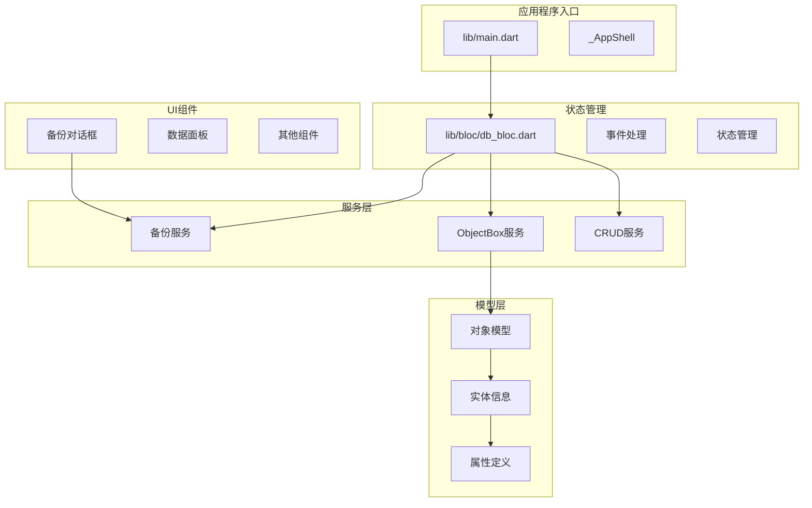
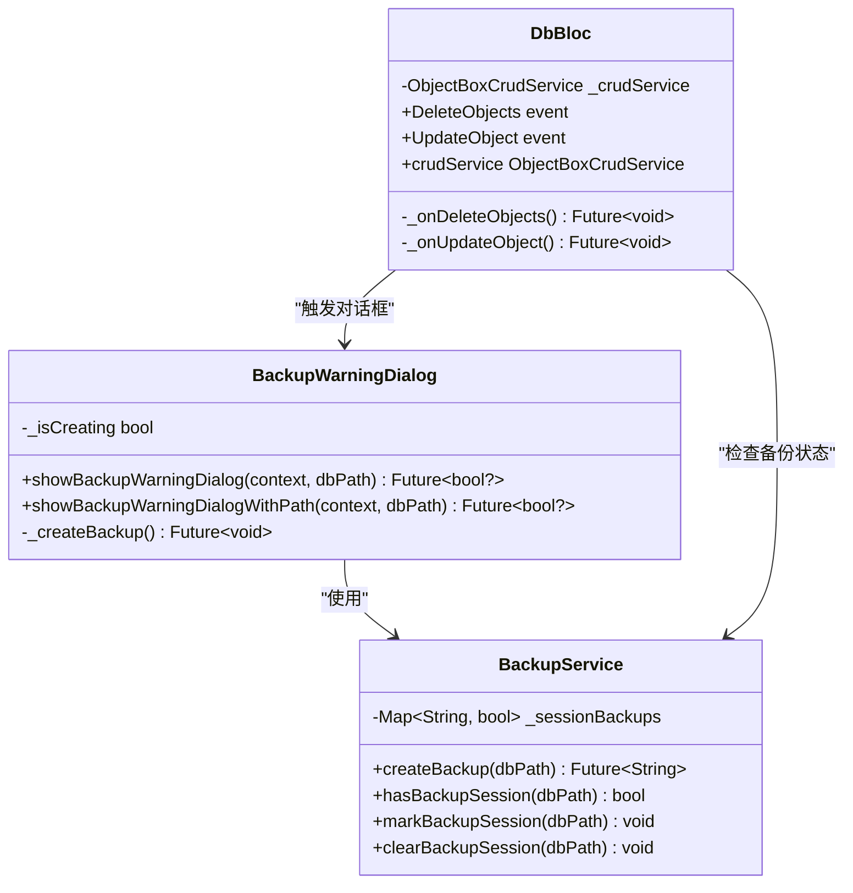
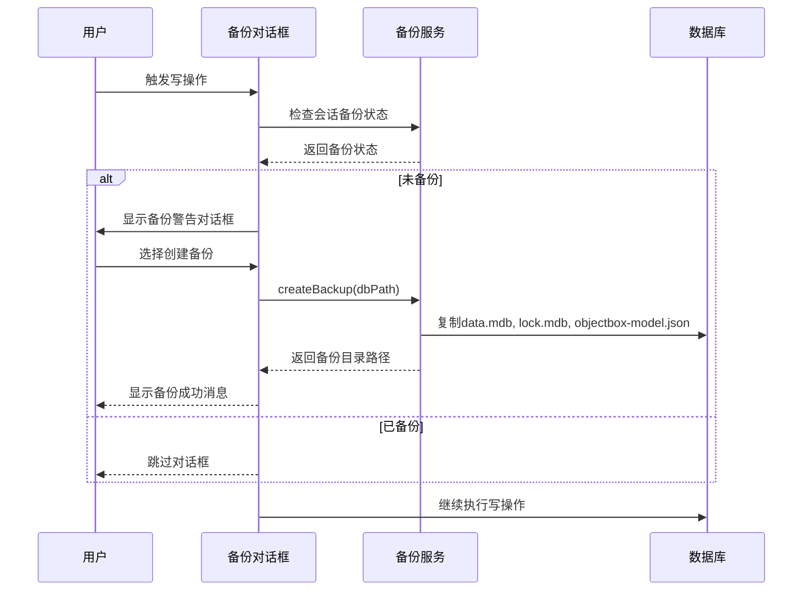
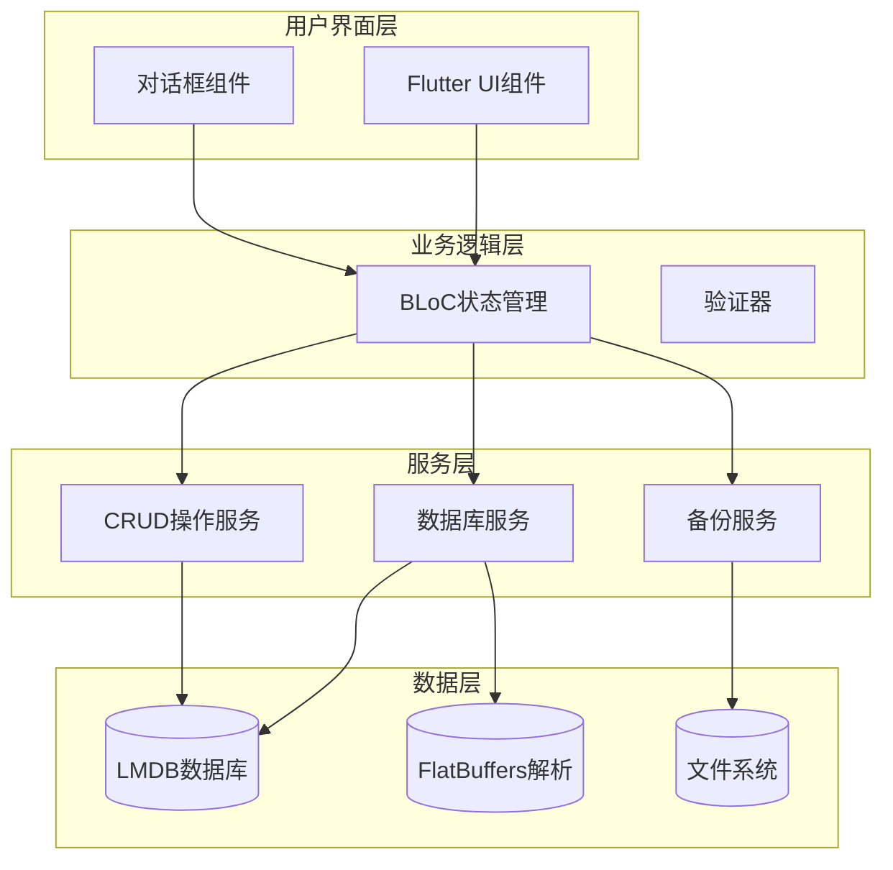
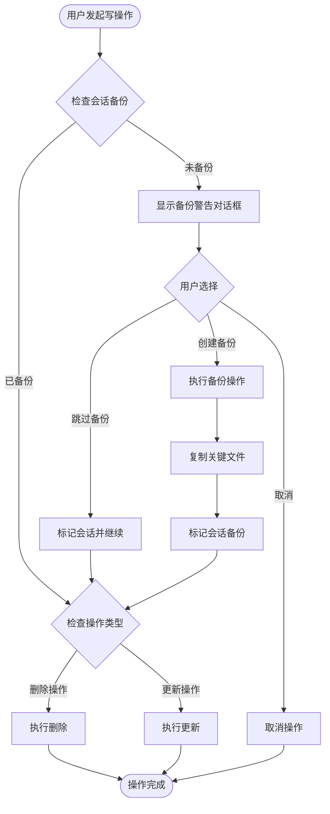
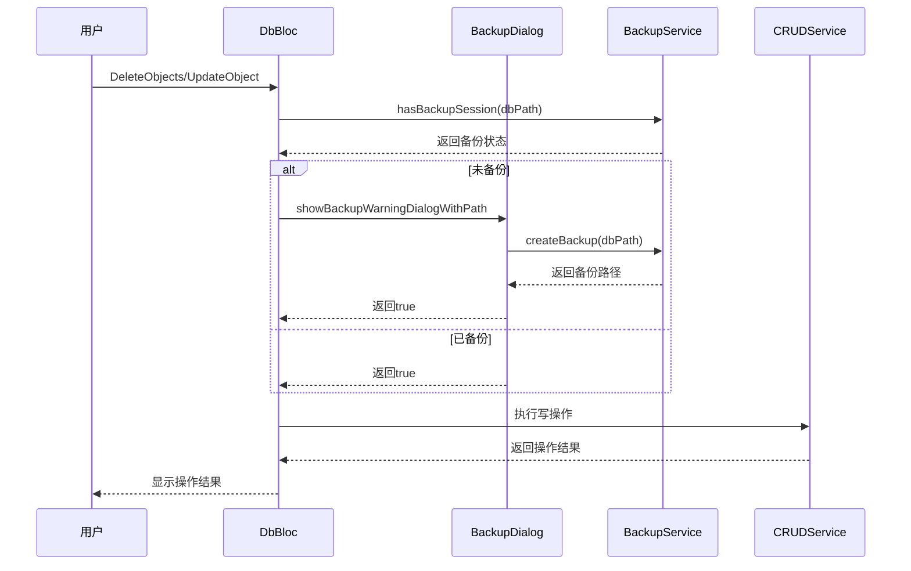
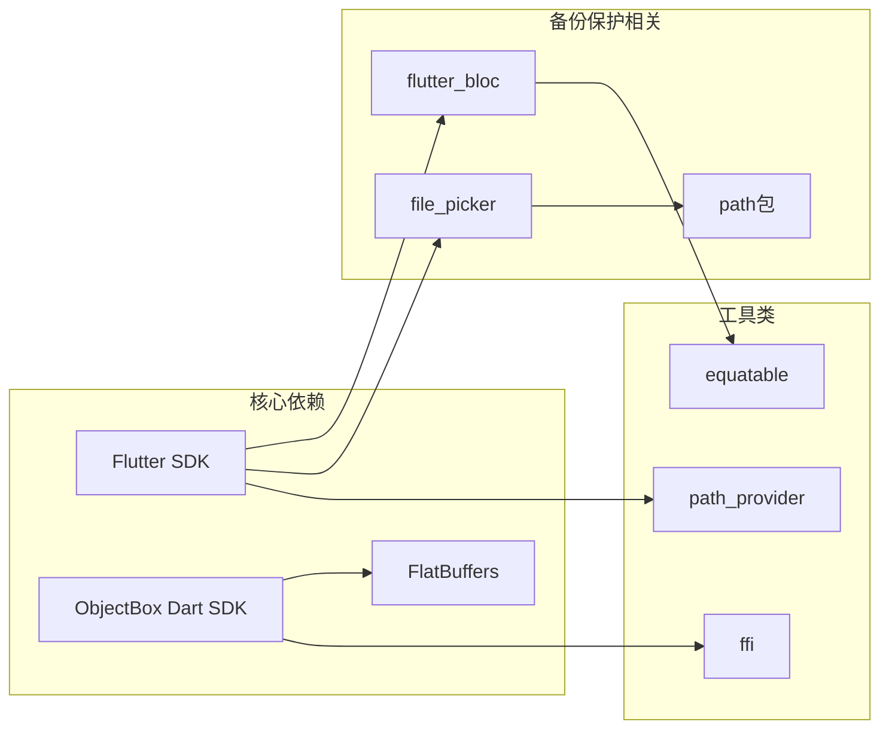
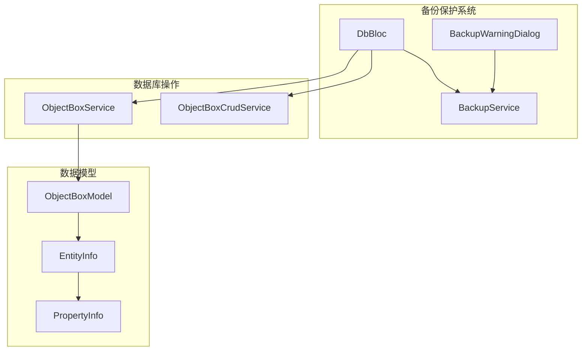

# 备份保护系统

<cite>
**本文档引用的文件**
- [README.md](file://README.md)
- [pubspec.yaml](file://pubspec.yaml)
- [lib/main.dart](file://lib/main.dart)
- [lib/bloc/db_bloc.dart](file://lib/bloc/db_bloc.dart)
- [lib/services/backup_service.dart](file://lib/services/backup_service.dart)
- [lib/widgets/backup_warning_dialog.dart](file://lib/widgets/backup_warning_dialog.dart)
- [lib/services/objectbox_service.dart](file://lib/services/objectbox_service.dart)
- [lib/models/objectbox_model.dart](file://lib/models/objectbox_model.dart)
</cite>

## 目录
1. [简介](#简介)
2. [项目结构](#项目结构)
3. [核心组件](#核心组件)
4. [架构概览](#架构概览)
5. [详细组件分析](#详细组件分析)
6. [依赖分析](#依赖分析)
7. [性能考虑](#性能考虑)
8. [故障排除指南](#故障排除指南)
9. [结论](#结论)

## 简介

ObjectBox Viewer 是一个跨平台桌面工具，专门用于浏览和检查 ObjectBox 数据库。该项目的核心特色是其强大的备份保护系统，确保用户在修改数据库时能够安全地保护数据。

该系统能够在不依赖 `objectbox-model.json` 的情况下直接从 `data.mdb` 文件中发现实体结构，支持 LMDB 和 FlatBuffers 的解析，并提供完整的备份保护机制。

## 项目结构

项目采用标准的 Flutter 应用程序结构，主要分为以下几个核心模块：

**图表来源**
- [lib/main.dart:1-156](file://lib/main.dart#L1-L156)
- [lib/bloc/db_bloc.dart:1-346](file://lib/bloc/db_bloc.dart#L1-L346)

**章节来源**
- [lib/main.dart:1-156](file://lib/main.dart#L1-L156)
- [pubspec.yaml:1-99](file://pubspec.yaml#L1-L99)

## 核心组件

### 备份保护系统架构

备份保护系统是整个应用程序的核心安全机制，主要由以下三个关键组件构成：

**图表来源**
- [lib/services/backup_service.dart:1-56](file://lib/services/backup_service.dart#L1-L56)
- [lib/widgets/backup_warning_dialog.dart:1-208](file://lib/widgets/backup_warning_dialog.dart#L1-L208)
- [lib/bloc/db_bloc.dart:274-341](file://lib/bloc/db_bloc.dart#L274-L341)

### 备份策略

系统采用智能的备份策略，确保在用户首次进行写操作时自动创建备份：

**图表来源**
- [lib/widgets/backup_warning_dialog.dart:15-29](file://lib/widgets/backup_warning_dialog.dart#L15-L29)
- [lib/services/backup_service.dart:12-39](file://lib/services/backup_service.dart#L12-L39)

**章节来源**
- [lib/services/backup_service.dart:1-56](file://lib/services/backup_service.dart#L1-L56)
- [lib/widgets/backup_warning_dialog.dart:1-208](file://lib/widgets/backup_warning_dialog.dart#L1-L208)

## 架构概览

### 整体系统架构

ObjectBox Viewer 采用 MVVM 架构模式，结合 BLoC 状态管理模式，构建了一个健壮的数据备份保护系统：

**图表来源**
- [lib/bloc/db_bloc.dart:148-345](file://lib/bloc/db_bloc.dart#L148-L345)
- [lib/services/backup_service.dart:5-55](file://lib/services/backup_service.dart#L5-L55)

### 备份保护流程

系统实现了多层次的备份保护机制：

**图表来源**
- [lib/widgets/backup_warning_dialog.dart:15-29](file://lib/widgets/backup_warning_dialog.dart#L15-L29)
- [lib/services/backup_service.dart:42-54](file://lib/services/backup_service.dart#L42-L54)

**章节来源**
- [lib/bloc/db_bloc.dart:274-341](file://lib/bloc/db_bloc.dart#L274-L341)
- [lib/services/backup_service.dart:1-56](file://lib/services/backup_service.dart#L1-L56)

## 详细组件分析

### 备份服务组件

备份服务是整个备份保护系统的核心组件，负责管理数据库文件的备份操作：

#### 核心功能分析

备份服务提供了以下关键功能：

1. **智能备份创建**：自动检测数据库目录中的关键文件并创建备份
2. **会话状态管理**：跟踪当前会话中是否已经创建过备份
3. **文件完整性保证**：确保备份包含所有必要的数据库文件

#### 备份文件策略

系统会自动备份以下关键文件：

| 文件名 | 描述 | 备份条件 |
|--------|------|----------|
| `data.mdb` | 主数据库文件，包含所有实体数据 | 总是备份 |
| `lock.mdb` | 锁文件，防止并发访问冲突 | 总是备份 |
| `objectbox-model.json` | 模式定义文件，包含实体结构信息 | 如果存在则备份 |

**章节来源**
- [lib/services/backup_service.dart:12-39](file://lib/services/backup_service.dart#L12-L39)

### 备份警告对话框组件

备份警告对话框提供了用户友好的交互界面，确保用户充分了解备份的重要性：

#### 对话框设计原则

对话框采用了三种不同的交互模式：

1. **基础对话框** (`showBackupWarningDialog`)
   - 仅显示警告信息
   - 用户可以选择取消或跳过备份
   - 不执行实际的备份操作

2. **带备份对话框** (`showBackupWarningDialogWithPath`)
   - 提供创建备份的选项
   - 自动执行备份操作
   - 显示备份结果反馈

#### 用户体验优化

对话框设计考虑了以下用户体验因素：

- **明确的警告信息**：强调这是会话中的首次修改操作
- **风险提示**：说明ObjectBox Viewer直接修改数据库且无撤销功能
- **多种选择**：提供取消、跳过备份、创建备份三种选项
- **状态反馈**：显示备份创建进度和结果

**章节来源**
- [lib/widgets/backup_warning_dialog.dart:15-208](file://lib/widgets/backup_warning_dialog.dart#L15-L208)

### 数据库BLoC组件

数据库BLoC组件负责协调备份保护系统与其他系统组件的交互：

#### 事件处理机制

BLoC组件监听以下与备份相关的事件：

1. **DeleteObjects事件**：处理对象删除操作
2. **UpdateObject事件**：处理对象更新操作
3. **OpenDatabase事件**：处理数据库打开操作

#### 备份集成点

在每次写操作之前，BLoC组件会自动检查并触发备份流程：

**图表来源**
- [lib/bloc/db_bloc.dart:274-341](file://lib/bloc/db_bloc.dart#L274-L341)
- [lib/widgets/backup_warning_dialog.dart:112-125](file://lib/widgets/backup_warning_dialog.dart#L112-L125)

**章节来源**
- [lib/bloc/db_bloc.dart:148-345](file://lib/bloc/db_bloc.dart#L148-L345)

## 依赖分析

### 外部依赖关系

项目使用了多个关键的外部依赖来实现备份保护功能：

**图表来源**
- [pubspec.yaml:30-46](file://pubspec.yaml#L30-L46)

### 内部组件依赖

备份保护系统内部组件之间的依赖关系如下：

**图表来源**
- [lib/services/backup_service.dart:1-56](file://lib/services/backup_service.dart#L1-L56)
- [lib/bloc/db_bloc.dart:148-160](file://lib/bloc/db_bloc.dart#L148-L160)
- [lib/models/objectbox_model.dart:30-106](file://lib/models/objectbox_model.dart#L30-L106)

**章节来源**
- [pubspec.yaml:30-46](file://pubspec.yaml#L30-L46)
- [lib/bloc/db_bloc.dart:148-160](file://lib/bloc/db_bloc.dart#L148-L160)

## 性能考虑

### 备份性能优化

备份系统在设计时充分考虑了性能影响：

1. **延迟备份策略**：只在用户首次进行写操作时才创建备份
2. **增量检查机制**：使用会话级别的备份状态缓存，避免重复备份
3. **异步操作**：备份操作在后台线程执行，不影响主界面响应性

### 内存使用优化

系统采用了以下内存优化策略：

- **流式文件复制**：避免一次性加载整个数据库到内存
- **按需解析**：只在需要时解析数据库结构信息
- **及时清理**：操作完成后及时释放不再使用的资源

## 故障排除指南

### 常见问题及解决方案

#### 备份失败问题

**问题描述**：备份操作执行失败，返回错误信息

**可能原因**：
1. 目标备份目录权限不足
2. 磁盘空间不足
3. 数据库文件被其他进程占用

**解决步骤**：
1. 检查目标目录的写入权限
2. 确认有足够的磁盘空间
3. 关闭可能占用数据库文件的其他程序
4. 重新尝试备份操作

#### 备份对话框不显示

**问题描述**：用户尝试进行写操作时，备份对话框没有出现

**可能原因**：
1. 会话中已经创建过备份
2. 应用程序状态异常
3. 对话框组件初始化失败

**解决步骤**：
1. 检查备份服务的状态缓存
2. 重启应用程序
3. 清除应用缓存后重试

#### 数据库文件损坏

**问题描述**：备份文件无法正常打开或读取

**可能原因**：
1. 备份过程中数据库被意外关闭
2. 文件系统错误
3. 备份文件被意外修改

**解决步骤**：
1. 使用原始数据库文件重建备份
2. 检查文件系统完整性
3. 验证备份文件的完整性

**章节来源**
- [lib/widgets/backup_warning_dialog.dart:92-107](file://lib/widgets/backup_warning_dialog.dart#L92-L107)
- [lib/services/backup_service.dart:12-39](file://lib/services/backup_service.dart#L12-L39)

## 结论

ObjectBox Viewer 的备份保护系统通过精心设计的多层防护机制，为用户提供了可靠的数据安全保障。系统的核心优势包括：

1. **自动化备份**：在用户首次进行写操作时自动触发备份流程
2. **用户控制**：提供明确的警告信息和多种操作选择
3. **可靠性保证**：确保备份包含所有关键的数据库文件
4. **性能优化**：最小化备份操作对用户体验的影响

该系统的设计充分体现了"预防胜于治疗"的理念，通过主动的安全措施保护用户的重要数据资产。对于任何需要直接操作数据库的应用程序，这种备份保护机制都是值得借鉴的最佳实践。