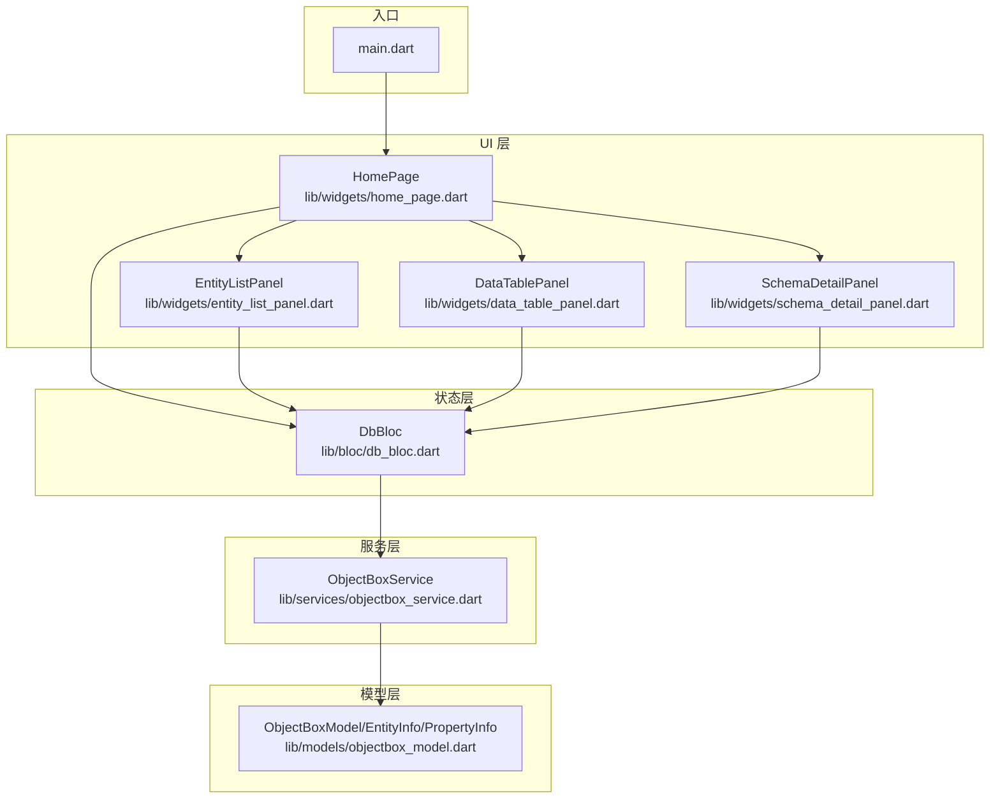
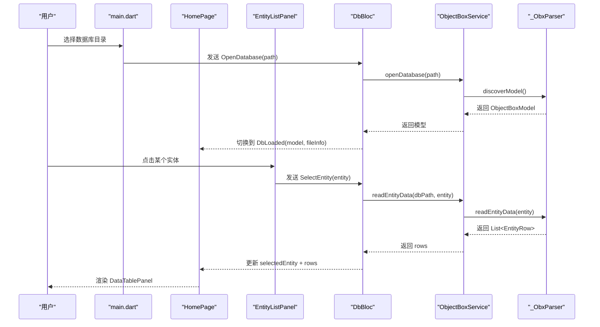
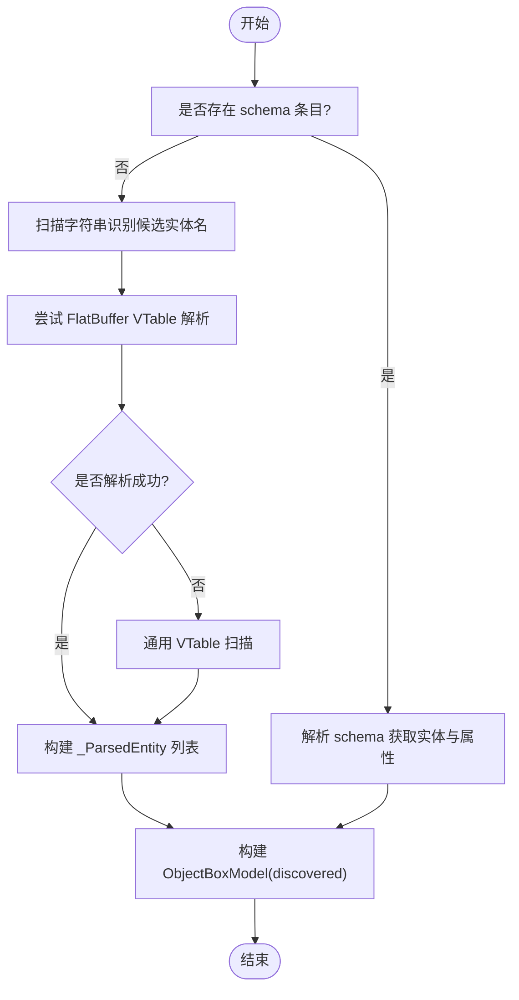
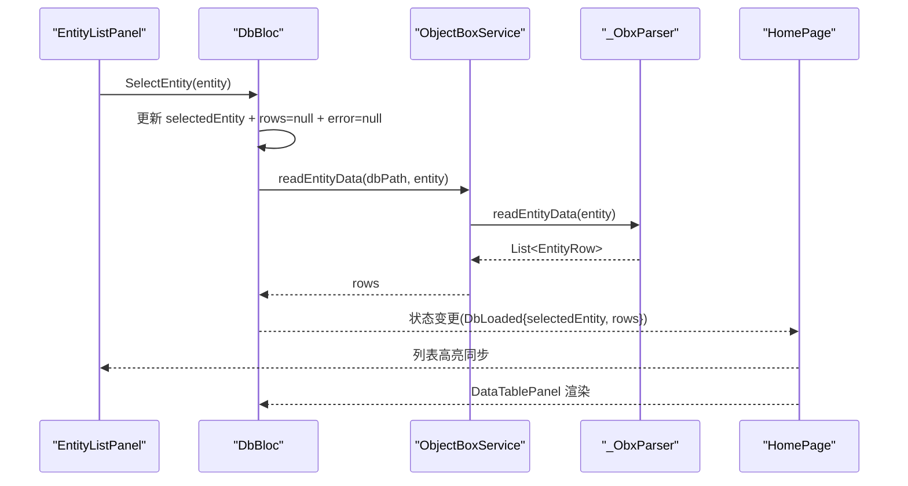
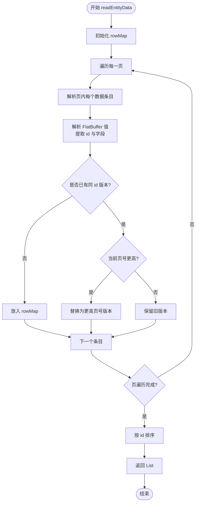
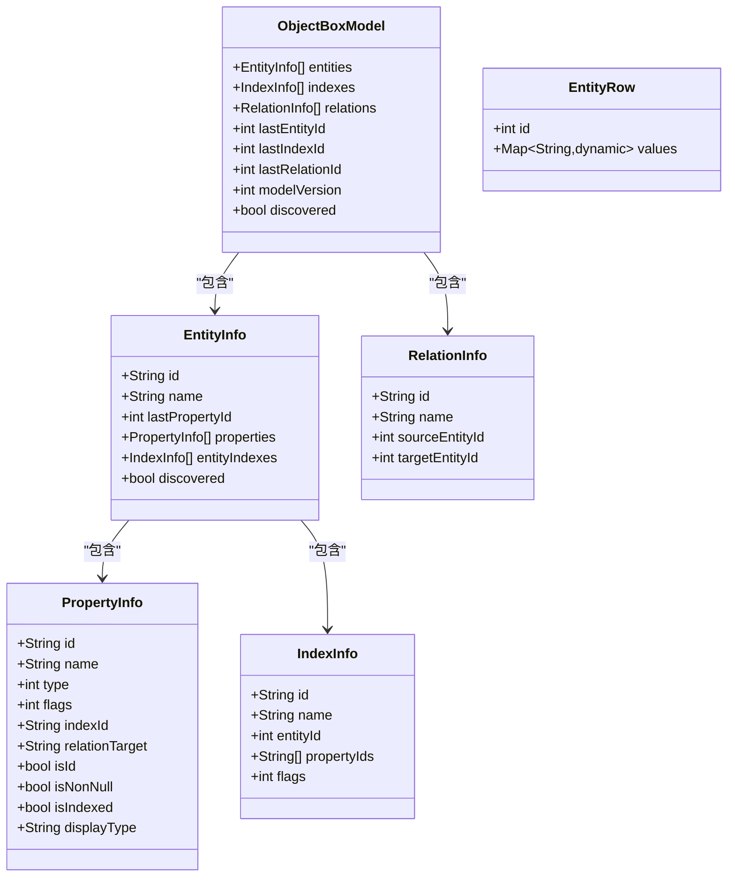
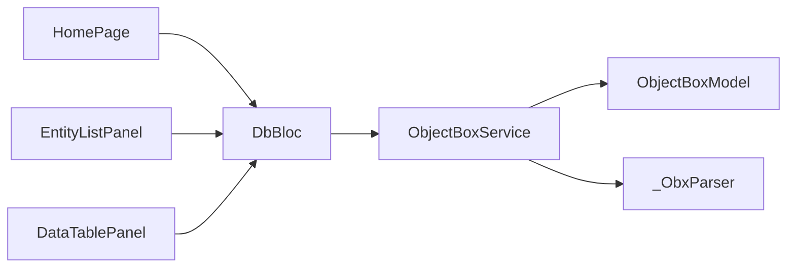

# 实体管理

<cite>
**本文引用的文件**
- [lib/main.dart](file://lib/main.dart)
- [lib/bloc/db_bloc.dart](file://lib/bloc/db_bloc.dart)
- [lib/models/objectbox_model.dart](file://lib/models/objectbox_model.dart)
- [lib/services/objectbox_service.dart](file://lib/services/objectbox_service.dart)
- [lib/widgets/entity_list_panel.dart](file://lib/widgets/entity_list_panel.dart)
- [lib/widgets/data_table_panel.dart](file://lib/widgets/data_table_panel.dart)
- [lib/widgets/home_page.dart](file://lib/widgets/home_page.dart)
- [lib/widgets/schema_detail_panel.dart](file://lib/widgets/schema_detail_panel.dart)
- [lib/services/simple_viewer.dart](file://lib/services/simple_viewer.dart)
- [pubspec.yaml](file://pubspec.yaml)
</cite>

## 目录
1. [简介](#简介)
2. [项目结构](#项目结构)
3. [核心组件](#核心组件)
4. [架构总览](#架构总览)
5. [详细组件分析](#详细组件分析)
6. [依赖关系分析](#依赖关系分析)
7. [性能考量](#性能考量)
8. [故障排查指南](#故障排查指南)
9. [结论](#结论)
10. [附录：最佳实践与示例路径](#附录最佳实践与示例路径)

## 简介
本文件系统性梳理“实体管理”功能，覆盖以下方面：
- 实体列表显示机制：实体发现算法、排序与过滤（当前实现为直接枚举）。
- 实体选择与切换逻辑：用户交互处理与状态同步。
- 实体数据查询：readEntityData 的实现原理、数据读取策略与去重机制。
- 数据模型设计：EntityInfo、PropertyInfo 及其在“已发现模式”下的动态补全。
- 最佳实践：性能优化与内存管理建议。
- 示例路径：如何实现高效的数据查询与展示。

## 项目结构
该项目采用 Flutter + BLoC 架构，核心模块如下：
- 入口与应用壳层：lib/main.dart、lib/widgets/home_page.dart
- 状态管理：lib/bloc/db_bloc.dart
- 模型定义：lib/models/objectbox_model.dart
- 数据服务：lib/services/objectbox_service.dart
- 视图组件：lib/widgets/entity_list_panel.dart、lib/widgets/data_table_panel.dart、lib/widgets/schema_detail_panel.dart
- 简化示例：lib/services/simple_viewer.dart
- 依赖声明：pubspec.yaml

图表来源
- [lib/main.dart:1-147](file://lib/main.dart#L1-L147)
- [lib/widgets/home_page.dart:1-218](file://lib/widgets/home_page.dart#L1-L218)
- [lib/bloc/db_bloc.dart:1-136](file://lib/bloc/db_bloc.dart#L1-L136)
- [lib/services/objectbox_service.dart:1-1006](file://lib/services/objectbox_service.dart#L1-L1006)
- [lib/models/objectbox_model.dart:1-248](file://lib/models/objectbox_model.dart#L1-L248)

章节来源
- [lib/main.dart:1-147](file://lib/main.dart#L1-L147)
- [lib/widgets/home_page.dart:1-218](file://lib/widgets/home_page.dart#L1-L218)
- [pubspec.yaml:1-96](file://pubspec.yaml#L1-L96)

## 核心组件
- 应用入口与主题配置：负责启动应用、打开数据库目录、构建状态栏与底部状态条。
- DbBloc：集中处理数据库打开、实体选择、刷新与关闭事件，维护 DbLoaded/DbError/DbLoading 等状态。
- ObjectBoxService：负责打开数据库、读取文件信息、解析 LMDB 并发现模型、读取实体数据。
- 视图组件：
  - EntityListPanel：展示实体列表，支持选中态高亮与统计信息。
  - DataTablePanel：以表格形式展示实体数据，支持刷新、错误提示与长文本详情弹窗。
  - SchemaDetailPanel：展示未选择实体时的模式概览卡片。
- 数据模型：
  - ObjectBoxModel、EntityInfo、PropertyInfo、IndexInfo、RelationInfo、EntityRow。

章节来源
- [lib/bloc/db_bloc.dart:1-136](file://lib/bloc/db_bloc.dart#L1-L136)
- [lib/services/objectbox_service.dart:1-1006](file://lib/services/objectbox_service.dart#L1-L1006)
- [lib/models/objectbox_model.dart:1-248](file://lib/models/objectbox_model.dart#L1-L248)
- [lib/widgets/entity_list_panel.dart:1-131](file://lib/widgets/entity_list_panel.dart#L1-L131)
- [lib/widgets/data_table_panel.dart:1-345](file://lib/widgets/data_table_panel.dart#L1-L345)
- [lib/widgets/schema_detail_panel.dart](file://lib/widgets/schema_detail_panel.dart)

## 架构总览
整体流程：用户通过入口选择数据库目录，DbBloc 打开数据库并加载模型；用户在实体列表中选择某实体，DbBloc 调用服务读取该实体数据并更新状态；视图根据状态渲染实体列表或数据表格。

图表来源
- [lib/main.dart:97-145](file://lib/main.dart#L97-L145)
- [lib/widgets/home_page.dart:14-89](file://lib/widgets/home_page.dart#L14-L89)
- [lib/bloc/db_bloc.dart:101-130](file://lib/bloc/db_bloc.dart#L101-L130)
- [lib/services/objectbox_service.dart:10-41](file://lib/services/objectbox_service.dart#L10-L41)
- [lib/services/objectbox_service.dart:31-40](file://lib/services/objectbox_service.dart#L31-L40)

## 详细组件分析

### 实体列表显示机制
- 实体发现算法
  - 若存在 schema 记录，优先从 schema 解析实体与属性。
  - 否则进行字符串扫描与 FlatBuffer VTable 探测，自动发现实体名与字段数量。
  - 对于未找到 schema 的情况，生成“已发现模式”的实体与属性占位，后续运行时再填充真实类型与名称。
- 实体排序与过滤
  - 当从 schema 解析时，按实体 id 排序；当从字符串扫描解析时，按出现顺序收集，不做额外排序。
  - 过滤：当前实现为直接遍历 model.entities，未提供 UI 级过滤器。
- 列表渲染与交互
  - 使用 ListView.builder 构建实体项，高亮选中项，点击触发 SelectEntity 事件。

图表来源
- [lib/services/objectbox_service.dart:78-111](file://lib/services/objectbox_service.dart#L78-L111)
- [lib/services/objectbox_service.dart:158-185](file://lib/services/objectbox_service.dart#L158-L185)
- [lib/services/objectbox_service.dart:187-217](file://lib/services/objectbox_service.dart#L187-L217)

章节来源
- [lib/widgets/entity_list_panel.dart:52-84](file://lib/widgets/entity_list_panel.dart#L52-L84)
- [lib/services/objectbox_service.dart:78-111](file://lib/services/objectbox_service.dart#L78-L111)

### 实体选择与切换逻辑
- 用户交互
  - EntityListPanel 中点击实体项，回调 onEntitySelected，触发 DbBloc.SelectEntity。
- 状态同步
  - DbBloc 在收到 SelectEntity 后：
    - 将当前 selectedEntity 更新为新实体，并清空 rows 与错误。
    - 异步调用服务读取数据，成功后更新 rows，失败则设置 error。
  - HomePage 根据 DbState 决定渲染 SchemaDetailPanel 或 DataTablePanel。

图表来源
- [lib/widgets/entity_list_panel.dart:58-62](file://lib/widgets/entity_list_panel.dart#L58-L62)
- [lib/bloc/db_bloc.dart:112-124](file://lib/bloc/db_bloc.dart#L112-L124)
- [lib/services/objectbox_service.dart:31-40](file://lib/services/objectbox_service.dart#L31-L40)
- [lib/widgets/home_page.dart:39-61](file://lib/widgets/home_page.dart#L39-L61)

章节来源
- [lib/bloc/db_bloc.dart:112-124](file://lib/bloc/db_bloc.dart#L112-L124)
- [lib/widgets/home_page.dart:22-71](file://lib/widgets/home_page.dart#L22-L71)

### 实体数据查询：readEntityData 实现原理
- 数据读取策略
  - 遍历所有页，提取数据条目，解析 FlatBuffer 值，提取对象 id 与各字段值。
  - 对于同一对象（按 ObjectId 分组），保留来自最高页号（最新写入）的版本，避免重复。
  - 最终对结果按 ObjectId 排序返回。
- 类型推断与回填
  - 若 schema 中未知类型，按启发式规则尝试读取为 long/int32/float/string/bool 等，若成功则回填 PropertyInfo。
- 错误处理
  - 无法解析时返回兜底值（如字符串列表），保证 UI 不中断。

图表来源
- [lib/services/objectbox_service.dart:369-399](file://lib/services/objectbox_service.dart#L369-L399)
- [lib/services/objectbox_service.dart:683-760](file://lib/services/objectbox_service.dart#L683-L760)
- [lib/services/objectbox_service.dart:762-768](file://lib/services/objectbox_service.dart#L762-L768)

章节来源
- [lib/services/objectbox_service.dart:31-40](file://lib/services/objectbox_service.dart#L31-L40)
- [lib/services/objectbox_service.dart:369-399](file://lib/services/objectbox_service.dart#L369-L399)
- [lib/services/objectbox_service.dart:683-760](file://lib/services/objectbox_service.dart#L683-L760)

### 数据模型设计：EntityInfo 与 PropertyInfo
- ObjectBoxModel
  - 包含 entities、indexes、relations、id/索引/关系计数、modelVersion、discovered 标记。
  - 支持从 JSON 构造（discovered=false）与“已发现模式”构造（discovered=true）。
- EntityInfo
  - 字段：id、name、lastPropertyId、properties、entityIndexes、discovered。
  - 提供 fromJson 与 discovered 工厂方法。
- PropertyInfo
  - 字段：id、name、type、flags、indexId、relationTarget。
  - 提供 fromJson 与 discovered 工厂方法；支持 isId/isNonNull/isIndexed 等便捷判断。
  - PropertyType 枚举覆盖常见类型，含“已发现类型”用于动态推断。
- EntityRow
  - 单行数据：id 与 values 映射。

图表来源
- [lib/models/objectbox_model.dart:1-248](file://lib/models/objectbox_model.dart#L1-L248)

章节来源
- [lib/models/objectbox_model.dart:1-248](file://lib/models/objectbox_model.dart#L1-L248)

### 表格展示与交互细节
- DataTablePanel
  - 当 error 存在时展示错误视图；当 rows 为空时展示“无数据”占位；否则渲染实体表格。
  - 表头包含列名与类型标记（在 discovered 模式下）；单元格支持点击查看详情弹窗（超长文本复制）。
- EntityListPanel
  - 列表项高亮当前选中实体；右侧显示属性数量；点击触发 onEntitySelected 回调。
- SchemaDetailPanel
  - 未选择实体时展示实体卡片与属性表（仅在非 discovered 模式下显示 ID）。

章节来源
- [lib/widgets/data_table_panel.dart:1-345](file://lib/widgets/data_table_panel.dart#L1-L345)
- [lib/widgets/entity_list_panel.dart:1-131](file://lib/widgets/entity_list_panel.dart#L1-L131)
- [lib/widgets/schema_detail_panel.dart](file://lib/widgets/schema_detail_panel.dart)

## 依赖关系分析
- 组件耦合
  - DbBloc 与 ObjectBoxService 强耦合，前者负责事件驱动与状态更新，后者负责底层解析。
  - 视图组件通过 BlocBuilder 与 DbBloc 解耦，仅依赖状态输出。
- 外部依赖
  - flutter_bloc、equatable、path、file_picker、path_provider 等。
- 潜在循环依赖
  - 未见直接循环；状态与服务分离良好。

图表来源
- [lib/widgets/home_page.dart:14-71](file://lib/widgets/home_page.dart#L14-L71)
- [lib/bloc/db_bloc.dart:91-135](file://lib/bloc/db_bloc.dart#L91-L135)
- [lib/services/objectbox_service.dart:9-41](file://lib/services/objectbox_service.dart#L9-L41)
- [lib/models/objectbox_model.dart:1-248](file://lib/models/objectbox_model.dart#L1-L248)

章节来源
- [pubspec.yaml:30-43](file://pubspec.yaml#L30-L43)

## 性能考量
- 解析复杂度
  - 读取数据：遍历所有页与条目，时间复杂度近似 O(P×E)，其中 P 为页数，E 为每页条目数。
  - 去重与排序：按 ObjectId 去重并排序，整体复杂度 O(N log N)，N 为唯一记录数。
- 内存占用
  - rowMap 保存每个对象的最新版本，内存与唯一对象数线性相关。
  - 字符串与二进制解析可能产生临时缓冲区，建议在大数据集场景下分批处理或懒加载。
- UI 渲染
  - DataTablePanel 使用可滚动容器，避免大表格一次性渲染导致卡顿。
- 优化建议
  - 分页/虚拟化：对大表采用分页或虚拟列表，仅渲染可见区域。
  - 缓存策略：对最近访问的实体数据进行短期缓存，减少重复解析。
  - 类型预判：在 schema 完整时尽量避免动态类型推断，降低启发式分支成本。
  - I/O 优化：避免重复读取 data.mdb，可在 DbBloc 中缓存已打开的字节流（谨慎处理文件变更）。

[本节为通用性能指导，不直接分析具体文件]

## 故障排查指南
- 常见错误
  - 数据库目录不存在或 data.mdb 缺失：打开数据库阶段抛出异常。
  - 读取实体数据失败：DbBloc 捕获异常并设置 error，DataTablePanel 展示错误视图。
- 排查步骤
  - 确认数据库目录包含 data.mdb 与 lock.mdb。
  - 若无 objectbox-model.json，系统会进入“已发现模式”，字段名与类型为占位，需等待运行时解析。
  - 使用“刷新”按钮重新加载当前实体数据。
- 相关实现位置
  - 打开数据库与错误处理：DbBloc.OpenDatabase
  - 读取实体数据与错误回退：DbBloc.SelectEntity
  - UI 错误视图：HomePage._ErrorView

章节来源
- [lib/bloc/db_bloc.dart:101-110](file://lib/bloc/db_bloc.dart#L101-L110)
- [lib/bloc/db_bloc.dart:118-123](file://lib/bloc/db_bloc.dart#L118-L123)
- [lib/widgets/home_page.dart:190-217](file://lib/widgets/home_page.dart#L190-L217)

## 结论
本实体管理子系统以 BLoC 为核心，结合自研 LMDB/FlatBuffer 解析器，实现了无需 objectbox-model.json 的数据库浏览能力。其实体发现、选择切换与数据读取流程清晰，具备良好的扩展性。针对大规模数据，建议引入分页/虚拟化与缓存策略以提升性能与用户体验。

[本节为总结性内容，不直接分析具体文件]

## 附录：最佳实践与示例路径
- 性能优化
  - 分页/虚拟化：参考 DataTablePanel 的滚动容器设计，结合分页接口（建议在服务层增加分页参数）。
  - 缓存：在 DbBloc 中缓存最近实体的 rows，避免重复解析。
  - 类型预判：优先使用 schema 模式，减少动态推断。
- 内存管理
  - 控制 rowMap 的生命周期，离开页面时及时释放。
  - 对超长文本采用延迟解析与弹窗展示，避免一次性渲染。
- 示例路径（不展示代码，仅给出定位）
  - 实体列表渲染与选中态：[lib/widgets/entity_list_panel.dart:52-84](file://lib/widgets/entity_list_panel.dart#L52-L84)
  - 选择实体事件与状态更新：[lib/bloc/db_bloc.dart:112-124](file://lib/bloc/db_bloc.dart#L112-L124)
  - 实体数据读取与去重排序：[lib/services/objectbox_service.dart:369-399](file://lib/services/objectbox_service.dart#L369-L399)
  - FlatBuffer 字段读取与类型推断：[lib/services/objectbox_service.dart:770-875](file://lib/services/objectbox_service.dart#L770-L875)
  - 表格展示与详情弹窗：[lib/widgets/data_table_panel.dart:150-294](file://lib/widgets/data_table_panel.dart#L150-L294)
  - 模型与数据结构定义：[lib/models/objectbox_model.dart:1-248](file://lib/models/objectbox_model.dart#L1-L248)

[本节为指引性内容，不直接分析具体文件]