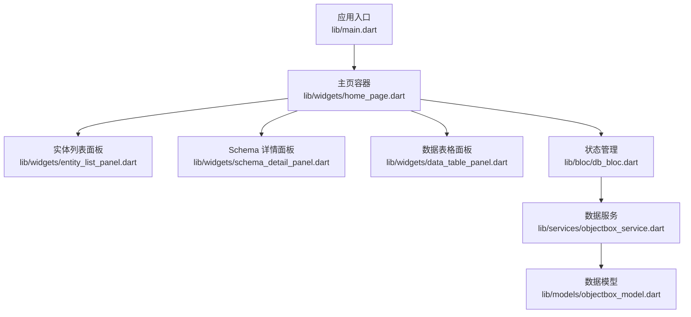
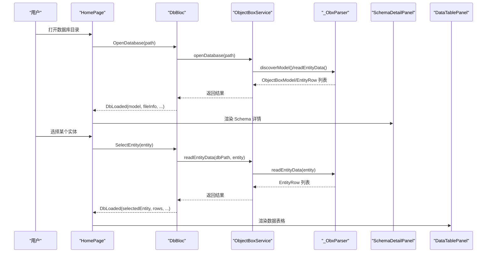
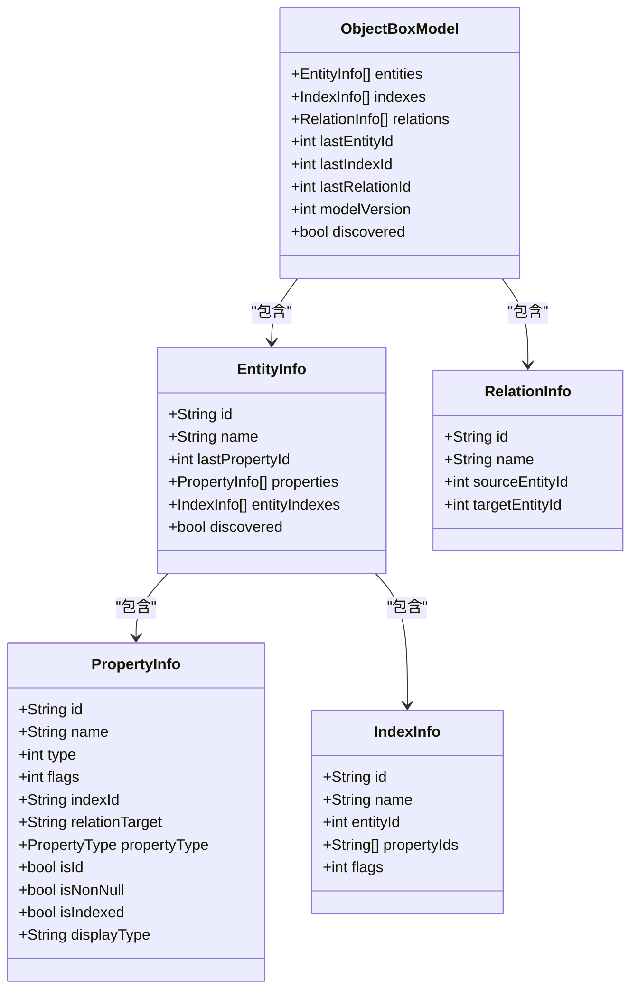
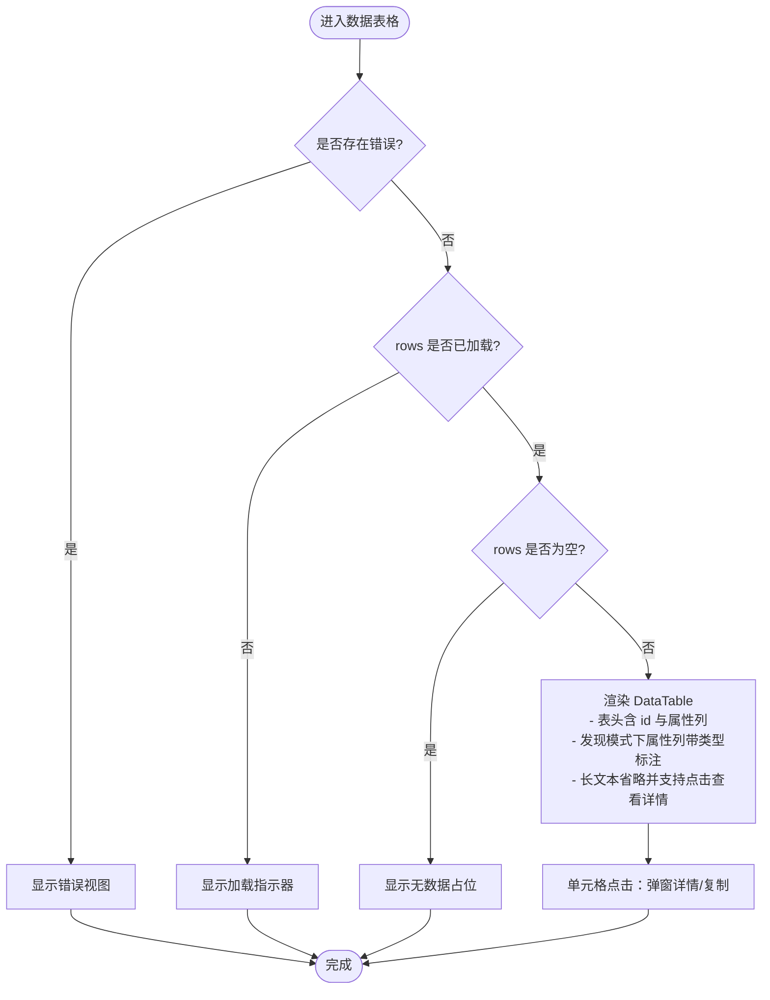
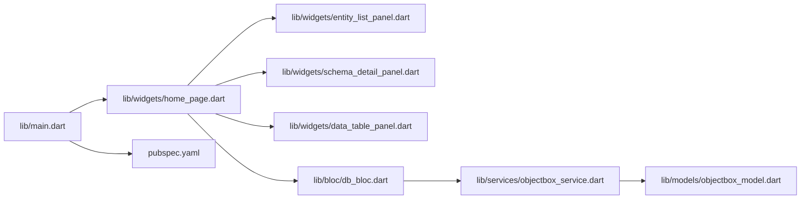

# 数据展示

<cite>
**本文引用的文件**
- [lib/main.dart](file://lib/main.dart)
- [lib/bloc/db_bloc.dart](file://lib/bloc/db_bloc.dart)
- [lib/models/objectbox_model.dart](file://lib/models/objectbox_model.dart)
- [lib/services/objectbox_service.dart](file://lib/services/objectbox_service.dart)
- [lib/widgets/home_page.dart](file://lib/widgets/home_page.dart)
- [lib/widgets/schema_detail_panel.dart](file://lib/widgets/schema_detail_panel.dart)
- [lib/widgets/entity_list_panel.dart](file://lib/widgets/entity_list_panel.dart)
- [lib/widgets/data_table_panel.dart](file://lib/widgets/data_table_panel.dart)
- [pubspec.yaml](file://pubspec.yaml)
</cite>

## 目录
1. [简介](#简介)
2. [项目结构](#项目结构)
3. [核心组件](#核心组件)
4. [架构总览](#架构总览)
5. [详细组件分析](#详细组件分析)
6. [依赖分析](#依赖分析)
7. [性能考虑](#性能考虑)
8. [故障排查指南](#故障排查指南)
9. [结论](#结论)
10. [附录](#附录)

## 简介
本文件聚焦于 ObjectBox Viewer 的“数据展示”能力，系统性说明以下内容：
- Schema 详情展示：实体结构解析、属性详情显示与格式化输出
- 数据表格浏览：EntityRow 数据模型、表格渲染机制与用户交互
- 性能优化策略：大数据集处理、虚拟滚动与懒加载思路
- 不同数据类型的展示方式：基本类型、复合类型与关系类型
- UI 组件使用指南：自定义样式、响应式布局与无障碍支持
- 实现示例与最佳实践建议（以源码路径代替具体代码）

## 项目结构
该项目采用 Flutter + BLoC 架构，围绕数据库打开、模型解析、实体选择与数据表格展示展开。关键模块如下：
- 应用入口与主题：lib/main.dart
- 状态管理：lib/bloc/db_bloc.dart
- 数据模型：lib/models/objectbox_model.dart
- 数据服务与解析：lib/services/objectbox_service.dart
- 视图组件：lib/widgets 下的各面板组件
- 依赖声明：pubspec.yaml

图表来源
- [lib/main.dart:1-147](file://lib/main.dart#L1-L147)
- [lib/widgets/home_page.dart:1-218](file://lib/widgets/home_page.dart#L1-L218)
- [lib/widgets/entity_list_panel.dart:1-131](file://lib/widgets/entity_list_panel.dart#L1-L131)
- [lib/widgets/schema_detail_panel.dart:1-283](file://lib/widgets/schema_detail_panel.dart#L1-L283)
- [lib/widgets/data_table_panel.dart:1-345](file://lib/widgets/data_table_panel.dart#L1-L345)
- [lib/bloc/db_bloc.dart:1-136](file://lib/bloc/db_bloc.dart#L1-L136)
- [lib/services/objectbox_service.dart:1-800](file://lib/services/objectbox_service.dart#L1-L800)
- [lib/models/objectbox_model.dart:1-248](file://lib/models/objectbox_model.dart#L1-L248)

章节来源
- [lib/main.dart:1-147](file://lib/main.dart#L1-L147)
- [lib/widgets/home_page.dart:1-218](file://lib/widgets/home_page.dart#L1-L218)

## 核心组件
- 数据模型层
  - ObjectBoxModel、EntityInfo、PropertyInfo、IndexInfo、RelationInfo 及枚举 PropertyType，用于描述 Schema 结构与属性元数据
  - EntityRow 表示单行数据，包含 id 与字段值映射
- 业务服务层
  - ObjectBoxService 负责打开数据库、读取文件信息、解析 FlatBuffer 并读取实体数据
- UI 展示层
  - SchemaDetailPanel：展示数据库文件信息、模型概览、实体与关系
  - EntityListPanel：列出所有实体并支持选择
  - DataTablePanel：以表格形式展示选中实体的数据行，并提供刷新与详情查看
- 状态管理层
  - DbBloc：处理打开数据库、选择实体、刷新数据、关闭数据库等事件，维护 DbLoaded/DbError 等状态

章节来源
- [lib/models/objectbox_model.dart:1-248](file://lib/models/objectbox_model.dart#L1-L248)
- [lib/services/objectbox_service.dart:1-800](file://lib/services/objectbox_service.dart#L1-L800)
- [lib/widgets/schema_detail_panel.dart:1-283](file://lib/widgets/schema_detail_panel.dart#L1-L283)
- [lib/widgets/entity_list_panel.dart:1-131](file://lib/widgets/entity_list_panel.dart#L1-L131)
- [lib/widgets/data_table_panel.dart:1-345](file://lib/widgets/data_table_panel.dart#L1-L345)
- [lib/bloc/db_bloc.dart:1-136](file://lib/bloc/db_bloc.dart#L1-L136)

## 架构总览
下图展示了从用户操作到数据渲染的端到端流程。

图表来源
- [lib/widgets/home_page.dart:1-218](file://lib/widgets/home_page.dart#L1-L218)
- [lib/bloc/db_bloc.dart:1-136](file://lib/bloc/db_bloc.dart#L1-L136)
- [lib/services/objectbox_service.dart:1-800](file://lib/services/objectbox_service.dart#L1-L800)

## 详细组件分析

### Schema 详情展示（实体结构与属性）
- 功能要点
  - 展示数据库文件信息（文件名与大小）
  - 在非发现模式下展示模型版本、实体数、索引数、关系数
  - 每个实体卡片展示名称、ID、字段表（属性名、类型、标志位、ID），在未发现时提示点击后发现字段
  - 关系列表仅在非发现且存在关系时展示
- 数据来源
  - ObjectBoxModel、EntityInfo、PropertyInfo、IndexInfo、RelationInfo
  - 文件信息由服务层收集返回
- 展示细节
  - 使用卡片与表格组合，列宽按比例分配，标题加粗
  - 属性标志位通过逻辑计算生成（如是否为 ID、是否非空、是否建立索引）
  - 发现模式下对实体与属性进行标注，提示自动推断

图表来源
- [lib/models/objectbox_model.dart:1-248](file://lib/models/objectbox_model.dart#L1-L248)

章节来源
- [lib/widgets/schema_detail_panel.dart:1-283](file://lib/widgets/schema_detail_panel.dart#L1-L283)
- [lib/models/objectbox_model.dart:1-248](file://lib/models/objectbox_model.dart#L1-L248)

### 数据表格浏览（EntityRow、渲染与交互）
- 数据模型
  - EntityRow：包含对象 id 与字段值映射
- 表格渲染
  - 表头包含 id 列与其他属性列；当处于发现模式时，属性列会附加类型标注
  - 单元格根据值长度截断或省略，长文本支持弹窗查看详情与复制
  - 值的颜色区分：布尔、整型、浮点、字符串等
- 用户交互
  - 支持点击单元格弹出详情对话框
  - 提供刷新按钮重新拉取当前实体数据
- 处理逻辑
  - 当 rows 为空时显示“无数据”占位
  - 当发生错误时显示错误信息与可选的重试关闭

图表来源
- [lib/widgets/data_table_panel.dart:1-345](file://lib/widgets/data_table_panel.dart#L1-L345)

章节来源
- [lib/widgets/data_table_panel.dart:1-345](file://lib/widgets/data_table_panel.dart#L1-L345)
- [lib/models/objectbox_model.dart:241-248](file://lib/models/objectbox_model.dart#L241-L248)

### 实体列表与导航
- 功能要点
  - 左侧实体列表，支持选择实体、关闭数据库
  - 顶部统计显示实体数量与索引数量
  - 选中实体高亮，右侧切换到数据表格面板
- 交互流程
  - 点击实体 -> 触发 SelectEntity 事件 -> 服务层读取该实体数据 -> 更新状态并渲染表格

章节来源
- [lib/widgets/entity_list_panel.dart:1-131](file://lib/widgets/entity_list_panel.dart#L1-L131)
- [lib/bloc/db_bloc.dart:112-124](file://lib/bloc/db_bloc.dart#L112-L124)

### 主页容器与状态驱动
- 功能要点
  - 根据 DbState 渲染欢迎页、加载中、错误或内容区域
  - 内容区域左侧实体列表，右侧根据是否选择实体渲染 Schema 详情或数据表格
  - 发现模式下顶部横幅提示
- 事件触发
  - 打开数据库、选择实体、刷新数据、关闭数据库

章节来源
- [lib/widgets/home_page.dart:1-218](file://lib/widgets/home_page.dart#L1-L218)
- [lib/bloc/db_bloc.dart:101-130](file://lib/bloc/db_bloc.dart#L101-L130)

## 依赖分析
- 外部依赖
  - flutter_bloc：状态管理
  - file_picker：文件选择
  - path_provider/path：路径处理
  - equatable：相等性比较
- 内部依赖
  - widgets 依赖 models 与 services
  - db_bloc 作为桥梁连接 widgets 与 services
  - main.dart 作为应用入口，注册主题与路由壳体

图表来源
- [lib/main.dart:1-147](file://lib/main.dart#L1-L147)
- [pubspec.yaml:1-96](file://pubspec.yaml#L1-L96)

章节来源
- [pubspec.yaml:1-96](file://pubspec.yaml#L1-L96)

## 性能考虑
- 大数据集处理
  - 解析阶段：LMDB 页面扫描与 FlatBuffer 字段读取，按页遍历并去重保留最新写入版本（基于页号）
  - 展示阶段：表格采用横向滚动与固定列宽，避免过宽导致布局抖动
- 虚拟滚动与懒加载
  - 当前实现使用标准列表/表格组件；对于超大数据集，建议引入虚拟化方案（如按需渲染可见行）以降低内存占用与重绘成本
- I/O 与解析优化
  - 一次性读取 data.mdb，解析时复用字节缓冲区与偏移计算，减少重复扫描
  - 属性类型未知时采用启发式推断，逐步完善模型
- UI 响应性
  - 加载态与错误态明确反馈，避免长时间阻塞
  - 长文本单元格截断显示，详情弹窗异步复制，避免主线程卡顿

章节来源
- [lib/services/objectbox_service.dart:369-399](file://lib/services/objectbox_service.dart#L369-L399)
- [lib/widgets/data_table_panel.dart:170-251](file://lib/widgets/data_table_panel.dart#L170-L251)

## 故障排查指南
- 常见问题
  - 无法找到数据库文件：确认目录包含 data.mdb；若未找到，检查子目录
  - 打开失败：查看错误视图中的异常信息，尝试重新打开或更换数据库
  - 无数据或空白表格：确认实体存在记录；使用刷新按钮重新加载
  - 发现模式字段不完整：首次加载仅展示实体名，点击实体后触发字段发现
- 定位方法
  - 查看 DbError 状态与错误消息
  - 检查服务层 openDatabase/readEntityData 抛出的异常
  - 核对实体属性标志位与类型标注（发现模式下属性类型可能为推断）

章节来源
- [lib/widgets/home_page.dart:190-217](file://lib/widgets/home_page.dart#L190-L217)
- [lib/bloc/db_bloc.dart:101-124](file://lib/bloc/db_bloc.dart#L101-L124)
- [lib/services/objectbox_service.dart:10-41](file://lib/services/objectbox_service.dart#L10-L41)

## 结论
本项目通过清晰的分层设计与状态驱动，实现了从数据库打开、Schema 解析、实体选择到数据表格展示的完整链路。Schema 详情与数据表格分别承担“结构概览”和“明细浏览”的职责；在发现模式下，系统能够直接从 LMDB 文件解析实体与属性，具备良好的兼容性。未来可在超大数据集场景引入虚拟滚动与更细粒度的懒加载策略，进一步提升性能与用户体验。

## 附录

### 数据类型展示方式
- 基本类型
  - 布尔、整型、浮点、字符串等，单元格按类型着色并保持可读性
- 复合类型
  - 向量/列表类型在发现模式下以“未知类型”标注，后续解析完善
- 关系类型
  - 关系信息在非发现模式下以列表形式展示，包含源实体与目标实体标识

章节来源
- [lib/widgets/data_table_panel.dart:296-344](file://lib/widgets/data_table_panel.dart#L296-L344)
- [lib/widgets/schema_detail_panel.dart:107-119](file://lib/widgets/schema_detail_panel.dart#L107-L119)
- [lib/models/objectbox_model.dart:108-142](file://lib/models/objectbox_model.dart#L108-L142)

### UI 组件使用指南
- 自定义样式
  - 使用主题色板与 Material 3 设计规范，卡片、标签与图标统一风格
  - 表头与单元格字体、颜色与尺寸在组件内集中配置
- 响应式设计
  - 左右分栏布局，实体列表固定宽度，内容区域自适应
  - 表格支持横向滚动，避免窄屏下列拥挤
- 无障碍支持
  - 提供可选的 Tooltip 与图标说明
  - 对话框与按钮具备明确文案与焦点顺序

章节来源
- [lib/main.dart:28-43](file://lib/main.dart#L28-L43)
- [lib/widgets/data_table_panel.dart:170-251](file://lib/widgets/data_table_panel.dart#L170-L251)
- [lib/widgets/schema_detail_panel.dart:167-253](file://lib/widgets/schema_detail_panel.dart#L167-L253)