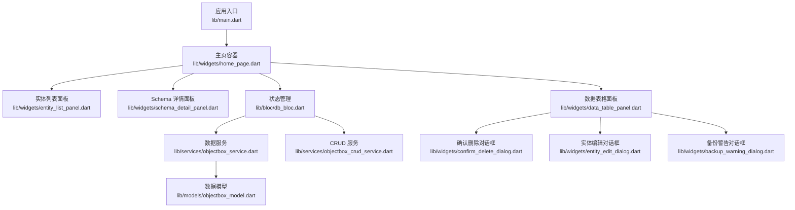
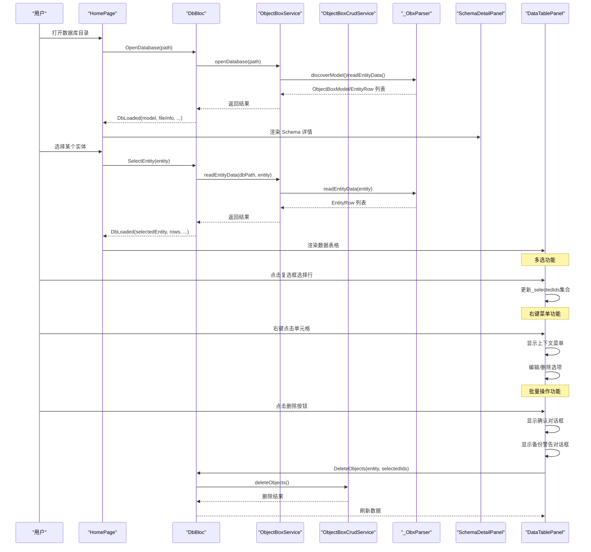
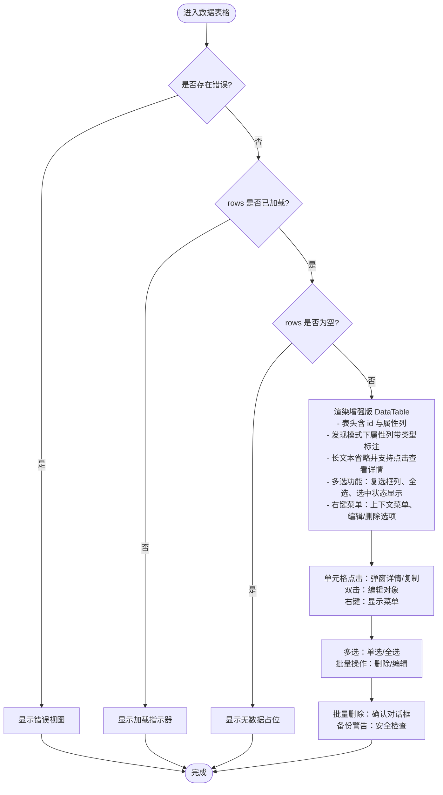
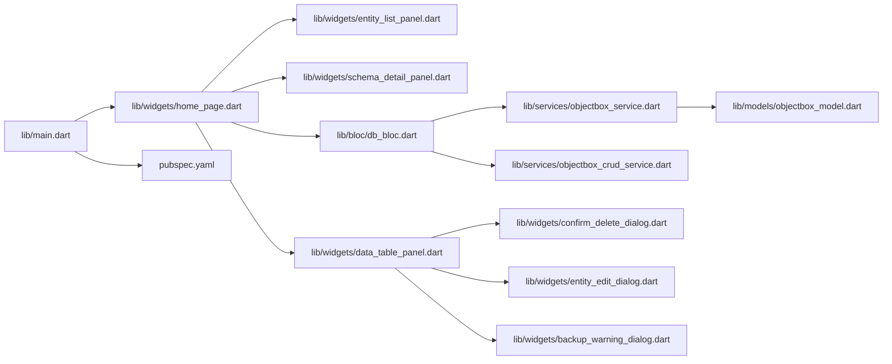

# 数据展示

<cite>
**本文引用的文件**
- [lib/main.dart](file://lib/main.dart)
- [lib/bloc/db_bloc.dart](file://lib/bloc/db_bloc.dart)
- [lib/models/objectbox_model.dart](file://lib/models/objectbox_model.dart)
- [lib/services/objectbox_service.dart](file://lib/services/objectbox_service.dart)
- [lib/services/objectbox_crud_service.dart](file://lib/services/objectbox_crud_service.dart)
- [lib/widgets/home_page.dart](file://lib/widgets/home_page.dart)
- [lib/widgets/schema_detail_panel.dart](file://lib/widgets/schema_detail_panel.dart)
- [lib/widgets/entity_list_panel.dart](file://lib/widgets/entity_list_panel.dart)
- [lib/widgets/data_table_panel.dart](file://lib/widgets/data_table_panel.dart)
- [lib/widgets/confirm_delete_dialog.dart](file://lib/widgets/confirm_delete_dialog.dart)
- [lib/widgets/entity_edit_dialog.dart](file://lib/widgets/entity_edit_dialog.dart)
- [lib/widgets/backup_warning_dialog.dart](file://lib/widgets/backup_warning_dialog.dart)
- [pubspec.yaml](file://pubspec.yaml)
</cite>

## 更新摘要
**所做更改**
- 新增数据表格面板多选功能章节，详细说明选择机制与状态管理
- 新增右键菜单功能章节，包含上下文菜单实现与交互流程
- 新增批量操作功能章节，涵盖批量删除与批量编辑的完整流程
- 更新数据表格浏览章节，整合多选、右键菜单和批量操作的新功能
- 新增备份警告对话框章节，说明写操作的安全保护机制
- 更新架构总览图，反映新增的多选与右键菜单交互流程

## 目录
1. [简介](#简介)
2. [项目结构](#项目结构)
3. [核心组件](#核心组件)
4. [架构总览](#架构总览)
5. [详细组件分析](#详细组件分析)
6. [依赖分析](#依赖分析)
7. [性能考虑](#性能考虑)
8. [故障排查指南](#故障排查指南)
9. [结论](#结论)
10. [附录](#附录)

## 简介
本文件聚焦于 ObjectBox Viewer 的"数据展示"能力，系统性说明以下内容：
- Schema 详情展示：实体结构解析、属性详情显示与格式化输出
- 数据表格浏览：EntityRow 数据模型、表格渲染机制、用户交互与新增的多选、右键菜单、批量操作功能
- 性能优化策略：大数据集处理、虚拟滚动与懒加载思路
- 不同数据类型的展示方式：基本类型、复合类型与关系类型
- UI 组件使用指南：自定义样式、响应式设计与无障碍支持
- 实现示例与最佳实践建议（以源码路径代替具体代码）

## 项目结构
该项目采用 Flutter + BLoC 架构，围绕数据库打开、模型解析、实体选择与数据表格展示展开。关键模块如下：
- 应用入口与主题：lib/main.dart
- 状态管理：lib/bloc/db_bloc.dart
- 数据模型：lib/models/objectbox_model.dart
- 数据服务与解析：lib/services/objectbox_service.dart
- CRUD 服务与写操作：lib/services/objectbox_crud_service.dart
- 视图组件：lib/widgets 下的各面板组件
- 依赖声明：pubspec.yaml

```mermaid
graph TB
A["应用入口<br/>lib/main.dart"] --> B["主页容器<br/>lib/widgets/home_page.dart"]
B --> C["实体列表面板<br/>lib/widgets/entity_list_panel.dart"]
B --> D["Schema 详情面板<br/>lib/widgets/schema_detail_panel.dart"]
B --> E["数据表格面板<br/>lib/widgets/data_table_panel.dart"]
B --> F["状态管理<br/>lib/bloc/db_bloc.dart"]
F --> G["数据服务<br/>lib/services/objectbox_service.dart"]
F --> H["CRUD 服务<br/>lib/services/objectbox_crud_service.dart"]
G --> I["数据模型<br/>lib/models/objectbox_model.dart"]
E --> J["确认删除对话框<br/>lib/widgets/confirm_delete_dialog.dart"]
E --> K["实体编辑对话框<br/>lib/widgets/entity_edit_dialog.dart"]
E --> L["备份警告对话框<br/>lib/widgets/backup_warning_dialog.dart"]
```

**图表来源**
- [lib/main.dart:1-147](file://lib/main.dart#L1-L147)
- [lib/widgets/home_page.dart:1-218](file://lib/widgets/home_page.dart#L1-L218)
- [lib/widgets/entity_list_panel.dart:1-131](file://lib/widgets/entity_list_panel.dart#L1-L131)
- [lib/widgets/schema_detail_panel.dart:1-283](file://lib/widgets/schema_detail_panel.dart#L1-L283)
- [lib/widgets/data_table_panel.dart:1-789](file://lib/widgets/data_table_panel.dart#L1-L789)
- [lib/bloc/db_bloc.dart:1-345](file://lib/bloc/db_bloc.dart#L1-L345)
- [lib/services/objectbox_service.dart:1-800](file://lib/services/objectbox_service.dart#L1-L800)
- [lib/services/objectbox_crud_service.dart:214-254](file://lib/services/objectbox_crud_service.dart#L214-L254)

**章节来源**
- [lib/main.dart:1-147](file://lib/main.dart#L1-L147)
- [lib/widgets/home_page.dart:1-218](file://lib/widgets/home_page.dart#L1-L218)

## 核心组件
- 数据模型层
  - ObjectBoxModel、EntityInfo、PropertyInfo、IndexInfo、RelationInfo 及枚举 PropertyType，用于描述 Schema 结构与属性元数据
  - EntityRow 表示单行数据，包含 id 与字段值映射
- 业务服务层
  - ObjectBoxService 负责打开数据库、读取文件信息、解析 FlatBuffer 并读取实体数据
  - ObjectBoxCrudService 提供 CRUD 操作，支持批量删除和对象更新
- UI 展示层
  - SchemaDetailPanel：展示数据库文件信息、模型概览、实体与关系
  - EntityListPanel：列出所有实体并支持选择
  - DataTablePanel：以表格形式展示选中实体的数据行，支持多选、右键菜单、批量操作
- 状态管理层
  - DbBloc：处理打开数据库、选择实体、刷新数据、关闭数据库、批量删除、对象更新等事件，维护 DbLoaded/DbError 等状态

**章节来源**
- [lib/models/objectbox_model.dart:1-248](file://lib/models/objectbox_model.dart#L1-L248)
- [lib/services/objectbox_service.dart:1-800](file://lib/services/objectbox_service.dart#L1-L800)
- [lib/services/objectbox_crud_service.dart:214-254](file://lib/services/objectbox_crud_service.dart#L214-L254)
- [lib/widgets/schema_detail_panel.dart:1-283](file://lib/widgets/schema_detail_panel.dart#L1-L283)
- [lib/widgets/entity_list_panel.dart:1-131](file://lib/widgets/entity_list_panel.dart#L1-L131)
- [lib/widgets/data_table_panel.dart:1-789](file://lib/widgets/data_table_panel.dart#L1-L789)
- [lib/bloc/db_bloc.dart:1-345](file://lib/bloc/db_bloc.dart#L1-L345)

## 架构总览
下图展示了从用户操作到数据渲染的端到端流程，包括新增的多选与右键菜单功能。

```mermaid
sequenceDiagram
participant U as "用户"
participant HP as "HomePage"
participant BL as "DbBloc"
participant SV as "ObjectBoxService"
participant CS as "ObjectBoxCrudService"
participant PR as "_ObxParser"
participant SD as "SchemaDetailPanel"
participant DT as "DataTablePanel"
U->>HP : 打开数据库目录
HP->>BL : OpenDatabase(path)
BL->>SV : openDatabase(path)
SV->>PR : discoverModel()/readEntityData()
PR-->>SV : ObjectBoxModel/EntityRow 列表
SV-->>BL : 返回结果
BL-->>HP : DbLoaded(model, fileInfo, ...)
HP->>SD : 渲染 Schema 详情
U->>HP : 选择某个实体
HP->>BL : SelectEntity(entity)
BL->>SV : readEntityData(dbPath, entity)
SV->>PR : readEntityData(entity)
PR-->>SV : EntityRow 列表
SV-->>BL : 返回结果
BL-->>HP : DbLoaded(selectedEntity, rows, ...)
HP->>DT : 渲染数据表格
Note over DT : 多选功能
U->>DT : 点击复选框选择行
DT->>DT : 更新_selectedIds集合
Note over DT : 右键菜单功能
U->>DT : 右键点击单元格
DT->>DT : 显示上下文菜单
DT->>DT : 编辑/删除选项
Note over DT : 批量操作功能
U->>DT : 点击删除按钮
DT->>DT : 显示确认对话框
DT->>DT : 显示备份警告对话框
DT->>BL : DeleteObjects(entity, selectedIds)
BL->>CS : deleteObjects()
CS-->>BL : 删除结果
BL-->>DT : 刷新数据
```

**图表来源**
- [lib/widgets/home_page.dart:1-218](file://lib/widgets/home_page.dart#L1-L218)
- [lib/bloc/db_bloc.dart:1-345](file://lib/bloc/db_bloc.dart#L1-L345)
- [lib/services/objectbox_service.dart:1-800](file://lib/services/objectbox_service.dart#L1-L800)
- [lib/services/objectbox_crud_service.dart:214-254](file://lib/services/objectbox_crud_service.dart#L214-L254)

## 详细组件分析

### 多选功能（Set 选择机制）
- 功能要点
  - 支持单行选择和全选操作
  - 使用 Set<int> _selectedIds 存储选中的对象 ID
  - 选中状态在页面切换时自动清空，确保状态一致性
  - 选中数量实时显示在头部栏中
- 实现细节
  - DataTable 中启用 showCheckboxColumn: true
  - onSelectChanged 回调处理单行选择状态变化
  - onSelectAll 回调处理全选/取消全选操作
  - 选中行具有高亮显示效果

**章节来源**
- [lib/widgets/data_table_panel.dart:35-47](file://lib/widgets/data_table_panel.dart#L35-L47)
- [lib/widgets/data_table_panel.dart:177-199](file://lib/widgets/data_table_panel.dart#L177-L199)
- [lib/widgets/data_table_panel.dart:628-633](file://lib/widgets/data_table_panel.dart#L628-L633)

### 右键菜单功能（上下文菜单实现）
- 功能要点
  - 支持右键点击任意单元格显示菜单
  - 提供编辑和删除两个主要选项
  - 使用 OverlayEntry 实现菜单覆盖层
  - 菜单位置跟随鼠标指针
- 实现细节
  - onContextMenu 回调接收点击位置和对应行数据
  - _ContextMenuOverlay 组件负责菜单渲染
  - 菜单项包含图标和颜色区分（删除使用错误色）
  - 点击菜单项后自动移除覆盖层

**章节来源**
- [lib/widgets/data_table_panel.dart:200-201](file://lib/widgets/data_table_panel.dart#L200-L201)
- [lib/widgets/data_table_panel.dart:378-399](file://lib/widgets/data_table_panel.dart#L378-L399)
- [lib/widgets/data_table_panel.dart:449-514](file://lib/widgets/data_table_panel.dart#L449-L514)

### 批量操作功能（DeleteObjects 事件）
- 功能要点
  - 支持批量删除选中的多个对象
  - 包含确认对话框防止误操作
  - 集成备份警告对话框确保数据安全
  - 删除后自动刷新数据并清空选择状态
- 实现流程
  - 删除按钮仅在有选中项时可用
  - _onDelete 方法处理删除逻辑
  - 显示 ConfirmDeleteDialog 确认删除数量
  - 显示 BackupWarningDialog 检查数据库状态
  - 通过 DbBloc 发送 DeleteObjects 事件
  - CRUD 服务执行批量删除操作

**章节来源**
- [lib/widgets/data_table_panel.dart:146-157](file://lib/widgets/data_table_panel.dart#L146-L157)
- [lib/widgets/data_table_panel.dart:328-353](file://lib/widgets/data_table_panel.dart#L328-L353)
- [lib/bloc/db_bloc.dart:274-306](file://lib/bloc/db_bloc.dart#L274-L306)
- [lib/services/objectbox_crud_service.dart:214-233](file://lib/services/objectbox_crud_service.dart#L214-L233)

### 数据表格浏览（EntityRow、渲染与交互增强版）
- 数据模型
  - EntityRow：包含对象 id 与字段值映射
- 表格渲染增强
  - 表头包含 id 列与其他属性列；当处于发现模式时，属性列会附加类型标注
  - 单元格根据值长度截断或省略，长文本支持弹窗查看详情与复制
  - 值的颜色区分：布尔、整型、浮点、字符串等
  - 多选功能：启用复选框列，支持单选和全选
  - 右键菜单：支持右键点击显示上下文菜单
- 用户交互增强
  - 支持点击单元格弹出详情对话框
  - 支持双击单元格进行编辑
  - 提供刷新按钮重新拉取当前实体数据
  - 批量删除按钮仅在有选中项时可用
- 处理逻辑
  - 当 rows 为空时显示"无数据"占位
  - 当发生错误时显示错误信息与可选的重试关闭

```mermaid
flowchart TD
Start(["进入数据表格"]) --> CheckError{"是否存在错误?"}
CheckError --> |是| ShowError["显示错误视图"]
CheckError --> |否| CheckRows{"rows 是否已加载?"}
CheckRows --> |否| Loading["显示加载指示器"]
CheckRows --> |是| RowsEmpty{"rows 是否为空?"}
RowsEmpty --> |是| Empty["显示无数据占位"]
RowsEmpty --> |否| Render["渲染增强版 DataTable<br/>- 表头含 id 与属性列<br/>- 发现模式下属性列带类型标注<br/>- 长文本省略并支持点击查看详情<br/>- 多选功能：复选框列、全选、选中状态显示<br/>- 右键菜单：上下文菜单、编辑/删除选项"]
Render --> Interact["单元格点击：弹窗详情/复制<br/>双击：编辑对象<br/>右键：显示菜单"]
Interact --> MultiSelect["多选：单选/全选<br/>批量操作：删除/编辑"]
MultiSelect --> BatchOps["批量删除：确认对话框<br/>备份警告：安全检查"]
BatchOps --> End(["完成"])
ShowError --> End
Loading --> End
Empty --> End
```

**图表来源**
- [lib/widgets/data_table_panel.dart:1-789](file://lib/widgets/data_table_panel.dart#L1-L789)

**章节来源**
- [lib/widgets/data_table_panel.dart:1-789](file://lib/widgets/data_table_panel.dart#L1-L789)
- [lib/models/objectbox_model.dart:241-248](file://lib/models/objectbox_model.dart#L241-L248)

### 备份警告对话框（写操作安全保护）
- 功能要点
  - 在执行任何写操作前显示备份警告
  - 检查数据库文件路径并显示相关信息
  - 用户可以选择继续或取消操作
  - 防止意外数据丢失
- 实现细节
  - _onEditRow 和 _onDelete 方法中集成备份检查
  - showBackupWarningDialogWithPath 函数处理对话框显示
  - 用户取消时中断操作流程
  - 仅在用户确认后才执行实际的 CRUD 操作

**章节来源**
- [lib/widgets/data_table_panel.dart:355-376](file://lib/widgets/data_table_panel.dart#L355-L376)
- [lib/widgets/data_table_panel.dart:339-345](file://lib/widgets/data_table_panel.dart#L339-L345)

### 实体列表与导航
- 功能要点
  - 左侧实体列表，支持选择实体、关闭数据库
  - 顶部统计显示实体数量与索引数量
  - 选中实体高亮，右侧切换到数据表格面板
- 交互流程
  - 点击实体 -> 触发 SelectEntity 事件 -> 服务层读取该实体数据 -> 更新状态并渲染表格

**章节来源**
- [lib/widgets/entity_list_panel.dart:1-131](file://lib/widgets/entity_list_panel.dart#L1-L131)
- [lib/bloc/db_bloc.dart:196-205](file://lib/bloc/db_bloc.dart#L196-L205)

### 主页容器与状态驱动
- 功能要点
  - 根据 DbState 渲染欢迎页、加载中、错误或内容区域
  - 内容区域左侧实体列表，右侧根据是否选择实体渲染 Schema 详情或数据表格
  - 发现模式下顶部横幅提示
- 事件触发
  - 打开数据库、选择实体、刷新数据、关闭数据库

**章节来源**
- [lib/widgets/home_page.dart:1-218](file://lib/widgets/home_page.dart#L1-L218)
- [lib/bloc/db_bloc.dart:162-194](file://lib/bloc/db_bloc.dart#L162-L194)

## 依赖分析
- 外部依赖
  - flutter_bloc：状态管理
  - file_picker：文件选择
  - path_provider/path：路径处理
  - equatable：相等性比较
- 内部依赖
  - widgets 依赖 models 与 services
  - db_bloc 作为桥梁连接 widgets 与 services
  - main.dart 作为应用入口，注册主题与路由壳体
  - 新增对话框组件：confirm_delete_dialog、entity_edit_dialog、backup_warning_dialog

```mermaid
graph LR
M["lib/main.dart"] --> HP["lib/widgets/home_page.dart"]
HP --> EL["lib/widgets/entity_list_panel.dart"]
HP --> SD["lib/widgets/schema_detail_panel.dart"]
HP --> DT["lib/widgets/data_table_panel.dart"]
HP --> BL["lib/bloc/db_bloc.dart"]
BL --> SV["lib/services/objectbox_service.dart"]
BL --> CS["lib/services/objectbox_crud_service.dart"]
SV --> MD["lib/models/objectbox_model.dart"]
DT --> CD["lib/widgets/confirm_delete_dialog.dart"]
DT --> ED["lib/widgets/entity_edit_dialog.dart"]
DT --> BW["lib/widgets/backup_warning_dialog.dart"]
M --> PUB["pubspec.yaml"]
```

**图表来源**
- [lib/main.dart:1-147](file://lib/main.dart#L1-L147)
- [pubspec.yaml:1-96](file://pubspec.yaml#L1-L96)

**章节来源**
- [pubspec.yaml:1-96](file://pubspec.yaml#L1-L96)

## 性能考虑
- 大数据集处理
  - 解析阶段：LMDB 页面扫描与 FlatBuffer 字段读取，按页遍历并去重保留最新写入版本（基于页号）
  - 展示阶段：表格采用横向滚动与固定列宽，避免过宽导致布局抖动
  - 分页机制：每页显示固定数量的行，支持快速导航
- 虚拟滚动与懒加载
  - 当前实现使用标准列表/表格组件；对于超大数据集，建议引入虚拟化方案（如按需渲染可见行）以降低内存占用与重绘成本
  - 多选功能使用 Set 数据结构，查找效率 O(1)，适合大量数据的选择操作
- I/O 与解析优化
  - 一次性读取 data.mdb，解析时复用字节缓冲区与偏移计算，减少重复扫描
  - 属性类型未知时采用启发式推断，逐步完善模型
  - 批量删除使用 boxRemoveMany API，比逐个删除更高效
- UI 响应性
  - 加载态与错误态明确反馈，避免长时间阻塞
  - 长文本单元格截断显示，详情弹窗异步复制，避免主线程卡顿
  - 右键菜单使用 OverlayEntry，避免影响主界面布局

**章节来源**
- [lib/services/objectbox_service.dart:369-399](file://lib/services/objectbox_service.dart#L369-L399)
- [lib/widgets/data_table_panel.dart:170-251](file://lib/widgets/data_table_panel.dart#L170-L251)
- [lib/services/objectbox_crud_service.dart:250-263](file://lib/services/objectbox_crud_service.dart#L250-L263)

## 故障排查指南
- 常见问题
  - 无法找到数据库文件：确认目录包含 data.mdb；若未找到，检查子目录
  - 打开失败：查看错误视图中的异常信息，尝试重新打开或更换数据库
  - 无数据或空白表格：确认实体存在记录；使用刷新按钮重新加载
  - 发现模式字段不完整：首次加载仅展示实体名，点击实体后触发字段发现
  - 多选功能异常：检查_selectedIds集合状态，确认页面切换时状态重置正常
  - 右键菜单不显示：确认onContextMenu回调正确传递，检查OverlayEntry插入
  - 批量删除失败：检查确认对话框和备份警告对话框的用户交互
- 定位方法
  - 查看 DbError 状态与错误消息
  - 检查服务层 openDatabase/readEntityData 抛出的异常
  - 核对实体属性标志位与类型标注（发现模式下属性类型可能为推断）
  - 检查 DbBloc 中 DeleteObjects 事件处理流程
  - 验证 ObjectBoxCrudService 的 deleteObjects 方法执行情况

**章节来源**
- [lib/widgets/home_page.dart:190-217](file://lib/widgets/home_page.dart#L190-L217)
- [lib/bloc/db_bloc.dart:274-306](file://lib/bloc/db_bloc.dart#L274-L306)
- [lib/services/objectbox_service.dart:10-41](file://lib/services/objectbox_service.dart#L10-L41)

## 结论
本项目通过清晰的分层设计与状态驱动，实现了从数据库打开、Schema 解析、实体选择到数据表格展示的完整链路。新增的多选、右键菜单和批量操作功能显著提升了数据表格的交互性和实用性。Schema 详情与数据表格分别承担"结构概览"和"明细浏览"的职责；在发现模式下，系统能够直接从 LMDB 文件解析实体与属性，具备良好的兼容性。备份警告对话框确保了写操作的安全性。未来可在超大数据集场景引入虚拟滚动与更细粒度的懒加载策略，进一步提升性能与用户体验。

## 附录

### 数据类型展示方式
- 基本类型
  - 布尔、整型、浮点、字符串等，单元格按类型着色并保持可读性
  - 日期类型特殊格式化显示，支持毫秒和微秒精度
- 复合类型
  - 向量/列表类型在发现模式下以"未知类型"标注，后续解析完善
- 关系类型
  - 关系信息在非发现模式下以列表形式展示，包含源实体与目标实体标识

**章节来源**
- [lib/widgets/data_table_panel.dart:754-780](file://lib/widgets/data_table_panel.dart#L754-L780)
- [lib/widgets/schema_detail_panel.dart:107-119](file://lib/widgets/schema_detail_panel.dart#L107-L119)
- [lib/models/objectbox_model.dart:108-142](file://lib/models/objectbox_model.dart#L108-L142)

### UI 组件使用指南
- 自定义样式
  - 使用主题色板与 Material 3 设计规范，卡片、标签与图标统一风格
  - 表头与单元格字体、颜色与尺寸在组件内集中配置
  - 多选状态使用高亮显示，右键菜单使用阴影和圆角设计
- 响应式设计
  - 左右分栏布局，实体列表固定宽度，内容区域自适应
  - 表格支持横向滚动，避免窄屏下列拥挤
  - 分页控件自适应屏幕宽度，数字按钮支持省略显示
- 无障碍支持
  - 提供可选的 Tooltip 与图标说明
  - 对话框与按钮具备明确文案与焦点顺序
  - 多选功能支持键盘导航和屏幕阅读器识别

**章节来源**
- [lib/main.dart:28-43](file://lib/main.dart#L28-L43)
- [lib/widgets/data_table_panel.dart:170-251](file://lib/widgets/data_table_panel.dart#L170-L251)
- [lib/widgets/schema_detail_panel.dart:167-253](file://lib/widgets/schema_detail_panel.dart#L167-L253)

### 批量操作最佳实践
- 数据安全
  - 批量删除前必须显示确认对话框
  - 所有写操作前检查备份状态，防止数据丢失
  - 删除后自动刷新数据，确保界面状态一致
- 用户体验
  - 选中数量实时显示，提供视觉反馈
  - 右键菜单提供快捷操作入口
  - 批量操作完成后清空选择状态，避免误操作
- 性能优化
  - 使用 Set 数据结构存储选中 ID，提高查找效率
  - 批量删除使用 boxRemoveMany API，避免多次事务开销
  - 分页显示大量数据，支持快速导航和定位

**章节来源**
- [lib/widgets/data_table_panel.dart:328-353](file://lib/widgets/data_table_panel.dart#L328-L353)
- [lib/widgets/data_table_panel.dart:378-399](file://lib/widgets/data_table_panel.dart#L378-L399)
- [lib/services/objectbox_crud_service.dart:250-263](file://lib/services/objectbox_crud_service.dart#L250-L263)