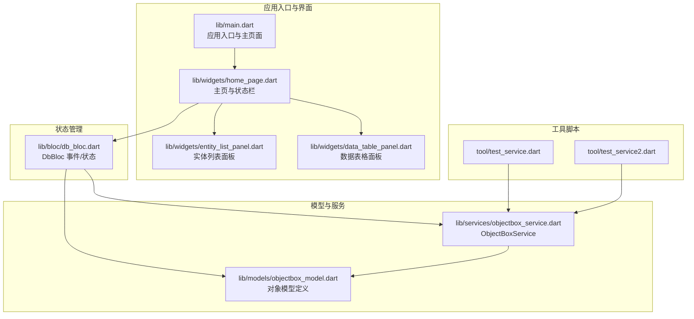
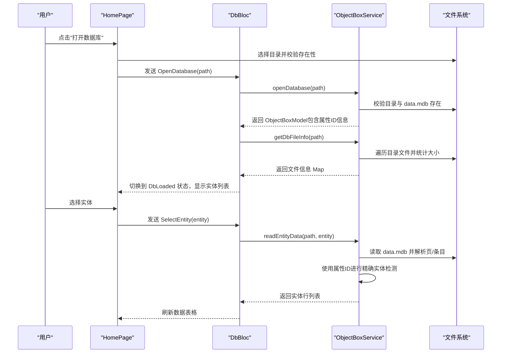
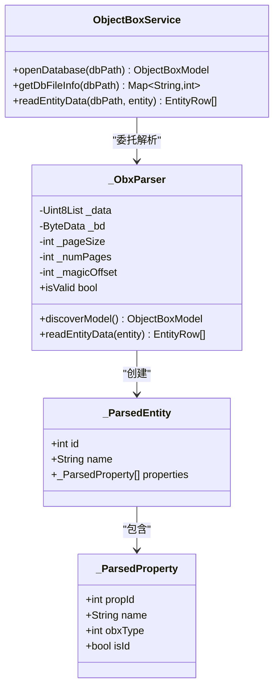
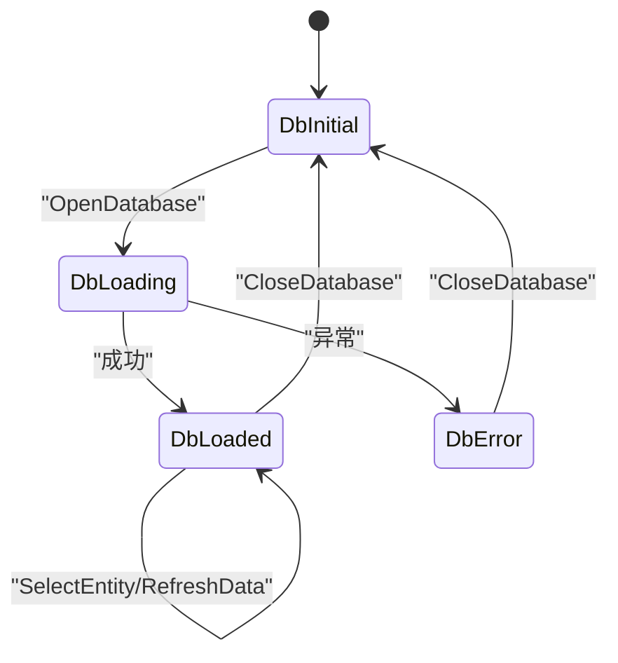
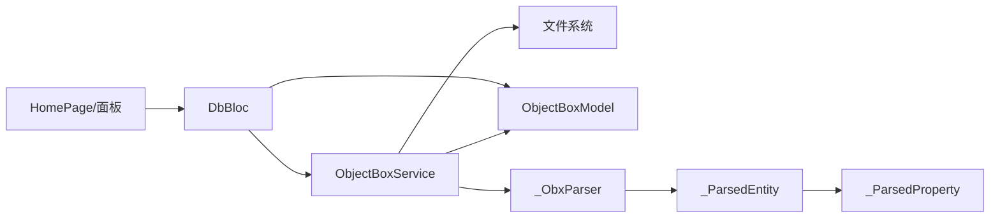

# 数据库管理

<cite>
**本文引用的文件**
- [lib/main.dart](file://lib/main.dart)
- [lib/bloc/db_bloc.dart](file://lib/bloc/db_bloc.dart)
- [lib/services/objectbox_service.dart](file://lib/services/objectbox_service.dart)
- [lib/models/objectbox_model.dart](file://lib/models/objectbox_model.dart)
- [lib/widgets/home_page.dart](file://lib/widgets/home_page.dart)
- [lib/widgets/entity_list_panel.dart](file://lib/widgets/entity_list_panel.dart)
- [lib/widgets/data_table_panel.dart](file://lib/widgets/data_table_panel.dart)
- [tool/test_service.dart](file://tool/test_service.dart)
- [tool/test_service2.dart](file://tool/test_service2.dart)
- [pubspec.yaml](file://pubspec.yaml)
</cite>

## 更新摘要
**变更内容**
- 增强了属性ID处理能力，支持从 FlatBuffer schema 中提取和使用属性ID
- 改进了实体检测准确性，通过属性ID和字段计数进行更精确的实体区分
- 优化了错误处理机制，增强了实体数据读取时的过滤和验证逻辑
- 新增了 `_ParsedEntity` 和 `_ParsedProperty` 类，提供更详细的实体和属性信息

## 目录
1. [简介](#简介)
2. [项目结构](#项目结构)
3. [核心组件](#核心组件)
4. [架构总览](#架构总览)
5. [详细组件分析](#详细组件分析)
6. [依赖关系分析](#依赖关系分析)
7. [性能考量](#性能考量)
8. [故障排查指南](#故障排查指南)
9. [结论](#结论)
10. [附录：使用示例与最佳实践](#附录使用示例与最佳实践)

## 简介
本文件围绕数据库管理功能进行系统化说明，重点覆盖以下方面：
- 数据库打开与关闭机制：文件系统验证、data.mdb 文件检查与异常处理策略
- 数据库状态监控：文件信息获取、数据库完整性验证思路、性能指标采集建议
- ObjectBoxService 核心方法：openDatabase、getDbFileInfo、readEntityData 的工作原理与调用流程
- 属性ID处理能力：从 FlatBuffer schema 中提取属性ID，支持精确的实体检测和数据映射
- 使用示例：如何正确打开数据库、处理常见错误、监控数据库状态
- 最佳实践：数据库生命周期管理与资源清理策略

## 项目结构
该项目为 Flutter 应用，采用按功能分层组织：
- 入口与界面：lib/main.dart、lib/widgets/*
- 状态管理：lib/bloc/db_bloc.dart
- 模型定义：lib/models/objectbox_model.dart
- 数据库服务：lib/services/objectbox_service.dart
- 工具脚本：tool/*.dart（用于测试与调试）

**图表来源**
- [lib/main.dart:1-147](file://lib/main.dart#L1-L147)
- [lib/widgets/home_page.dart:1-218](file://lib/widgets/home_page.dart#L1-L218)
- [lib/bloc/db_bloc.dart:1-136](file://lib/bloc/db_bloc.dart#L1-L136)
- [lib/services/objectbox_service.dart:1-1515](file://lib/services/objectbox_service.dart#L1-L1515)
- [lib/models/objectbox_model.dart:1-317](file://lib/models/objectbox_model.dart#L1-L317)
- [tool/test_service.dart:1-108](file://tool/test_service.dart#L1-L108)
- [tool/test_service2.dart:1-53](file://tool/test_service2.dart#L1-L53)

**章节来源**
- [lib/main.dart:1-147](file://lib/main.dart#L1-L147)
- [lib/bloc/db_bloc.dart:1-136](file://lib/bloc/db_bloc.dart#L1-L136)
- [lib/services/objectbox_service.dart:1-1515](file://lib/services/objectbox_service.dart#L1-L1515)
- [lib/models/objectbox_model.dart:1-317](file://lib/models/objectbox_model.dart#L1-L317)
- [lib/widgets/home_page.dart:1-218](file://lib/widgets/home_page.dart#L1-L218)
- [lib/widgets/entity_list_panel.dart:1-131](file://lib/widgets/entity_list_panel.dart#L1-L131)
- [lib/widgets/data_table_panel.dart:1-345](file://lib/widgets/data_table_panel.dart#L1-L345)
- [tool/test_service.dart:1-108](file://tool/test_service.dart#L1-L108)
- [tool/test_service2.dart:1-53](file://tool/test_service2.dart#L1-L53)

## 核心组件
- ObjectBoxService：直接解析 LMDB 文件（data.mdb），无需 objectbox-model.json，支持模型发现与实体数据读取
- DbBloc：负责数据库打开、实体选择、刷新数据与关闭数据库的状态流转
- ObjectBoxModel 及其子类：描述实体、属性、索引等模型信息；支持从 JSON 或直接从文件发现
- **新增**：_ParsedEntity 和 _ParsedProperty 类，提供详细的实体和属性信息，支持属性ID处理
- 主界面与面板：提供用户交互、状态显示与数据表格展示

**章节来源**
- [lib/services/objectbox_service.dart:1-41](file://lib/services/objectbox_service.dart#L1-L41)
- [lib/bloc/db_bloc.dart:91-135](file://lib/bloc/db_bloc.dart#L91-L135)
- [lib/models/objectbox_model.dart:1-317](file://lib/models/objectbox_model.dart#L1-L317)
- [lib/widgets/home_page.dart:1-218](file://lib/widgets/home_page.dart#L1-L218)

## 架构总览
数据库管理的端到端流程如下：

**图表来源**
- [lib/widgets/home_page.dart:74-88](file://lib/widgets/home_page.dart#L74-L88)
- [lib/bloc/db_bloc.dart:101-110](file://lib/bloc/db_bloc.dart#L101-L110)
- [lib/services/objectbox_service.dart:10-41](file://lib/services/objectbox_service.dart#L10-L41)

## 详细组件分析

### ObjectBoxService：数据库打开与数据读取
- openDatabase
  - 输入：数据库目录路径
  - 行为：校验目录与 data.mdb 存在，读取二进制内容，委托内部解析器进行模型发现
  - 异常：目录不存在或 data.mdb 缺失时抛出异常
- getDbFileInfo
  - 输入：数据库目录路径
  - 行为：遍历目录中的文件，返回文件名到字节数的映射
  - 边界：目录不存在时返回空映射
- readEntityData
  - 输入：数据库目录路径、实体信息
  - **更新**：使用属性ID进行精确的实体检测和数据映射，支持属性ID缺失时的回退机制
  - 行为：读取 data.mdb，解析页与条目，构建实体行（去重保留最新版本）
  - 异常：data.mdb 缺失时抛出异常

**图表来源**
- [lib/services/objectbox_service.dart:9-41](file://lib/services/objectbox_service.dart#L9-L41)
- [lib/services/objectbox_service.dart:47-1515](file://lib/services/objectbox_service.dart#L47-L1515)
- [lib/services/objectbox_service.dart:1496-1514](file://lib/services/objectbox_service.dart#L1496-L1514)

**章节来源**
- [lib/services/objectbox_service.dart:10-41](file://lib/services/objectbox_service.dart#L10-L41)
- [lib/services/objectbox_service.dart:47-1515](file://lib/services/objectbox_service.dart#L47-L1515)

### DbBloc：数据库生命周期与状态管理
- 事件
  - OpenDatabase：触发数据库打开流程
  - SelectEntity：切换选中实体并读取数据
  - RefreshData：刷新当前实体数据
  - CloseDatabase：回到初始状态
- 状态
  - DbInitial、DbLoading、DbLoaded、DbError
  - DbLoaded 包含 dbPath、model、fileInfo、selectedEntity、rows、error

**图表来源**
- [lib/bloc/db_bloc.dart:39-88](file://lib/bloc/db_bloc.dart#L39-L88)
- [lib/bloc/db_bloc.dart:91-135](file://lib/bloc/db_bloc.dart#L91-L135)

**章节来源**
- [lib/bloc/db_bloc.dart:1-136](file://lib/bloc/db_bloc.dart#L1-L136)

### 主界面与面板：用户交互与状态展示
- HomePage：根据 DbBloc 状态渲染欢迎页、加载指示器、错误视图、实体列表与数据表格
- EntityListPanel：列出实体并显示属性数量
- DataTablePanel：展示实体数据，支持刷新与详情复制

**章节来源**
- [lib/widgets/home_page.dart:1-218](file://lib/widgets/home_page.dart#L1-L218)
- [lib/widgets/entity_list_panel.dart:1-131](file://lib/widgets/entity_list_panel.dart#L1-L131)
- [lib/widgets/data_table_panel.dart:1-345](file://lib/widgets/data_table_panel.dart#L1-L345)

### 数据库完整性验证与性能指标采集
- 完整性验证思路
  - 基于 _ObxParser 的有效性判断（魔数、页大小、页数）与模式识别
  - 通过 getDbFileInfo 获取文件尺寸，辅助判断 data.mdb 是否异常
  - **新增**：使用属性ID进行实体检测准确性验证
- 性能指标采集建议
  - 读取耗时：在调用 readEntityData 前后记录时间戳
  - 实体行数：结合 rows.length 评估数据规模
  - 文件大小：结合 fileInfo 映射评估存储占用
  - **新增**：属性ID解析耗时和实体检测准确性指标

**章节来源**
- [lib/services/objectbox_service.dart:74-77](file://lib/services/objectbox_service.dart#L74-L77)
- [lib/services/objectbox_service.dart:21-29](file://lib/services/objectbox_service.dart#L21-L29)
- [lib/bloc/db_bloc.dart:101-124](file://lib/bloc/db_bloc.dart#L101-L124)

### 属性ID处理能力增强
**新增功能**：ObjectBoxService 现在能够从 FlatBuffer schema 中提取属性ID，提供更精确的实体检测和数据映射能力。

- **属性ID提取**：从 FlatBuffer Property 表中解析属性ID，支持现代和旧版 schema 格式
- **实体检测准确性**：使用属性ID和字段计数进行精确的实体区分，减少误判
- **数据映射优化**：基于属性ID的字段索引映射，提高数据解析准确性
- **回退机制**：当属性ID不可用时，自动回退到顺序映射方式

**章节来源**
- [lib/services/objectbox_service.dart:743-849](file://lib/services/objectbox_service.dart#L743-L849)
- [lib/services/objectbox_service.dart:1496-1514](file://lib/services/objectbox_service.dart#L1496-L1514)

## 依赖关系分析
- 组件耦合
  - DbBloc 依赖 ObjectBoxService 进行数据库操作
  - ObjectBoxService 依赖文件系统与内部解析器
  - 视图层仅依赖状态与模型，保持低耦合
- 外部依赖
  - Flutter 生态（flutter_bloc、file_picker、path 等）
  - 本地文件系统访问
- **新增**：_ParsedEntity 和 _ParsedProperty 类作为中间数据结构，提供属性ID信息

**图表来源**
- [lib/bloc/db_bloc.dart:91-135](file://lib/bloc/db_bloc.dart#L91-L135)
- [lib/services/objectbox_service.dart:1-41](file://lib/services/objectbox_service.dart#L1-L41)
- [lib/models/objectbox_model.dart:1-317](file://lib/models/objectbox_model.dart#L1-L317)
- [lib/services/objectbox_service.dart:1496-1514](file://lib/services/objectbox_service.dart#L1496-L1514)

**章节来源**
- [lib/bloc/db_bloc.dart:1-136](file://lib/bloc/db_bloc.dart#L1-L136)
- [lib/services/objectbox_service.dart:1-1515](file://lib/services/objectbox_service.dart#L1-L1515)
- [lib/models/objectbox_model.dart:1-317](file://lib/models/objectbox_model.dart#L1-L317)
- [pubspec.yaml:30-42](file://pubspec.yaml#L30-L42)

## 性能考量
- 解析复杂度
  - 页扫描与条目解析的时间复杂度与页数和条目数线性相关
  - **新增**：属性ID解析增加额外的 FlatBuffer 字段解析开销，但显著提高了检测准确性
  - 去重与排序在最终阶段完成，避免重复数据
- I/O 优化
  - 一次性读取 data.mdb，减少多次文件访问
  - 在 UI 层对长文本进行截断与延迟渲染，提升表格滚动体验
- 内存与类型推断
  - 对未知类型的字段采用启发式推断，兼顾准确性与性能
  - **新增**：属性ID信息缓存，避免重复解析
- **新增**：实体检测优化
  - 使用属性ID和字段计数预过滤，减少不必要的完整解析
  - 允许最多6个字段的容差，适应删除属性后的间隙

## 故障排查指南
- 打开数据库失败
  - 现象：出现错误视图
  - 排查：确认目录存在且包含 data.mdb；检查权限与路径拼接
- data.mdb 缺失
  - 现象：openDatabase/readEntityData 抛出异常
  - 排查：使用 getDbFileInfo 确认文件是否存在；确保选择了正确的数据库目录
- 解析异常或无数据
  - 现象：readEntityData 返回空列表或报错
  - 排查：确认数据库未被其他进程锁定；尝试重新打开；参考工具脚本进行原始扫描验证
- **新增**：属性ID解析失败
  - 现象：实体检测不准确或数据映射错误
  - 排查：检查 FlatBuffer schema 格式；确认属性ID字段存在；验证属性ID范围合理性
- **新增**：实体区分困难
  - 现象：多个实体共享相同 B+tree 导致误判
  - 排查：使用属性ID进行精确区分；检查字段计数匹配；验证实体ID映射

**章节来源**
- [lib/widgets/home_page.dart:190-217](file://lib/widgets/home_page.dart#L190-L217)
- [lib/bloc/db_bloc.dart:107-109](file://lib/bloc/db_bloc.dart#L107-L109)
- [lib/services/objectbox_service.dart:10-19](file://lib/services/objectbox_service.dart#L10-L19)
- [tool/test_service.dart:32-104](file://tool/test_service.dart#L32-L104)

## 结论
本项目通过 ObjectBoxService 提供了无需 schema 文件即可直接解析 LMDB 数据的能力，配合 BLoC 的状态管理与 UI 面板，实现了完整的数据库打开、监控与浏览体验。**最新的更新增强了属性ID处理能力和实体检测准确性，通过精确的属性ID解析和字段计数验证，显著提升了数据库解析的可靠性。** 建议在生产环境中结合文件信息监控与耗时统计，持续评估数据库健康状况与性能表现。

## 附录：使用示例与最佳实践

### 使用示例
- 正确打开数据库
  - 通过界面或工具脚本选择数据库目录，确保包含 data.mdb
  - 调用 DbBloc 的 OpenDatabase 事件，等待 DbLoaded 状态
  - **新增**：查看实体属性列表，确认属性ID信息正确提取
  - 参考路径：[lib/widgets/home_page.dart:74-88](file://lib/widgets/home_page.dart#L74-L88)，[lib/bloc/db_bloc.dart:101-110](file://lib/bloc/db_bloc.dart#L101-L110)
- 处理错误情况
  - 当出现异常时，DbBloc 将进入 DbError 状态；用户可点击"关闭数据库"回到初始状态
  - **新增**：检查属性ID解析日志，定位具体解析问题
  - 参考路径：[lib/widgets/home_page.dart:190-217](file://lib/widgets/home_page.dart#L190-L217)，[lib/bloc/db_bloc.dart:107-109](file://lib/bloc/db_bloc.dart#L107-L109)
- 监控数据库状态
  - 使用 getDbFileInfo 获取文件大小映射，辅助判断存储占用与完整性
  - **新增**：监控属性ID解析成功率和实体检测准确性
  - 参考路径：[lib/services/objectbox_service.dart:21-29](file://lib/services/objectbox_service.dart#L21-L29)
- 读取实体数据
  - 选择实体后，DbBloc 调用 readEntityData 并更新 UI
  - **新增**：利用属性ID进行精确的数据映射和实体区分
  - 参考路径：[lib/bloc/db_bloc.dart:112-124](file://lib/bloc/db_bloc.dart#L112-L124)，[lib/services/objectbox_service.dart:31-40](file://lib/services/objectbox_service.dart#L31-L40)

### 最佳实践
- 生命周期管理
  - 仅在需要时打开数据库；在切换或退出时发送 CloseDatabase 事件，释放状态
  - 参考路径：[lib/bloc/db_bloc.dart:132-134](file://lib/bloc/db_bloc.dart#L132-L134)
- 资源清理
  - 避免长时间持有大文件句柄；解析完成后及时释放内存
- 错误处理
  - 对目录与文件存在性进行显式校验；捕获并展示用户可理解的错误信息
  - **新增**：实现属性ID解析失败的降级策略
- 性能优化
  - 对大数据量实体采用分页或增量加载策略；在 UI 层限制单次渲染行数
  - **新增**：利用属性ID进行预过滤，减少不必要的完整解析
- 完整性验证
  - 结合 getDbFileInfo 与解析器有效性判断，定期检查 data.mdb 的一致性
  - **新增**：验证属性ID的合理性和实体检测的准确性
- **新增**：属性ID处理最佳实践
  - 确保 FlatBuffer schema 格式的兼容性
  - 实现属性ID缺失时的回退机制
  - 监控属性ID解析的成功率和准确性
  - 使用字段计数进行二次验证，确保实体区分的可靠性