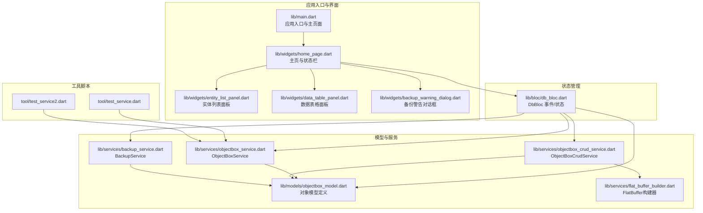
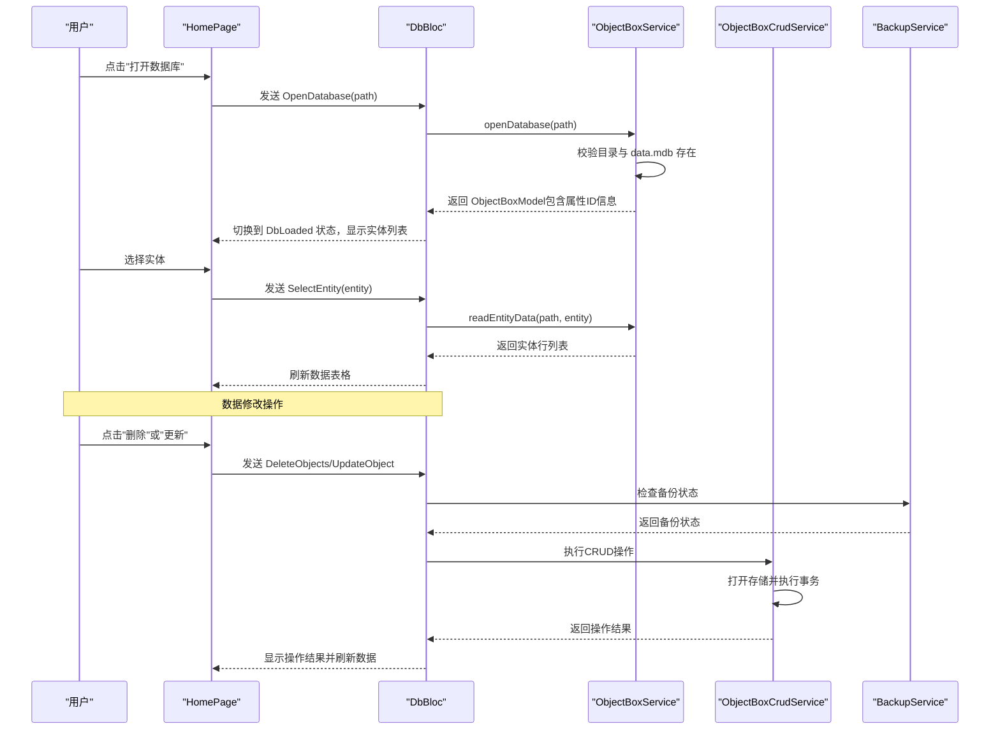
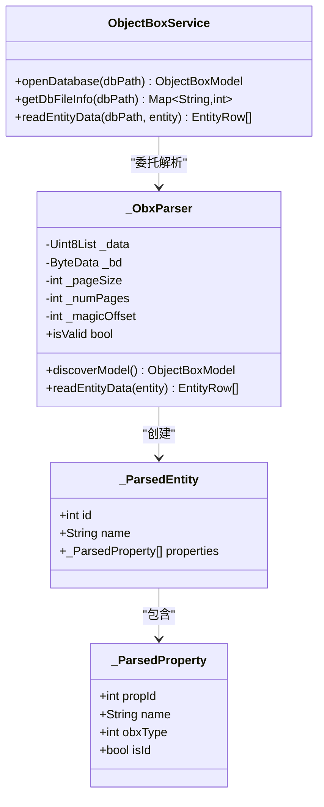
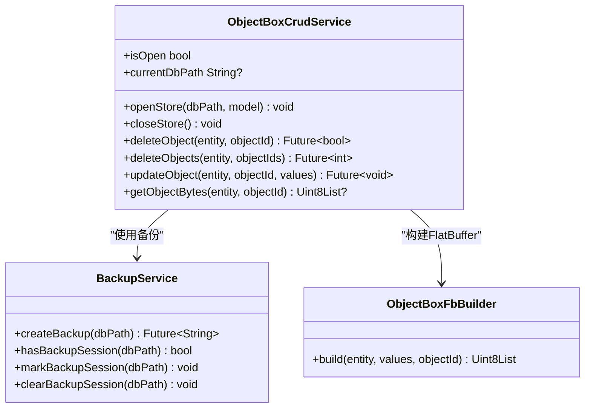
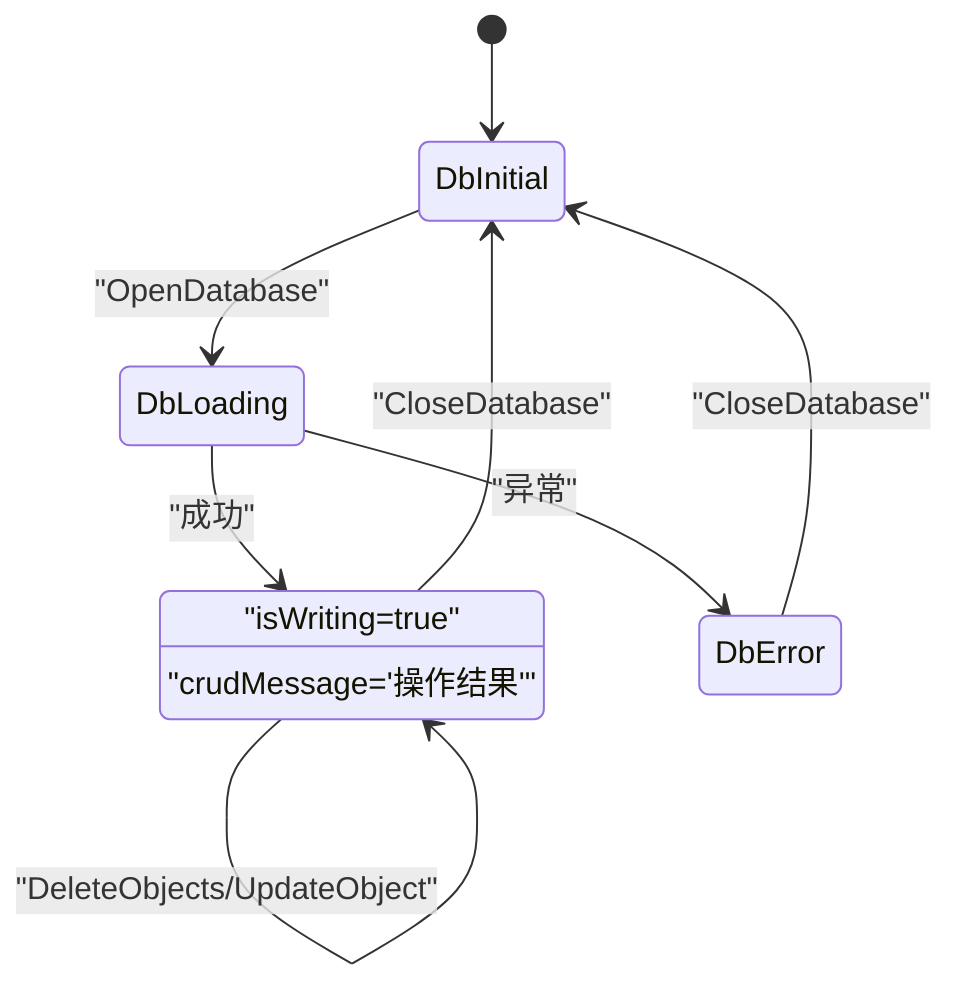
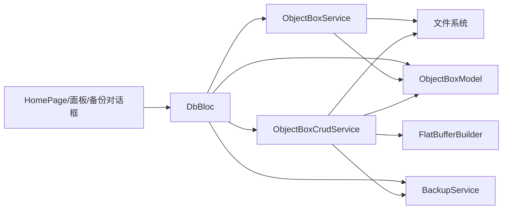

# 数据库管理

<cite>
**本文引用的文件**
- [lib/main.dart](file://lib/main.dart)
- [lib/bloc/db_bloc.dart](file://lib/bloc/db_bloc.dart)
- [lib/services/objectbox_service.dart](file://lib/services/objectbox_service.dart)
- [lib/services/objectbox_crud_service.dart](file://lib/services/objectbox_crud_service.dart)
- [lib/services/backup_service.dart](file://lib/services/backup_service.dart)
- [lib/services/flat_buffer_builder.dart](file://lib/services/flat_buffer_builder.dart)
- [lib/models/objectbox_model.dart](file://lib/models/objectbox_model.dart)
- [lib/widgets/home_page.dart](file://lib/widgets/home_page.dart)
- [lib/widgets/entity_list_panel.dart](file://lib/widgets/entity_list_panel.dart)
- [lib/widgets/data_table_panel.dart](file://lib/widgets/data_table_panel.dart)
- [lib/widgets/backup_warning_dialog.dart](file://lib/widgets/backup_warning_dialog.dart)
- [tool/test_service.dart](file://tool/test_service.dart)
- [tool/test_service2.dart](file://tool/test_service2.dart)
- [pubspec.yaml](file://pubspec.yaml)
</cite>

## 更新摘要
**变更内容**
- 新增完整的数据库修改功能，包括删除、更新、备份等CRUD操作能力
- 添加ObjectBoxCrudService类，提供直接的数据库写入操作
- 新增BackupService类，支持数据库备份功能
- 新增FlatBuffer构建器，支持对象数据的序列化
- 更新DbBloc以支持CRUD操作和备份检查
- 新增备份警告对话框，确保用户在首次修改数据库前进行备份

## 目录
1. [简介](#简介)
2. [项目结构](#项目结构)
3. [核心组件](#核心组件)
4. [架构总览](#架构总览)
5. [详细组件分析](#详细组件分析)
6. [依赖关系分析](#依赖关系分析)
7. [性能考量](#性能考量)
8. [故障排查指南](#故障排查指南)
9. [结论](#结论)
10. [附录：使用示例与最佳实践](#附录使用示例与最佳实践)

## 简介
本文件围绕数据库管理功能进行系统化说明，重点覆盖以下方面：
- 数据库打开与关闭机制：文件系统验证、data.mdb 文件检查与异常处理策略
- 数据库状态监控：文件信息获取、数据库完整性验证思路、性能指标采集建议
- ObjectBoxService 核心方法：openDatabase、getDbFileInfo、readEntityData 的工作原理与调用流程
- **新增**：ObjectBoxCrudService 完整的CRUD操作能力，包括删除、更新、备份等
- **新增**：备份服务与安全机制，确保数据库修改的安全性
- 属性ID处理能力：从 FlatBuffer schema 中提取属性ID，支持精确的实体检测和数据映射
- 使用示例：如何正确打开数据库、处理常见错误、监控数据库状态、执行CRUD操作
- 最佳实践：数据库生命周期管理与资源清理策略

## 项目结构
该项目为 Flutter 应用，采用按功能分层组织：
- 入口与界面：lib/main.dart、lib/widgets/*
- 状态管理：lib/bloc/db_bloc.dart
- 模型定义：lib/models/objectbox_model.dart
- 数据库服务：lib/services/objectbox_service.dart、lib/services/objectbox_crud_service.dart
- **新增**：备份服务：lib/services/backup_service.dart
- **新增**：FlatBuffer构建器：lib/services/flat_buffer_builder.dart
- **新增**：备份警告对话框：lib/widgets/backup_warning_dialog.dart
- 工具脚本：tool/*.dart（用于测试与调试）

```mermaid
graph TB
subgraph "应用入口与界面"
M["lib/main.dart<br/>应用入口与主页面"]
HP["lib/widgets/home_page.dart<br/>主页与状态栏"]
EL["lib/widgets/entity_list_panel.dart<br/>实体列表面板"]
DT["lib/widgets/data_table_panel.dart<br/>数据表格面板"]
BW["lib/widgets/backup_warning_dialog.dart<br/>备份警告对话框"]
end
subgraph "状态管理"
BLOC["lib/bloc/db_bloc.dart<br/>DbBloc 事件/状态"]
end
subgraph "模型与服务"
MODEL["lib/models/objectbox_model.dart<br/>对象模型定义"]
SVC["lib/services/objectbox_service.dart<br/>ObjectBoxService"]
CRUD["lib/services/objectbox_crud_service.dart<br/>ObjectBoxCrudService"]
BACKUP["lib/services/backup_service.dart<br/>BackupService"]
FB["lib/services/flat_buffer_builder.dart<br/>FlatBuffer构建器"]
end
subgraph "工具脚本"
T1["tool/test_service.dart"]
T2["tool/test_service2.dart"]
end
M --> HP
HP --> EL
HP --> DT
HP --> BW
HP --> BLOC
BLOC --> SVC
BLOC --> CRUD
BLOC --> BACKUP
BLOC --> MODEL
SVC --> MODEL
CRUD --> MODEL
CRUD --> FB
BACKUP --> MODEL
T1 --> SVC
T2 --> SVC
```

**图表来源**
- [lib/main.dart:1-147](file://lib/main.dart#L1-L147)
- [lib/widgets/home_page.dart:1-218](file://lib/widgets/home_page.dart#L1-L218)
- [lib/bloc/db_bloc.dart:1-346](file://lib/bloc/db_bloc.dart#L1-L346)
- [lib/services/objectbox_service.dart:1-1515](file://lib/services/objectbox_service.dart#L1-L1515)
- [lib/services/objectbox_crud_service.dart:1-463](file://lib/services/objectbox_crud_service.dart#L1-L463)
- [lib/services/backup_service.dart:1-56](file://lib/services/backup_service.dart#L1-L56)
- [lib/services/flat_buffer_builder.dart:1-149](file://lib/services/flat_buffer_builder.dart#L1-L149)
- [lib/models/objectbox_model.dart:1-317](file://lib/models/objectbox_model.dart#L1-L317)
- [lib/widgets/backup_warning_dialog.dart:1-208](file://lib/widgets/backup_warning_dialog.dart#L1-L208)
- [tool/test_service.dart:1-108](file://tool/test_service.dart#L1-L108)
- [tool/test_service2.dart:1-53](file://tool/test_service2.dart#L1-L53)

**章节来源**
- [lib/main.dart:1-147](file://lib/main.dart#L1-L147)
- [lib/bloc/db_bloc.dart:1-346](file://lib/bloc/db_bloc.dart#L1-L346)
- [lib/services/objectbox_service.dart:1-1515](file://lib/services/objectbox_service.dart#L1-L1515)
- [lib/services/objectbox_crud_service.dart:1-463](file://lib/services/objectbox_crud_service.dart#L1-L463)
- [lib/services/backup_service.dart:1-56](file://lib/services/backup_service.dart#L1-L56)
- [lib/services/flat_buffer_builder.dart:1-149](file://lib/services/flat_buffer_builder.dart#L1-L149)
- [lib/models/objectbox_model.dart:1-317](file://lib/models/objectbox_model.dart#L1-L317)
- [lib/widgets/home_page.dart:1-218](file://lib/widgets/home_page.dart#L1-L218)
- [lib/widgets/entity_list_panel.dart:1-131](file://lib/widgets/entity_list_panel.dart#L1-L131)
- [lib/widgets/data_table_panel.dart:1-345](file://lib/widgets/data_table_panel.dart#L1-L345)
- [lib/widgets/backup_warning_dialog.dart:1-208](file://lib/widgets/backup_warning_dialog.dart#L1-L208)
- [tool/test_service.dart:1-108](file://tool/test_service.dart#L1-L108)
- [tool/test_service2.dart:1-53](file://tool/test_service2.dart#L1-L53)

## 核心组件
- ObjectBoxService：直接解析 LMDB 文件（data.mdb），无需 objectbox-model.json，支持模型发现与实体数据读取
- **新增**：ObjectBoxCrudService：提供完整的CRUD操作能力，包括删除、更新、批量删除等
- **新增**：BackupService：支持数据库备份功能，确保数据修改的安全性
- **新增**：FlatBufferBuilder：支持对象数据的FlatBuffer序列化，用于数据库写入操作
- DbBloc：负责数据库打开、实体选择、刷新数据、**新增**：CRUD操作与备份检查的状态流转
- ObjectBoxModel 及其子类：描述实体、属性、索引等模型信息；支持从 JSON 或直接从文件发现
- **新增**：_ParsedEntity 和 _ParsedProperty 类，提供详细的实体和属性信息，支持属性ID处理
- 主界面与面板：提供用户交互、状态显示与数据表格展示

**章节来源**
- [lib/services/objectbox_service.dart:1-41](file://lib/services/objectbox_service.dart#L1-L41)
- [lib/services/objectbox_crud_service.dart:22-98](file://lib/services/objectbox_crud_service.dart#L22-L98)
- [lib/services/backup_service.dart:4-56](file://lib/services/backup_service.dart#L4-L56)
- [lib/services/flat_buffer_builder.dart:5-149](file://lib/services/flat_buffer_builder.dart#L5-L149)
- [lib/bloc/db_bloc.dart:91-135](file://lib/bloc/db_bloc.dart#L91-L135)
- [lib/models/objectbox_model.dart:1-317](file://lib/models/objectbox_model.dart#L1-L317)
- [lib/widgets/home_page.dart:1-218](file://lib/widgets/home_page.dart#L1-L218)

## 架构总览
数据库管理的端到端流程如下：

```mermaid
sequenceDiagram
participant U as "用户"
participant UI as "HomePage"
participant B as "DbBloc"
participant S as "ObjectBoxService"
participant CRUD as "ObjectBoxCrudService"
participant BS as "BackupService"
U->>UI : 点击"打开数据库"
UI->>B : 发送 OpenDatabase(path)
B->>S : openDatabase(path)
S->>S : 校验目录与 data.mdb 存在
S-->>B : 返回 ObjectBoxModel包含属性ID信息
B-->>UI : 切换到 DbLoaded 状态，显示实体列表
U->>UI : 选择实体
UI->>B : 发送 SelectEntity(entity)
B->>S : readEntityData(path, entity)
S-->>B : 返回实体行列表
B-->>UI : 刷新数据表格
Note over U,B : 数据修改操作
U->>UI : 点击"删除"或"更新"
UI->>B : 发送 DeleteObjects/UpdateObject
B->>BS : 检查备份状态
BS-->>B : 返回备份状态
B->>CRUD : 执行CRUD操作
CRUD->>CRUD : 打开存储并执行事务
CRUD-->>B : 返回操作结果
B-->>UI : 显示操作结果并刷新数据
```

**图表来源**
- [lib/widgets/home_page.dart:74-88](file://lib/widgets/home_page.dart#L74-L88)
- [lib/bloc/db_bloc.dart:101-110](file://lib/bloc/db_bloc.dart#L101-L110)
- [lib/services/objectbox_service.dart:10-41](file://lib/services/objectbox_service.dart#L10-L41)
- [lib/bloc/db_bloc.dart:288-341](file://lib/bloc/db_bloc.dart#L288-L341)
- [lib/services/backup_service.dart:41-56](file://lib/services/backup_service.dart#L41-L56)

## 详细组件分析

### ObjectBoxService：数据库打开与数据读取
- openDatabase
  - 输入：数据库目录路径
  - 行为：校验目录与 data.mdb 存在，读取二进制内容，委托内部解析器进行模型发现
  - 异常：目录不存在或 data.mdb 缺失时抛出异常
- getDbFileInfo
  - 输入：数据库目录路径
  - 行为：遍历目录中的文件，返回文件名到字节数的映射
  - 边界：目录不存在时返回空映射
- readEntityData
  - 输入：数据库目录路径、实体信息
  - **更新**：使用属性ID进行精确的实体检测和数据映射，支持属性ID缺失时的回退机制
  - 行为：读取 data.mdb，解析页与条目，构建实体行（去重保留最新版本）
  - 异常：data.mdb 缺失时抛出异常

```mermaid
classDiagram
class ObjectBoxService {
+openDatabase(dbPath) ObjectBoxModel
+getDbFileInfo(dbPath) Map~String,int~
+readEntityData(dbPath, entity) EntityRow[]
}
class _ObxParser {
-Uint8List _data
-ByteData _bd
-int _pageSize
-int _numPages
-int _magicOffset
+isValid bool
+discoverModel() ObjectBoxModel
+readEntityData(entity) EntityRow[]
}
class _ParsedEntity {
+int id
+String name
+_ParsedProperty[] properties
}
class _ParsedProperty {
+int propId
+String name
+int obxType
+bool isId
}
ObjectBoxService --> _ObxParser : "委托解析"
_ObxParser --> _ParsedEntity : "创建"
_ParsedEntity --> _ParsedProperty : "包含"
```

**图表来源**
- [lib/services/objectbox_service.dart:9-41](file://lib/services/objectbox_service.dart#L9-L41)
- [lib/services/objectbox_service.dart:47-1515](file://lib/services/objectbox_service.dart#L47-L1515)
- [lib/services/objectbox_service.dart:1496-1514](file://lib/services/objectbox_service.dart#L1496-L1514)

**章节来源**
- [lib/services/objectbox_service.dart:10-41](file://lib/services/objectbox_service.dart#L10-L41)
- [lib/services/objectbox_service.dart:47-1515](file://lib/services/objectbox_service.dart#L47-L1515)

### ObjectBoxCrudService：完整的CRUD操作能力
**新增功能**：ObjectBoxCrudService 提供了完整的数据库修改能力，支持删除、更新、批量删除等操作。

- openStore
  - 输入：数据库路径、ObjectBoxModel
  - 行为：尝试多种策略打开存储（内部模型、JSON模型、解析模型）
  - 异常：所有策略失败时抛出异常
- closeStore
  - 行为：关闭当前打开的存储，清理资源
- deleteObject
  - 输入：实体信息、对象ID
  - 行为：删除单个对象，返回是否找到并删除
- deleteObjects
  - 输入：实体信息、对象ID列表
  - 行为：批量删除对象，返回实际删除数量
- updateObject
  - 输入：实体信息、对象ID、值映射
  - 行为：更新现有对象，保留未修改字段
- getObjectBytes
  - 输入：实体信息、对象ID
  - 行为：获取对象的原始FlatBuffer字节

```mermaid
classDiagram
class ObjectBoxCrudService {
+isOpen bool
+currentDbPath String?
+openStore(dbPath, model) void
+closeStore() void
+deleteObject(entity, objectId) Future~bool~
+deleteObjects(entity, objectIds) Future~int~
+updateObject(entity, objectId, values) Future~void~
+getObjectBytes(entity, objectId) Uint8List?
}
class BackupService {
+createBackup(dbPath) Future~String~
+hasBackupSession(dbPath) bool
+markBackupSession(dbPath) void
+clearBackupSession(dbPath) void
}
class ObjectBoxFbBuilder {
+build(entity, values, objectId) Uint8List
}
ObjectBoxCrudService --> BackupService : "使用备份"
ObjectBoxCrudService --> ObjectBoxFbBuilder : "构建FlatBuffer"
```

**图表来源**
- [lib/services/objectbox_crud_service.dart:22-98](file://lib/services/objectbox_crud_service.dart#L22-L98)
- [lib/services/objectbox_crud_service.dart:193-297](file://lib/services/objectbox_crud_service.dart#L193-L297)
- [lib/services/backup_service.dart:4-56](file://lib/services/backup_service.dart#L4-L56)
- [lib/services/flat_buffer_builder.dart:12-83](file://lib/services/flat_buffer_builder.dart#L12-L83)

**章节来源**
- [lib/services/objectbox_crud_service.dart:22-98](file://lib/services/objectbox_crud_service.dart#L22-L98)
- [lib/services/objectbox_crud_service.dart:193-297](file://lib/services/objectbox_crud_service.dart#L193-L297)
- [lib/services/backup_service.dart:4-56](file://lib/services/backup_service.dart#L4-L56)
- [lib/services/flat_buffer_builder.dart:12-83](file://lib/services/flat_buffer_builder.dart#L12-L83)

### BackupService：数据库备份功能
**新增功能**：BackupService 提供数据库备份能力，确保数据修改的安全性。

- createBackup
  - 输入：数据库路径
  - 行为：创建时间戳命名的备份目录，复制 data.mdb、lock.mdb、objectbox-model.json
  - 返回：备份目录路径
- hasBackupSession
  - 输入：数据库路径
  - 行为：检查当前会话是否已创建备份
- markBackupSession
  - 输入：数据库路径
  - 行为：标记当前会话已创建备份
- clearBackupSession
  - 输入：数据库路径
  - 行为：清除备份会话标记

**章节来源**
- [lib/services/backup_service.dart:4-56](file://lib/services/backup_service.dart#L4-L56)

### ObjectBoxFbBuilder：FlatBuffer构建器
**新增功能**：FlatBufferBuilder 支持对象数据的FlatBuffer序列化，用于数据库写入操作。

- build
  - 输入：实体信息、值映射、对象ID
  - 行为：计算最大属性ID确定vtable大小，构建FlatBuffer表
  - 特性：支持字符串、数值、日期等类型，跳过Flex和向量类型
- _addField
  - 行为：根据属性类型添加字段值到FlatBuffer

**章节来源**
- [lib/services/flat_buffer_builder.dart:12-83](file://lib/services/flat_buffer_builder.dart#L12-L83)
- [lib/services/flat_buffer_builder.dart:85-135](file://lib/services/flat_buffer_builder.dart#L85-L135)

### DbBloc：数据库生命周期与状态管理
**更新**：DbBloc 现在支持完整的CRUD操作和备份检查。

- 事件
  - OpenDatabase：触发数据库打开流程
  - SelectEntity：切换选中实体并读取数据
  - RefreshData：刷新当前实体数据
  - CloseDatabase：回到初始状态
  - **新增**：DeleteObjects：删除多个对象
  - **新增**：UpdateObject：更新对象
- 状态
  - DbInitial、DbLoading、DbLoaded、DbError
  - **新增**：DbLoaded 包含 isWriting、crudMessage、error 等状态
  - DbLoaded 包含 dbPath、model、fileInfo、selectedEntity、rows、error

```mermaid
stateDiagram-v2
[*] --> DbInitial
DbInitial --> DbLoading : "OpenDatabase"
DbLoading --> DbLoaded : "成功"
DbLoading --> DbError : "异常"
DbLoaded --> DbLoaded : "SelectEntity/RefreshData"
DbLoaded --> DbInitial : "CloseDatabase"
DbLoaded --> DbLoaded : "DeleteObjects/UpdateObject"
DbLoaded : "isWriting=true"
DbLoaded : "crudMessage='操作结果'"
DbError --> DbInitial : "CloseDatabase"
```

**图表来源**
- [lib/bloc/db_bloc.dart:39-88](file://lib/bloc/db_bloc.dart#L39-L88)
- [lib/bloc/db_bloc.dart:91-135](file://lib/bloc/db_bloc.dart#L91-L135)
- [lib/bloc/db_bloc.dart:288-341](file://lib/bloc/db_bloc.dart#L288-L341)

**章节来源**
- [lib/bloc/db_bloc.dart:1-346](file://lib/bloc/db_bloc.dart#L1-L346)

### 主界面与面板：用户交互与状态展示
- HomePage：根据 DbBloc 状态渲染欢迎页、加载指示器、错误视图、实体列表与数据表格
- EntityListPanel：列出实体并显示属性数量
- DataTablePanel：展示实体数据，支持刷新与详情复制
- **新增**：BackupWarningDialog：首次数据库修改时显示备份警告对话框

**章节来源**
- [lib/widgets/home_page.dart:1-218](file://lib/widgets/home_page.dart#L1-L218)
- [lib/widgets/entity_list_panel.dart:1-131](file://lib/widgets/entity_list_panel.dart#L1-L131)
- [lib/widgets/data_table_panel.dart:1-345](file://lib/widgets/data_table_panel.dart#L1-L345)
- [lib/widgets/backup_warning_dialog.dart:1-208](file://lib/widgets/backup_warning_dialog.dart#L1-L208)

### 数据库完整性验证与性能指标采集
- 完整性验证思路
  - 基于 _ObxParser 的有效性判断（魔数、页大小、页数）与模式识别
  - 通过 getDbFileInfo 获取文件尺寸，辅助判断 data.mdb 是否异常
  - **新增**：使用属性ID进行实体检测准确性验证
  - **新增**：CRUD操作后的数据一致性验证
- 性能指标采集建议
  - 读取耗时：在调用 readEntityData 前后记录时间戳
  - 实体行数：结合 rows.length 评估数据规模
  - 文件大小：结合 fileInfo 映射评估存储占用
  - **新增**：CRUD操作耗时统计
  - **新增**：FlatBuffer构建耗时
  - **新增**：属性ID解析耗时和实体检测准确性指标

**章节来源**
- [lib/services/objectbox_service.dart:74-77](file://lib/services/objectbox_service.dart#L74-L77)
- [lib/services/objectbox_service.dart:21-29](file://lib/services/objectbox_service.dart#L21-L29)
- [lib/bloc/db_bloc.dart:101-124](file://lib/bloc/db_bloc.dart#L101-L124)

### 属性ID处理能力增强
**新增功能**：ObjectBoxService 现在能够从 FlatBuffer schema 中提取属性ID，提供更精确的实体检测和数据映射能力。

- **属性ID提取**：从 FlatBuffer Property 表中解析属性ID，支持现代和旧版 schema 格式
- **实体检测准确性**：使用属性ID和字段计数进行精确的实体区分，减少误判
- **数据映射优化**：基于属性ID的字段索引映射，提高数据解析准确性
- **回退机制**：当属性ID不可用时，自动回退到顺序映射方式

**章节来源**
- [lib/services/objectbox_service.dart:743-849](file://lib/services/objectbox_service.dart#L743-L849)
- [lib/services/objectbox_service.dart:1496-1514](file://lib/services/objectbox_service.dart#L1496-L1514)

## 依赖关系分析
- 组件耦合
  - DbBloc 依赖 ObjectBoxService 进行数据库操作，**新增**：依赖 ObjectBoxCrudService 进行CRUD操作，**新增**：依赖 BackupService 进行备份检查
  - ObjectBoxService 依赖文件系统与内部解析器
  - ObjectBoxCrudService 依赖 ObjectBoxFbBuilder 进行数据序列化，**新增**：依赖 BackupService 进行备份
  - 视图层仅依赖状态与模型，保持低耦合
- 外部依赖
  - Flutter 生态（flutter_bloc、file_picker、path 等）
  - 本地文件系统访问
  - **新增**：FlatBuffers 库用于数据序列化
  - **新增**：FFI 库用于C API调用
- **新增**：_ParsedEntity 和 _ParsedProperty 类作为中间数据结构，提供属性ID信息

```mermaid
graph LR
UI["HomePage/面板/备份对话框"] --> BLOC["DbBloc"]
BLOC --> SVC["ObjectBoxService"]
BLOC --> CRUD["ObjectBoxCrudService"]
BLOC --> BACKUP["BackupService"]
SVC --> FS["文件系统"]
CRUD --> FS
CRUD --> FB["FlatBufferBuilder"]
CRUD --> BACKUP
BLOC --> MODEL["ObjectBoxModel"]
SVC --> MODEL
CRUD --> MODEL
```

**图表来源**
- [lib/bloc/db_bloc.dart:91-135](file://lib/bloc/db_bloc.dart#L91-L135)
- [lib/services/objectbox_service.dart:1-41](file://lib/services/objectbox_service.dart#L1-L41)
- [lib/services/objectbox_crud_service.dart:1-27](file://lib/services/objectbox_crud_service.dart#L1-L27)
- [lib/services/backup_service.dart:1-56](file://lib/services/backup_service.dart#L1-L56)
- [lib/models/objectbox_model.dart:1-317](file://lib/models/objectbox_model.dart#L1-L317)
- [lib/services/flat_buffer_builder.dart:1-3](file://lib/services/flat_buffer_builder.dart#L1-L3)
- [lib/widgets/backup_warning_dialog.dart:1-208](file://lib/widgets/backup_warning_dialog.dart#L1-L208)

**章节来源**
- [lib/bloc/db_bloc.dart:1-346](file://lib/bloc/db_bloc.dart#L1-L346)
- [lib/services/objectbox_service.dart:1-1515](file://lib/services/objectbox_service.dart#L1-L1515)
- [lib/services/objectbox_crud_service.dart:1-463](file://lib/services/objectbox_crud_service.dart#L1-L463)
- [lib/services/backup_service.dart:1-56](file://lib/services/backup_service.dart#L1-L56)
- [lib/models/objectbox_model.dart:1-317](file://lib/models/objectbox_model.dart#L1-L317)
- [lib/services/flat_buffer_builder.dart:1-149](file://lib/services/flat_buffer_builder.dart#L1-L149)
- [pubspec.yaml:30-42](file://pubspec.yaml#L30-L42)

## 性能考量
- 解析复杂度
  - 页扫描与条目解析的时间复杂度与页数和条目数线性相关
  - **新增**：属性ID解析增加额外的 FlatBuffer 字段解析开销，但显著提高了检测准确性
  - **新增**：CRUD操作涉及事务处理和数据序列化，需要考虑性能影响
  - 去重与排序在最终阶段完成，避免重复数据
- I/O 优化
  - 一次性读取 data.mdb，减少多次文件访问
  - 在 UI 层对长文本进行截断与延迟渲染，提升表格滚动体验
  - **新增**：备份操作异步执行，避免阻塞主线程
- 内存与类型推断
  - 对未知类型的字段采用启发式推断，兼顾准确性与性能
  - **新增**：FlatBuffer构建器使用Builder模式，优化内存使用
  - **新增**：CRUD操作中的对象字节缓存管理
- **新增**：实体检测优化
  - 使用属性ID和字段计数预过滤，减少不必要的完整解析
  - 允许最多6个字段的容差，适应删除属性后的间隙
- **新增**：CRUD操作优化
  - 批量删除操作使用 boxRemoveMany 提高效率
  - 事务处理确保数据一致性
  - 对象更新时只序列化修改的字段

## 故障排查指南
- 打开数据库失败
  - 现象：出现错误视图
  - 排查：确认目录存在且包含 data.mdb；检查权限与路径拼接
- data.mdb 缺失
  - 现象：openDatabase/readEntityData 抛出异常
  - 排查：使用 getDbFileInfo 确认文件是否存在；确保选择了正确的数据库目录
- 解析异常或无数据
  - 现象：readEntityData 返回空列表或报错
  - 排查：确认数据库未被其他进程锁定；尝试重新打开；参考工具脚本进行原始扫描验证
- **新增**：CRUD操作失败
  - 现象：删除或更新操作抛出异常
  - 排查：检查存储是否已打开；确认实体ID和对象ID有效；查看事务状态
- **新增**：备份创建失败
  - 现象：BackupService.createBackup 抛出异常
  - 排查：检查目标目录权限；确认磁盘空间充足；验证数据库文件存在
- **新增**：FlatBuffer构建错误
  - 现象：updateObject 时构建FlatBuffer失败
  - 排查：检查属性类型映射；确认值格式正确；验证属性ID设置
- **新增**：属性ID解析失败
  - 现象：实体检测不准确或数据映射错误
  - 排查：检查 FlatBuffer schema 格式；确认属性ID字段存在；验证属性ID范围合理性
- **新增**：实体区分困难
  - 现象：多个实体共享相同 B+tree 导致误判
  - 排查：使用属性ID进行精确区分；检查字段计数匹配；验证实体ID映射

**章节来源**
- [lib/widgets/home_page.dart:190-217](file://lib/widgets/home_page.dart#L190-L217)
- [lib/bloc/db_bloc.dart:107-109](file://lib/bloc/db_bloc.dart#L107-L109)
- [lib/services/objectbox_service.dart:10-19](file://lib/services/objectbox_service.dart#L10-L19)
- [lib/services/objectbox_crud_service.dart:318-326](file://lib/services/objectbox_crud_service.dart#L318-L326)
- [lib/services/backup_service.dart:12-39](file://lib/services/backup_service.dart#L12-L39)
- [tool/test_service.dart:32-104](file://tool/test_service.dart#L32-L104)

## 结论
本项目通过 ObjectBoxService 提供了无需 schema 文件即可直接解析 LMDB 数据的能力，配合 BLoC 的状态管理与 UI 面板，实现了完整的数据库打开、监控与浏览体验。**最新的更新新增了完整的数据库修改功能，包括删除、更新、备份等CRUD操作能力，通过 ObjectBoxCrudService 提供了直接的数据库写入操作，通过 BackupService 确保数据修改的安全性。** 建议在生产环境中结合文件信息监控与耗时统计，持续评估数据库健康状况与性能表现。

## 附录：使用示例与最佳实践

### 使用示例
- 正确打开数据库
  - 通过界面或工具脚本选择数据库目录，确保包含 data.mdb
  - 调用 DbBloc 的 OpenDatabase 事件，等待 DbLoaded 状态
  - **新增**：查看实体属性列表，确认属性ID信息正确提取
  - 参考路径：[lib/widgets/home_page.dart:74-88](file://lib/widgets/home_page.dart#L74-L88)，[lib/bloc/db_bloc.dart:101-110](file://lib/bloc/db_bloc.dart#L101-L110)
- 处理错误情况
  - 当出现异常时，DbBloc 将进入 DbError 状态；用户可点击"关闭数据库"回到初始状态
  - **新增**：检查属性ID解析日志，定位具体解析问题
  - **新增**：查看CRUD操作错误信息，确认操作失败原因
  - 参考路径：[lib/widgets/home_page.dart:190-217](file://lib/widgets/home_page.dart#L190-L217)，[lib/bloc/db_bloc.dart:107-109](file://lib/bloc/db_bloc.dart#L107-L109)
- 监控数据库状态
  - 使用 getDbFileInfo 获取文件大小映射，辅助判断存储占用与完整性
  - **新增**：监控属性ID解析成功率和实体检测准确性
  - **新增**：跟踪CRUD操作的执行状态和结果
  - 参考路径：[lib/services/objectbox_service.dart:21-29](file://lib/services/objectbox_service.dart#L21-L29)
- 读取实体数据
  - 选择实体后，DbBloc 调用 readEntityData 并更新 UI
  - **新增**：利用属性ID进行精确的数据映射和实体区分
  - 参考路径：[lib/bloc/db_bloc.dart:112-124](file://lib/bloc/db_bloc.dart#L112-L124)，[lib/services/objectbox_service.dart:31-40](file://lib/services/objectbox_service.dart#L31-L40)
- **新增**：执行数据库修改操作
  - 删除对象：调用 DeleteObjects 事件，传入实体信息和对象ID列表
  - 更新对象：调用 UpdateObject 事件，传入实体信息、对象ID和值映射
  - 自动备份：首次修改时显示备份警告对话框，建议创建数据库备份
  - 参考路径：[lib/bloc/db_bloc.dart:288-341](file://lib/bloc/db_bloc.dart#L288-L341)，[lib/widgets/backup_warning_dialog.dart:15-29](file://lib/widgets/backup_warning_dialog.dart#L15-L29)

### 最佳实践
- 生命周期管理
  - 仅在需要时打开数据库；在切换或退出时发送 CloseDatabase 事件，释放状态
  - **新增**：CRUD操作完成后及时关闭存储连接，释放资源
  - 参考路径：[lib/bloc/db_bloc.dart:132-134](file://lib/bloc/db_bloc.dart#L132-L134)
- 资源清理
  - 避免长时间持有大文件句柄；解析完成后及时释放内存
  - **新增**：CRUD操作中的内存分配和释放要成对管理
- 错误处理
  - 对目录与文件存在性进行显式校验；捕获并展示用户可理解的错误信息
  - **新增**：实现属性ID解析失败的降级策略
  - **新增**：CRUD操作失败时提供详细的错误信息和恢复建议
- 性能优化
  - 对大数据量实体采用分页或增量加载策略；在 UI 层限制单次渲染行数
  - **新增**：利用属性ID进行预过滤，减少不必要的完整解析
  - **新增**：批量删除操作使用 boxRemoveMany 提高效率
  - **新增**：FlatBuffer构建器复用Builder实例，减少内存分配
- 完整性验证
  - 结合 getDbFileInfo 与解析器有效性判断，定期检查 data.mdb 的一致性
  - **新增**：验证属性ID的合理性和实体检测的准确性
  - **新增**：CRUD操作后验证数据一致性和完整性
- **新增**：属性ID处理最佳实践
  - 确保 FlatBuffer schema 格式的兼容性
  - 实现属性ID缺失时的回退机制
  - 监控属性ID解析的成功率和准确性
  - 使用字段计数进行二次验证，确保实体区分的可靠性
- **新增**：CRUD操作最佳实践
  - 始终在事务中执行数据库修改操作，确保原子性
  - 批量操作优先使用批量API（如 boxRemoveMany）
  - 修改前先备份数据库，特别是首次修改时
  - 验证输入数据的类型和范围，防止数据损坏
  - 及时刷新UI显示，让用户了解操作结果
- **新增**：备份策略最佳实践
  - 首次数据库修改时强制备份，后续会话内不再重复提示
  - 备份目录包含 data.mdb、lock.mdb 和 objectbox-model.json
  - 备份文件使用时间戳命名，便于识别和管理
  - 备份失败时提供清晰的错误信息和重试选项