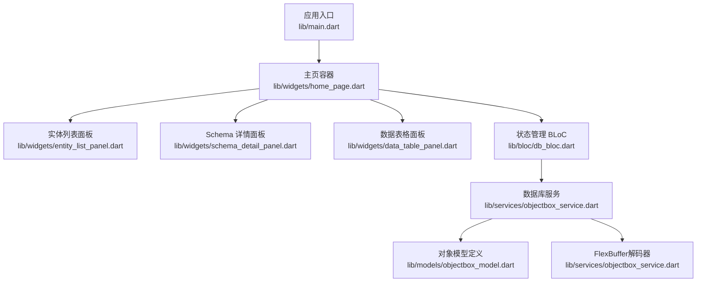
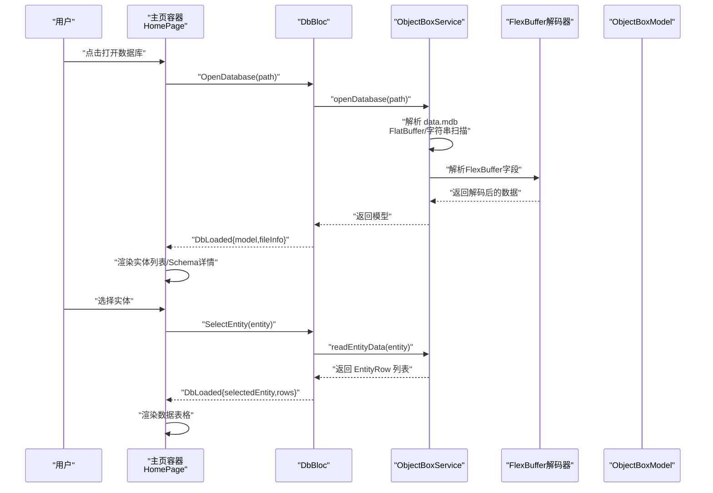
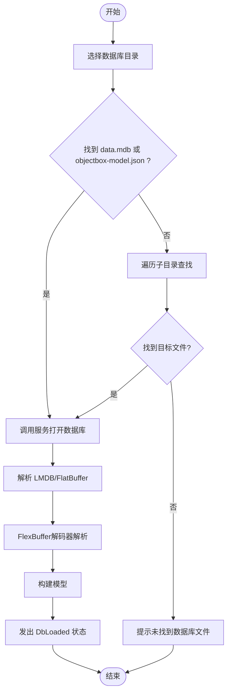
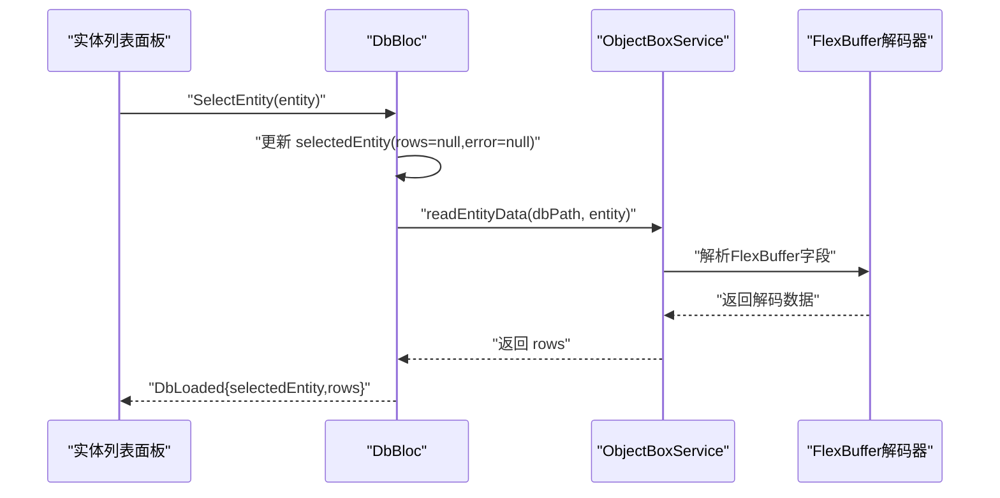
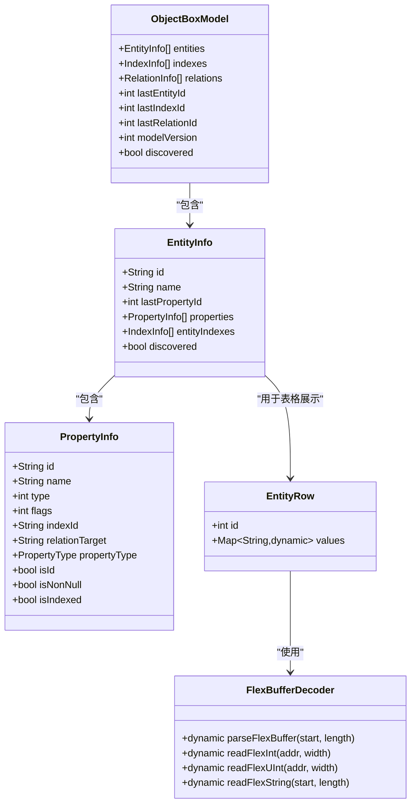
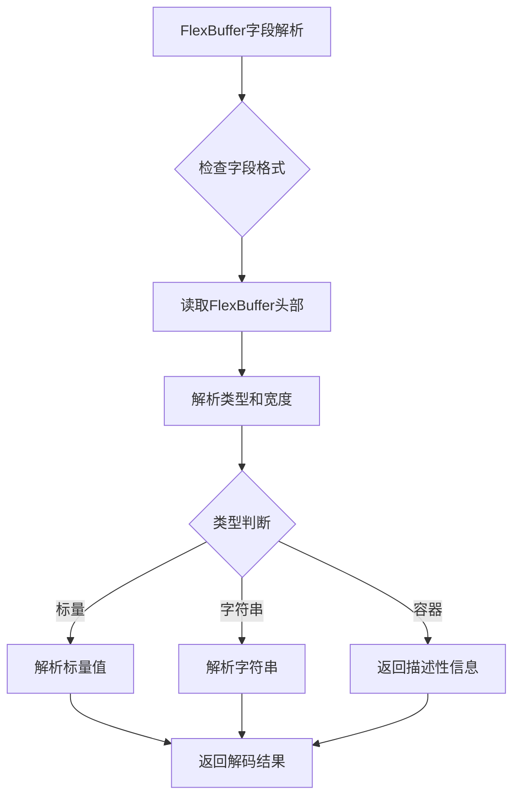
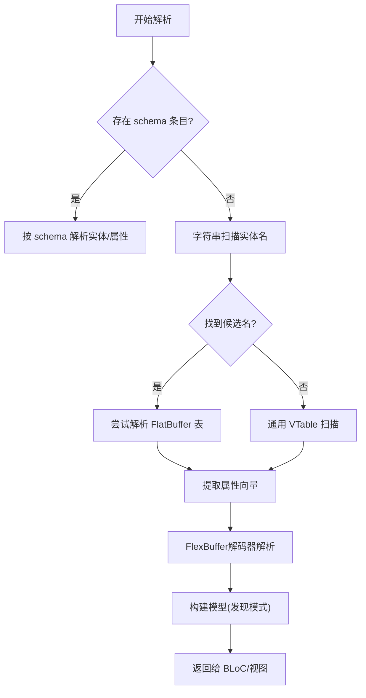
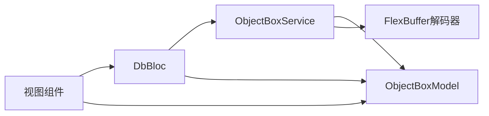

# 核心功能

<cite>
**本文引用的文件**
- [lib/main.dart](file://lib/main.dart)
- [lib/bloc/db_bloc.dart](file://lib/bloc/db_bloc.dart)
- [lib/models/objectbox_model.dart](file://lib/models/objectbox_model.dart)
- [lib/services/objectbox_service.dart](file://lib/services/objectbox_service.dart)
- [lib/widgets/home_page.dart](file://lib/widgets/home_page.dart)
- [lib/widgets/entity_list_panel.dart](file://lib/widgets/entity_list_panel.dart)
- [lib/widgets/data_table_panel.dart](file://lib/widgets/data_table_panel.dart)
- [lib/widgets/schema_detail_panel.dart](file://lib/widgets/schema_detail_panel.dart)
- [pubspec.yaml](file://pubspec.yaml)
- [README.md](file://README.md)
</cite>

## 更新摘要
**变更内容**
- 新增FlexBuffer解码器实现，支持完整的ObjectBox属性类型谱系
- 增强数据解析功能，包括新的Flex类型和所有向量变体
- 新增dateNanoVector类型支持，提供纳秒级时间戳解析
- 改进向量类型处理，支持所有标准ObjectBox向量变体
- 增强自动发现模式下的类型推断能力

## 目录
1. [简介](#简介)
2. [项目结构](#项目结构)
3. [核心组件](#核心组件)
4. [架构总览](#架构总览)
5. [详细组件分析](#详细组件分析)
6. [依赖关系分析](#依赖关系分析)
7. [性能考虑](#性能考虑)
8. [故障排查指南](#故障排查指南)
9. [结论](#结论)
10. [附录：使用示例与最佳实践](#附录使用示例与最佳实践)

## 简介
本文件系统性梳理 ObjectBox Viewer 的核心功能，覆盖数据库管理（打开、关闭、状态监控）、实体管理（实体列表、实体选择、数据查询）、数据展示（Schema 详情、数据表格、实体数据浏览），并深入解析"自动发现模式"的工作原理与优势。文档同时提供用户工作流说明、错误处理策略与性能优化建议，兼顾初学者易懂与高级用户的深度需求。

**更新** 本版本新增了FlexBuffer解码器实现，显著增强了数据解析能力，支持完整的ObjectBox属性类型谱系，包括新的Flex类型和所有向量变体。

## 项目结构
项目采用 Flutter 应用结构，按功能域组织目录：
- 应用入口与主题：lib/main.dart
- 状态管理：lib/bloc/db_bloc.dart
- 数据模型：lib/models/objectbox_model.dart
- 数据服务：lib/services/objectbox_service.dart
- 视图组件：lib/widgets 下的多个面板组件
- 依赖声明：pubspec.yaml

**图表来源**
- [lib/main.dart:1-147](file://lib/main.dart#L1-L147)
- [lib/widgets/home_page.dart:1-218](file://lib/widgets/home_page.dart#L1-L218)
- [lib/widgets/entity_list_panel.dart:1-131](file://lib/widgets/entity_list_panel.dart#L1-L131)
- [lib/widgets/schema_detail_panel.dart:1-283](file://lib/widgets/schema_detail_panel.dart#L1-L283)
- [lib/widgets/data_table_panel.dart:1-345](file://lib/widgets/data_table_panel.dart#L1-L345)
- [lib/bloc/db_bloc.dart:1-136](file://lib/bloc/db_bloc.dart#L1-L136)
- [lib/services/objectbox_service.dart:1-800](file://lib/services/objectbox_service.dart#L1-L800)
- [lib/models/objectbox_model.dart:1-248](file://lib/models/objectbox_model.dart#L1-L248)

**章节来源**
- [lib/main.dart:1-147](file://lib/main.dart#L1-L147)
- [pubspec.yaml:1-96](file://pubspec.yaml#L1-L96)

## 核心组件
- 应用壳与导航
  - 应用入口负责初始化并挂载顶层应用壳，设置主题与全局状态提供器。
  - 应用壳在顶部提供"打开数据库"入口，并在底部状态栏提示用户操作。
- 主页容器
  - 根据 BLoC 状态渲染欢迎视图、加载中、错误或主界面。
  - 主界面左侧为实体列表面板，右侧为内容区（Schema 详情或数据表格）。
- 实体列表面板
  - 展示所有实体名称、属性数量与统计信息；支持点击选择实体。
- Schema 详情面板
  - 展示数据库文件信息、模型版本（非发现模式）、实体概览与属性表。
- 数据表格面板
  - 展示选中实体的数据行，支持刷新、复制大字段、列类型标注等。
- 状态管理（BLoC）
  - 定义数据库打开、实体选择、刷新、关闭等事件与状态机。
- 数据服务
  - 负责直接读取 LMDB 文件，解析 FlatBuffer，构建模型与实体数据。
  - **新增** FlexBuffer解码器支持完整的ObjectBox属性类型谱系。
- 对象模型
  - 定义实体、属性、索引、关系以及实体行的数据结构。

**章节来源**
- [lib/main.dart:45-147](file://lib/main.dart#L45-L147)
- [lib/widgets/home_page.dart:9-218](file://lib/widgets/home_page.dart#L9-L218)
- [lib/widgets/entity_list_panel.dart:1-131](file://lib/widgets/entity_list_panel.dart#L1-L131)
- [lib/widgets/schema_detail_panel.dart:1-283](file://lib/widgets/schema_detail_panel.dart#L1-L283)
- [lib/widgets/data_table_panel.dart:1-345](file://lib/widgets/data_table_panel.dart#L1-L345)
- [lib/bloc/db_bloc.dart:1-136](file://lib/bloc/db_bloc.dart#L1-L136)
- [lib/services/objectbox_service.dart:1-800](file://lib/services/objectbox_service.dart#L1-L800)
- [lib/models/objectbox_model.dart:1-248](file://lib/models/objectbox_model.dart#L1-L248)

## 架构总览
整体采用"MVI（Model-View-Intent）+ BLoC"的架构风格：
- 视图层通过 BlocBuilder 订阅状态变化，驱动 UI 更新。
- 用户交互触发事件，BLoC 在处理器中调用服务执行业务逻辑，更新状态。
- 服务层直接解析 LMDB 文件，无需依赖外部 JSON 模型，实现"自动发现"。
- **新增** FlexBuffer解码器提供对复杂数据类型的解析支持。

**图表来源**
- [lib/widgets/home_page.dart:74-89](file://lib/widgets/home_page.dart#L74-L89)
- [lib/bloc/db_bloc.dart:101-130](file://lib/bloc/db_bloc.dart#L101-L130)
- [lib/services/objectbox_service.dart:10-41](file://lib/services/objectbox_service.dart#L10-L41)
- [lib/models/objectbox_model.dart:1-248](file://lib/models/objectbox_model.dart#L1-L248)

## 详细组件分析

### 数据库管理：打开、关闭与状态监控
- 打开数据库
  - 通过文件选择器选择数据库目录，内部会查找 data.mdb 并调用服务打开。
  - 服务解析 LMDB 文件，构建模型（schema 或自动发现）。
- 关闭数据库
  - 将状态重置为初始态，释放当前上下文。
- 状态监控
  - Loading/Error/Loaded 三种状态分别对应加载中、错误与成功场景。
  - 加载时显示进度指示器；错误时弹出消息并提供返回按钮。

**图表来源**
- [lib/main.dart:97-145](file://lib/main.dart#L97-L145)
- [lib/bloc/db_bloc.dart:101-110](file://lib/bloc/db_bloc.dart#L101-L110)
- [lib/services/objectbox_service.dart:10-29](file://lib/services/objectbox_service.dart#L10-L29)

**章节来源**
- [lib/main.dart:97-145](file://lib/main.dart#L97-L145)
- [lib/bloc/db_bloc.dart:101-135](file://lib/bloc/db_bloc.dart#L101-L135)
- [lib/widgets/home_page.dart:16-218](file://lib/widgets/home_page.dart#L16-L218)

### 实体管理：实体列表、选择与数据查询
- 实体列表
  - 展示实体名、属性数量与统计信息；支持高亮选中项。
- 实体选择
  - 选择后触发事件，BLoC 发起数据读取请求。
- 数据查询
  - 服务解析 LMDB 中的 FlatBuffer 表格，提取对象 ID 与字段值，去重保留最新写入版本。
  - **新增** FlexBuffer字段解析支持复杂数据类型。
  - 返回实体行集合，供表格面板渲染。

**图表来源**
- [lib/widgets/entity_list_panel.dart:52-84](file://lib/widgets/entity_list_panel.dart#L52-L84)
- [lib/bloc/db_bloc.dart:112-124](file://lib/bloc/db_bloc.dart#L112-L124)
- [lib/services/objectbox_service.dart:31-41](file://lib/services/objectbox_service.dart#L31-L41)

**章节来源**
- [lib/widgets/entity_list_panel.dart:1-131](file://lib/widgets/entity_list_panel.dart#L1-L131)
- [lib/bloc/db_bloc.dart:112-124](file://lib/bloc/db_bloc.dart#L112-L124)
- [lib/services/objectbox_service.dart:31-41](file://lib/services/objectbox_service.dart#L31-L41)

### 数据展示：Schema 详情、数据表格与实体浏览
- Schema 详情
  - 显示数据库文件大小、模型版本（非发现模式）、实体与属性概览。
  - 发现模式下提示字段名与类型为自动推断。
- 数据表格
  - 渲染实体数据，列头包含类型标注；支持复制大字段、查看详情。
  - **新增** FlexBuffer字段显示为可读格式或描述性文本。
  - 当无数据或读取失败时分别给出提示与错误视图。
- 自动发现模式标识
  - 在实体卡片与表格列头显示"auto/Discovered"标识，帮助用户识别数据来源。

**图表来源**
- [lib/models/objectbox_model.dart:1-248](file://lib/models/objectbox_model.dart#L1-L248)
- [lib/services/objectbox_service.dart:1188-1250](file://lib/services/objectbox_service.dart#L1188-L1250)

**章节来源**
- [lib/widgets/schema_detail_panel.dart:1-283](file://lib/widgets/schema_detail_panel.dart#L1-L283)
- [lib/widgets/data_table_panel.dart:1-345](file://lib/widgets/data_table_panel.dart#L1-L345)
- [lib/models/objectbox_model.dart:1-248](file://lib/models/objectbox_model.dart#L1-L248)

### FlexBuffer解码器：新增功能与增强
- **FlexBuffer格式支持**
  - 支持完整的FlexBuffer编码格式，包括根值类型和宽度编码。
  - 解析字节序列中的类型和宽度信息，实现对不同数据类型的正确识别。
- **支持的数据类型**
  - 标量类型：null、整数（有符号/无符号）、浮点数、布尔值。
  - 字符串类型：UTF-8编码的字符串，支持长度前缀。
  - 容器类型：向量（列表）和映射（字典），返回描述性信息而非完整解析。
- **向量类型增强**
  - 支持所有标准ObjectBox向量变体：boolVector、byteVector、shortVector、charVector、intVector、longVector、floatVector、doubleVector、stringVector、dateVector、dateNanoVector。
  - **新增** dateNanoVector类型支持纳秒级时间戳解析。
  - 向量数据以FlatBuffer向量格式存储，包含长度前缀和元素数据。
- **解析策略**
  - 对于支持的类型，返回可读的原始数据或结构化表示。
  - 对于复杂容器类型，返回元素数量或键数量的描述性信息。
  - 解析失败时回退到十六进制字符串显示，确保数据完整性。

**图表来源**
- [lib/services/objectbox_service.dart:1162-1250](file://lib/services/objectbox_service.dart#L1162-L1250)

**章节来源**
- [lib/services/objectbox_service.dart:1162-1250](file://lib/services/objectbox_service.dart#L1162-L1250)
- [lib/services/objectbox_service.dart:943-1060](file://lib/services/objectbox_service.dart#L943-L1060)
- [lib/models/objectbox_model.dart:134-179](file://lib/models/objectbox_model.dart#L134-L179)

### 自动发现模式：原理与优势
- 原理
  - 无 objectbox-model.json 时，服务通过解析 LMDB 文件中的 FlatBuffer 结构，扫描实体名与属性向量，重建模型。
  - 支持两种路径：基于已知 schema 的条目解析，以及通用的 FlatBuffer VTable 扫描。
  - **新增** FlexBuffer解码器增强自动发现模式下的类型推断能力。
- 优势
  - 零依赖：无需 objectbox-model.json 即可浏览数据库。
  - 可靠性：即使缺少 JSON，也能从二进制数据中恢复实体与字段的基本信息。
  - 透明性：UI 明确标注"Discovered"，避免误用未知字段类型。
  - **新增** FlexBuffer支持使自动发现模式能够处理复杂的动态数据类型。

**图表来源**
- [lib/services/objectbox_service.dart:78-111](file://lib/services/objectbox_service.dart#L78-L111)
- [lib/services/objectbox_service.dart:158-185](file://lib/services/objectbox_service.dart#L158-L185)
- [lib/services/objectbox_service.dart:187-217](file://lib/services/objectbox_service.dart#L187-L217)

**章节来源**
- [lib/services/objectbox_service.dart:78-111](file://lib/services/objectbox_service.dart#L78-L111)
- [lib/widgets/home_page.dart:92-126](file://lib/widgets/home_page.dart#L92-L126)
- [lib/widgets/schema_detail_panel.dart:50-76](file://lib/widgets/schema_detail_panel.dart#L50-L76)

## 依赖关系分析
- 组件耦合
  - 视图层仅依赖 BLoC 与模型，不直接访问服务层，降低耦合度。
  - BLoC 作为协调者，统一调度服务与状态更新。
- 外部依赖
  - 使用 flutter_bloc 进行状态管理，equatable 提供相等性比较。
  - 使用 file_picker 进行目录选择，path/path_provider 提供路径工具。
- 潜在风险
  - 服务层直接解析二进制文件，需保证解析健壮性与边界检查。
  - UI 面板较多，需注意状态同步与错误传播的一致性。
  - **新增** FlexBuffer解码器增加了对复杂数据类型的处理复杂度。

**图表来源**
- [lib/bloc/db_bloc.dart:1-136](file://lib/bloc/db_bloc.dart#L1-L136)
- [lib/services/objectbox_service.dart:1-800](file://lib/services/objectbox_service.dart#L1-L800)
- [lib/models/objectbox_model.dart:1-248](file://lib/models/objectbox_model.dart#L1-L248)
- [lib/widgets/*.dart:1-218](file://lib/widgets/home_page.dart#L1-L218)

**章节来源**
- [pubspec.yaml:30-43](file://pubspec.yaml#L30-L43)
- [lib/bloc/db_bloc.dart:1-136](file://lib/bloc/db_bloc.dart#L1-L136)
- [lib/services/objectbox_service.dart:1-800](file://lib/services/objectbox_service.dart#L1-L800)

## 性能考虑
- 解析性能
  - LMDB 文件按页解析，注意页大小与页数计算的边界校验，避免无效内存访问。
  - 字符串扫描与 VTable 扫描可能带来 O(n) 开销，建议限制扫描范围与长度。
  - **新增** FlexBuffer解码器采用最小化解析策略，只解析必要的头部信息，提高性能。
- UI 渲染
  - 数据表格采用可滚动容器，避免一次性渲染大量列导致布局压力。
  - 对超长字段进行截断与延迟展示，减少文本渲染成本。
  - **新增** FlexBuffer字段显示优化，复杂容器类型仅显示简要信息。
- 内存占用
  - 读取数据时以"最近写入版本"去重，避免重复存储同一对象的多份旧快照。
  - **新增** FlexBuffer解码器使用流式解析，避免大对象的完整内存复制。
- I/O 优化
  - 仅在必要时重新读取数据（例如刷新），避免频繁全量解析。

## 故障排查指南
- 常见错误
  - 未找到数据库目录或 data.mdb：确认目录包含 data.mdb 与 lock.mdb。
  - 解析失败：检查文件是否被占用或损坏；尝试在安全模式下打开。
  - 无实体数据：确认实体已被写入且未被清理。
  - **新增** FlexBuffer解析错误：检查FlexBuffer字段格式是否符合规范。
- 错误处理
  - UI 层捕获异常并展示错误视图，提供返回按钮以便重新打开数据库。
  - BLoC 层在打开与读取过程中抛出异常，转换为错误状态，便于 UI 呈现。
  - **新增** FlexBuffer解码器遇到未知类型时回退到十六进制显示。
- 建议
  - 若出现"发现模式"提示，建议补充 objectbox-model.json 以获得更准确的类型与索引信息。
  - 大字段复制前先预览，避免阻塞 UI。
  - **新增** 对于FlexBuffer字段，如果显示为十六进制，表示该字段格式不受支持或解析失败。

**章节来源**
- [lib/main.dart:108-115](file://lib/main.dart#L108-L115)
- [lib/widgets/home_page.dart:190-218](file://lib/widgets/home_page.dart#L190-L218)
- [lib/bloc/db_bloc.dart:107-109](file://lib/bloc/db_bloc.dart#L107-L109)

## 结论
ObjectBox Viewer 通过清晰的分层设计与强大的自动发现能力，实现了对 ObjectBox 数据库的可视化浏览。其核心优势在于：
- 无需 objectbox-model.json 即可打开数据库；
- 以 FlatBuffer 为核心解析机制，具备良好的扩展性；
- **新增** FlexBuffer解码器支持完整的ObjectBox属性类型谱系；
- UI 与状态解耦，易于维护与演进。

**更新** 本次更新显著增强了数据解析能力，特别是对FlexBuffer的支持，使得应用能够处理更复杂的数据类型，包括新的Flex类型和所有向量变体。

## 附录：使用示例与最佳实践
- 首次使用
  - 启动应用后，点击"打开数据库目录"，选择包含 data.mdb 的目录。
  - 若未找到 objectbox-model.json，将进入"发现模式"，字段名与类型为自动推断。
- 日常操作
  - 在左侧实体列表中选择实体，右侧显示数据表格。
  - 使用"刷新"按钮重新加载数据；对长字段可复制或查看详情。
  - **新增** FlexBuffer字段显示为可读格式或描述性文本，复杂容器类型显示元素数量。
- 最佳实践
  - 优先提供 objectbox-model.json，以获得更精确的 Schema 信息。
  - 对大型数据库，建议分批查看实体，避免一次性加载过多数据。
  - 如遇解析问题，先检查文件完整性与权限，再尝试重新打开。
  - **新增** 对于FlexBuffer字段，如果显示为十六进制，表示该字段格式不受支持或解析失败，不影响其他字段的正常显示。

**章节来源**
- [lib/widgets/home_page.dart:128-188](file://lib/widgets/home_page.dart#L128-L188)
- [lib/widgets/data_table_panel.dart:260-294](file://lib/widgets/data_table_panel.dart#L260-L294)
- [lib/widgets/schema_detail_panel.dart:50-76](file://lib/widgets/schema_detail_panel.dart#L50-L76)