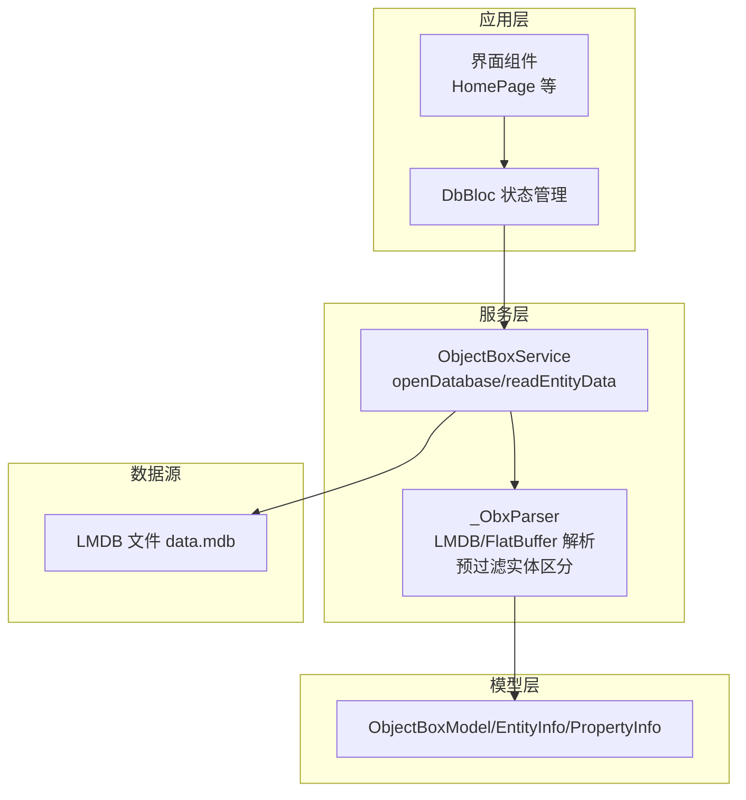
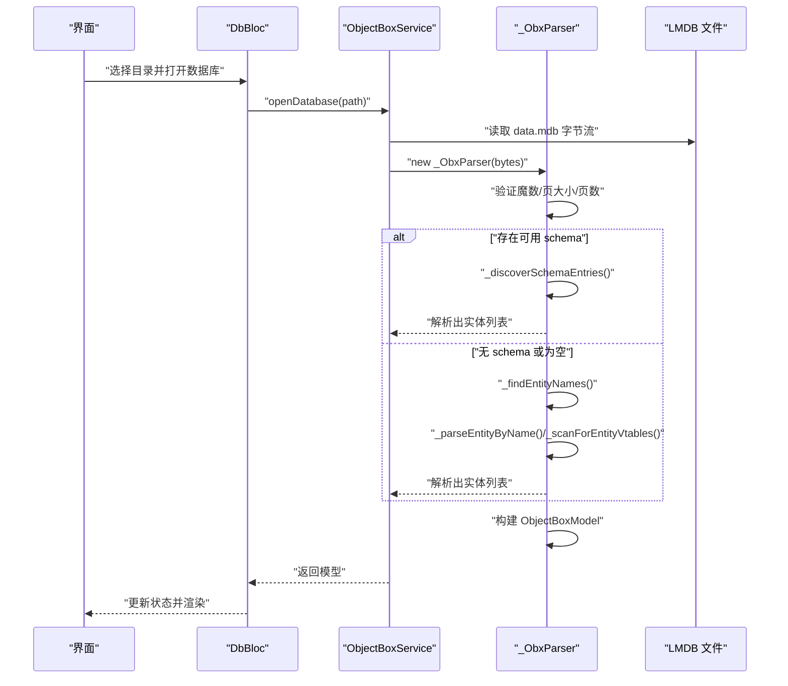
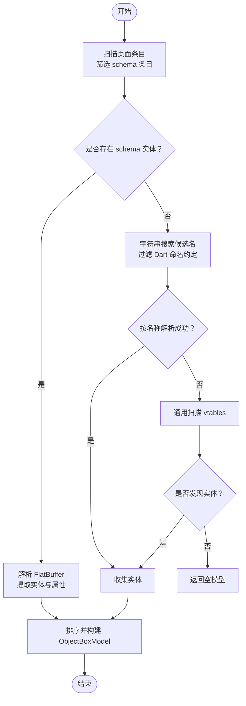
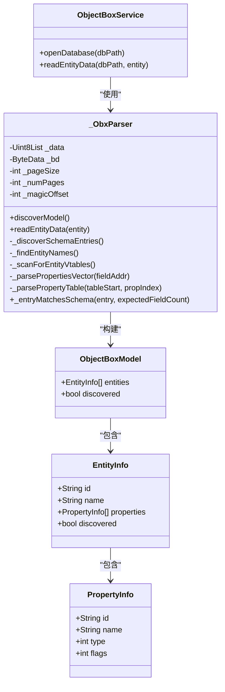

# 自动发现机制

<cite>
**本文引用的文件**
- [lib/main.dart](file://lib/main.dart)
- [lib/bloc/db_bloc.dart](file://lib/bloc/db_bloc.dart)
- [lib/services/objectbox_service.dart](file://lib/services/objectbox_service.dart)
- [lib/models/objectbox_model.dart](file://lib/models/objectbox_model.dart)
- [tool/debug_diagnostic.dart](file://tool/debug_diagnostic.dart)
- [tool/debug_dump.dart](file://tool/debug_dump.dart)
- [tool/debug_props.dart](file://tool/debug_props.dart)
- [tool/debug_schema.dart](file://tool/debug_schema.dart)
</cite>

## 更新摘要
**变更内容**
- 新增基于预过滤的实体区分逻辑，显著提升数据解析性能
- 改进了实体识别技术，优化了实体名称匹配和属性解析算法
- 增强了实体区分的准确性，通过 FlatBuffer 字段计数进行精确区分
- 优化了数据解析流程，减少不必要的完整解析操作

## 目录
1. [引言](#引言)
2. [项目结构](#项目结构)
3. [核心组件](#核心组件)
4. [架构总览](#架构总览)
5. [详细组件分析](#详细组件分析)
6. [依赖关系分析](#依赖关系分析)
7. [性能考量](#性能考量)
8. [故障排查指南](#故障排查指南)
9. [结论](#结论)
10. [附录](#附录)

## 引言
本文件系统性阐述 ObjectBox Viewer 中"自动发现机制"的实现与原理，重点围绕 _ObxParser 类展开，覆盖以下主题：
- LMDB 文件格式解析（页/条目/键值布局）
- FlatBuffer 协议处理（VTable/字段偏移/字符串读取）
- 实体识别技术（基于 schema 的精确发现与基于字符串搜索的自动发现）
- **新增**：基于预过滤的实体区分逻辑（通过 FlatBuffer 字段计数进行实体区分）
- 关键方法剖析：_discoverSchemaEntries、_findEntityNames、_scanForEntityVtables、_parsePropertiesVector、_parsePropertyTable
- 属性解析与类型推断
- 调试与诊断工具的使用
- 性能分析与优化建议

## 项目结构
该项目采用 Flutter 应用结构，核心逻辑集中在服务层与模型层：
- 入口与界面：lib/main.dart、lib/widgets/*
- 状态管理：lib/bloc/db_bloc.dart
- 数据解析与发现：lib/services/objectbox_service.dart（含 _ObxParser）
- 数据模型：lib/models/objectbox_model.dart
- 工具脚本：tool/*（用于调试与诊断）

**图表来源**
- [lib/main.dart:97-145](file://lib/main.dart#L97-L145)
- [lib/bloc/db_bloc.dart:101-110](file://lib/bloc/db_bloc.dart#L101-L110)
- [lib/services/objectbox_service.dart:10-41](file://lib/services/objectbox_service.dart#L10-L41)

**章节来源**
- [lib/main.dart:1-147](file://lib/main.dart#L1-L147)
- [lib/bloc/db_bloc.dart:1-136](file://lib/bloc/db_bloc.dart#L1-L136)
- [lib/services/objectbox_service.dart:1-41](file://lib/services/objectbox_service.dart#L1-L41)

## 核心组件
- ObjectBoxService：对外提供打开数据库、读取实体数据等能力；内部委托 _ObxParser 完成解析与发现。
- _ObxParser：核心解析器，负责：
  - 验证 LMDB 头部与页边界
  - 扫描页面条目，区分 schema 与数据条目
  - 解析 FlatBuffer 实体与属性表
  - 基于 schema 的精确发现与基于字符串搜索的自动发现
  - **新增**：基于 FlatBuffer 字段计数的实体预过滤区分
  - 构建 ObjectBoxModel
- ObjectBoxModel/EntityInfo/PropertyInfo：描述模型、实体与属性的数据结构。

**章节来源**
- [lib/services/objectbox_service.dart:9-41](file://lib/services/objectbox_service.dart#L9-L41)
- [lib/models/objectbox_model.dart:1-248](file://lib/models/objectbox_model.dart#L1-L248)

## 架构总览
自动发现机制在"无 objectbox-model.json"时，直接从 data.mdb 中解析 schema 与数据，生成可浏览的模型视图。整体流程如下：

**图表来源**
- [lib/bloc/db_bloc.dart:101-110](file://lib/bloc/db_bloc.dart#L101-L110)
- [lib/services/objectbox_service.dart:10-19](file://lib/services/objectbox_service.dart#L10-L19)
- [lib/services/objectbox_service.dart:78-111](file://lib/services/objectbox_service.dart#L78-L111)

## 详细组件分析

### _ObxParser：LMDB 文件格式解析
- 魔数与页信息
  - 支持带魔数前缀的文件头，自动调整偏移量
  - 从页头读取页大小与页数，校验合理性
- 页面与条目读取
  - 通过页头 lower 指针数组定位条目起止
  - 将相邻指针去重后切分条目范围
  - 提供 _EntryData 抽象，包含绝对地址、实体 ID、对象 ID、是否 schema 等
- schema 与数据条目的区分
  - schema 条目：键区第 9~15 字节全零
  - 数据条目：键区第 9~15 字节非零（包含写入标志/尺寸信息）

**章节来源**
- [lib/services/objectbox_service.dart:47-70](file://lib/services/objectbox_service.dart#L47-L70)
- [lib/services/objectbox_service.dart:403-436](file://lib/services/objectbox_service.dart#L403-L436)
- [lib/services/objectbox_service.dart:959-977](file://lib/services/objectbox_service.dart#L959-L977)

### FlatBuffer 协议处理
- VTable 结构
  - vtableSOff 可为正或负，表示 vtable 相对位置
  - vtableSize 与 numFields 由 (vtableSize-4)/2 计算
- 字段访问
  - 通过 vtable 偏移表定位字段相对偏移
  - 字符串字段采用"字段偏移 -> 字符串表偏移 -> 字符串长度/内容"的链式寻址
- 类型读取
  - 针对已知类型（bool/byte/short/int/long/float/double/string/date/dateNano/relation）进行精确解析
  - 对未知类型采用启发式回退（优先 int64，再尝试 string/double/int32/bool）

**章节来源**
- [lib/services/objectbox_service.dart:440-528](file://lib/services/objectbox_service.dart#L440-L528)
- [lib/services/objectbox_service.dart:530-644](file://lib/services/objectbox_service.dart#L530-L644)
- [lib/services/objectbox_service.dart:770-875](file://lib/services/objectbox_service.dart#L770-L875)

### 实体识别技术
- 基于 schema 的精确发现（_discoverSchemaEntries）
  - 遍历所有页面条目，筛选 schema 条目（键区第 9~15 字节全零且实体 ID 非零）
  - 解析 FlatBuffer 表，提取实体名与属性向量
  - 过滤不可打印或过短的实体名
- 基于字符串搜索的自动发现（_findEntityNames + _parseEntityByName + _scanForEntityVtables）
  - 字符串搜索：扫描字节流，提取符合 Dart 命名约定（以 "Entity" 结尾、可打印、长度限制）的候选名
  - 名称解析：在数据中查找候选名出现位置，向后/向前回溯解析 FlatBuffer 表
  - 通用扫描：在未找到明确名称时，扫描可能的 vtable 头，检查其后紧邻的 FlatBuffer 表是否满足字段布局特征

**图表来源**
- [lib/services/objectbox_service.dart:142-156](file://lib/services/objectbox_service.dart#L142-L156)
- [lib/services/objectbox_service.dart:158-185](file://lib/services/objectbox_service.dart#L158-L185)
- [lib/services/objectbox_service.dart:187-217](file://lib/services/objectbox_service.dart#L187-L217)
- [lib/services/objectbox_service.dart:219-304](file://lib/services/objectbox_service.dart#L219-L304)
- [lib/services/objectbox_service.dart:306-366](file://lib/services/objectbox_service.dart#L306-L366)

**章节来源**
- [lib/services/objectbox_service.dart:78-111](file://lib/services/objectbox_service.dart#L78-L111)

### 实体名称识别算法
- Dart 命名约定匹配
  - 仅接受 ASCII 可打印字符与常用中文范围
  - 长度限制在 5~50 字符之间
  - 以 "Entity" 结尾作为强约束
- 通用字符串搜索策略
  - 在整个字节流上滑动窗口，识别连续可打印序列
  - 使用 UTF-8 解码并二次过滤（可打印比例阈值）
  - 去重集合避免重复候选

**章节来源**
- [lib/services/objectbox_service.dart:158-185](file://lib/services/objectbox_service.dart#L158-L185)
- [lib/services/objectbox_service.dart:878-882](file://lib/services/objectbox_service.dart#L878-L882)
- [lib/services/objectbox_service.dart:884-909](file://lib/services/objectbox_service.dart#L884-L909)
- [lib/services/objectbox_service.dart:911-917](file://lib/services/objectbox_service.dart#L911-L917)

### 属性解析机制
- 向量解析（_parsePropertiesVector）
  - 读取字段地址的偏移，计算向量起始地址
  - 读取向量元素个数，遍历每个元素偏移
  - 解析每个属性表（_parsePropertyTable）
- 属性表解析（_parsePropertyTable）
  - 识别 vtable 布局，尝试现代/旧版字段索引（name/type/flags 等）
  - 读取字符串字段（name），读取类型（低字节或整型字段）
  - 识别标识位（flags），判定是否为 id 属性
  - 若无法确定类型，回退到启发式推断

**章节来源**
- [lib/services/objectbox_service.dart:530-558](file://lib/services/objectbox_service.dart#L530-L558)
- [lib/services/objectbox_service.dart:560-644](file://lib/services/objectbox_service.dart#L560-L644)

### 数据读取与类型推断
- 数据条目解析（_parseDataEntry）
  - 从 FlatBuffer 表中读取对象 ID（字段 0，int64）
  - 遍历字段，根据已知类型精确读取
  - 当类型未知时，采用启发式回退（int64、string、double、int32、bool）
- 类型推断（_inferPropertyType）
  - 根据解析结果映射到 PropertyType（bool/int/double/string）
- **新增**：实体预过滤区分（_entryMatchesSchema）
  - 通过 FlatBuffer 字段计数快速区分不同实体
  - 避免对不匹配实体的完整解析，提升性能

**章节来源**
- [lib/services/objectbox_service.dart:683-760](file://lib/services/objectbox_service.dart#L683-L760)
- [lib/services/objectbox_service.dart:762-768](file://lib/services/objectbox_service.dart#L762-L768)
- [lib/services/objectbox_service.dart:827-854](file://lib/services/objectbox_service.dart#L827-L854)

### 关键方法实现原理

#### _discoverSchemaEntries
- 遍历所有页面，读取条目
- 判断是否 schema 条目（键区第 9~15 字节全零且实体 ID 非零）
- 解析 FlatBuffer 表，提取实体名与属性向量
- 过滤不可打印或过短的实体名，按实体 ID 去重

**章节来源**
- [lib/services/objectbox_service.dart:142-156](file://lib/services/objectbox_service.dart#L142-L156)

#### _findEntityNames
- 在字节流上滑动窗口，识别可打印字符串
- 过滤 Dart 命名约定（以 "Entity" 结尾、长度限制、可打印比例）
- 去重并返回候选名列表

**章节来源**
- [lib/services/objectbox_service.dart:158-185](file://lib/services/objectbox_service.dart#L158-L185)

#### _scanForEntityVtables
- 扫描可能的 vtable 头（大小 8~128，偶数）
- 检查其后紧邻的 FlatBuffer 表是否满足字段布局特征
- 尝试解析实体名与属性向量，收集实体

**章节来源**
- [lib/services/objectbox_service.dart:187-217](file://lib/services/objectbox_service.dart#L187-L217)

#### _parseEntityByName
- 在数据中查找候选名出现位置
- 向后/向前回溯解析 FlatBuffer 表，提取实体名与属性

**章节来源**
- [lib/services/objectbox_service.dart:219-304](file://lib/services/objectbox_service.dart#L219-L304)

#### _tryParseEntityAt
- 从给定表起始位置解析 FlatBuffer 表
- 读取字段 3 作为 name，字段 4 作为属性向量
- 返回解析出的实体

**章节来源**
- [lib/services/objectbox_service.dart:306-366](file://lib/services/objectbox_service.dart#L306-L366)

#### _parsePropertiesVector
- 读取属性向量的元素个数与每个元素偏移
- 解析每个属性表，收集属性列表

**章节来源**
- [lib/services/objectbox_service.dart:530-558](file://lib/services/objectbox_service.dart#L530-L558)

#### _parsePropertyTable
- 识别 vtable 布局，尝试现代/旧版字段索引
- 读取 name、type、flags，必要时回退到启发式推断

**章节来源**
- [lib/services/objectbox_service.dart:560-644](file://lib/services/objectbox_service.dart#L560-L644)

#### **新增** _entryMatchesSchema
- 快速检查：仅解析 FlatBuffer vtable 的字段计数
- 通过比较预期字段计数与实际字段计数来区分实体
- 这是最便宜的方式，用于在共享 LMDB B-tree 的不同实体间进行区分
- empircally，FlatBuffer numFields = entity.properties.length + 1

**章节来源**
- [lib/services/objectbox_service.dart:827-854](file://lib/services/objectbox_service.dart#L827-L854)

#### **新增** _parseDataEntry（增强版）
- 基于预过滤的实体区分
- 在完整解析前先检查 FlatBuffer 字段计数是否匹配
- 如果不匹配则跳过，避免不必要的解析操作
- 其他功能保持不变

**章节来源**
- [lib/services/objectbox_service.dart:856-933](file://lib/services/objectbox_service.dart#L856-L933)

## 依赖关系分析
- ObjectBoxService 依赖 _ObxParser 完成解析
- _ObxParser 依赖 ByteData/Uint8List 进行二进制读取
- _ObxParser 依赖 _EntryData/_PageData 抽象页面与条目
- 解析结果封装为 ObjectBoxModel/EntityInfo/PropertyInfo

**图表来源**
- [lib/services/objectbox_service.dart:9-41](file://lib/services/objectbox_service.dart#L9-L41)
- [lib/services/objectbox_service.dart:47-70](file://lib/services/objectbox_service.dart#L47-L70)
- [lib/models/objectbox_model.dart:1-248](file://lib/models/objectbox_model.dart#L1-L248)

**章节来源**
- [lib/services/objectbox_service.dart:9-41](file://lib/services/objectbox_service.dart#L9-L41)
- [lib/models/objectbox_model.dart:1-248](file://lib/models/objectbox_model.dart#L1-L248)

## 性能考量
- 时间复杂度
  - LMDB 扫描：O(P×E)，P 为页数，E 为每页平均条目数
  - 字符串搜索：O(B)，B 为数据大小
  - FlatBuffer 解析：O(F)，F 为 FlatBuffer 字段数量
  - **新增**：预过滤检查 O(1) 操作，大幅减少完整解析次数
- 空间复杂度
  - 主要为解析中间结构（实体/属性列表）与去重集合
- 优化建议
  - 分页缓存：对已解析的页面/条目进行缓存，避免重复解析
  - 并行扫描：在多核环境下并行处理不同页，注意线程安全
  - 早期终止：当已发现足够实体或达到阈值时提前停止
  - 字符串过滤：增加更严格的命名规则与长度限制，减少误报
  - **新增**：利用预过滤机制，优先使用字段计数区分实体，减少完整解析开销
  - 启发式收敛：对未知类型的回退策略设置上限，避免无限尝试

## 故障排查指南
- 常见问题
  - data.mdb 不存在或损坏：抛出异常提示路径或文件缺失
  - 非 ObjectBox 文件：魔数不匹配，返回空模型
  - schema 不完整：自动切换到字符串搜索与通用扫描
  - **新增**：实体区分失败：检查 FlatBuffer 字段计数是否正确
- 调试工具
  - debug_dump.dart：输出页/条目/FlatBuffer 字段的十六进制与类型推断
  - debug_schema.dart：解析并打印 schema 实体的 FlatBuffer 字段
  - debug_props.dart：解析实体属性向量，逐项打印字段与字符串
  - debug_diagnostic.dart：对比 schema 解析与数据字段解析结果，辅助定位差异
  - **新增**：使用调试工具检查 FlatBuffer 字段计数，验证实体区分逻辑

**章节来源**
- [lib/main.dart:97-115](file://lib/main.dart#L97-L115)
- [tool/debug_dump.dart:1-159](file://tool/debug_dump.dart#L1-L159)
- [tool/debug_schema.dart:1-101](file://tool/debug_schema.dart#L1-L101)
- [tool/debug_props.dart:1-120](file://tool/debug_props.dart#L1-L120)
- [tool/debug_diagnostic.dart:1-345](file://tool/debug_diagnostic.dart#L1-L345)

## 结论
自动发现机制通过"schema 精确发现 + 字符串搜索 + 通用 vtable 扫描"的组合策略，在缺少 objectbox-model.json 的情况下仍能可靠地解析 LMDB 文件中的 FlatBuffer 数据，生成可浏览的实体与属性视图。**最新的改进**引入了基于预过滤的实体区分逻辑，通过 FlatBuffer 字段计数快速区分不同实体，显著提升了数据解析性能和准确性。该机制在准确性与鲁棒性之间取得平衡，并提供了完善的调试工具支持。

## 附录
- 使用步骤
  - 选择数据库目录，程序会自动检测 objectbox-model.json 与 data.mdb
  - 打开数据库后，DbBloc 触发 ObjectBoxService.openDatabase
  - 内部调用 _ObxParser.discoverModel 完成解析
  - 选择实体后，调用 readEntityData 获取数据行
- 最佳实践
  - 优先确保 schema 存在，以获得最准确的实体与属性信息
  - 在大规模数据库上启用分页缓存与并行扫描
  - **新增**：利用预过滤机制，通过 FlatBuffer 字段计数快速区分实体
  - 使用调试工具比对 schema 与数据字段，快速定位解析差异
  - **新增**：监控实体区分性能，确保预过滤逻辑正常工作