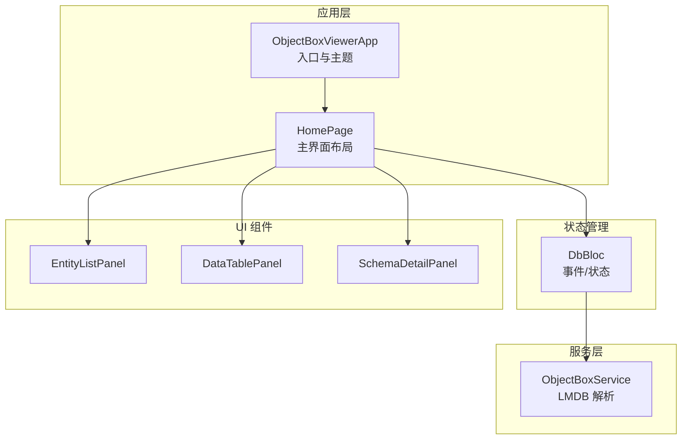
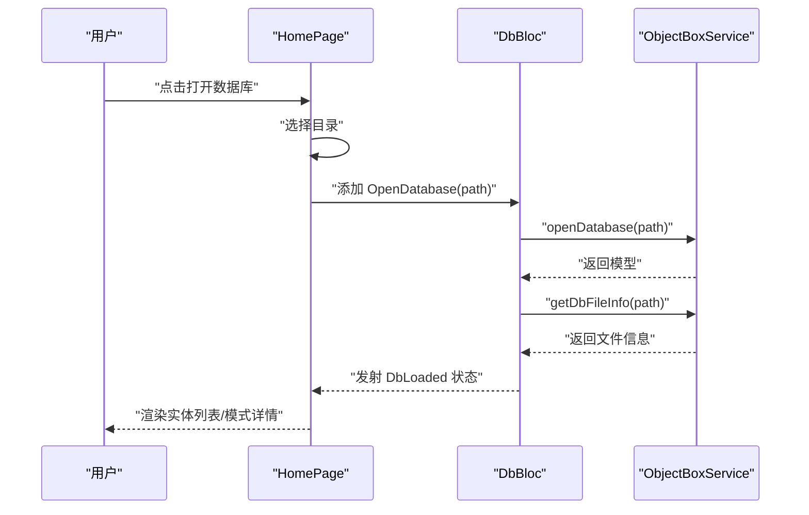
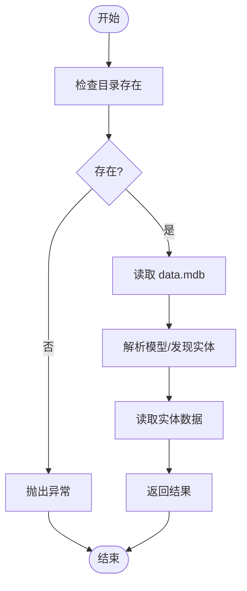
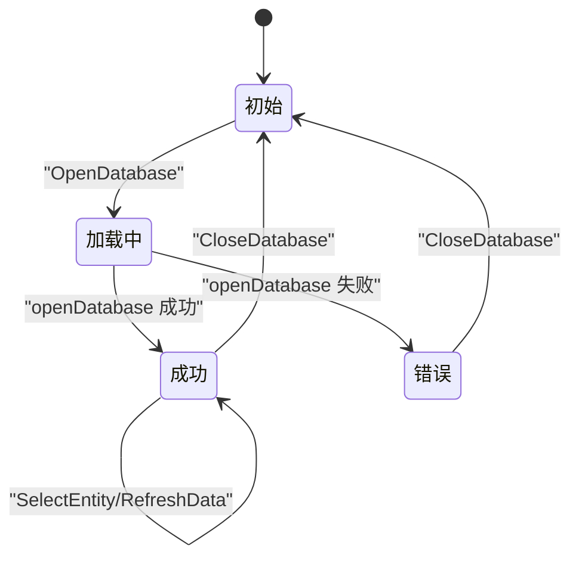
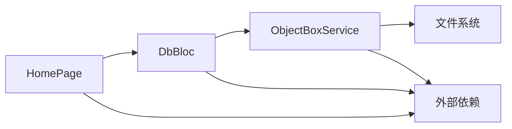

# 测试策略

<cite>
**本文引用的文件**
- [README.md](file://README.md)
- [pubspec.yaml](file://pubspec.yaml)
- [lib/main.dart](file://lib/main.dart)
- [lib/bloc/db_bloc.dart](file://lib/bloc/db_bloc.dart)
- [lib/services/objectbox_service.dart](file://lib/services/objectbox_service.dart)
- [lib/widgets/home_page.dart](file://lib/widgets/home_page.dart)
- [test/widget_test.dart](file://test/widget_test.dart)
- [tool/test_service.dart](file://tool/test_service.dart)
- [tool/test_service2.dart](file://tool/test_service2.dart)
</cite>

## 目录
1. [引言](#引言)
2. [项目结构](#项目结构)
3. [核心组件](#核心组件)
4. [架构总览](#架构总览)
5. [详细组件分析](#详细组件分析)
6. [依赖分析](#依赖分析)
7. [性能考虑](#性能考虑)
8. [故障排查指南](#故障排查指南)
9. [结论](#结论)
10. [附录](#附录)

## 引言
本测试策略面向 ObjectBox Viewer 的测试体系，目标是建立覆盖单元测试、集成测试、UI 自动化测试、数据库服务测试与模拟、性能与压力测试、测试数据管理、以及持续集成与自动化测试的完整方案。策略强调可验证性、可扩展性与可维护性，确保对核心功能与边界场景的全面覆盖。

## 项目结构
该项目为 Flutter 应用，采用按功能域分层组织：入口应用、BLoC 状态管理、服务层（数据库解析）、UI 组件与工具脚本。测试主要围绕以下模块展开：
- 应用入口与主界面：负责启动、主题、打开数据库目录、状态栏等
- BLoC 层：处理数据库打开、实体选择、刷新与关闭等事件，驱动状态流转
- 服务层：直接读取 LMDB 数据文件，解析模型与实体数据
- UI 组件：首页、实体列表面板、数据表格面板、模式详情面板
- 工具脚本：用于离线测试数据库服务能力

图表来源
- [lib/main.dart:13-43](file://lib/main.dart#L13-L43)
- [lib/widgets/home_page.dart:9-72](file://lib/widgets/home_page.dart#L9-L72)
- [lib/bloc/db_bloc.dart:91-135](file://lib/bloc/db_bloc.dart#L91-L135)
- [lib/services/objectbox_service.dart:9-41](file://lib/services/objectbox_service.dart#L9-L41)

章节来源
- [pubspec.yaml:30-43](file://pubspec.yaml#L30-L43)
- [lib/main.dart:1-147](file://lib/main.dart#L1-L147)
- [lib/widgets/home_page.dart:1-218](file://lib/widgets/home_page.dart#L1-L218)
- [lib/bloc/db_bloc.dart:1-136](file://lib/bloc/db_bloc.dart#L1-L136)
- [lib/services/objectbox_service.dart:1-1006](file://lib/services/objectbox_service.dart#L1-L1006)

## 核心组件
- 应用入口与主界面
  - 负责初始化、主题构建、应用壳体与底部状态栏
  - 提供“打开数据库”交互，触发目录选择与路径发现逻辑
- BLoC 层（DbBloc）
  - 定义数据库打开、实体选择、刷新与关闭等事件
  - 驱动加载、成功、错误三种状态，并在加载态与错误态渲染对应 UI
- 服务层（ObjectBoxService）
  - 从 data.mdb 直接解析模型与实体数据，支持无 schema 模式下的自动发现
  - 提供文件信息查询、实体数据读取等能力
- UI 组件
  - 首页根据状态渲染欢迎视图、加载指示器、错误视图或内容面板
  - 内容面板根据是否选择实体切换展示模式详情或数据表格

章节来源
- [lib/main.dart:13-147](file://lib/main.dart#L13-L147)
- [lib/bloc/db_bloc.dart:7-135](file://lib/bloc/db_bloc.dart#L7-L135)
- [lib/services/objectbox_service.dart:9-41](file://lib/services/objectbox_service.dart#L9-L41)
- [lib/widgets/home_page.dart:9-218](file://lib/widgets/home_page.dart#L9-L218)

## 架构总览
下图展示了从用户操作到状态更新与 UI 渲染的关键调用链路，以及服务层解析 LMDB 文件的内部流程。

图表来源
- [lib/widgets/home_page.dart:74-88](file://lib/widgets/home_page.dart#L74-L88)
- [lib/bloc/db_bloc.dart:101-110](file://lib/bloc/db_bloc.dart#L101-L110)
- [lib/services/objectbox_service.dart:10-29](file://lib/services/objectbox_service.dart#L10-L29)

## 详细组件分析

### UI 测试与自动化测试流程
- 单元测试框架
  - 使用 Flutter SDK 内置的 flutter_test 进行 UI 组件与业务逻辑测试
  - 建议使用 WidgetTester 对关键交互进行断言，如应用启动、标题文本、加载状态等
- 自动化测试流程
  - 在 CI 中执行 flutter test，结合覆盖率收集（参见附录）
  - 对关键页面（如 HomePage）进行快照测试与交互测试，确保状态变化正确
- 设计原则与编写指南
  - 以行为驱动：围绕用户操作与状态变化设计用例
  - 最小化耦合：通过 Provider/BLoC 注入依赖，便于替换与测试
  - 可重复性：使用稳定的测试数据与固定时序，避免随机性
  - 可维护性：用例命名清晰、断言明确、失败信息具体

章节来源
- [test/widget_test.dart:1-10](file://test/widget_test.dart#L1-L10)
- [pubspec.yaml:44-53](file://pubspec.yaml#L44-L53)

### 数据库服务测试与模拟策略
- 服务层职责
  - 直接读取 data.mdb 并解析 FlatBuffers 结构，支持 schema 发现与实体数据扫描
  - 提供文件信息查询与实体数据读取接口
- 测试方法
  - 单元测试：针对 _ObxParser 的解析逻辑（页读取、条目解析、FlatBuffers 字段读取）进行小范围测试
  - 集成测试：使用真实 LMDB 文件片段或工具脚本生成的样本数据，验证 openDatabase/readEntityData 的整体流程
  - 模拟策略：对文件系统访问与网络依赖进行抽象，使用内存字节流或临时文件替代真实磁盘访问
- 边界与异常
  - 非法页大小、损坏页、空数据、缺失文件等异常路径需覆盖
  - 无 schema 模式下的自动发现逻辑需重点验证

图表来源
- [lib/services/objectbox_service.dart:10-40](file://lib/services/objectbox_service.dart#L10-L40)

章节来源
- [lib/services/objectbox_service.dart:9-1006](file://lib/services/objectbox_service.dart#L1-L1006)
- [tool/test_service.dart:8-108](file://tool/test_service.dart#L8-L108)
- [tool/test_service2.dart:10-53](file://tool/test_service2.dart#L10-L53)

### BLoC 状态机测试
- 事件与状态
  - 事件：OpenDatabase、SelectEntity、RefreshData、CloseDatabase
  - 状态：DbInitial、DbLoading、DbLoaded、DbError
- 测试要点
  - 正常路径：打开数据库后进入 DbLoaded，选择实体后加载数据
  - 错误路径：捕获异常并进入 DbError，支持重新打开
  - 刷新路径：触发 RefreshData 后重新加载当前实体数据
- 断言建议
  - 状态类型与字段值（如 dbPath、model、fileInfo、selectedEntity、rows、error）
  - 状态变更顺序与条件满足（仅在 DbLoaded 且已选实体时才刷新）

图表来源
- [lib/bloc/db_bloc.dart:7-135](file://lib/bloc/db_bloc.dart#L7-L135)

章节来源
- [lib/bloc/db_bloc.dart:1-136](file://lib/bloc/db_bloc.dart#L1-L136)

### UI 组件测试
- 主要组件
  - HomePage：根据状态渲染欢迎视图、加载指示器、错误视图与内容面板
  - 实体列表面板、数据表格面板、模式详情面板：展示模型与数据
- 测试关注点
  - 状态到 UI 的映射正确性
  - 用户交互（打开数据库、选择实体、刷新）触发的状态变化
  - 错误提示与回退按钮的可用性

章节来源
- [lib/widgets/home_page.dart:9-218](file://lib/widgets/home_page.dart#L9-L218)
- [lib/main.dart:45-147](file://lib/main.dart#L45-L147)

### 性能测试与压力测试
- 性能关注点
  - 大型 LMDB 文件的解析时间与内存占用
  - 实体数据读取与去重（基于页号与对象 ID）的效率
  - UI 渲染在大数据量下的流畅度
- 压力测试建议
  - 生成不同规模的 LMDB 文件样本，测量解析耗时与峰值内存
  - 对实体数据读取进行批量请求与滚动渲染的压力验证
- 指标与工具
  - 使用 Flutter DevTools 或平台原生工具采集 CPU/内存/帧率
  - 在 CI 中引入基准测试任务，记录关键指标趋势

[本节为通用性能讨论，不直接分析具体文件]

### 测试数据准备与管理
- 数据源
  - 使用真实或合成的 LMDB 文件作为测试数据
  - 工具脚本可用于生成或验证样本数据（参考 tool 目录）
- 管理策略
  - 将测试数据置于资源目录，按场景分类（小/中/大、含/不含 schema）
  - 使用临时目录隔离每次测试的数据副本，避免污染
  - 对异常场景（损坏页、空数据、非法页大小）准备专门样本

章节来源
- [tool/test_service.dart:8-108](file://tool/test_service.dart#L8-L108)
- [tool/test_service2.dart:10-53](file://tool/test_service2.dart#L10-L53)

### 持续集成与自动化测试配置
- 基本步骤
  - 在 CI 中安装 Flutter SDK 与平台依赖
  - 执行 flutter pub get 获取依赖
  - 运行 flutter test 并生成覆盖率报告
  - 可选：上传覆盖率至第三方平台
- 质量门禁
  - 设置最低覆盖率阈值（例如语句/分支/函数/行）
  - 对关键路径失败即阻断构建
- 平台矩阵
  - 覆盖 Windows/macOS/Linux 平台的测试执行

章节来源
- [pubspec.yaml:44-53](file://pubspec.yaml#L44-L53)
- [README.md:1-18](file://README.md#L1-L18)

## 依赖分析
- 组件耦合
  - HomePage 依赖 DbBloc；DbBloc 依赖 ObjectBoxService；服务层依赖文件系统与二进制解析
- 外部依赖
  - Flutter SDK、flutter_bloc、file_picker、path、path_provider、ffi、equatable
- 风险点
  - 文件系统访问与二进制解析的健壮性
  - UI 与状态管理的解耦程度影响测试可维护性

图表来源
- [lib/widgets/home_page.dart:14-71](file://lib/widgets/home_page.dart#L14-L71)
- [lib/bloc/db_bloc.dart:91-135](file://lib/bloc/db_bloc.dart#L91-L135)
- [lib/services/objectbox_service.dart:9-41](file://lib/services/objectbox_service.dart#L9-L41)
- [pubspec.yaml:30-43](file://pubspec.yaml#L30-L43)

章节来源
- [pubspec.yaml:30-43](file://pubspec.yaml#L30-L43)
- [lib/widgets/home_page.dart:1-218](file://lib/widgets/home_page.dart#L1-L218)
- [lib/bloc/db_bloc.dart:1-136](file://lib/bloc/db_bloc.dart#L1-L136)
- [lib/services/objectbox_service.dart:1-1006](file://lib/services/objectbox_service.dart#L1-L1006)

## 性能考虑
- 解析复杂度
  - 页扫描与条目解析的时间复杂度与文件大小线性相关
  - 去重与排序在大数据量下可能成为瓶颈
- 优化方向
  - 分页读取与增量解析
  - 缓存已解析的实体元数据
  - UI 层采用虚拟化列表与懒加载
- 监控与回归
  - 在 CI 中加入性能回归检测，设定阈值告警

[本节为通用性能讨论，不直接分析具体文件]

## 故障排查指南
- 常见问题
  - 目录不存在或 data.mdb 缺失：服务层会抛出异常，BLoC 进入错误状态
  - 无 schema 模式：UI 显示发现提示，字段名与类型为自动推断
  - UI 未响应：检查事件派发与状态更新链路
- 排查步骤
  - 查看 DbError 状态消息
  - 使用工具脚本验证服务层解析能力
  - 在 UI 测试中复现并定位状态流转问题

章节来源
- [lib/services/objectbox_service.dart:10-18](file://lib/services/objectbox_service.dart#L10-L18)
- [lib/bloc/db_bloc.dart:101-110](file://lib/bloc/db_bloc.dart#L101-L110)
- [lib/widgets/home_page.dart:19-217](file://lib/widgets/home_page.dart#L19-L217)

## 结论
本测试策略以 BLoC 为核心，结合 UI 自动化、服务层解析测试与工具脚本验证，形成从单元到集成再到性能的完整测试闭环。通过明确的质量标准与覆盖率要求、规范的测试数据管理与 CI 配置，确保 ObjectBox Viewer 在多平台上的稳定性与可靠性。

## 附录
- 测试覆盖率要求与质量标准
  - 语句覆盖率：≥ 80%
  - 分支覆盖率：≥ 70%
  - 函数/类覆盖率：≥ 90%
  - 关键路径（错误处理、无 schema 模式、大数据量）必须 100% 覆盖
- 测试用例设计原则
  - 功能覆盖：核心功能与边界场景双覆盖
  - 状态驱动：围绕 BLoC 状态机设计用例
  - 可重复：使用稳定数据与固定时序
  - 可追溯：用例与需求/缺陷关联
- 持续集成配置要点
  - 安装 Flutter SDK 与平台依赖
  - flutter pub get
  - flutter test --coverage
  - 上传覆盖率与报告
  - 失败即阻断

[本节为通用指导，不直接分析具体文件]