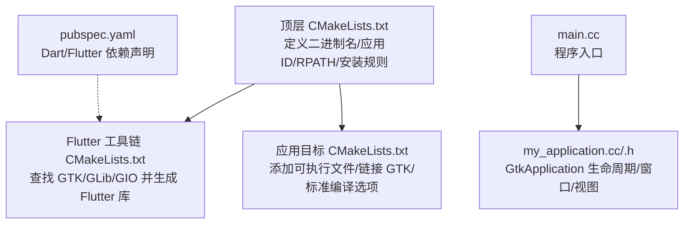
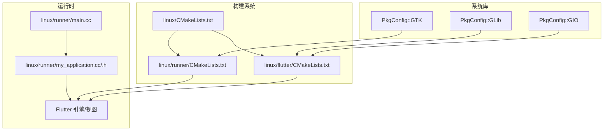
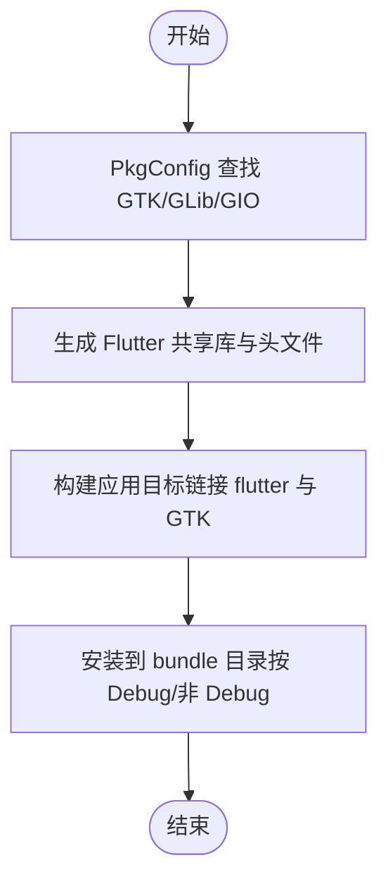
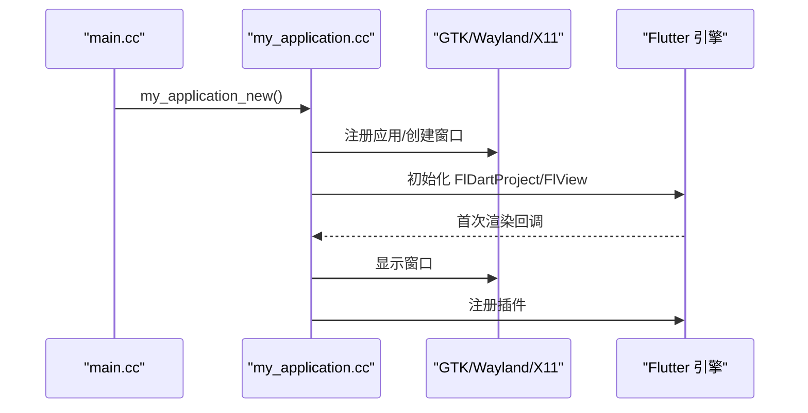
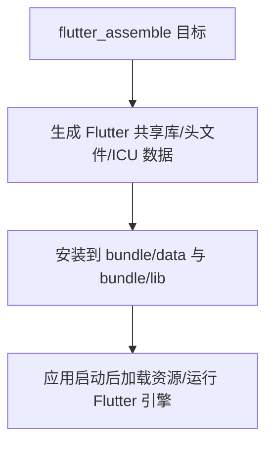
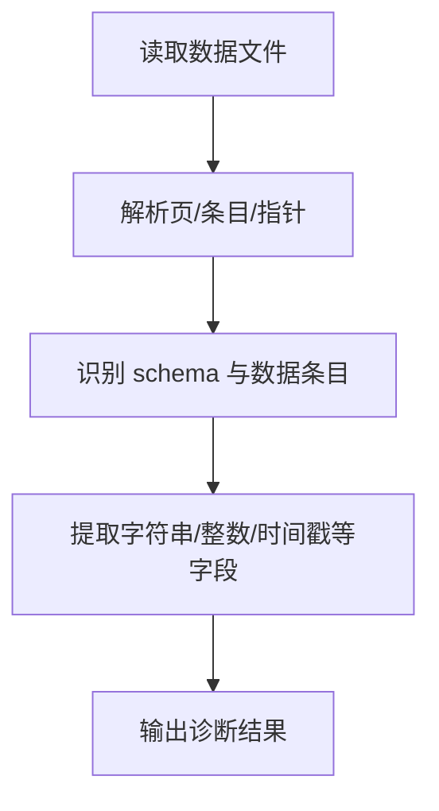
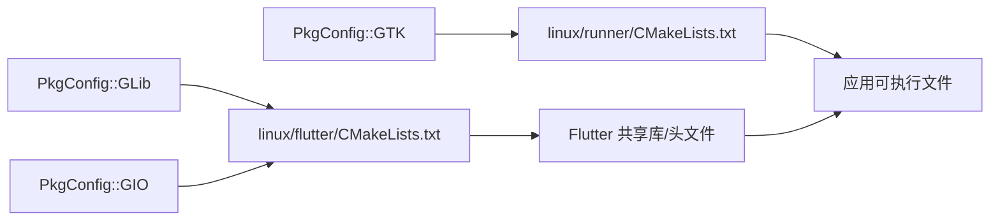

# Linux 平台支持

<cite>
**本文引用的文件**
- [linux/CMakeLists.txt](file://linux/CMakeLists.txt)
- [linux/flutter/CMakeLists.txt](file://linux/flutter/CMakeLists.txt)
- [linux/runner/CMakeLists.txt](file://linux/runner/CMakeLists.txt)
- [linux/runner/my_application.cc](file://linux/runner/my_application.cc)
- [linux/runner/my_application.h](file://linux/runner/my_application.h)
- [linux/runner/main.cc](file://linux/runner/main.cc)
- [pubspec.yaml](file://pubspec.yaml)
- [README.md](file://README.md)
- [tool/debug_all_pages.dart](file://tool/debug_all_pages.dart)
- [tool/debug_current.dart](file://tool/debug_current.dart)
- [tool/debug_diagnostic.dart](file://tool/debug_diagnostic.dart)
- [tool/debug_dump.dart](file://tool/debug_dump.dart)
</cite>

## 目录
1. [简介](#简介)
2. [项目结构](#项目结构)
3. [核心组件](#核心组件)
4. [架构总览](#架构总览)
5. [详细组件分析](#详细组件分析)
6. [依赖关系分析](#依赖关系分析)
7. [性能考量](#性能考量)
8. [故障排查指南](#故障排查指南)
9. [结论](#结论)
10. [附录](#附录)

## 简介
本文件面向 Linux 平台，系统化梳理 ObjectBox Viewer 的 GTK 应用框架、Flutter Desktop 在 Linux 上的构建与运行、PkgConfig 依赖管理、系统库链接配置、发行版兼容性与包管理器集成、AppImage 与 Snap 打包实践、Linux 权限与文件系统访问、桌面环境集成与启动器配置，以及调试与性能分析方法。内容基于仓库中的 CMake 构建脚本、GTK 应用入口与窗口逻辑、Flutter 工具链配置、以及配套的诊断工具脚本。

## 项目结构
Linux 相关实现主要位于 linux/ 目录，包含：
- 构建层：顶层 CMakeLists.txt、Flutter 工具链 CMakeLists.txt、应用目标 CMakeLists.txt
- 运行时层：GTK 应用入口 main.cc、应用生命周期与窗口逻辑 my_application.cc/h
- 配置与清单：pubspec.yaml（Dart/Flutter 依赖）、README.md（基础说明）

图表来源
- [linux/CMakeLists.txt:1-129](file://linux/CMakeLists.txt#L1-L129)
- [linux/flutter/CMakeLists.txt:1-89](file://linux/flutter/CMakeLists.txt#L1-L89)
- [linux/runner/CMakeLists.txt:1-27](file://linux/runner/CMakeLists.txt#L1-L27)
- [linux/runner/main.cc:1-7](file://linux/runner/main.cc#L1-L7)
- [linux/runner/my_application.cc:1-149](file://linux/runner/my_application.cc#L1-L149)
- [linux/runner/my_application.h:1-22](file://linux/runner/my_application.h#L1-L22)
- [pubspec.yaml:1-96](file://pubspec.yaml#L1-L96)

章节来源
- [linux/CMakeLists.txt:1-129](file://linux/CMakeLists.txt#L1-L129)
- [linux/flutter/CMakeLists.txt:1-89](file://linux/flutter/CMakeLists.txt#L1-L89)
- [linux/runner/CMakeLists.txt:1-27](file://linux/runner/CMakeLists.txt#L1-L27)
- [linux/runner/main.cc:1-7](file://linux/runner/main.cc#L1-L7)
- [linux/runner/my_application.cc:1-149](file://linux/runner/my_application.cc#L1-L149)
- [linux/runner/my_application.h:1-22](file://linux/runner/my_application.h#L1-L22)
- [pubspec.yaml:1-96](file://pubspec.yaml#L1-L96)
- [README.md:1-18](file://README.md#L1-L18)

## 核心组件
- 构建与依赖管理
  - 顶层 CMakeLists.txt 定义二进制名称、应用 ID、RPATH、安装目录、跨构建 sysroot、标准编译选项、安装规则等；通过 PkgConfig 查找 GTK 并链接。
  - Flutter 工具链 CMakeLists.txt 通过 PkgConfig 查找 GTK、GLib、GIO，并生成 Flutter 共享库与头文件，同时触发 Flutter 工具后端生成。
  - 应用目标 CMakeLists.txt 定义可执行文件、应用宏、链接 flutter 与 GTK。
- GTK 应用入口与窗口
  - main.cc 调用 my_application_new() 并交由 GLib/GTK 应用框架运行。
  - my_application.cc 实现 GtkApplication 生命周期回调：激活窗口、设置标题栏/头部栏、创建 Flutter 视图、注册插件、首次渲染后显示窗口、命令行参数传递等。
- Flutter 依赖
  - pubspec.yaml 声明 Flutter SDK、Material 图标、bloc、路径与文件选择等依赖，用于 Linux 桌面运行时。

章节来源
- [linux/CMakeLists.txt:1-129](file://linux/CMakeLists.txt#L1-L129)
- [linux/flutter/CMakeLists.txt:1-89](file://linux/flutter/CMakeLists.txt#L1-L89)
- [linux/runner/CMakeLists.txt:1-27](file://linux/runner/CMakeLists.txt#L1-L27)
- [linux/runner/main.cc:1-7](file://linux/runner/main.cc#L1-L7)
- [linux/runner/my_application.cc:1-149](file://linux/runner/my_application.cc#L1-L149)
- [linux/runner/my_application.h:1-22](file://linux/runner/my_application.h#L1-L22)
- [pubspec.yaml:1-96](file://pubspec.yaml#L1-L96)

## 架构总览
下图展示从 CMake 到 GTK/Flutter 的整体关系与依赖流向：

图表来源
- [linux/CMakeLists.txt:50-76](file://linux/CMakeLists.txt#L50-L76)
- [linux/flutter/CMakeLists.txt:22-69](file://linux/flutter/CMakeLists.txt#L22-L69)
- [linux/runner/CMakeLists.txt:9-26](file://linux/runner/CMakeLists.txt#L9-L26)
- [linux/runner/main.cc:1-7](file://linux/runner/main.cc#L1-L7)
- [linux/runner/my_application.cc:1-149](file://linux/runner/my_application.cc#L1-L149)

## 详细组件分析

### 组件一：CMake 构建与 PkgConfig 依赖管理
- 顶层 CMakeLists.txt
  - 设置二进制名、应用 ID、RPATH 以支持相对路径加载库。
  - 使用 PkgConfig 查找 GTK 并作为导入目标，供后续链接。
  - 安装规则将资源与库复制到 bundle 目录，区分 Debug/非 Debug 的 AOT 库安装。
- Flutter 工具链 CMakeLists.txt
  - 同样使用 PkgConfig 查找 GTK、GLib、GIO，并生成 Flutter 共享库与头文件。
  - 通过自定义命令触发 Flutter 工具后端生成，确保构建产物可用。
- 应用目标 CMakeLists.txt
  - 添加可执行文件，应用标准编译选项，定义应用 ID 宏，链接 flutter 与 GTK。

图表来源
- [linux/CMakeLists.txt:50-129](file://linux/CMakeLists.txt#L50-L129)
- [linux/flutter/CMakeLists.txt:22-89](file://linux/flutter/CMakeLists.txt#L22-L89)
- [linux/runner/CMakeLists.txt:9-26](file://linux/runner/CMakeLists.txt#L9-L26)

章节来源
- [linux/CMakeLists.txt:1-129](file://linux/CMakeLists.txt#L1-L129)
- [linux/flutter/CMakeLists.txt:1-89](file://linux/flutter/CMakeLists.txt#L1-L89)
- [linux/runner/CMakeLists.txt:1-27](file://linux/runner/CMakeLists.txt#L1-L27)

### 组件二：GTK 应用入口与窗口系统集成
- main.cc
  - 创建 MyApplication 实例并交由 g_application_run 运行。
- my_application.cc
  - 生命周期：startup/shutdown/activate/local_command_line。
  - 窗口创建：根据桌面环境选择头部栏或传统标题栏；默认大小、背景色、视图容器。
  - Flutter 集成：创建 FlDartProject、设置入口参数、创建 FlView、注册插件、首次帧回调显示窗口。
  - 程序名设置：将 g_set_prgname 设为 APPLICATION_ID，便于桌面环境识别。

图表来源
- [linux/runner/main.cc:1-7](file://linux/runner/main.cc#L1-L7)
- [linux/runner/my_application.cc:23-79](file://linux/runner/my_application.cc#L23-L79)
- [linux/runner/my_application.h:1-22](file://linux/runner/my_application.h#L1-L22)

章节来源
- [linux/runner/main.cc:1-7](file://linux/runner/main.cc#L1-L7)
- [linux/runner/my_application.cc:1-149](file://linux/runner/my_application.cc#L1-L149)
- [linux/runner/my_application.h:1-22](file://linux/runner/my_application.h#L1-L22)

### 组件三：Flutter Desktop 在 Linux 的构建与运行
- 构建阶段
  - 通过 Flutter 工具链 CMakeLists.txt 生成 Flutter 共享库与 ICU 数据文件。
  - 顶层 CMakeLists.txt 将 Flutter 资源与库安装到 bundle。
- 运行阶段
  - 应用通过 GTK 窗口承载 Flutter 视图；首次渲染后显示窗口，确保视觉一致性。
  - 插件注册在视图上完成，保证平台通道与原生能力可用。

图表来源
- [linux/flutter/CMakeLists.txt:72-89](file://linux/flutter/CMakeLists.txt#L72-L89)
- [linux/CMakeLists.txt:91-129](file://linux/CMakeLists.txt#L91-L129)

章节来源
- [linux/flutter/CMakeLists.txt:1-89](file://linux/flutter/CMakeLists.txt#L1-L89)
- [linux/CMakeLists.txt:75-129](file://linux/CMakeLists.txt#L75-L129)

### 组件四：诊断与调试工具（Linux 环境下的数据解析）
尽管这些脚本是 Dart 写的，但它们展示了如何在 Linux 环境中解析底层数据库文件（如 LMDB/FlatBuffers），可用于验证数据一致性与定位问题：
- debug_all_pages.dart：扫描页、解析指针与条目，识别潜在模式。
- debug_current.dart：收集 schema 与数据条目，输出实体与对象信息。
- debug_diagnostic.dart：对比 schema 解析与实际字段，辅助诊断字段类型与值。
- debug_dump.dart：打印页头、键、值、FlatBuffers 表格与字段类型（字符串/整数/布尔/时间戳）。

图表来源
- [tool/debug_all_pages.dart:1-102](file://tool/debug_all_pages.dart#L1-L102)
- [tool/debug_current.dart:1-158](file://tool/debug_current.dart#L1-L158)
- [tool/debug_diagnostic.dart:1-345](file://tool/debug_diagnostic.dart#L1-L345)
- [tool/debug_dump.dart:1-159](file://tool/debug_dump.dart#L1-L159)

章节来源
- [tool/debug_all_pages.dart:1-102](file://tool/debug_all_pages.dart#L1-L102)
- [tool/debug_current.dart:1-158](file://tool/debug_current.dart#L1-L158)
- [tool/debug_diagnostic.dart:1-345](file://tool/debug_diagnostic.dart#L1-L345)
- [tool/debug_dump.dart:1-159](file://tool/debug_dump.dart#L1-L159)

## 依赖关系分析
- 构建期依赖
  - PkgConfig::GTK 用于 GTK+3 的发现与链接。
  - PkgConfig::GLib、PkgConfig::GIO 用于 GLib/GIO 的发现与链接。
  - Flutter 工具链生成共享库与头文件，供应用目标链接。
- 运行期依赖
  - GTK+3、GLib、GIO 库需在目标系统存在。
  - Flutter 共享库与 ICU 数据随 bundle 分发，配合 RPATH 实现相对路径加载。

图表来源
- [linux/CMakeLists.txt:54-56](file://linux/CMakeLists.txt#L54-L56)
- [linux/flutter/CMakeLists.txt:24-28](file://linux/flutter/CMakeLists.txt#L24-L28)
- [linux/runner/CMakeLists.txt:23-24](file://linux/runner/CMakeLists.txt#L23-L24)

章节来源
- [linux/CMakeLists.txt:50-76](file://linux/CMakeLists.txt#L50-L76)
- [linux/flutter/CMakeLists.txt:22-69](file://linux/flutter/CMakeLists.txt#L22-L69)
- [linux/runner/CMakeLists.txt:9-26](file://linux/runner/CMakeLists.txt#L9-L26)

## 性能考量
- 编译优化
  - 非 Debug 模式启用 -O3 并定义 NDEBUG，有助于提升运行时性能。
- 资源与安装
  - 安装规则将 Flutter 资源与库复制到 bundle，避免运行时缺失导致的性能回退。
- 渲染与显示
  - 首次帧回调后才显示窗口，减少闪烁并确保渲染稳定。

章节来源
- [linux/CMakeLists.txt:37-47](file://linux/CMakeLists.txt#L37-L47)
- [linux/CMakeLists.txt:81-129](file://linux/CMakeLists.txt#L81-L129)
- [linux/runner/my_application.cc:17-79](file://linux/runner/my_application.cc#L17-L79)

## 故障排查指南
- 构建失败（找不到 GTK/GLib/GIO）
  - 确认系统已安装开发包（例如 gtk+-3.0、glib-2.0、gio-2.0 的 dev 包），并确保 pkg-config 能找到它们。
  - 参考 PkgConfig 查找逻辑与导入目标的使用位置。
- 运行时崩溃或黑屏
  - 检查 bundle 是否完整（Flutter 共享库、ICU 数据、插件库是否被正确安装到 lib/ 目录）。
  - 确认 RPATH 设置为 $ORIGIN/lib，以便相对路径加载库。
- 窗口未显示或标题栏异常
  - 检查桌面环境（Wayland/X11/GNOME Shell）与窗口管理器行为差异，确认头部栏/标题栏策略生效。
- 文件访问与权限
  - 若涉及外部数据库文件，确保用户对目标路径具有读取权限；必要时通过文件选择器或沙箱限制访问范围。

章节来源
- [linux/CMakeLists.txt:16-17](file://linux/CMakeLists.txt#L16-L17)
- [linux/CMakeLists.txt:91-129](file://linux/CMakeLists.txt#L91-L129)
- [linux/runner/my_application.cc:23-79](file://linux/runner/my_application.cc#L23-L79)

## 结论
本项目在 Linux 上采用 CMake + PkgConfig 的现代构建方式，结合 GTK 应用框架与 Flutter 引擎，实现了跨平台桌面体验。通过清晰的安装与 RPATH 配置、标准编译选项与插件注册机制，满足了桌面环境集成与运行时稳定性需求。配套的诊断脚本为 Linux 环境下的数据解析与问题定位提供了实用工具。

## 附录

### Linux 发行版兼容性与包管理器集成
- 兼容性建议
  - 基于 GTK+3、GLib、GIO 的通用性，适用于主流桌面发行版（如 Debian/Ubuntu、Fedora、openSUSE、Arch 等）。
  - 建议在 CI 中针对多个发行版版本进行交叉构建与测试，确保 GTK/GLib/GIO 版本差异带来的 ABI 兼容性。
- 包管理器集成
  - 可将 bundle 目录打包为 .deb/.rpm/.pkg.tar.xz 等格式，随系统包管理器分发。
  - 通过安装规则将资源与库放置到系统约定路径，或保持便携的 bundle 结构。

章节来源
- [linux/CMakeLists.txt:81-129](file://linux/CMakeLists.txt#L81-L129)

### AppImage 与 Snap 打包指南
- AppImage
  - 将构建产物（可执行文件与库）放入 AppDir 结构，使用 appimagekit 生成 AppImage。
  - 注意设置 RPATH 与运行时库查找路径，确保在不同发行版上可运行。
- Snap
  - 使用 snapcraft 定义部件，将 Flutter 共享库与应用资源打包为 snap。
  - 通过 plugs/udev 或 classic 模式满足系统库访问需求（谨慎使用）。

章节来源
- [linux/CMakeLists.txt:81-129](file://linux/CMakeLists.txt#L81-L129)

### 桌面环境集成与启动器配置
- 应用 ID 与程序名
  - 应用 ID 与 g_set_prgname 的设置有助于桌面环境将运行中的进程与 .desktop 文件关联。
- .desktop 文件
  - 提供标准的 .desktop 文件，包含图标、名称、分类、启动命令等，放置于 ~/.local/share/applications 或 /usr/share/applications。
- 文件关联
  - 如需打开特定文件类型，可在 .desktop 中声明 MimeType 并配合系统 MIME 数据库。

章节来源
- [linux/CMakeLists.txt:7-10](file://linux/CMakeLists.txt#L7-L10)
- [linux/runner/my_application.cc:138-148](file://linux/runner/my_application.cc#L138-L148)

### Linux 平台的调试工具与性能分析方法
- 日志与诊断
  - 使用日志输出与断点定位问题；结合诊断脚本解析底层数据结构，验证一致性。
- 性能分析
  - 使用 perf/valgrind/heaptrack 等工具进行 CPU/内存分析。
  - 关注 Flutter 渲染路径与窗口事件循环，避免阻塞主线程。

章节来源
- [tool/debug_all_pages.dart:1-102](file://tool/debug_all_pages.dart#L1-L102)
- [tool/debug_current.dart:1-158](file://tool/debug_current.dart#L1-L158)
- [tool/debug_diagnostic.dart:1-345](file://tool/debug_diagnostic.dart#L1-L345)
- [tool/debug_dump.dart:1-159](file://tool/debug_dump.dart#L1-L159)