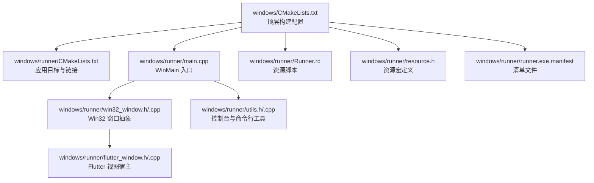
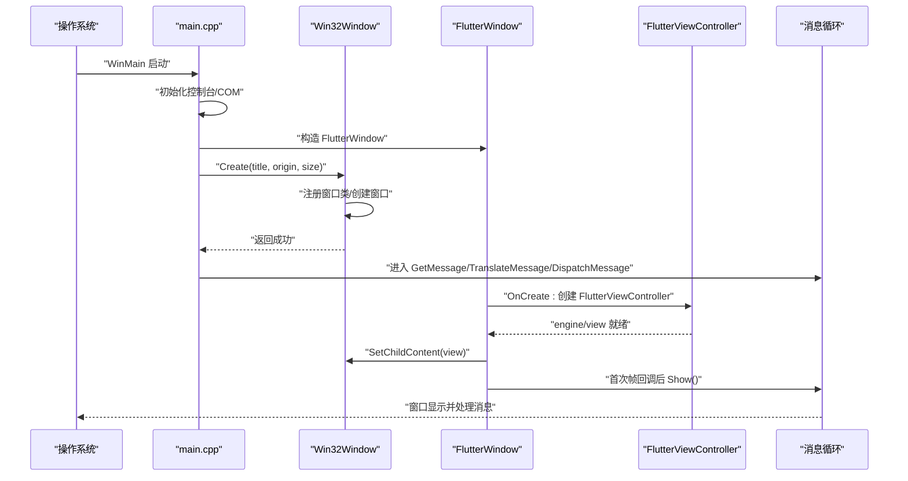
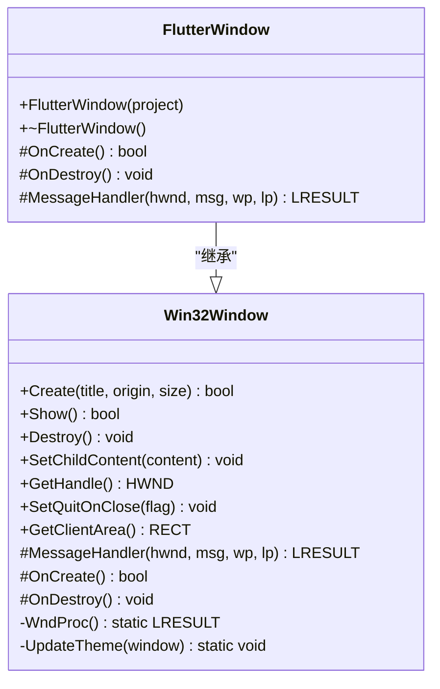
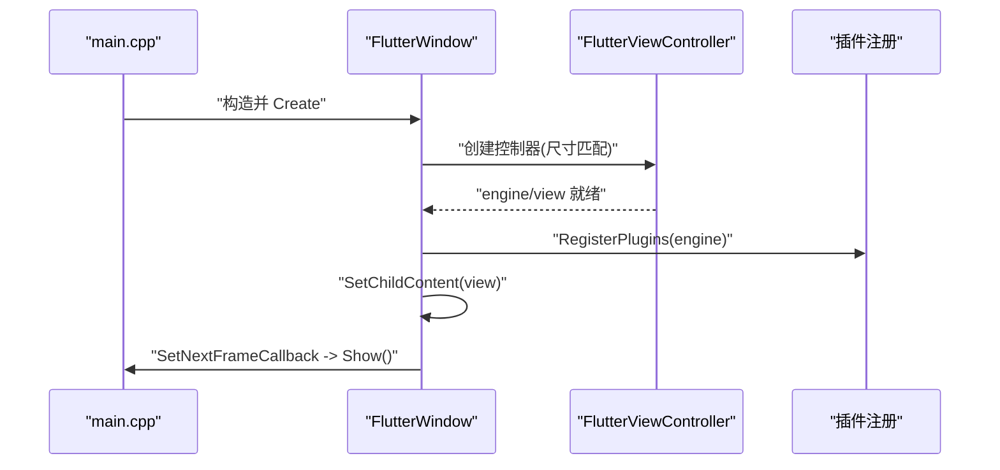
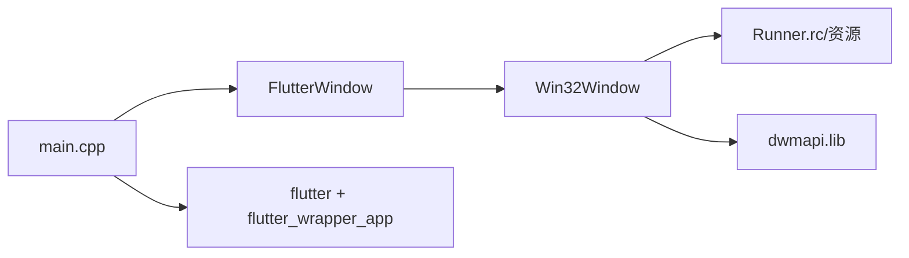

# Windows 平台支持

<cite>
**本文引用的文件**
- [windows/CMakeLists.txt](file://windows/CMakeLists.txt)
- [windows/runner/CMakeLists.txt](file://windows/runner/CMakeLists.txt)
- [windows/runner/main.cpp](file://windows/runner/main.cpp)
- [windows/runner/win32_window.h](file://windows/runner/win32_window.h)
- [windows/runner/win32_window.cpp](file://windows/runner/win32_window.cpp)
- [windows/runner/flutter_window.h](file://windows/runner/flutter_window.h)
- [windows/runner/flutter_window.cpp](file://windows/runner/flutter_window.cpp)
- [windows/runner/utils.h](file://windows/runner/utils.h)
- [windows/runner/utils.cpp](file://windows/runner/utils.cpp)
- [windows/runner/resource.h](file://windows/runner/resource.h)
- [windows/runner/Runner.rc](file://windows/runner/Runner.rc)
- [windows/runner/runner.exe.manifest](file://windows/runner/runner.exe.manifest)
- [pubspec.yaml](file://pubspec.yaml)
- [README.md](file://README.md)
</cite>

## 目录
1. [简介](#简介)
2. [项目结构](#项目结构)
3. [核心组件](#核心组件)
4. [架构总览](#架构总览)
5. [详细组件分析](#详细组件分析)
6. [依赖关系分析](#依赖关系分析)
7. [性能与内存管理](#性能与内存管理)
8. [故障排查指南](#故障排查指南)
9. [结论](#结论)
10. [附录](#附录)

## 简介
本文件面向 Windows 平台的 ObjectBox Viewer，系统性说明其 CMake 构建配置、原生代码集成（Win32 窗口系统与消息循环）、Flutter Desktop 在 Windows 上的特定配置与依赖管理、资源与图标配置、Visual Studio 与 CMake 的构建流程、Windows API 集成与系统权限处理、性能优化与内存管理策略，以及 Windows 平台的错误处理与调试技巧。目标是帮助开发者快速理解并维护该平台的实现。

## 项目结构
Windows 相关代码集中在 windows 与 windows/runner 目录中，采用标准 Flutter Desktop Windows 结构：顶层 CMakeLists 负责全局配置与安装规则；runner 子目录包含可执行程序入口、Win32 窗口抽象、Flutter 视图集成、工具函数与资源文件。

图表来源
- [windows/CMakeLists.txt:1-109](file://windows/CMakeLists.txt#L1-L109)
- [windows/runner/CMakeLists.txt:1-41](file://windows/runner/CMakeLists.txt#L1-L41)
- [windows/runner/main.cpp:1-44](file://windows/runner/main.cpp#L1-L44)
- [windows/runner/win32_window.h:1-103](file://windows/runner/win32_window.h#L1-L103)
- [windows/runner/win32_window.cpp:1-289](file://windows/runner/win32_window.cpp#L1-L289)
- [windows/runner/flutter_window.h:1-34](file://windows/runner/flutter_window.h#L1-L34)
- [windows/runner/flutter_window.cpp:1-72](file://windows/runner/flutter_window.cpp#L1-L72)
- [windows/runner/utils.h:1-20](file://windows/runner/utils.h#L1-L20)
- [windows/runner/utils.cpp:1-66](file://windows/runner/utils.cpp#L1-L66)
- [windows/runner/resource.h:1-17](file://windows/runner/resource.h#L1-L17)
- [windows/runner/Runner.rc](file://windows/runner/Runner.rc)
- [windows/runner/runner.exe.manifest](file://windows/runner/runner.exe.manifest)

章节来源
- [windows/CMakeLists.txt:1-109](file://windows/CMakeLists.txt#L1-L109)
- [windows/runner/CMakeLists.txt:1-41](file://windows/runner/CMakeLists.txt#L1-L41)

## 核心组件
- 顶层 CMake 配置：设置二进制名、多配置类型、Unicode 宏、编译标准与警告级别、安装路径与运行时文件复制、AOT 库安装等。
- runner 目标：定义可执行程序，包含窗口、Flutter 视图、资源与清单文件，链接 flutter_wrapper_app、dwmapi，注入版本信息。
- Win32 窗口抽象：高 DPI 友好、DPI 缩放、主题更新、非客户区 DPI 启用、窗口类注册与注销、消息分发与子内容嵌入。
- FlutterWindow：在 Win32 窗口中托管 FlutterViewController，处理字体变化与首次帧显示时机。
- 工具函数：控制台创建与重定向、UTF-16 到 UTF-8 字符串转换、命令行参数解析。
- 资源与图标：通过资源脚本与头文件定义应用图标，使用系统图标加载到窗口类。
- 清单文件：指定 UAC、视觉样式与兼容性等。

章节来源
- [windows/CMakeLists.txt:1-109](file://windows/CMakeLists.txt#L1-L109)
- [windows/runner/CMakeLists.txt:1-41](file://windows/runner/CMakeLists.txt#L1-L41)
- [windows/runner/win32_window.h:1-103](file://windows/runner/win32_window.h#L1-L103)
- [windows/runner/win32_window.cpp:1-289](file://windows/runner/win32_window.cpp#L1-L289)
- [windows/runner/flutter_window.h:1-34](file://windows/runner/flutter_window.h#L1-L34)
- [windows/runner/flutter_window.cpp:1-72](file://windows/runner/flutter_window.cpp#L1-L72)
- [windows/runner/utils.h:1-20](file://windows/runner/utils.h#L1-L20)
- [windows/runner/utils.cpp:1-66](file://windows/runner/utils.cpp#L1-L66)
- [windows/runner/resource.h:1-17](file://windows/runner/resource.h#L1-L17)
- [windows/runner/Runner.rc](file://windows/runner/Runner.rc)
- [windows/runner/runner.exe.manifest](file://windows/runner/runner.exe.manifest)

## 架构总览
下图展示从进程启动到 Flutter 首帧渲染的关键调用链与消息循环。

图表来源
- [windows/runner/main.cpp:1-44](file://windows/runner/main.cpp#L1-L44)
- [windows/runner/win32_window.cpp:123-150](file://windows/runner/win32_window.cpp#L123-L150)
- [windows/runner/flutter_window.cpp:12-40](file://windows/runner/flutter_window.cpp#L12-L40)

## 详细组件分析

### CMake 构建配置与安装规则
- 顶层配置
  - 设置二进制名为 objectbox_viewer，启用多配置类型 Debug/Profile/Release。
  - 定义 Profile 构建标志与 Release 对齐。
  - 添加 Unicode 宏，统一字符集。
  - 提供 APPLY_STANDARD_SETTINGS 函数：C++17、严格警告、异常设置、配置相关宏。
  - 引入 Flutter managed 目录与插件生成规则。
  - 安装规则：将可执行文件、ICU 数据、Flutter 动态库、插件库、原生资产与 Flutter 资产复制到运行目录；非 Debug 条件下安装 AOT 库。
- runner 目标
  - 目标类型：WIN32 可执行文件。
  - 源文件：窗口、Flutter 视图、入口、工具、插件注册、资源脚本、清单。
  - 预处理器：注入 Flutter 版本信息，禁用 NOMINMAX。
  - 链接：flutter、flutter_wrapper_app、dwmapi。
  - 依赖：flutter_assemble。

章节来源
- [windows/CMakeLists.txt:1-109](file://windows/CMakeLists.txt#L1-L109)
- [windows/runner/CMakeLists.txt:1-41](file://windows/runner/CMakeLists.txt#L1-L41)

### Win32 窗口系统与消息处理机制
- 窗口类注册与注销
  - 使用 WindowClassRegistrar 单例注册窗口类，设置光标、图标、窗口过程。
  - 图标通过资源 ID 加载，确保系统托盘与任务栏显示一致。
  - 窗口类在最后一个实例销毁时注销，避免资源泄漏。
- 窗口创建与 DPI 处理
  - 通过 MonitorFromPoint 获取 DPI，按 96dpi 基准缩放物理尺寸。
  - 动态加载 EnableNonClientDpiScaling 以支持每显示器 v1 感知模式。
- 消息处理
  - WndProc：WM_NCCREATE 中保存 this 指针；其余消息委派给 MessageHandler。
  - MessageHandler：处理 WM_DESTROY、WM_DPICHANGED、WM_SIZE、WM_ACTIVATE、DWM 彩色变化等。
  - 主题更新：读取注册表偏好，设置沉浸式暗色模式属性。
- 子内容嵌入
  - SetChildContent 将 Flutter 视图作为子窗口嵌入，随窗口大小调整布局。
  - GetClientArea 返回客户区矩形，用于定位子窗口。

图表来源
- [windows/runner/win32_window.h:1-103](file://windows/runner/win32_window.h#L1-L103)
- [windows/runner/flutter_window.h:1-34](file://windows/runner/flutter_window.h#L1-L34)

章节来源
- [windows/runner/win32_window.h:1-103](file://windows/runner/win32_window.h#L1-L103)
- [windows/runner/win32_window.cpp:1-289](file://windows/runner/win32_window.cpp#L1-L289)
- [windows/runner/flutter_window.cpp:1-72](file://windows/runner/flutter_window.cpp#L1-L72)

### Flutter Desktop 在 Windows 的集成
- 进程入口与生命周期
  - main.cpp 初始化控制台（调试器附加或新建控制台），初始化 COM，创建 DartProject，解析命令行参数，构造 FlutterWindow 并创建窗口。
  - 进入消息循环，直到收到退出消息。
- Flutter 视图托管
  - FlutterWindow::OnCreate 创建 FlutterViewController，注册插件，将视图句柄设为子内容。
  - 首帧回调后触发 Show，避免空白窗口。
  - 处理字体变化消息以刷新系统字体。
- 插件与注册
  - 通过 generated_plugin_registrant 注册插件，确保 Windows 平台可用。

图表来源
- [windows/runner/main.cpp:1-44](file://windows/runner/main.cpp#L1-L44)
- [windows/runner/flutter_window.cpp:12-40](file://windows/runner/flutter_window.cpp#L12-L40)

章节来源
- [windows/runner/main.cpp:1-44](file://windows/runner/main.cpp#L1-L44)
- [windows/runner/flutter_window.cpp:1-72](file://windows/runner/flutter_window.cpp#L1-L72)

### 资源文件与图标配置
- 资源脚本与头文件
  - Runner.rc 定义资源项，resource.h 提供资源 ID 宏（如应用图标）。
  - 窗口类在创建时通过 MAKEINTRESOURCE 加载图标。
- 清单文件
  - runner.exe.manifest 提供 UAC、视觉样式与兼容性声明，确保在不同 Windows 版本下的正确行为。

章节来源
- [windows/runner/resource.h:1-17](file://windows/runner/resource.h#L1-L17)
- [windows/runner/Runner.rc](file://windows/runner/Runner.rc)
- [windows/runner/runner.exe.manifest](file://windows/runner/runner.exe.manifest)

### Visual Studio 与 CMake 构建流程
- 顶层构建
  - 顶层 CMakeLists 定义配置类型、安装路径、安装规则（运行时文件、AOT 库、Flutter 资产）。
  - 通过 include(flutter/generated_plugins.cmake) 引入插件构建。
- runner 目标
  - add_executable 使用 WIN32 类型，链接 flutter 与 flutter_wrapper_app，包含资源与清单。
  - apply_standard_settings 应用统一编译选项。
- 安装与部署
  - 安装规则将运行所需文件复制到可执行文件同目录，便于 Visual Studio 直接运行。

章节来源
- [windows/CMakeLists.txt:1-109](file://windows/CMakeLists.txt#L1-L109)
- [windows/runner/CMakeLists.txt:1-41](file://windows/runner/CMakeLists.txt#L1-L41)

### Windows API 集成与系统权限
- 控制台与 COM
  - 调试器环境下创建并附加控制台，重定向标准输出；初始化 COM 以便库与插件使用。
- DPI 与主题
  - 通过 FlutterDesktopGetDpiForMonitor 获取 DPI，动态启用非客户区 DPI 缩放。
  - 读取注册表判断浅/深色主题，设置 DWM 沉浸式暗色模式属性。
- 字体与系统事件
  - 处理 WM_FONTCHANGE 以重新加载系统字体，保证文本渲染一致性。

章节来源
- [windows/runner/main.cpp:1-44](file://windows/runner/main.cpp#L1-L44)
- [windows/runner/win32_window.cpp:134-150](file://windows/runner/win32_window.cpp#L134-L150)
- [windows/runner/win32_window.cpp:275-288](file://windows/runner/win32_window.cpp#L275-L288)
- [windows/runner/flutter_window.cpp:50-71](file://windows/runner/flutter_window.cpp#L50-L71)

## 依赖关系分析
- 组件耦合
  - FlutterWindow 继承 Win32Window，复用窗口生命周期与消息处理。
  - Win32Window 依赖窗口类注册器与资源图标，负责系统级窗口行为。
  - main.cpp 作为进程入口，协调 COM、控制台、FlutterWindow 与消息循环。
- 外部依赖
  - flutter、flutter_wrapper_app：Flutter 运行时与包装库。
  - dwmapi：用于暗色模式窗口装饰。
  - Windows SDK：DPI、注册表、消息处理等 API。

图表来源
- [windows/runner/main.cpp:1-44](file://windows/runner/main.cpp#L1-L44)
- [windows/runner/flutter_window.cpp:1-72](file://windows/runner/flutter_window.cpp#L1-L72)
- [windows/runner/win32_window.cpp:1-289](file://windows/runner/win32_window.cpp#L1-L289)
- [windows/runner/CMakeLists.txt:35-36](file://windows/runner/CMakeLists.txt#L35-L36)

章节来源
- [windows/runner/CMakeLists.txt:35-36](file://windows/runner/CMakeLists.txt#L35-L36)

## 性能与内存管理
- 构建优化
  - Profile 构建标志与 Release 对齐，减少调试开销。
  - 统一警告级别与异常模型，降低运行时开销与未定义行为风险。
- 窗口与渲染
  - 首帧回调后才显示窗口，避免不必要的表面创建/销毁。
  - 子内容随窗口尺寸变化同步调整，减少重绘抖动。
- 内存与资源
  - 窗口类在最后一个实例销毁时注销，防止类注册泄露。
  - 控制台仅在需要时创建，避免无谓资源占用。

章节来源
- [windows/CMakeLists.txt:26-30](file://windows/CMakeLists.txt#L26-L30)
- [windows/runner/CMakeLists.txt:21-21](file://windows/runner/CMakeLists.txt#L21-L21)
- [windows/runner/flutter_window.cpp:30-37](file://windows/runner/flutter_window.cpp#L30-L37)
- [windows/runner/win32_window.cpp:231-234](file://windows/runner/win32_window.cpp#L231-L234)

## 故障排查指南
- 控制台输出
  - 调试器附加失败时自动创建控制台并重定向输出，便于日志查看。
- 命令行参数
  - UTF-16 命令行转换为 UTF-8，跳过可执行文件名，确保参数传递正确。
- 常见问题定位
  - 窗口不显示：检查首帧回调是否触发、Show 是否被调用。
  - 图标缺失：确认资源 ID 与 Runner.rc 定义一致，且窗口类已注册。
  - DPI 显示异常：确认 MonitorFromPoint 与 Scale 计算逻辑，以及 EnableNonClientDpiScaling 成功加载。
  - 暗色主题无效：检查注册表键值与 DWM 属性设置是否成功。

章节来源
- [windows/runner/utils.cpp:10-22](file://windows/runner/utils.cpp#L10-L22)
- [windows/runner/utils.cpp:24-42](file://windows/runner/utils.cpp#L24-L42)
- [windows/runner/flutter_window.cpp:30-37](file://windows/runner/flutter_window.cpp#L30-L37)
- [windows/runner/win32_window.cpp:98-104](file://windows/runner/win32_window.cpp#L98-L104)
- [windows/runner/win32_window.cpp:134-150](file://windows/runner/win32_window.cpp#L134-L150)
- [windows/runner/win32_window.cpp:42-54](file://windows/runner/win32_window.cpp#L42-L54)
- [windows/runner/win32_window.cpp:275-288](file://windows/runner/win32_window.cpp#L275-L288)

## 结论
ObjectBox Viewer 的 Windows 实现遵循 Flutter Desktop 标准结构，通过顶层 CMake 与 runner 目标完成构建与安装，Win32 窗口抽象封装了 DPI、主题与消息处理，FlutterWindow 承载 Flutter 视图并与系统 API 紧密集成。资源与清单文件确保图标与兼容性，工具函数保障国际化与调试体验。整体设计清晰、模块化程度高，便于扩展与维护。

## 附录
- 依赖与平台能力
  - Flutter 与 Windows 平台支持：参见 pubspec 与 Flutter SDK。
  - Windows SDK API：DPI、注册表、消息循环、DWM 等。
- 参考
  - [README.md:1-18](file://README.md#L1-L18)
  - [pubspec.yaml:1-96](file://pubspec.yaml#L1-L96)