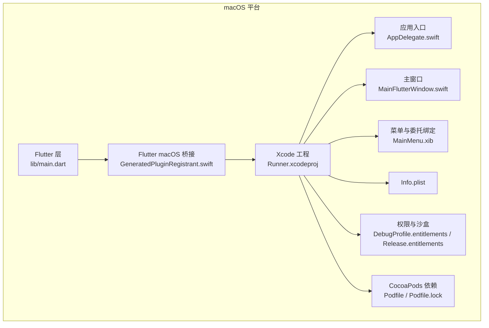
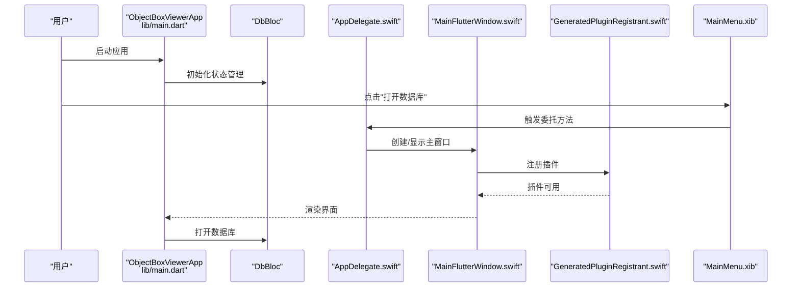
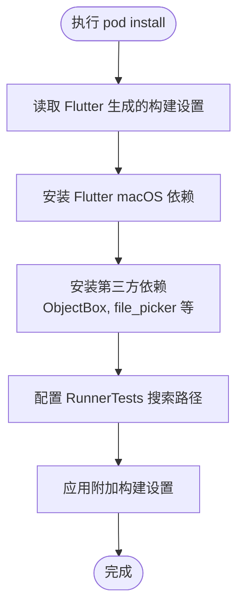
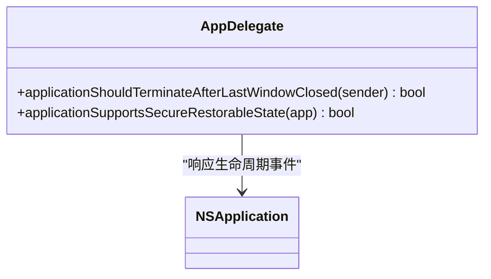
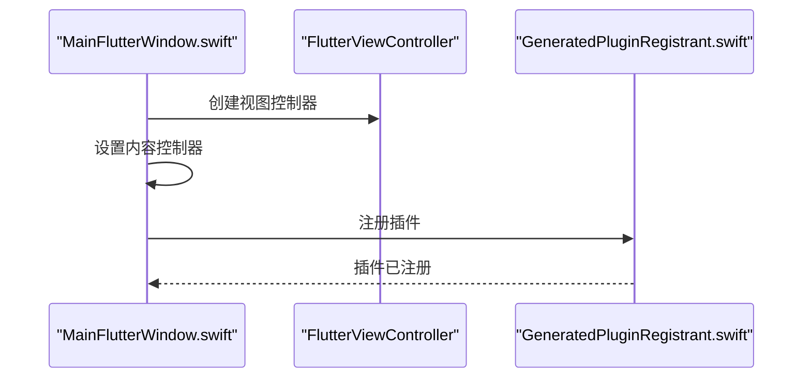
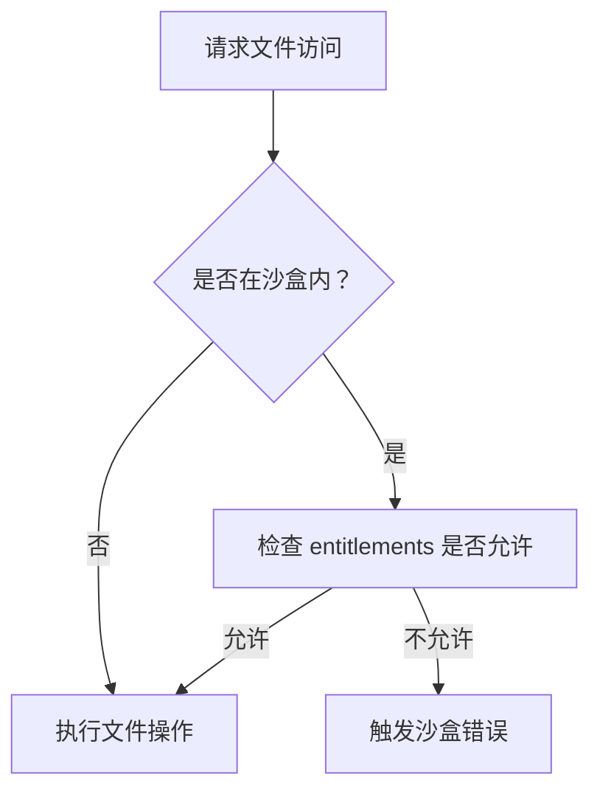
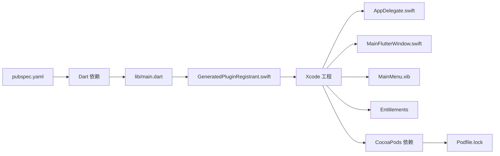

# macOS 平台支持

<cite>
**本文引用的文件**
- [Podfile](file://macos/Podfile)
- [Podfile.lock](file://macos/Podfile.lock)
- [AppDelegate.swift](file://macos/Runner/AppDelegate.swift)
- [MainFlutterWindow.swift](file://macos/Runner/MainFlutterWindow.swift)
- [Info.plist](file://macos/Runner/Info.plist)
- [GeneratedPluginRegistrant.swift](file://macos/Flutter/GeneratedPluginRegistrant.swift)
- [pubspec.yaml](file://pubspec.yaml)
- [DebugProfile.entitlements](file://macos/Runner/DebugProfile.entitlements)
- [Release.entitlements](file://macos/Runner/Release.entitlements)
- [MainMenu.xib](file://macos/Runner/Base.lproj/MainMenu.xib)
- [AppInfo.xcconfig](file://macos/Runner/Configs/AppInfo.xcconfig)
- [Debug.xcconfig](file://macos/Runner/Configs/Debug.xcconfig)
- [Release.xcconfig](file://macos/Runner/Configs/Release.xcconfig)
- [main.dart](file://lib/main.dart)
</cite>

## 更新摘要
**所做变更**
- 新增 CocoaPods 依赖管理章节，详细说明 Podfile 和 Podfile.lock 的配置
- 更新权限系统章节，增加 DebugProfile 和 Release 配置的权限文件分析
- 补充 ObjectBox 相关依赖的集成说明
- 更新构建配置章节，包含新的 entitlements 文件处理

## 目录
1. [简介](#简介)
2. [项目结构](#项目结构)
3. [核心组件](#核心组件)
4. [架构总览](#架构总览)
5. [详细组件分析](#详细组件分析)
6. [依赖关系分析](#依赖关系分析)
7. [性能与内存管理](#性能与内存管理)
8. [权限与沙盒配置](#权限与沙盒配置)
9. [构建与打包流程](#构建与打包流程)
10. [测试策略](#测试策略)
11. [App Store 发布准备](#app-store-发布准备)
12. [故障排查指南](#故障排查指南)
13. [结论](#结论)

## 简介
本文件面向 macOS 平台，系统性说明 ObjectBox Viewer 的 CocoaPods 依赖管理、Xcode 工作空间配置、Swift 应用委托与 macOS 生命周期、Flutter Desktop 在 macOS 上的集成方式与原生能力、Info.plist 与签名配置、构建与打包流程、权限与沙盒机制、性能与内存优化、测试策略以及 App Store 发布准备。内容基于仓库中的实际文件进行分析与总结，帮助开发者快速理解并维护 macOS 平台支持。

## 项目结构
macOS 平台相关代码主要位于 macos/ 目录，包含：
- Flutter 框架桥接层：macos/Flutter（生成的配置与插件注册）
- 原生 macOS 入口与窗口：macos/Runner（AppDelegate、MainFlutterWindow、Info.plist、菜单与权限配置等）
- CocoaPods 依赖管理：macos/Podfile 及其生成的 Pods 工程
- Xcode 工作空间：macos/Runner.xcworkspace
- 构建配置：macos/Runner/Configs 下的 xcconfig 文件

**图表来源**
- [main.dart](file://lib/main.dart)
- [GeneratedPluginRegistrant.swift](file://macos/Flutter/GeneratedPluginRegistrant.swift)
- [AppDelegate.swift](file://macos/Runner/AppDelegate.swift)
- [MainFlutterWindow.swift](file://macos/Runner/MainFlutterWindow.swift)
- [MainMenu.xib](file://macos/Runner/Base.lproj/MainMenu.xib)
- [Info.plist](file://macos/Runner/Info.plist)
- [DebugProfile.entitlements](file://macos/Runner/DebugProfile.entitlements)
- [Release.entitlements](file://macos/Runner/Release.entitlements)
- [Podfile](file://macos/Podfile)
- [Podfile.lock](file://macos/Podfile.lock)

**章节来源**
- [pubspec.yaml](file://pubspec.yaml)
- [Podfile](file://macos/Podfile)
- [Podfile.lock](file://macos/Podfile.lock)
- [AppDelegate.swift](file://macos/Runner/AppDelegate.swift)
- [MainFlutterWindow.swift](file://macos/Runner/MainFlutterWindow.swift)
- [Info.plist](file://macos/Runner/Info.plist)
- [GeneratedPluginRegistrant.swift](file://macos/Flutter/GeneratedPluginRegistrant.swift)
- [MainMenu.xib](file://macos/Runner/Base.lproj/MainMenu.xib)
- [DebugProfile.entitlements](file://macos/Runner/DebugProfile.entitlements)
- [Release.entitlements](file://macos/Runner/Release.entitlements)
- [AppInfo.xcconfig](file://macos/Runner/Configs/AppInfo.xcconfig)
- [Debug.xcconfig](file://macos/Runner/Configs/Debug.xcconfig)
- [Release.xcconfig](file://macos/Runner/Configs/Release.xcconfig)

## 核心组件
- Flutter 应用入口与业务逻辑：lib/main.dart 中定义应用主题、状态管理与数据库打开流程。
- macOS 原生入口与生命周期：macOS 委托 AppDelegate.swift 控制应用终止行为与恢复能力。
- 主窗口与视图控制器：MainFlutterWindow.swift 将 FlutterViewController 注入到 NSWindow。
- 插件注册：GeneratedPluginRegistrant.swift 自动注册 file_picker 等插件。
- 菜单与委托绑定：MainMenu.xib 将 NSApplication 委托与窗口连接至 AppDelegate 与 MainFlutterWindow。
- 配置与签名：Info.plist 定义应用元数据；DebugProfile.entitlements/Release.entitlements 定义沙盒与网络/文件访问权限。
- CocoaPods 依赖：Podfile 管理 Flutter macOS 依赖与测试目标。

**章节来源**
- [main.dart](file://lib/main.dart)
- [AppDelegate.swift](file://macos/Runner/AppDelegate.swift)
- [MainFlutterWindow.swift](file://macos/Runner/MainFlutterWindow.swift)
- [GeneratedPluginRegistrant.swift](file://macos/Flutter/GeneratedPluginRegistrant.swift)
- [MainMenu.xib](file://macos/Runner/Base.lproj/MainMenu.xib)
- [Info.plist](file://macos/Runner/Info.plist)
- [DebugProfile.entitlements](file://macos/Runner/DebugProfile.entitlements)
- [Release.entitlements](file://macos/Runner/Release.entitlements)
- [Podfile](file://macos/Podfile)

## 架构总览
下图展示了从 Flutter 到 macOS 原生层的调用链路与关键交互点。

**图表来源**
- [main.dart](file://lib/main.dart)
- [AppDelegate.swift](file://macos/Runner/AppDelegate.swift)
- [MainFlutterWindow.swift](file://macos/Runner/MainFlutterWindow.swift)
- [GeneratedPluginRegistrant.swift](file://macos/Flutter/GeneratedPluginRegistrant.swift)
- [MainMenu.xib](file://macos/Runner/Base.lproj/MainMenu.xib)

## 详细组件分析

### CocoaPods 依赖管理与 Xcode 工作空间
- 平台与版本：Podfile 指定 macOS 最低版本与 Flutter macOS 集成脚手架。
- 依赖安装：通过 flutter_install_all_macos_pods 安装 Flutter 与第三方插件依赖。
- 测试目标：RunnerTests 继承搜索路径，便于单元测试。
- 工作空间：Runner.xcworkspace 包含 Runner.xcodeproj 与 Pods.xcodeproj，确保依赖与工程协同。
- 依赖锁定：Podfile.lock 记录了具体的依赖版本，包括 ObjectBox 5.3.0-beta.4 和相关插件。

**图表来源**
- [Podfile](file://macos/Podfile)
- [Podfile.lock](file://macos/Podfile.lock)

**章节来源**
- [Podfile](file://macos/Podfile)
- [Podfile.lock](file://macos/Podfile.lock)
- [Runner.xcworkspace/contents.xcworkspacedata](file://macos/Runner.xcworkspace/contents.xcworkspacedata)

### Swift 应用委托与 macOS 生命周期
- 应用终止策略：applicationShouldTerminateAfterLastWindowClosed 返回 true，关闭最后一个窗口即退出应用。
- 安全可恢复状态：applicationSupportsSecureRestorableState 返回 true，启用安全恢复能力。
- 委托绑定：MainMenu.xib 将 NSApplication 委托指向 AppDelegate。

**图表来源**
- [AppDelegate.swift](file://macos/Runner/AppDelegate.swift)
- [MainMenu.xib](file://macos/Runner/Base.lproj/MainMenu.xib)

**章节来源**
- [AppDelegate.swift](file://macos/Runner/AppDelegate.swift)
- [MainMenu.xib](file://macos/Runner/Base.lproj/MainMenu.xib)

### Flutter Desktop 在 macOS 上的集成
- 插件注册：GeneratedPluginRegistrant.swift 自动注册 file_picker 等插件，供 Flutter 层使用。
- 主窗口注入：MainFlutterWindow.swift 创建 FlutterViewController 并将其内容控制器设为主窗口，随后注册插件。
- 应用入口：lib/main.dart 中的 ObjectBoxViewerApp 作为根组件，MaterialApp 提供主题与导航。

**图表来源**
- [MainFlutterWindow.swift](file://macos/Runner/MainFlutterWindow.swift)
- [GeneratedPluginRegistrant.swift](file://macos/Flutter/GeneratedPluginRegistrant.swift)
- [main.dart](file://lib/main.dart)

**章节来源**
- [GeneratedPluginRegistrant.swift](file://macos/Flutter/GeneratedPluginRegistrant.swift)
- [MainFlutterWindow.swift](file://macos/Runner/MainFlutterWindow.swift)
- [main.dart](file://lib/main.dart)

### Info.plist 配置与应用签名
- 元数据键值：Info.plist 定义开发区域、可执行文件名、包类型、最低系统版本、主 nib 文件、主类等。
- 版本信息：短版本号与版本号由 Flutter 构建变量提供。
- 应用签名：在 Xcode 中通过 Runner 目标设置 Team、Signing Certificate 与 Provisioning Profile；Entitlements 文件控制沙盒与文件访问权限。

**章节来源**
- [Info.plist](file://macos/Runner/Info.plist)
- [AppInfo.xcconfig](file://macos/Runner/Configs/AppInfo.xcconfig)

### macOS 权限系统与沙盒机制
- 开发配置（DebugProfile.entitlements）：启用沙盒、允许 JIT、网络服务器、用户选择文件与下载目录读写。
- 发布配置（Release.entitlements）：启用沙盒与用户选择文件/下载目录读写。
- 使用场景：文件选择器与数据库读写需要相应权限以避免沙盒限制导致的失败。

**图表来源**
- [DebugProfile.entitlements](file://macos/Runner/DebugProfile.entitlements)
- [Release.entitlements](file://macos/Runner/Release.entitlements)

**章节来源**
- [DebugProfile.entitlements](file://macos/Runner/DebugProfile.entitlements)
- [Release.entitlements](file://macos/Runner/Release.entitlements)

### 构建与打包流程
- 构建配置：Debug.xcconfig 与 Release.xcconfig 引入 Flutter 默认配置与警告设置。
- 目标设置：Runner 目标包含 Debug/Profile/Release 三种构建风格；RunnerTests 继承搜索路径。
- 打包：通过 Xcode Archive 生成 .app 或 .pkg，配合签名与公证流程发布。

**章节来源**
- [Debug.xcconfig](file://macos/Runner/Configs/Debug.xcconfig)
- [Release.xcconfig](file://macos/Runner/Configs/Release.xcconfig)
- [Podfile](file://macos/Podfile)

## 依赖关系分析
- Flutter 层依赖：pubspec.yaml 声明 flutter、flutter_bloc、file_picker、path_provider 等。
- 原生层依赖：CocoaPods 通过 Podfile 管理 Flutter macOS 与第三方库。
- 插件注册：GeneratedPluginRegistrant.swift 将 file_picker 注册到 Flutter 运行时。
- 菜单与委托：MainMenu.xib 将 NSApplication 委托与主窗口连接到 Swift 类。

**图表来源**
- [pubspec.yaml](file://pubspec.yaml)
- [main.dart](file://lib/main.dart)
- [GeneratedPluginRegistrant.swift](file://macos/Flutter/GeneratedPluginRegistrant.swift)
- [AppDelegate.swift](file://macos/Runner/AppDelegate.swift)
- [MainFlutterWindow.swift](file://macos/Runner/MainFlutterWindow.swift)
- [MainMenu.xib](file://macos/Runner/Base.lproj/MainMenu.xib)
- [DebugProfile.entitlements](file://macos/Runner/DebugProfile.entitlements)
- [Release.entitlements](file://macos/Runner/Release.entitlements)
- [Podfile](file://macos/Podfile)
- [Podfile.lock](file://macos/Podfile.lock)

**章节来源**
- [pubspec.yaml](file://pubspec.yaml)
- [GeneratedPluginRegistrant.swift](file://macos/Flutter/GeneratedPluginRegistrant.swift)
- [MainMenu.xib](file://macos/Runner/Base.lproj/MainMenu.xib)

## 性能与内存管理
- UI 渲染：MaterialApp 与 BlocProvider 提供响应式 UI 与状态管理，建议在大数据集场景中采用分页或懒加载策略。
- 文件访问：文件选择与数据库扫描应异步执行，避免阻塞主线程。
- 内存占用：合理释放未使用的资源，避免长时间持有大型对象；在窗口关闭时清理缓存。
- 日志与诊断：可结合工具链输出日志，定位内存峰值与泄漏点。

## 权限与沙盒配置
- 沙盒启用：Entitlements 文件开启 com.apple.security.app-sandbox。
- 文件访问：根据需求启用用户选择文件与下载目录的读写权限，避免不必要的权限以降低审核风险。
- 网络访问：如需本地服务或网络功能，按需启用相关权限键。

**章节来源**
- [DebugProfile.entitlements](file://macos/Runner/DebugProfile.entitlements)
- [Release.entitlements](file://macos/Runner/Release.entitlements)

## 构建与打包流程
- 获取依赖：先运行 Flutter 获取命令，再执行 pod install 安装 CocoaPods 依赖。
- 编译：在 Xcode 中选择 Runner 目标，设置签名与团队，分别构建 Debug/Release。
- 归档：Archive 生成 .xcarchive，导出 .app 或 .pkg。
- 签名与公证：使用 Apple Developer 证书签名并进行公证，确保可分发。

**章节来源**
- [Podfile](file://macos/Podfile)
- [Debug.xcconfig](file://macos/Runner/Configs/Debug.xcconfig)
- [Release.xcconfig](file://macos/Runner/Configs/Release.xcconfig)

## 测试策略
- 单元测试：RunnerTests 目标继承搜索路径，可在 macOS 上运行 Flutter/Dart 测试。
- 集成测试：验证菜单交互、窗口生命周期与文件选择流程。
- 权限测试：在沙盒环境下验证文件读写与网络访问行为。

**章节来源**
- [Runner.xcworkspace/contents.xcworkspacedata](file://macos/Runner.xcworkspace/contents.xcworkspacedata)

## App Store 发布准备
- 证书与团队：在 Xcode 中配置 Team 与 Apple ID。
- Entitlements：仅保留必要权限，避免过度授权。
- 图标与元数据：确保 AppIcon、Info.plist 字段完整。
- 审核说明：在 Connect 中填写隐私清单与用途说明。

## 故障排查指南
- CocoaPods 未找到 Flutter 根：确保先执行 Flutter 获取命令，再运行 pod install。
- 插件未注册：确认 GeneratedPluginRegistrant.swift 存在且被正确导入。
- 沙盒拒绝访问：检查 Entitlements 文件中相关权限键是否启用。
- 窗口不显示：确认 MainMenu.xib 中委托与窗口连接正常，MainFlutterWindow 已注册插件。

**章节来源**
- [Podfile](file://macos/Podfile)
- [Podfile.lock](file://macos/Podfile.lock)
- [GeneratedPluginRegistrant.swift](file://macos/Flutter/GeneratedPluginRegistrant.swift)
- [DebugProfile.entitlements](file://macos/Runner/DebugProfile.entitlements)
- [MainMenu.xib](file://macos/Runner/Base.lproj/MainMenu.xib)

## 结论
本文件基于仓库中的实际文件，系统梳理了 ObjectBox Viewer 在 macOS 平台的依赖管理、原生入口、窗口与菜单、权限与沙盒、构建与打包、测试与发布等关键环节。新增的 CocoaPods 依赖管理和权限配置文件进一步完善了 macOS 平台的支持，遵循本文档的配置与实践，可稳定地在 macOS 上运行并交付应用。