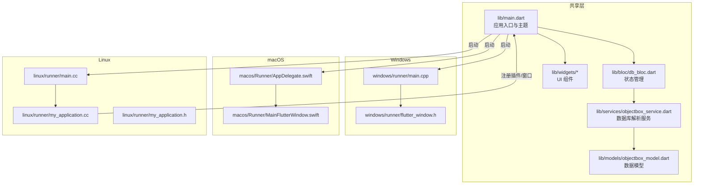
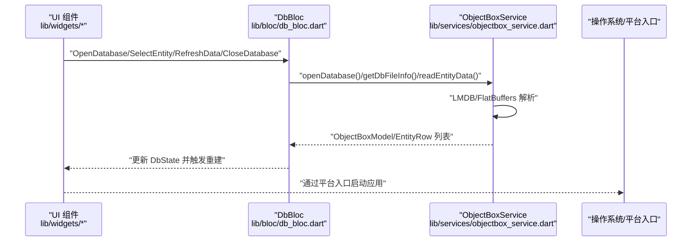
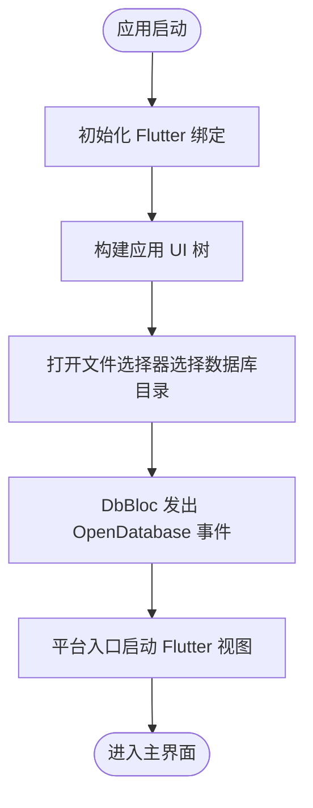
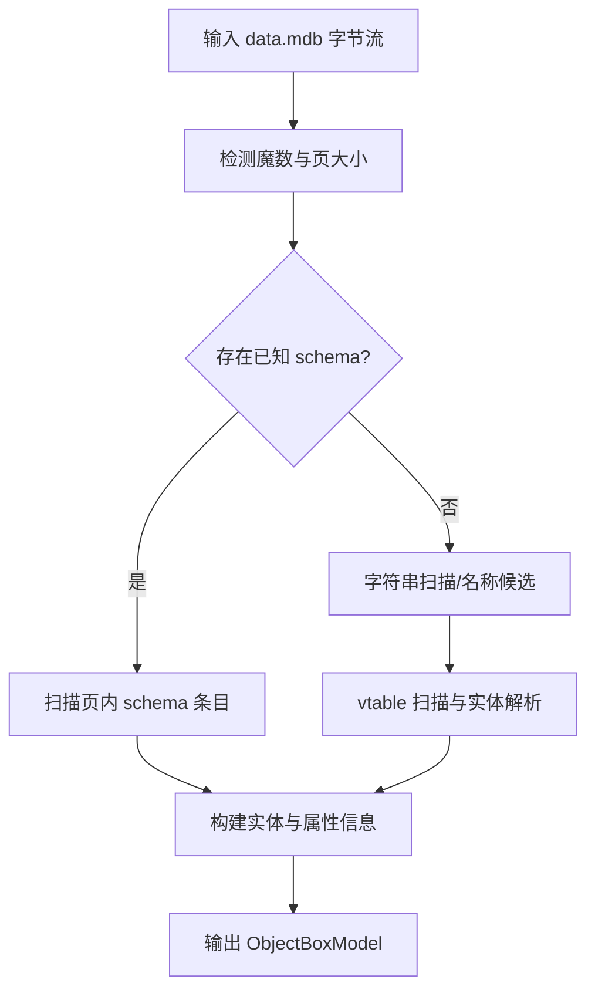
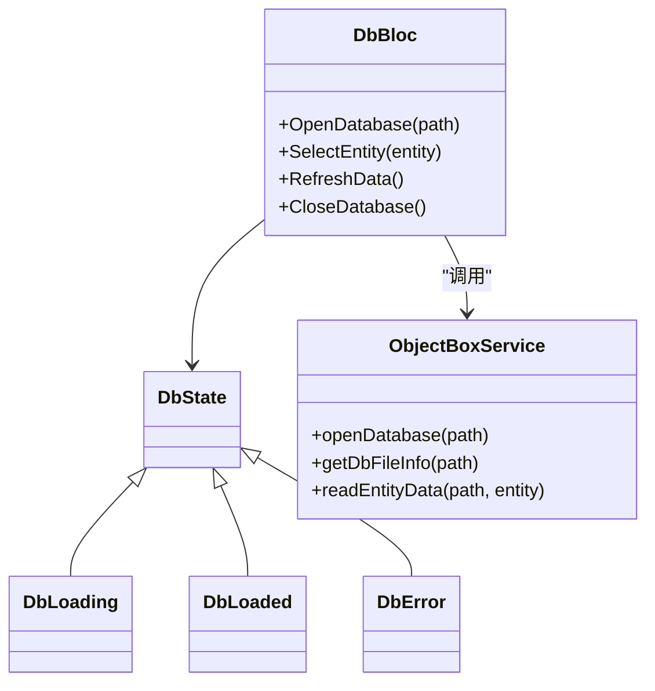
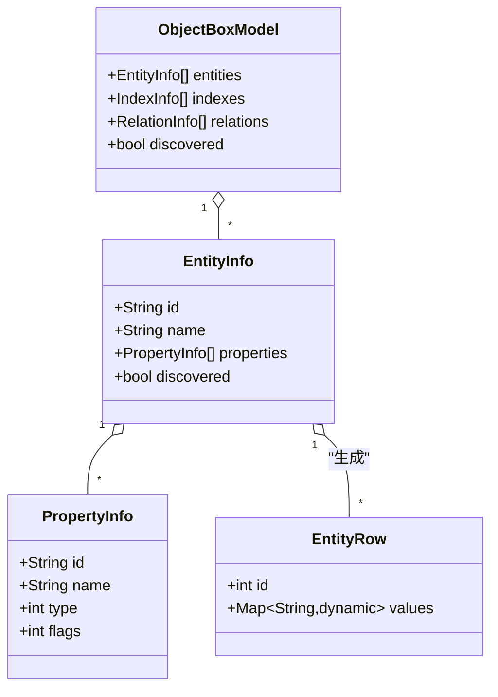
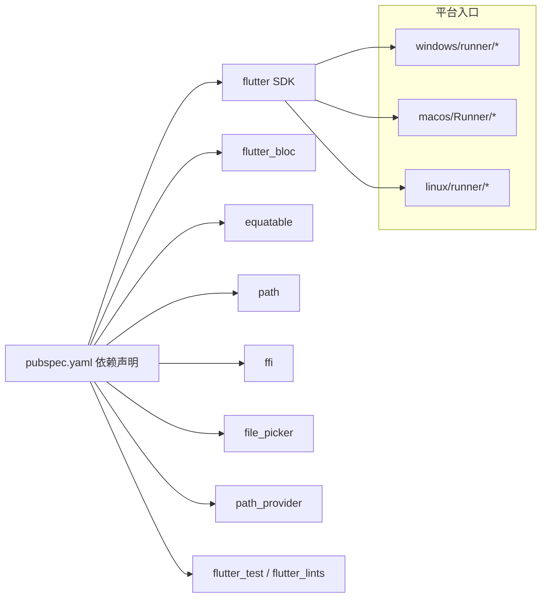

# 平台兼容性与移植

<cite>
**本文引用的文件**
- [lib/main.dart](file://lib/main.dart)
- [pubspec.yaml](file://pubspec.yaml)
- [README.md](file://README.md)
- [linux/runner/main.cc](file://linux/runner/main.cc)
- [linux/runner/my_application.cc](file://linux/runner/my_application.cc)
- [linux/runner/my_application.h](file://linux/runner/my_application.h)
- [macos/Runner/AppDelegate.swift](file://macos/Runner/AppDelegate.swift)
- [macos/Runner/MainFlutterWindow.swift](file://macos/Runner/MainFlutterWindow.swift)
- [windows/runner/main.cpp](file://windows/runner/main.cpp)
- [windows/runner/flutter_window.h](file://windows/runner/flutter_window.h)
- [lib/bloc/db_bloc.dart](file://lib/bloc/db_bloc.dart)
- [lib/widgets/home_page.dart](file://lib/widgets/home_page.dart)
- [lib/services/objectbox_service.dart](file://lib/services/objectbox_service.dart)
- [lib/models/objectbox_model.dart](file://lib/models/objectbox_model.dart)
</cite>

## 目录
1. [简介](#简介)
2. [项目结构](#项目结构)
3. [核心组件](#核心组件)
4. [架构总览](#架构总览)
5. [详细组件分析](#详细组件分析)
6. [依赖关系分析](#依赖关系分析)
7. [性能考量](#性能考量)
8. [故障排查指南](#故障排查指南)
9. [结论](#结论)
10. [附录](#附录)

## 简介
本文件面向 ObjectBox Viewer 的跨平台兼容性与移植，系统梳理 Windows、macOS、Linux 三大桌面平台的功能一致性、差异与限制；阐明 Flutter Desktop 的平台抽象层与条件编译策略；总结共享代码设计原则与平台特定代码组织方式；给出版本兼容性矩阵与依赖管理策略；提供平台迁移与维护最佳实践；解释跨平台测试方法与工具链配置；包含性能基准测试与平台特定优化对比；覆盖用户界面在不同平台上的适配与本地化注意事项。

## 项目结构
该项目采用 Flutter 跨平台工程布局，共享 Dart 业务逻辑位于 lib 目录，平台入口与原生桥接分别置于各平台目录中：
- 共享层：lib（应用入口、BLoC、UI 组件、服务与模型）
- 平台入口：
  - Windows：windows/runner
  - macOS：macos/Runner
  - Linux：linux/runner

**图表来源**
- [lib/main.dart:1-147](file://lib/main.dart#L1-L147)
- [windows/runner/main.cpp:1-44](file://windows/runner/main.cpp#L1-L44)
- [macos/Runner/AppDelegate.swift:1-14](file://macos/Runner/AppDelegate.swift#L1-L14)
- [linux/runner/main.cc:1-7](file://linux/runner/main.cc#L1-L7)
- [linux/runner/my_application.cc:1-149](file://linux/runner/my_application.cc#L1-L149)

**章节来源**
- [lib/main.dart:1-147](file://lib/main.dart#L1-L147)
- [pubspec.yaml:1-96](file://pubspec.yaml#L1-L96)
- [README.md:1-18](file://README.md#L1-L18)

## 核心组件
- 应用入口与主题：定义 Material 风格主题、暗色模式、导航栏与状态栏 UI，以及打开数据库目录的交互流程。
- 数据库服务：直接读取 LMDB 文件 data.mdb，解析 FlatBuffers 结构，发现实体与属性，支持无 objectbox-model.json 的场景。
- 状态管理：使用 BLoC 模式处理数据库打开、实体选择、刷新与关闭等事件。
- UI 组件：主页按左右分栏展示实体列表与内容面板，错误视图与欢迎视图，以及“未发现 schema”时的提示横幅。
- 平台入口：Windows 使用 Win32 控制台/消息循环；macOS 使用 NSApplication 生命周期与 FlutterViewController；Linux 使用 GTK/FlView 宿主 Flutter。

**章节来源**
- [lib/main.dart:13-147](file://lib/main.dart#L13-L147)
- [lib/bloc/db_bloc.dart:1-136](file://lib/bloc/db_bloc.dart#L1-L136)
- [lib/widgets/home_page.dart:1-218](file://lib/widgets/home_page.dart#L1-L218)
- [lib/services/objectbox_service.dart:1-41](file://lib/services/objectbox_service.dart#L1-L41)
- [windows/runner/main.cpp:1-44](file://windows/runner/main.cpp#L1-L44)
- [macos/Runner/AppDelegate.swift:1-14](file://macos/Runner/AppDelegate.swift#L1-L14)
- [linux/runner/my_application.cc:1-149](file://linux/runner/my_application.cc#L1-L149)

## 架构总览
下图展示了从应用入口到平台原生宿主、再到数据库解析服务的整体调用链路与职责边界。

**图表来源**
- [lib/widgets/home_page.dart:14-72](file://lib/widgets/home_page.dart#L14-L72)
- [lib/bloc/db_bloc.dart:91-136](file://lib/bloc/db_bloc.dart#L91-L136)
- [lib/services/objectbox_service.dart:10-41](file://lib/services/objectbox_service.dart#L10-L41)
- [windows/runner/main.cpp:8-33](file://windows/runner/main.cpp#L8-L33)
- [macos/Runner/AppDelegate.swift:5-12](file://macos/Runner/AppDelegate.swift#L5-L12)
- [linux/runner/my_application.cc:23-79](file://linux/runner/my_application.cc#L23-L79)

## 详细组件分析

### 组件一：应用入口与平台抽象层
- 入口文件负责初始化 Flutter 绑定、构建主题与页面骨架，并通过文件选择器打开数据库目录。
- 平台入口分别在 Windows、macOS、Linux 中以各自原生框架启动 Flutter 视图或窗口，确保一致的 Flutter 运行环境。
- 平台差异体现在窗口标题栏样式（Linux 在 GNOME/X11 下行为不同）、生命周期回调与窗口管理策略。

**图表来源**
- [lib/main.dart:8-115](file://lib/main.dart#L8-L115)
- [windows/runner/main.cpp:8-33](file://windows/runner/main.cpp#L8-L33)
- [linux/runner/my_application.cc:23-79](file://linux/runner/my_application.cc#L23-L79)
- [macos/Runner/AppDelegate.swift:5-12](file://macos/Runner/AppDelegate.swift#L5-L12)

**章节来源**
- [lib/main.dart:8-115](file://lib/main.dart#L8-L115)
- [linux/runner/main.cc:1-7](file://linux/runner/main.cc#L1-L7)
- [linux/runner/my_application.cc:23-79](file://linux/runner/my_application.cc#L23-L79)
- [linux/runner/my_application.h:1-22](file://linux/runner/my_application.h#L1-L22)
- [macos/Runner/AppDelegate.swift:1-14](file://macos/Runner/AppDelegate.swift#L1-L14)
- [macos/Runner/MainFlutterWindow.swift:1-16](file://macos/Runner/MainFlutterWindow.swift#L1-L16)
- [windows/runner/main.cpp:1-44](file://windows/runner/main.cpp#L1-L44)
- [windows/runner/flutter_window.h:1-34](file://windows/runner/flutter_window.h#L1-L34)

### 组件二：数据库服务与 FlatBuffers 解析
- 服务层直接读取 data.mdb，解析页结构与 FlatBuffers 表/向量，自动发现实体与属性，无需 objectbox-model.json。
- 支持两种模式：
  - 已知 schema：从页内 schema 条目解析实体与属性；
  - 未知 schema：通过字符串扫描与 vtable 扫描推断实体与字段。
- 该模块是跨平台共享的核心，不依赖平台特定 API。

**图表来源**
- [lib/services/objectbox_service.dart:78-111](file://lib/services/objectbox_service.dart#L78-L111)
- [lib/services/objectbox_service.dart:142-156](file://lib/services/objectbox_service.dart#L142-L156)
- [lib/services/objectbox_service.dart:158-185](file://lib/services/objectbox_service.dart#L158-L185)
- [lib/services/objectbox_service.dart:187-217](file://lib/services/objectbox_service.dart#L187-L217)

**章节来源**
- [lib/services/objectbox_service.dart:1-41](file://lib/services/objectbox_service.dart#L1-L41)
- [lib/services/objectbox_service.dart:78-111](file://lib/services/objectbox_service.dart#L78-L111)
- [lib/services/objectbox_service.dart:369-399](file://lib/services/objectbox_service.dart#L369-L399)

### 组件三：状态管理与 UI 响应
- DbBloc 处理数据库打开、实体选择、刷新与关闭事件，驱动 UI 更新。
- UI 根据 DbState 渲染加载、错误、已加载与欢迎视图，并在未发现 schema 时提示横幅。

**图表来源**
- [lib/bloc/db_bloc.dart:91-136](file://lib/bloc/db_bloc.dart#L91-L136)
- [lib/services/objectbox_service.dart:10-41](file://lib/services/objectbox_service.dart#L10-L41)

**章节来源**
- [lib/bloc/db_bloc.dart:1-136](file://lib/bloc/db_bloc.dart#L1-L136)
- [lib/widgets/home_page.dart:14-72](file://lib/widgets/home_page.dart#L14-L72)

### 组件四：数据模型与类型系统
- 模型定义了实体、属性、索引、关系与行记录，支持已知与未知 schema 两种模式。
- 属性类型枚举覆盖布尔、整数、浮点、字符串、日期、向量等常见类型，并提供“已发现类型”用于未知 schema 场景。

**图表来源**
- [lib/models/objectbox_model.dart:1-248](file://lib/models/objectbox_model.dart#L1-L248)

**章节来源**
- [lib/models/objectbox_model.dart:1-248](file://lib/models/objectbox_model.dart#L1-L248)

## 依赖关系分析
- 共享依赖：flutter、flutter_bloc、equatable、path、ffi、file_picker、path_provider。
- 开发依赖：flutter_test、flutter_lints。
- 平台入口依赖：Windows 使用 Flutter Engine；macOS 使用 FlutterMacOS；Linux 使用 Flutter Linux/GTK。

**图表来源**
- [pubspec.yaml:30-53](file://pubspec.yaml#L30-L53)

**章节来源**
- [pubspec.yaml:30-53](file://pubspec.yaml#L30-L53)

## 性能考量
- 数据库解析路径：
  - 顺序扫描 LMDB 页，按页号与对象 ID 去重，保留最新写入版本，时间复杂度近似 O(N)（N 为页数）。
  - FlatBuffers 解析采用相对地址计算与边界检查，避免越界访问。
- UI 响应：
  - 使用 BLoC 分离状态，仅在状态变更时重建相关子树，减少不必要的渲染。
- 平台差异：
  - Linux 在 GNOME 与非 GNOME 环境下窗口标题栏样式不同，可能影响首帧显示时机与窗口管理行为。
  - Windows 初始化 COM 与控制台附加逻辑，调试与日志输出行为需注意。
  - macOS 生命周期回调可终止于最后窗口关闭，适合单实例行为。

**章节来源**
- [lib/services/objectbox_service.dart:369-399](file://lib/services/objectbox_service.dart#L369-L399)
- [lib/bloc/db_bloc.dart:101-130](file://lib/bloc/db_bloc.dart#L101-L130)
- [linux/runner/my_application.cc:35-53](file://linux/runner/my_application.cc#L35-L53)
- [windows/runner/main.cpp:12-18](file://windows/runner/main.cpp#L12-L18)
- [macos/Runner/AppDelegate.swift:6-8](file://macos/Runner/AppDelegate.swift#L6-L8)

## 故障排查指南
- 打开数据库失败：
  - 确认所选目录包含 data.mdb；若无 objectbox-model.json，将启用“发现模式”，实体名与类型将以“field_N”与“?”类型呈现。
- 错误视图：
  - UI 提供错误信息与返回按钮，便于快速回到初始状态。
- 平台问题：
  - Linux：若窗口标题栏异常或首帧不显示，检查桌面环境（如 GNOME Shell）与 GTK 版本。
  - Windows：调试器附加与控制台输出需满足条件；COM 初始化失败会导致部分功能不可用。
  - macOS：窗口关闭后是否终止由生命周期回调决定。

**章节来源**
- [lib/main.dart:97-115](file://lib/main.dart#L97-L115)
- [lib/widgets/home_page.dart:190-218](file://lib/widgets/home_page.dart#L190-L218)
- [linux/runner/my_application.cc:23-79](file://linux/runner/my_application.cc#L23-L79)
- [windows/runner/main.cpp:12-18](file://windows/runner/main.cpp#L12-L18)
- [macos/Runner/AppDelegate.swift:6-8](file://macos/Runner/AppDelegate.swift#L6-L8)

## 结论
ObjectBox Viewer 通过共享的数据库解析与状态管理逻辑，在 Windows、macOS、Linux 上实现了统一的数据浏览体验。平台入口遵循各系统原生框架规范，保证一致的启动与窗口行为。对于无 schema 的场景，系统具备强大的自动发现能力，兼顾可用性与扩展性。建议在后续版本中完善跨平台测试矩阵与性能基线，持续优化平台特定细节。

## 附录

### 平台功能差异与限制
- Windows
  - 启动流程包含控制台附加与 COM 初始化，调试友好；窗口尺寸与退出策略可配置。
- macOS
  - 通过 NSApplication 生命周期控制应用终止；FlutterViewController 作为主控制器。
- Linux
  - 标题栏样式随桌面环境变化；首帧显示与窗口管理依赖 GTK；支持透明背景可通过视图设置调整。

**章节来源**
- [windows/runner/main.cpp:8-33](file://windows/runner/main.cpp#L8-L33)
- [macos/Runner/AppDelegate.swift:5-12](file://macos/Runner/AppDelegate.swift#L5-L12)
- [linux/runner/my_application.cc:23-79](file://linux/runner/my_application.cc#L23-L79)

### 版本兼容性矩阵与依赖管理策略
- Dart SDK：^3.11.4（建议在 CI 中固定版本）
- Flutter：使用 flutter SDK（版本由 pubspec 指定）
- 关键依赖：
  - flutter_bloc：状态管理
  - file_picker：跨平台文件选择
  - ffi/path：底层文件与路径操作
  - equatable/path：模型与路径工具
- 策略：
  - 优先使用 Flutter 官方支持的依赖版本；
  - 对第三方原生插件进行平台条件编译与最小权限授权；
  - 在 pubspec 中锁定关键依赖版本，CI 中执行依赖审计。

**章节来源**
- [pubspec.yaml:21-53](file://pubspec.yaml#L21-L53)

### 平台迁移与维护最佳实践
- 将所有与平台无关的业务逻辑放入 lib 目录，平台特定代码仅限 platform/runner 目录；
- 使用条件编译与平台通道隔离原生命令，保持 Dart 侧接口稳定；
- 为每个平台编写最小可运行示例，确保入口文件正确注册插件与窗口；
- 在 CI 中对三大平台分别执行构建与 UI 测试，建立回归基线。

### 跨平台测试方法与工具链配置
- 单元测试：lib 内部的模型与服务可直接在 Dart VM 上运行；
- 集成测试：使用 flutter_test 在模拟器/真实设备上验证 UI 与交互；
- 平台测试：针对平台入口与窗口行为编写端到端测试，覆盖启动、窗口标题栏、关闭行为等；
- 工具链：Flutter SDK、各平台开发工具（Xcode、Android Studio、GNOME 开发包）。

### 性能基准测试与平台特定优化对比
- 基准指标：解析速度（MB/s）、内存占用峰值、首帧延迟、UI 帧率；
- 优化方向：
  - 减少不必要的字符串扫描与重复解析；
  - 使用更高效的去重策略（哈希表/跳表）；
  - 在 Linux 上优化 GTK 首帧显示时机；
  - 在 Windows 上减少 COM 初始化开销与控制台附加次数。

### 用户界面在不同平台上的适配与本地化考虑
- 主题与颜色：Material 3 主题在各平台保持一致；根据亮度切换配色方案；
- 导航与控件：AppBar、底部状态栏在各平台风格统一；
- 本地化：当前文本为英文，建议引入国际化方案并在平台入口设置语言环境。