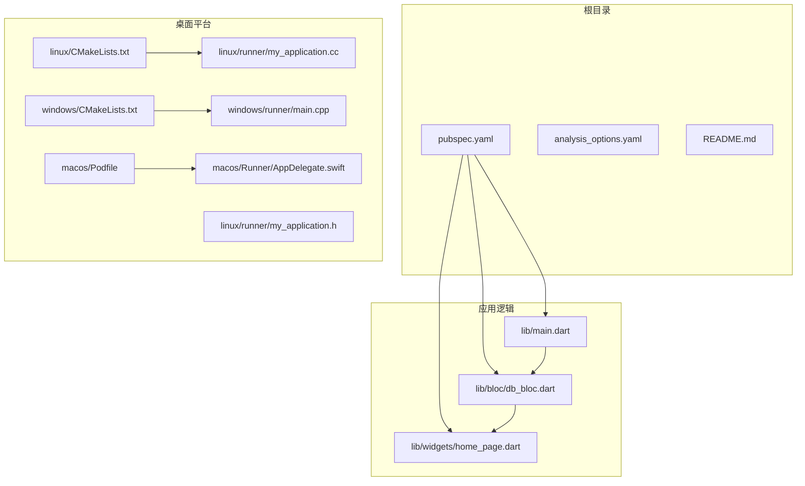
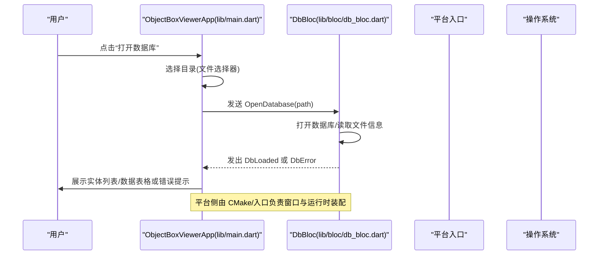
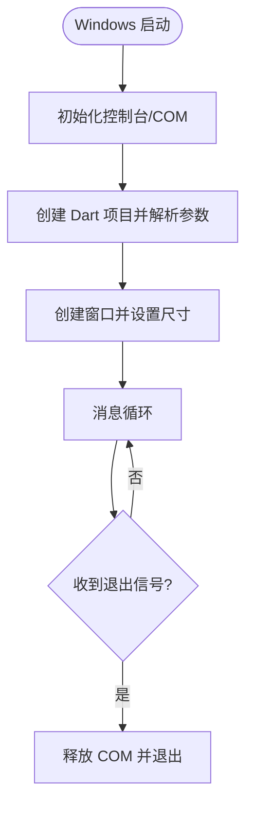
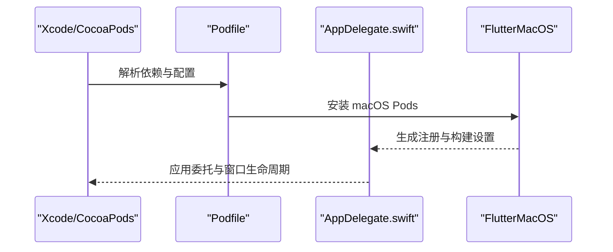
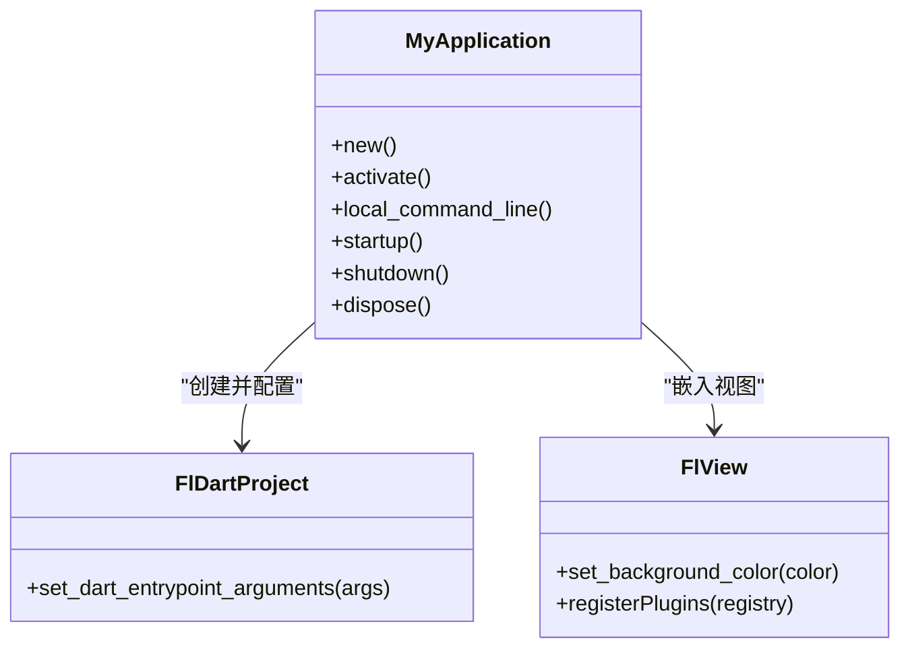
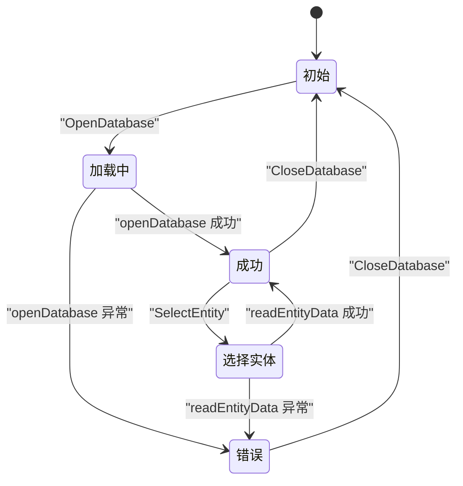
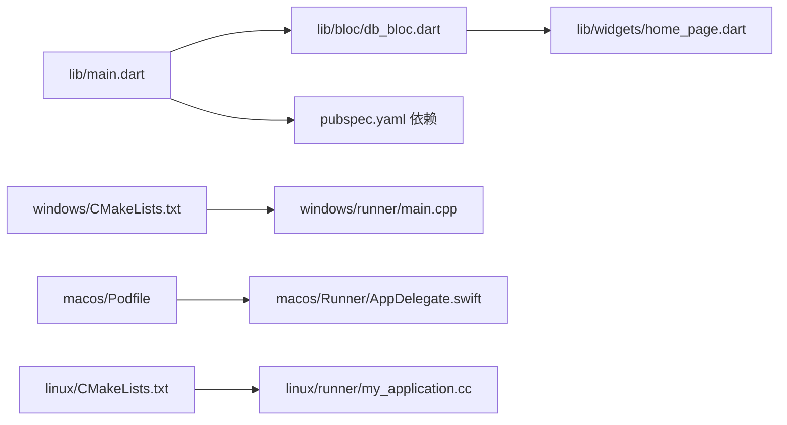

# 跨平台支持

<cite>
**本文引用的文件**
- [pubspec.yaml](file://pubspec.yaml)
- [analysis_options.yaml](file://analysis_options.yaml)
- [lib/main.dart](file://lib/main.dart)
- [lib/bloc/db_bloc.dart](file://lib/bloc/db_bloc.dart)
- [lib/widgets/home_page.dart](file://lib/widgets/home_page.dart)
- [linux/CMakeLists.txt](file://linux/CMakeLists.txt)
- [linux/runner/my_application.h](file://linux/runner/my_application.h)
- [linux/runner/my_application.cc](file://linux/runner/my_application.cc)
- [windows/CMakeLists.txt](file://windows/CMakeLists.txt)
- [windows/runner/main.cpp](file://windows/runner/main.cpp)
- [macos/Podfile](file://macos/Podfile)
- [macos/Runner/AppDelegate.swift](file://macos/Runner/AppDelegate.swift)
- [README.md](file://README.md)
- [artifacts/2026-05-22-breakthrough.md](file://artifacts/2026-05-22-breakthrough.md)
</cite>

## 目录
1. [简介](#简介)
2. [项目结构](#项目结构)
3. [核心组件](#核心组件)
4. [架构总览](#架构总览)
5. [详细组件分析](#详细组件分析)
6. [依赖关系分析](#依赖关系分析)
7. [性能考量](#性能考量)
8. [故障排查指南](#故障排查指南)
9. [结论](#结论)
10. [附录](#附录)

## 简介
本文件系统化梳理 ObjectBox Viewer 在 Windows、macOS 与 Linux 三大桌面平台上的跨平台支持，覆盖原生配置文件、构建设置、依赖管理、打包与部署、平台差异与兼容性、性能优化与最佳实践、测试与质量保障，以及平台切换与维护指导。项目基于 Flutter Desktop，采用 BLoC 状态管理与文件选择器进行数据库目录选择，支持从 LMDB 数据文件直接发现实体与字段（无需 objectbox-model.json）。

## 项目结构
- 根级配置：pubspec.yaml 定义版本、SDK、依赖与资源；analysis_options.yaml 统一 Lint 规则。
- 桌面平台目录：
  - linux：Linux 平台的 CMake 构建脚本与 GTK 应用入口。
  - windows：Windows 平台的 CMake 构建脚本与 Win32 入口。
  - macos：macOS 平台的 CocoaPods 集成与 Swift 应用委托。
- 应用主程序与业务逻辑：
  - lib/main.dart：应用入口、主题与顶层导航。
  - lib/bloc/db_bloc.dart：数据库打开、实体选择、数据刷新等状态流转。
  - lib/widgets/home_page.dart：界面布局与交互，包含欢迎页、错误页、实体列表与数据表格面板。
- 工具与文档：
  - artifacts/2026-05-22-breakthrough.md：LMDB 结构与模式发现的技术要点。
  - README.md：基础说明与入门链接。

**图表来源**
- [pubspec.yaml](file://pubspec.yaml)
- [linux/CMakeLists.txt](file://linux/CMakeLists.txt)
- [linux/runner/my_application.cc](file://linux/runner/my_application.cc)
- [windows/CMakeLists.txt](file://windows/CMakeLists.txt)
- [windows/runner/main.cpp](file://windows/runner/main.cpp)
- [macos/Podfile](file://macos/Podfile)
- [macos/Runner/AppDelegate.swift](file://macos/Runner/AppDelegate.swift)
- [lib/main.dart](file://lib/main.dart)
- [lib/bloc/db_bloc.dart](file://lib/bloc/db_bloc.dart)
- [lib/widgets/home_page.dart](file://lib/widgets/home_page.dart)

**章节来源**
- [pubspec.yaml](file://pubspec.yaml)
- [analysis_options.yaml](file://analysis_options.yaml)
- [README.md](file://README.md)

## 核心组件
- 应用入口与主题
  - 应用在 lib/main.dart 中初始化绑定、设置主题与导航栏，提供“打开数据库”入口。
  - 使用文件选择器选择数据库目录，随后通过 BLoC 打开数据库并展示模型与数据。
- 状态管理（BLoC）
  - lib/bloc/db_bloc.dart 定义事件与状态，处理打开数据库、选择实体、刷新数据与关闭数据库。
  - 读取实体数据时捕获异常并反馈到 UI。
- 界面与交互
  - lib/widgets/home_page.dart 提供欢迎页、错误页、实体列表面板与数据表格面板，支持无 model 文件时的自动发现提示与重新打开能力。

**章节来源**
- [lib/main.dart](file://lib/main.dart)
- [lib/bloc/db_bloc.dart](file://lib/bloc/db_bloc.dart)
- [lib/widgets/home_page.dart](file://lib/widgets/home_page.dart)

## 架构总览
下图展示了跨平台启动流程与关键组件交互：应用入口负责初始化与导航；BLoC 处理数据库生命周期；平台侧通过 CMake/构建脚本与原生入口完成窗口与运行时装配；UI 响应状态变化并提供用户操作。

**图表来源**
- [lib/main.dart](file://lib/main.dart)
- [lib/bloc/db_bloc.dart](file://lib/bloc/db_bloc.dart)

## 详细组件分析

### Windows 平台
- 构建与安装
  - 使用 CMakeLists.txt 定义二进制名、配置类型、编译选项与安装路径，确保资源与 AOT 库按需安装。
  - 生成插件规则 include flutter/generated_plugins.cmake。
- 原生入口
  - windows/runner/main.cpp 初始化控制台、COM、Dart 项目参数，创建窗口并进入消息循环。
- 依赖与集成
  - 通过 Flutter managed 目录与 runner 子目录组织应用构建。
- 部署与打包
  - 安装目标指向可执行文件所在目录，资源与库复制到安装前清理的 bundle 目录。
  - AOT 库仅在非 Debug 配置安装。

**图表来源**
- [windows/CMakeLists.txt](file://windows/CMakeLists.txt)
- [windows/runner/main.cpp](file://windows/runner/main.cpp)

**章节来源**
- [windows/CMakeLists.txt](file://windows/CMakeLists.txt)
- [windows/runner/main.cpp](file://windows/runner/main.cpp)

### macOS 平台
- CocoaPods 集成
  - macos/Podfile 指定最低系统版本、目标配置、Flutter 宏与 pods 安装步骤。
  - 使用 flutter_macos_podfile_setup 与 flutter_install_all_macos_pods 自动集成。
- 原生入口
  - macos/Runner/AppDelegate.swift 设置应用终止行为与安全恢复能力。
- 依赖与集成
  - 通过 GeneratedPluginRegistrant.swift 注册插件。
- 部署与打包
  - 与 CocoaPods 生态配合，遵循 macOS 应用包规范。

**图表来源**
- [macos/Podfile](file://macos/Podfile)
- [macos/Runner/AppDelegate.swift](file://macos/Runner/AppDelegate.swift)

**章节来源**
- [macos/Podfile](file://macos/Podfile)
- [macos/Runner/AppDelegate.swift](file://macos/Runner/AppDelegate.swift)

### Linux 平台
- 构建与安装
  - linux/CMakeLists.txt 定义二进制名、应用 ID、标准编译选项与安装规则，使用 PkgConfig 查找 GTK。
  - 通过 pkg_check_modules(gtk) 与 add_subdirectory(runner) 组织构建。
- 原生入口
  - linux/runner/my_application.h/cc 实现 GTK 应用类型、窗口创建、标题栏策略与首次帧显示回调。
  - 根据窗口管理器动态决定是否使用 HeaderBar。
- 依赖与集成
  - 通过 GeneratedPluginRegistrant 注册插件。
- 部署与打包
  - 安装到 bundle 目录，RPATH 指向相对 lib/，便于运行时加载本地库。

**图表来源**
- [linux/runner/my_application.h](file://linux/runner/my_application.h)
- [linux/runner/my_application.cc](file://linux/runner/my_application.cc)

**章节来源**
- [linux/CMakeLists.txt](file://linux/CMakeLists.txt)
- [linux/runner/my_application.h](file://linux/runner/my_application.h)
- [linux/runner/my_application.cc](file://linux/runner/my_application.cc)

### 数据库打开与实体浏览（跨平台通用）
- 事件与状态
  - OpenDatabase：打开指定路径数据库，读取模型与文件信息。
  - SelectEntity：选择实体后读取数据行。
  - RefreshData：刷新当前实体数据。
  - CloseDatabase：回到初始状态。
- UI 响应
  - Loading/Error/Loaded 三种状态驱动界面切换。
  - 无 objectbox-model.json 时显示“发现模式”横幅，允许重新打开数据库。

**图表来源**
- [lib/bloc/db_bloc.dart](file://lib/bloc/db_bloc.dart)
- [lib/widgets/home_page.dart](file://lib/widgets/home_page.dart)

**章节来源**
- [lib/bloc/db_bloc.dart](file://lib/bloc/db_bloc.dart)
- [lib/widgets/home_page.dart](file://lib/widgets/home_page.dart)

### 平台特定的依赖管理与集成方案
- 通用依赖
  - pubspec.yaml 声明 Flutter SDK、material 图标、flutter_bloc、path_provider、file_picker、ffi、equatable、path 等。
- 平台差异
  - Windows：CMake 控制器与 Win32 窗口；COM 初始化；AOT 库按配置安装。
  - macOS：CocoaPods 管理依赖与插件；Swift 应用委托。
  - Linux：GTK 应用框架；PkgConfig 查找系统库；RPATH 指向 lib/。

**章节来源**
- [pubspec.yaml](file://pubspec.yaml)
- [windows/CMakeLists.txt](file://windows/CMakeLists.txt)
- [macos/Podfile](file://macos/Podfile)
- [linux/CMakeLists.txt](file://linux/CMakeLists.txt)

### 部署与打包指南（概要）
- Windows
  - 使用 CMake 安装规则将可执行文件、资源与库复制到安装目录；AOT 库仅在 Profile/Release 安装。
- macOS
  - 通过 CocoaPods 安装 Flutter macOS Pods；遵循 .xcworkspace 与 .plist 配置。
- Linux
  - 安装 bundle 目录，设置 RPATH 以加载本地库；资源目录按 Flutter 资产规则复制。

**章节来源**
- [windows/CMakeLists.txt](file://windows/CMakeLists.txt)
- [macos/Podfile](file://macos/Podfile)
- [linux/CMakeLists.txt](file://linux/CMakeLists.txt)

### 功能差异与兼容性考虑
- 无 model 文件的发现模式
  - 当未找到 objectbox-model.json 时，工具会从 LMDB 文件直接发现实体与字段，字段名与类型为自动推断。
- 平台差异
  - Windows/macOS/Linux 的窗口系统、资源路径与插件注册方式不同，但 UI 与业务逻辑在 Dart 层保持一致。
- 兼容性
  - 通过 CMake 与 CocoaPods 的标准化构建流程，确保各平台一致的运行时环境。

**章节来源**
- [lib/widgets/home_page.dart](file://lib/widgets/home_page.dart)
- [artifacts/2026-05-22-breakthrough.md](file://artifacts/2026-05-22-breakthrough.md)

### 性能优化建议与最佳实践
- 构建优化
  - Windows：启用 C++17、严格警告与 Release/Optimize；Profile/Release 配置复用。
  - Linux：启用 -O3 与 NDEBUG；合理设置 RPATH 减少运行时查找开销。
  - macOS：遵循 Flutter macOS 构建设置，避免多余依赖。
- 运行时优化
  - 使用 BLoC 的增量更新与缓存策略，避免重复读取同一实体数据。
  - UI 层仅在必要时重建，减少不必要的重绘。
- 资源与打包
  - 将资源与库放置于安装目录的相对路径，确保跨平台可移植性。

**章节来源**
- [windows/CMakeLists.txt](file://windows/CMakeLists.txt)
- [linux/CMakeLists.txt](file://linux/CMakeLists.txt)
- [lib/bloc/db_bloc.dart](file://lib/bloc/db_bloc.dart)

### 测试策略与质量保证
- 代码规范
  - analysis_options.yaml 统一 Lint 规则，鼓励良好编码实践。
- 单元与集成测试
  - 可在 test/ 下添加 widget 测试与业务逻辑测试，验证 BLoC 状态转换与 UI 行为。
- 平台回归
  - 在 Windows/macOS/Linux 分别执行构建与运行，验证窗口、菜单、文件选择与数据库读取流程。

**章节来源**
- [analysis_options.yaml](file://analysis_options.yaml)
- [test/widget_test.dart](file://test/widget_test.dart)

## 依赖关系分析
- 依赖层次
  - 应用层：lib/main.dart 依赖 flutter_bloc、file_picker、path_provider。
  - 业务层：lib/bloc/db_bloc.dart 依赖 ObjectBoxService 与 models。
  - 平台层：各平台 CMake/Podfile/入口文件负责运行时装配。
- 耦合与内聚
  - UI 与状态分离，平台入口与业务逻辑解耦，提升可维护性。
- 外部依赖
  - Flutter SDK、Material 图标、BLoC、文件选择器、FFI、路径工具等。

**图表来源**
- [pubspec.yaml](file://pubspec.yaml)
- [lib/main.dart](file://lib/main.dart)
- [lib/bloc/db_bloc.dart](file://lib/bloc/db_bloc.dart)
- [lib/widgets/home_page.dart](file://lib/widgets/home_page.dart)
- [windows/CMakeLists.txt](file://windows/CMakeLists.txt)
- [windows/runner/main.cpp](file://windows/runner/main.cpp)
- [macos/Podfile](file://macos/Podfile)
- [macos/Runner/AppDelegate.swift](file://macos/Runner/AppDelegate.swift)
- [linux/CMakeLists.txt](file://linux/CMakeLists.txt)
- [linux/runner/my_application.cc](file://linux/runner/my_application.cc)

**章节来源**
- [pubspec.yaml](file://pubspec.yaml)
- [lib/main.dart](file://lib/main.dart)
- [lib/bloc/db_bloc.dart](file://lib/bloc/db_bloc.dart)
- [lib/widgets/home_page.dart](file://lib/widgets/home_page.dart)
- [windows/CMakeLists.txt](file://windows/CMakeLists.txt)
- [windows/runner/main.cpp](file://windows/runner/main.cpp)
- [macos/Podfile](file://macos/Podfile)
- [macos/Runner/AppDelegate.swift](file://macos/Runner/AppDelegate.swift)
- [linux/CMakeLists.txt](file://linux/CMakeLists.txt)
- [linux/runner/my_application.cc](file://linux/runner/my_application.cc)

## 性能考量
- 构建阶段
  - 合理利用各平台的编译优化与链接器配置，避免 Debug 模式下的过度调试符号影响体积与启动时间。
- 运行阶段
  - 对大数据集的实体读取采用分页或懒加载策略，结合 BLoC 的状态缓存减少重复 IO。
- 资源与打包
  - 将资源与库放置在安装目录的相对路径，减少跨平台路径解析成本。

[本节为通用建议，不涉及具体文件分析]

## 故障排查指南
- 打开数据库失败
  - 检查路径是否包含 data.mdb 与对象模型文件；若缺失，确认“发现模式”提示是否正确触发。
- UI 无响应
  - 确认 BLoC 事件已正确发出与处理；检查异常分支是否返回错误状态。
- 平台相关问题
  - Windows：确认 COM 初始化与控制台附加；检查 AOT 库安装配置。
  - macOS：确认 CocoaPods 安装与 GeneratedPluginRegistrant；检查 Info.plist 与 entitlements。
  - Linux：确认 GTK 依赖与 RPATH 设置；检查安装目录权限。

**章节来源**
- [lib/bloc/db_bloc.dart](file://lib/bloc/db_bloc.dart)
- [lib/widgets/home_page.dart](file://lib/widgets/home_page.dart)
- [windows/CMakeLists.txt](file://windows/CMakeLists.txt)
- [macos/Podfile](file://macos/Podfile)
- [linux/CMakeLists.txt](file://linux/CMakeLists.txt)

## 结论
ObjectBox Viewer 通过 Flutter Desktop 在 Windows、macOS 与 Linux 上实现了统一的 UI 体验与一致的业务逻辑，同时利用各平台的原生构建与入口完成窗口与运行时装配。借助 BLoC 的状态管理与文件选择器，应用能够灵活地打开数据库并浏览实体数据。通过合理的构建优化、资源打包与测试策略，可在多平台上获得稳定且高性能的用户体验。

[本节为总结，不涉及具体文件分析]

## 附录
- 技术背景与发现
  - artifacts/2026-05-22-breakthrough.md 记录了 LMDB 文件结构与模式发现的关键思路，为“无 model 文件”场景提供技术支撑。

**章节来源**
- [artifacts/2026-05-22-breakthrough.md](file://artifacts/2026-05-22-breakthrough.md)