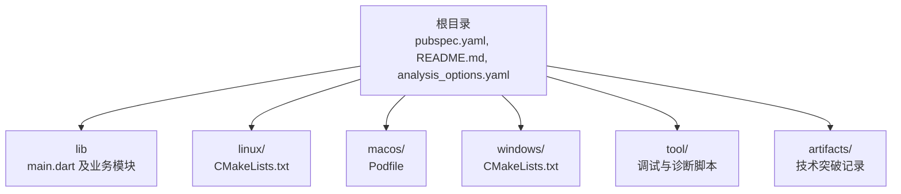
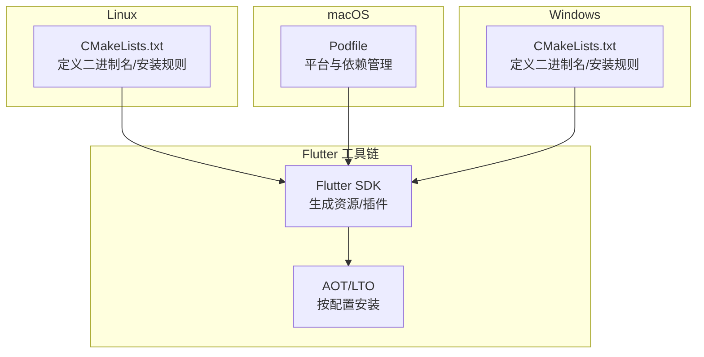
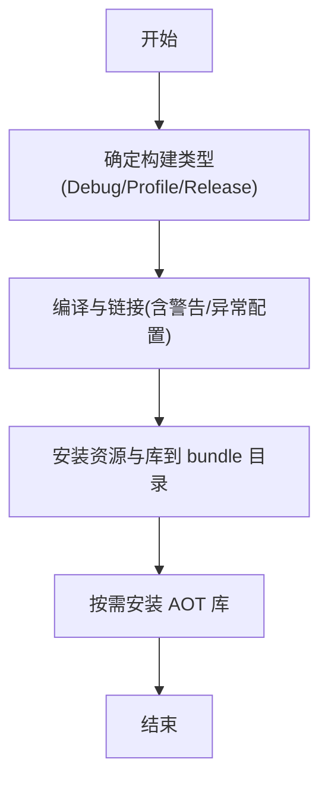
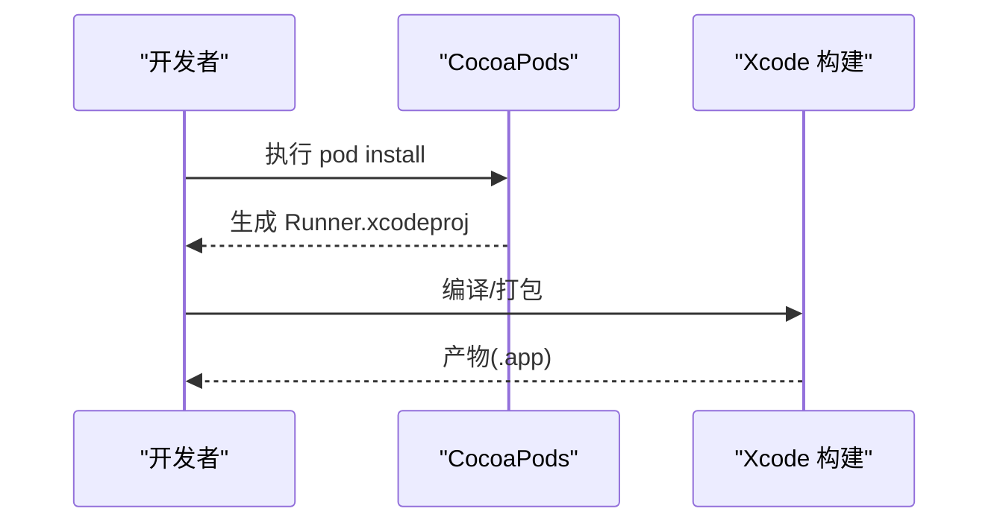
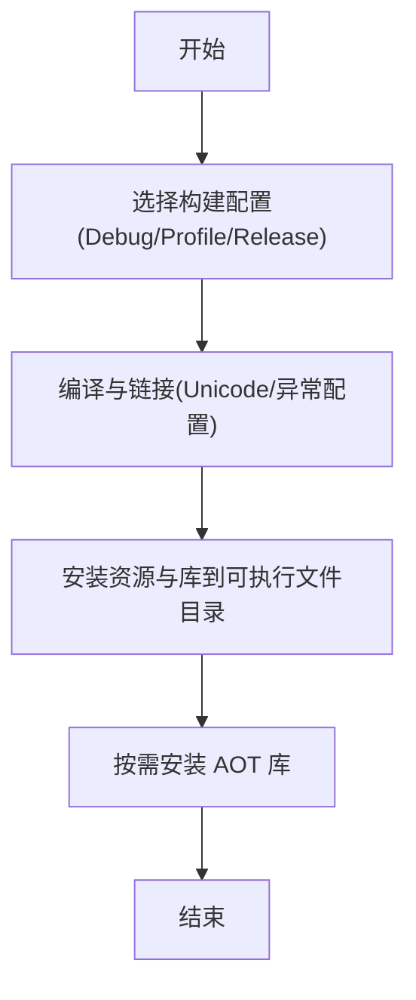
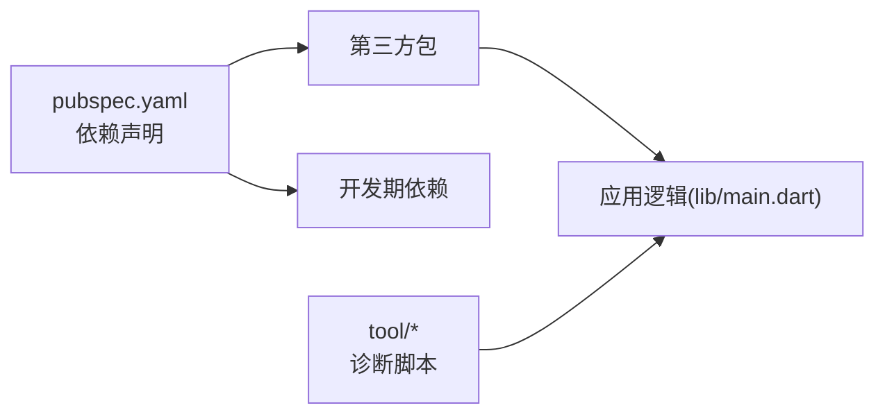

# 部署发布

<cite>
**本文引用的文件**
- [pubspec.yaml](file://pubspec.yaml)
- [README.md](file://README.md)
- [analysis_options.yaml](file://analysis_options.yaml)
- [lib/main.dart](file://lib/main.dart)
- [linux/CMakeLists.txt](file://linux/CMakeLists.txt)
- [macos/Podfile](file://macos/Podfile)
- [windows/CMakeLists.txt](file://windows/CMakeLists.txt)
- [.gitignore](file://.gitignore)
- [tool/debug_check.dart](file://tool/debug_check.dart)
- [tool/debug_diagnostic.dart](file://tool/debug_diagnostic.dart)
- [artifacts/2026-05-22-breakthrough.md](file://artifacts/2026-05-22-breakthrough.md)
</cite>

## 目录
1. [简介](#简介)
2. [项目结构](#项目结构)
3. [核心组件](#核心组件)
4. [架构总览](#架构总览)
5. [详细组件分析](#详细组件分析)
6. [依赖分析](#依赖分析)
7. [性能考虑](#性能考虑)
8. [故障排查指南](#故障排查指南)
9. [结论](#结论)
10. [附录](#附录)

## 简介
本文件面向 ObjectBox Viewer 的部署与发布，覆盖跨平台构建配置、打包流程、版本与发布策略、自动化部署配置、签名与安全要求、发布前质量检查清单、更新与升级机制、发布后监控与维护以及回滚与应急处理方案。内容基于仓库现有配置与源码进行系统化整理，确保发布流程的安全性与可靠性。

## 项目结构
该项目为 Flutter 应用，采用多平台支持（Linux、macOS、Windows），并包含用于数据库解析与诊断的工具脚本。关键目录与文件如下：
- 根目录：应用元数据与依赖定义
- lib：Flutter 应用入口与界面逻辑
- 平台目录：各平台的构建与打包配置
- tool：数据库解析与诊断辅助脚本
- artifacts：里程碑式技术探索记录

**图表来源**
- [pubspec.yaml](file://pubspec.yaml)
- [lib/main.dart](file://lib/main.dart)
- [linux/CMakeLists.txt](file://linux/CMakeLists.txt)
- [macos/Podfile](file://macos/Podfile)
- [windows/CMakeLists.txt](file://windows/CMakeLists.txt)
- [tool/debug_check.dart](file://tool/debug_check.dart)
- [artifacts/2026-05-22-breakthrough.md](file://artifacts/2026-05-22-breakthrough.md)

**章节来源**
- [pubspec.yaml](file://pubspec.yaml)
- [README.md](file://README.md)
- [analysis_options.yaml](file://analysis_options.yaml)

## 核心组件
- 应用入口与主题：应用在入口处初始化并启动主界面，使用主题与暗色模式支持，提供打开数据库目录的交互入口。
- 数据库选择与路径发现：通过文件选择器打开目录，自动扫描目标目录及其子目录以定位数据库文件，随后通过业务逻辑打开数据库。
- 跨平台构建：Linux 使用 CMake；macOS 使用 CocoaPods；Windows 使用 CMake；三者均遵循 Flutter 打包约定。

**章节来源**
- [lib/main.dart](file://lib/main.dart)

## 架构总览
下图展示跨平台构建与打包的关键节点，以及与 Flutter 工具链的集成关系。

**图表来源**
- [linux/CMakeLists.txt](file://linux/CMakeLists.txt)
- [macos/Podfile](file://macos/Podfile)
- [windows/CMakeLists.txt](file://windows/CMakeLists.txt)

## 详细组件分析

### Linux 打包与安装配置
- 二进制命名与应用标识：设置可执行文件名与应用 ID。
- 构建类型：支持 Debug/Profile/Release，并在非 Debug 模式启用优化与符号定义。
- 安装与资源：安装 ICU 数据、Flutter 动态库、插件库与 Flutter 资产目录；仅在非 Debug 安装 AOT 库。
- 运行时路径：设置运行时库查找路径，保证打包后可正确加载依赖。

**图表来源**
- [linux/CMakeLists.txt](file://linux/CMakeLists.txt)

**章节来源**
- [linux/CMakeLists.txt](file://linux/CMakeLists.txt)

### macOS 打包与依赖管理
- 平台版本：最低系统版本配置。
- CocoaPods 集成：通过 Podfile 管理依赖与测试目标，安装 Flutter macOS 依赖。
- 构建设置：继承 Flutter 生成的 Xcode 配置，统一构建行为。

**图表来源**
- [macos/Podfile](file://macos/Podfile)

**章节来源**
- [macos/Podfile](file://macos/Podfile)

### Windows 打包与安装配置
- 二进制命名与多配置：支持 Debug/Profile/Release，Profile 与 Release 共享编译选项。
- 安装策略：将支持文件复制到可执行文件同级目录，便于本地开发与调试。
- 资源与 AOT：安装 ICU 数据、Flutter 动态库、插件库与 Flutter 资产目录；仅在 Profile/Release 安装 AOT 库。

**图表来源**
- [windows/CMakeLists.txt](file://windows/CMakeLists.txt)

**章节来源**
- [windows/CMakeLists.txt](file://windows/CMakeLists.txt)

### 版本与依赖管理
- 版本号：采用三段主版本号加可选构建号的格式，可在构建时通过命令行参数覆盖。
- 依赖声明：Flutter SDK、第三方包等在依赖中声明；开发期依赖用于代码规范与质量。
- 分析选项：启用 Flutter 推荐规则，便于静态分析与代码质量控制。

**章节来源**
- [pubspec.yaml](file://pubspec.yaml)
- [analysis_options.yaml](file://analysis_options.yaml)

### 发布前质量检查清单
- 代码质量
  - 运行静态分析，确保无未启用规则的告警。
  - 修复所有 Lint 规则相关问题。
- 构建验证
  - 在 Linux/macOS/Windows 上分别执行 Debug/Release 构建，确认无编译错误。
  - 校验资源与库是否完整安装到 bundle 目录。
- 功能验证
  - 启动应用，选择数据库目录，验证数据库读取与显示功能。
- 安全与合规
  - 确认未包含敏感信息或密钥。
  - 如涉及签名，准备并验证签名材料。

**章节来源**
- [analysis_options.yaml](file://analysis_options.yaml)
- [lib/main.dart](file://lib/main.dart)

### 自动化部署与发布流程
- 建议流程
  - CI 触发：在分支保护策略下合并后触发流水线。
  - 构建阶段：分别在 Linux/macOS/Windows Runner 上执行构建，产出各平台安装包。
  - 测试阶段：运行单元测试与端到端测试（如存在）。
  - 归档阶段：收集各平台产物，生成发布说明与变更日志。
  - 发布阶段：上传至发布渠道（如内部制品库/分发平台），并同步发布说明。
- 关键配置点
  - 版本号与构建号：在构建命令中传入版本参数。
  - 产物命名：遵循平台规范，确保可识别与可追溯。
  - 签名与安全：在受控环境中完成签名，避免泄露。

[本节为通用流程建议，不直接分析具体文件，故不附“章节来源”]

### 签名与安全配置
- Linux
  - 通常通过发行渠道或打包工具进行签名与校验，建议在 CI 中完成。
- macOS
  - 使用 Apple 开发者证书与团队信息进行签名；在 CI 中配置环境变量与证书存储。
- Windows
  - 使用代码签名证书对可执行文件与安装包进行签名；在 CI 中妥善保管证书与密码。
- 通用要求
  - 密钥与证书应加密存储于 CI 凭据库。
  - 产物签名后进行哈希校验，确保完整性。

[本节为通用安全实践，不直接分析具体文件，故不附“章节来源”]

### 更新与升级机制
- 当前实现
  - 应用通过文件选择器打开数据库目录，未内置自动更新机制。
- 建议机制
  - 平台侧分发：在各平台的应用商店或官网提供新版本下载链接。
  - 自更新：若需要内建更新，可结合平台能力（如 Windows 的 ClickOnce 或 macOS 的 Sparkle）实现，但需额外集成与测试。
- 升级注意事项
  - 保持数据库文件格式兼容性。
  - 提供回滚路径与用户提示。

**章节来源**
- [lib/main.dart](file://lib/main.dart)

### 发布后监控与维护
- 监控指标
  - 下载量与安装成功率。
  - 崩溃率与错误日志聚合。
  - 用户反馈与常见问题统计。
- 维护策略
  - 定期审查依赖版本，及时修补安全漏洞。
  - 对关键平台的构建与签名流程进行演练与审计。

[本节为通用运维建议，不直接分析具体文件，故不附“章节来源”]

### 回滚与应急处理
- 回滚策略
  - 快速回滚至上一个稳定版本，保留发布产物与签名材料。
  - 在分发渠道中冻结当前版本并发布回滚版本。
- 应急响应
  - 收集崩溃日志与最小复现步骤。
  - 临时关闭相关功能或提供降级方案，直至修复上线。

[本节为通用应急流程，不直接分析具体文件，故不附“章节来源”]

## 依赖分析
- Flutter 工具链
  - Linux/macOS/Windows 三端均依赖 Flutter SDK 生成资源与插件。
- 第三方依赖
  - 文件选择、状态管理、路径处理等在依赖中声明，需关注版本兼容性与安全更新。
- 诊断工具
  - tool 目录下的脚本用于数据库解析与诊断，有助于定位问题与验证数据一致性。

**图表来源**
- [pubspec.yaml](file://pubspec.yaml)
- [lib/main.dart](file://lib/main.dart)
- [tool/debug_diagnostic.dart](file://tool/debug_diagnostic.dart)

**章节来源**
- [pubspec.yaml](file://pubspec.yaml)
- [lib/main.dart](file://lib/main.dart)
- [tool/debug_diagnostic.dart](file://tool/debug_diagnostic.dart)

## 性能考虑
- 构建优化
  - Release/Profile 模式启用编译优化与符号定义，减少运行时开销。
  - 仅在非 Debug 安装 AOT 库，提升启动与运行性能。
- 资源与库
  - 确保资源与库完整安装，避免运行时缺失导致的性能退化。
- 诊断与验证
  - 使用工具脚本验证数据库结构与字段解析，避免因数据异常引发的性能问题。

**章节来源**
- [linux/CMakeLists.txt](file://linux/CMakeLists.txt)
- [windows/CMakeLists.txt](file://windows/CMakeLists.txt)
- [tool/debug_diagnostic.dart](file://tool/debug_diagnostic.dart)

## 故障排查指南
- 构建失败
  - 检查平台工具链版本与依赖安装情况。
  - 确认 CMake 配置与 Flutter SDK 路径正确。
- 运行异常
  - 校验 bundle 目录中的资源与库是否完整。
  - 在 Linux 上检查运行时库查找路径配置。
- 数据库读取问题
  - 使用诊断脚本验证数据库文件结构与字段解析逻辑。
  - 参考技术突破记录中的方法论进行字段与实体发现。

**章节来源**
- [linux/CMakeLists.txt](file://linux/CMakeLists.txt)
- [windows/CMakeLists.txt](file://windows/CMakeLists.txt)
- [tool/debug_check.dart](file://tool/debug_check.dart)
- [tool/debug_diagnostic.dart](file://tool/debug_diagnostic.dart)
- [artifacts/2026-05-22-breakthrough.md](file://artifacts/2026-05-22-breakthrough.md)

## 结论
本文件基于仓库现有配置与源码，给出了跨平台构建、打包、版本与发布策略、自动化部署、签名与安全、质量检查、更新与升级、监控与维护以及回滚与应急处理的系统化建议。建议在实际落地时结合团队的 CI/CD 体系与平台分发渠道完善细节，确保发布流程的安全性与可靠性。

## 附录
- 版本控制与发布策略
  - 使用语义化版本，变更日志与发布说明同步更新。
  - 在 Git 标签与发布页面标注版本信息与下载链接。
- 产物归档与分发
  - 将各平台产物按版本号归档，保留签名与哈希校验结果。
- 日志与追踪
  - 在 CI 中记录构建与测试日志，便于问题溯源。

[本节为通用附录建议，不直接分析具体文件，故不附“章节来源”]