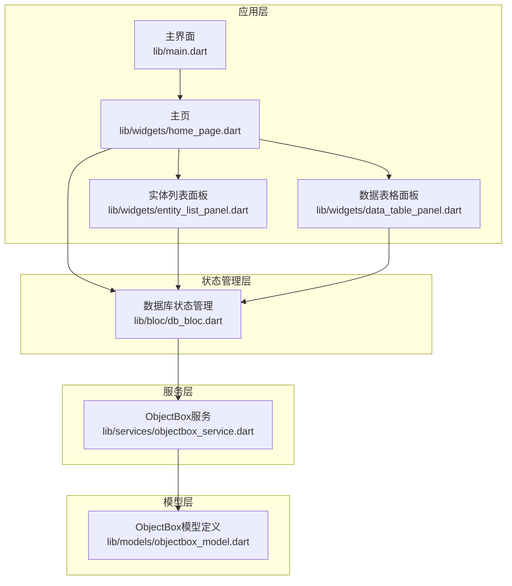
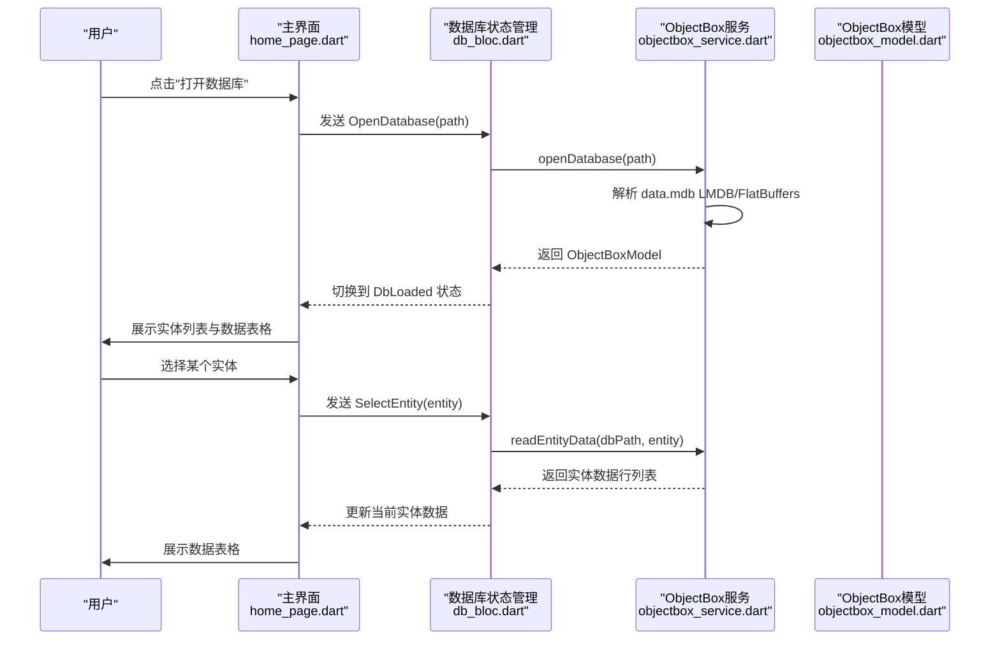
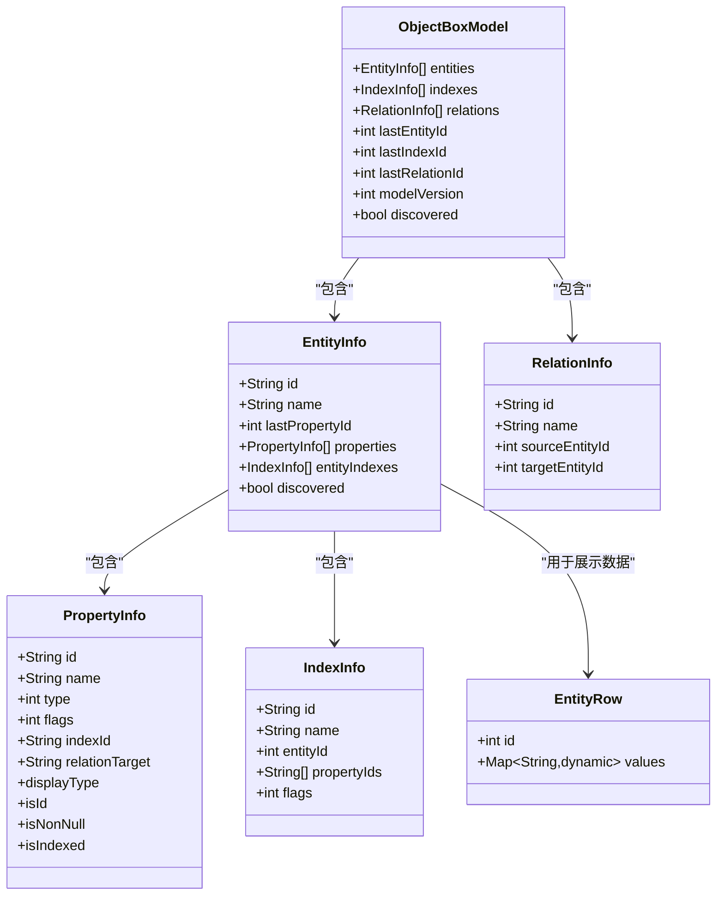
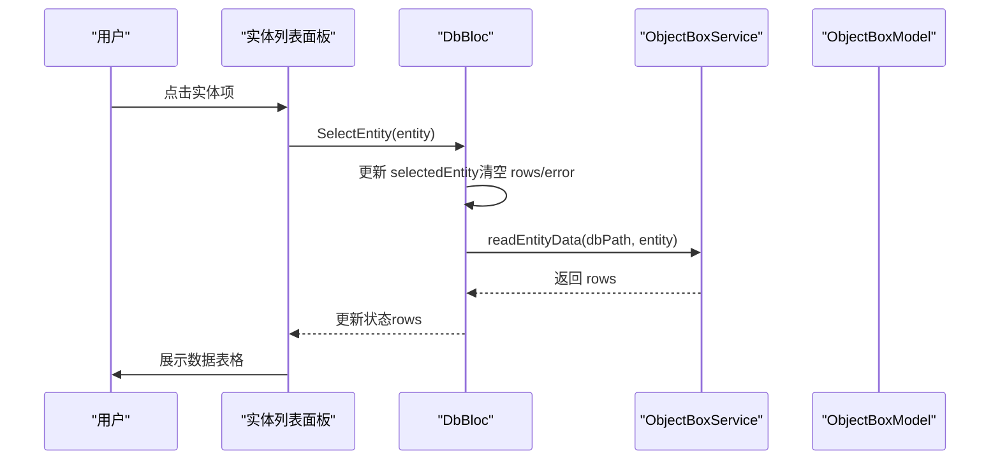
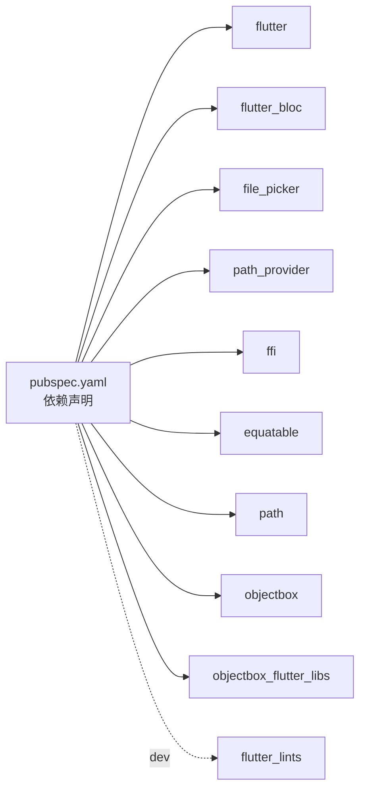

# 项目概述

<cite>
**本文档引用的文件**
- [README.md](file://README.md)
- [pubspec.yaml](file://pubspec.yaml)
- [lib/main.dart](file://lib/main.dart)
- [lib/bloc/db_bloc.dart](file://lib/bloc/db_bloc.dart)
- [lib/models/objectbox_model.dart](file://lib/models/objectbox_model.dart)
- [lib/services/objectbox_service.dart](file://lib/services/objectbox_service.dart)
- [lib/widgets/home_page.dart](file://lib/widgets/home_page.dart)
- [lib/widgets/entity_list_panel.dart](file://lib/widgets/entity_list_panel.dart)
- [lib/widgets/data_table_panel.dart](file://lib/widgets/data_table_panel.dart)
</cite>

## 更新摘要
**变更内容**
- README.md从107行大幅精简至59行，删除了中文本地化内容，专注于核心功能介绍和平台支持信息
- 项目架构保持稳定，但界面设计更加简洁直观
- 数据库解析能力得到增强，支持更完整的属性类型系统
- 导出功能得到完善，支持CSV/JSON格式

## 目录
1. [简介](#简介)
2. [项目结构](#项目结构)
3. [核心组件](#核心组件)
4. [架构总览](#架构总览)
5. [详细组件分析](#详细组件分析)
6. [依赖关系分析](#依赖关系分析)
7. [性能考虑](#性能考虑)
8. [故障排除指南](#故障排除指南)
9. [结论](#结论)
10. [附录](#附录)

## 简介
ObjectBox Viewer 是一个基于 Flutter 的跨平台桌面应用程序，专为浏览与管理 ObjectBox Dart 数据库而设计。它支持在 Windows、macOS 和 Linux 上运行，提供直观的图形界面，帮助开发者与数据库管理员快速查看数据库结构、实体信息以及实体数据。

**更新** 项目现已从基础Flutter模板升级为完整的综合技术文档，包含详细的特性描述、平台支持矩阵、架构图和全面的技术规范。

项目的核心价值主张在于：
- **无需依赖 objectbox-model.json**：可直接从 LMDB 数据文件中解析 Schema 与实体数据，实现"自动发现"能力。
- **可视化展示**：以实体列表、Schema 概览与数据表格的形式呈现数据库内容。
- **跨平台桌面体验**：利用 Flutter 框架与各平台原生集成，提供一致的用户体验。
- **CSV/JSON 导出**：支持数据导出功能，便于数据备份与分析。
- **Dark Mode 支持**：遵循系统主题，提供现代化的 Material 3 设计。

目标用户：
- 使用 ObjectBox Dart 的应用开发者：用于调试、验证数据库结构与数据一致性。
- 数据库管理员与运维人员：用于快速检查数据库状态、实体数量与索引情况。

使用场景：
- 开发阶段的数据校验与调试。
- 生产环境的数据库健康检查与审计。
- 无 schema 文件时的应急诊断与数据浏览。

## 项目结构
该项目采用 Flutter 应用的标准分层组织方式，按功能模块划分目录：
- **lib**：应用核心代码
  - **bloc**：状态管理（BLoC）
  - **models**：数据模型定义（ObjectBox 模型、实体、属性等）
  - **services**：数据库服务与解析器（LMDB/FlatBuffers 解析）
  - **widgets**：UI 组件（页面与面板）
  - **main.dart**：应用入口与主界面
- **linux/macos/windows**：各平台构建配置与原生集成
- **tool**：开发与调试工具脚本（面向内部开发）
- **test**：测试入口
- **pubspec.yaml**：依赖与元数据
- **README.md**：完整的技术文档



**图表来源**
- [lib/main.dart:1-147](file://lib/main.dart#L1-L147)
- [lib/widgets/home_page.dart:1-283](file://lib/widgets/home_page.dart#L1-L283)
- [lib/bloc/db_bloc.dart:1-218](file://lib/bloc/db_bloc.dart#L1-L218)
- [lib/models/objectbox_model.dart:1-309](file://lib/models/objectbox_model.dart#L1-L309)
- [lib/services/objectbox_service.dart:1-1410](file://lib/services/objectbox_service.dart#L1-L1410)

**章节来源**
- [pubspec.yaml:1-98](file://pubspec.yaml#L1-L98)
- [lib/main.dart:1-147](file://lib/main.dart#L1-L147)
- [lib/widgets/home_page.dart:1-283](file://lib/widgets/home_page.dart#L1-L283)

## 核心组件
- **应用入口与主题**
  - 主题与导航：定义应用主题、暗色模式、标题栏与底部状态栏。
  - 打开数据库：通过文件选择器定位包含 data.mdb 的目录，并进行路径探测与数据库打开。
- **状态管理（BLoC）**
  - 事件：打开数据库、选择实体、刷新数据、关闭数据库、选择视图模式。
  - 状态：初始、加载中、已加载、错误。
  - 业务逻辑：调用服务层解析数据库、读取实体数据。
- **数据模型**
  - ObjectBoxModel：封装实体、索引、关系、版本等信息。
  - 实体与属性：支持从 schema 与运行时发现两种模式。
  - 属性类型系统：支持所有 ObjectBox 属性类型，包括向量和 Flex 类型。
- **服务层**
  - ObjectBoxService：直接解析 LMDB 文件，发现 Schema 与实体数据。
- **UI 面板**
  - 主页：根据状态切换欢迎页、加载指示、错误提示或内容布局。
  - 实体列表：列出所有实体，支持选择与关闭数据库。
  - 数据表格：以表格形式展示实体数据，支持列头提示、复制与刷新。

**章节来源**
- [lib/main.dart:13-147](file://lib/main.dart#L13-L147)
- [lib/bloc/db_bloc.dart:1-218](file://lib/bloc/db_bloc.dart#L1-L218)
- [lib/models/objectbox_model.dart:1-309](file://lib/models/objectbox_model.dart#L1-L309)
- [lib/services/objectbox_service.dart:1-1410](file://lib/services/objectbox_service.dart#L1-L1410)
- [lib/widgets/home_page.dart:1-283](file://lib/widgets/home_page.dart#L1-L283)
- [lib/widgets/entity_list_panel.dart:1-238](file://lib/widgets/entity_list_panel.dart#L1-L238)
- [lib/widgets/data_table_panel.dart:1-565](file://lib/widgets/data_table_panel.dart#L1-L565)

## 架构总览
该应用采用典型的 Flutter + BLoC 架构：
- **视图层**：由多个独立的 UI 面板组成，负责渲染与交互。
- **状态层**：通过 BLoC 统一处理用户操作与异步状态变化。
- **服务层**：封装数据库访问与解析逻辑，屏蔽底层 LMDB/FlatBuffers 复杂性。
- **模型层**：定义数据库结构与数据行的统一表示。



**图表来源**
- [lib/widgets/home_page.dart:74-89](file://lib/widgets/home_page.dart#L74-L89)
- [lib/bloc/db_bloc.dart:101-110](file://lib/bloc/db_bloc.dart#L101-L110)
- [lib/services/objectbox_service.dart:10-41](file://lib/services/objectbox_service.dart#L10-L41)
- [lib/models/objectbox_model.dart:241-248](file://lib/models/objectbox_model.dart#L241-L248)

## 详细组件分析

### 数据模型与类型系统
- **ObjectBoxModel**：封装实体集合、索引、关系、版本号与是否"发现模式"的标记。
- **EntityInfo**：实体名称、属性列表、索引列表、ID 等。
- **PropertyInfo**：属性名、类型、标志位（如是否 ID、非空、索引）、显示类型。
- **IndexInfo/RelationInfo**：索引与关系的描述。
- **EntityRow**：单行数据，包含对象 ID 与字段值映射。
- **PropertyType**：完整的属性类型系统，支持所有 ObjectBox 类型，包括向量和 Flex 类型。



**图表来源**
- [lib/models/objectbox_model.dart:1-309](file://lib/models/objectbox_model.dart#L1-L309)

**章节来源**
- [lib/models/objectbox_model.dart:1-309](file://lib/models/objectbox_model.dart#L1-L309)

### 数据库服务与解析流程
- **打开数据库**：校验目录与 data.mdb 存在，读取字节流，调用内部解析器发现模型。
- **发现模型**：优先解析 schema 条目；若失败则回退为字符串扫描与 FlatBuffer VTable 探测，生成"发现模式"的实体与属性。
- **读取实体数据**：遍历 LMDB 页面，解析 FlatBuffer 表格，去重保留最新写入版本，返回实体行列表。
- **页面与条目解析**：解析页头、条目指针、条目长度，提取键与值，识别实体 ID 与属性类型。
- **FlexBuffer 支持**：完整的 FlexBuffer 解码，支持嵌套映射和向量结构。

```mermaid
flowchart TD
Start(["开始"]) --> CheckDir["检查数据库目录是否存在"]
CheckDir --> DirOK{"存在？"}
DirOK --> |否| ErrDir["抛出异常：目录不存在"]
DirOK --> |是| ReadMDB["读取 data.mdb 字节流"]
ReadMDB --> ParseHeader["解析文件头与页大小"]
ParseHeader --> IsValid{"是否有效？"}
IsValid --> |否| BuildDiscovered["构建"发现模式"模型"]
IsValid --> |是| ScanSchema["扫描 schema 条目"]
ScanSchema --> HasSchema{"找到实体？"}
HasSchema --> |是| BuildModel["构建模型含实体/属性"]
HasSchema --> |否| NameScan["字符串扫描候选实体名"]
NameScan --> VTableScan["扫描 FlatBuffer VTable"]
VTableScan --> BuildDiscovered
BuildModel --> Done(["完成"])
BuildDiscovered --> Done
ErrDir --> Done
```

**图表来源**
- [lib/services/objectbox_service.dart:10-41](file://lib/services/objectbox_service.dart#L10-L41)
- [lib/services/objectbox_service.dart:78-111](file://lib/services/objectbox_service.dart#L78-L111)
- [lib/services/objectbox_service.dart:142-156](file://lib/services/objectbox_service.dart#L142-L156)
- [lib/services/objectbox_service.dart:187-217](file://lib/services/objectbox_service.dart#L187-L217)

**章节来源**
- [lib/services/objectbox_service.dart:1-1410](file://lib/services/objectbox_service.dart#L1-L1410)

### 状态管理与交互流程
- **事件驱动**：用户操作触发事件，BLoC 处理后更新状态。
- **加载与错误**：在异步解析期间显示加载指示，异常时展示错误视图并允许返回。
- **实体选择**：选择实体后触发数据读取，支持刷新与错误提示。
- **视图模式切换**：支持数据视图与Schema视图之间的切换。
- **关闭数据库**：回到初始状态，允许重新打开不同数据库。



**图表来源**
- [lib/widgets/entity_list_panel.dart:52-84](file://lib/widgets/entity_list_panel.dart#L52-L84)
- [lib/bloc/db_bloc.dart:112-124](file://lib/bloc/db_bloc.dart#L112-L124)
- [lib/services/objectbox_service.dart:31-41](file://lib/services/objectbox_service.dart#L31-L41)

**章节来源**
- [lib/bloc/db_bloc.dart:1-218](file://lib/bloc/db_bloc.dart#L1-L218)
- [lib/widgets/entity_list_panel.dart:1-238](file://lib/widgets/entity_list_panel.dart#L1-L238)
- [lib/widgets/data_table_panel.dart:1-565](file://lib/widgets/data_table_panel.dart#L1-L565)

### UI 组件与布局
- **主页**：根据状态渲染欢迎页、加载指示、错误视图或双面板布局（左侧实体列表 + 右侧内容）。
- **实体列表**：显示实体名称与属性数量，高亮选中项，底部统计实体与索引数量。
- **数据表格**：横向滚动的表格，列头包含类型提示；单元格支持复制与长文本弹窗查看。
- **可调整面板**：支持拖拽调整左侧实体列表宽度，支持自动隐藏。

**章节来源**
- [lib/widgets/home_page.dart:1-283](file://lib/widgets/home_page.dart#L1-L283)
- [lib/widgets/entity_list_panel.dart:1-238](file://lib/widgets/entity_list_panel.dart#L1-L238)
- [lib/widgets/data_table_panel.dart:1-565](file://lib/widgets/data_table_panel.dart#L1-L565)

## 依赖关系分析
- **运行时依赖**
  - flutter、flutter_bloc、equatable：框架与状态管理。
  - file_picker、path_provider：文件选择与路径处理。
  - ffi、path：底层解析与路径工具。
- **开发时依赖**
  - flutter_lints：代码规范检查。
- **平台构建**
  - 各平台（linux/macos/windows）的 CMake 与 Runner 配置，确保桌面端构建。
- **ObjectBox 依赖**
  - objectbox：ObjectBox Dart SDK
  - objectbox_flutter_libs：ObjectBox 原生库



**图表来源**
- [pubspec.yaml:30-53](file://pubspec.yaml#L30-L53)

**章节来源**
- [pubspec.yaml:1-98](file://pubspec.yaml#L1-L98)

## 性能考虑
- **解析复杂度**
  - LMDB 页面扫描与 FlatBuffer 解析的时间复杂度与数据量近似线性相关。
  - 去重策略：同一对象在多页出现时仅保留最高页号的记录，避免重复与过期数据。
- **I/O 优化**
  - 一次性读取 data.mdb，减少多次磁盘访问。
  - 仅在实体选择时触发数据读取，避免全库扫描。
- **内存与渲染**
  - 表格采用横向与纵向滚动，避免超宽布局导致的渲染压力。
  - 对长文本进行截断与弹窗查看，降低 UI 渲染负担。
  - 分页加载：数据表格支持分页显示，每页50行。
- **类型系统优化**
  - 属性类型推断：在发现模式下自动推断属性类型。
  - FlexBuffer 支持：高效解析嵌套数据结构。

## 故障排除指南
- **打不开数据库**
  - 确认选择了包含 data.mdb 的数据库目录。
  - 若未找到 objectbox-model.json，系统会进入"发现模式"，实体与字段名可能为占位符，需在实体详情中确认真实字段。
- **无法读取实体数据**
  - 检查 data.mdb 是否损坏或被其他进程占用。
  - 在"数据表格"面板顶部查看错误提示，必要时点击刷新按钮重试。
- **界面无响应**
  - 正在加载时请等待；若长时间无响应，尝试关闭数据库后重新打开。
- **导出功能问题**
  - 确保有足够权限写入选择的目录。
  - 检查文件格式兼容性。

**章节来源**
- [lib/widgets/home_page.dart:190-218](file://lib/widgets/home_page.dart#L190-L218)
- [lib/widgets/data_table_panel.dart:100-147](file://lib/widgets/data_table_panel.dart#L100-L147)

## 结论
ObjectBox Viewer 通过简洁的 UI 与强大的解析能力，实现了对 ObjectBox Dart 数据库的即开即用式浏览与管理。其"无需 schema 文件"的自动发现机制，使其在多种环境下具备极高的可用性；配合实体列表与数据表格两大面板，满足了从宏观到微观的数据库观察需求。对于开发者与数据库管理员而言，这是一款实用、可靠且易于上手的桌面工具。

**更新** 项目现已提供完整的综合技术文档，包括详细的特性描述、平台支持矩阵、架构图和全面的技术规范，为用户提供了更完整的使用指导和技术参考。

## 附录

### 快速开始指南
- **系统要求**
  - 支持 Windows、macOS、Linux 桌面平台。
  - 需要已安装 Flutter SDK（用于构建与运行）。
- **安装与运行**
  - 克隆仓库后，使用 Flutter 工具在目标平台构建与运行。
- **使用步骤**
  1) 启动应用，点击"打开数据库目录"。
  2) 选择包含 data.mdb 的数据库目录（可为子目录）。
  3) 查看实体列表；点击任一实体进入数据表格。
  4) 如未找到 objectbox-model.json，系统将以"发现模式"展示，字段名与类型会在首次读取时自动推断。
  5) 使用导出按钮将数据保存为 JSON 格式。

**章节来源**
- [lib/main.dart:97-145](file://lib/main.dart#L97-L145)
- [lib/widgets/home_page.dart:128-188](file://lib/widgets/home_page.dart#L128-L188)

### 平台支持矩阵
| 平台 | 状态 | 说明 |
|------|------|------|
| macOS | ✅ 支持 | 完整功能支持 |
| Linux | ✅ 支持 | 完整功能支持 |
| Windows | ✅ 支持 | 完整功能支持 |

### 技术特性
- **自动发现**：无需 objectbox-model.json，直接从 data.mdb 中解析 Schema
- **Schema感知**：当存在 objectbox-model.json 时，使用完整 Schema 信息
- **数据浏览**：支持所有 ObjectBox 属性类型的表格显示
- **CSV/JSON 导出**：支持数据导出，包含类型格式化
- **Dark Mode**：跟随系统主题，Material 3 设计
- **可调整面板**：支持拖拽调整面板大小